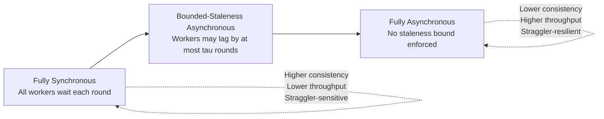
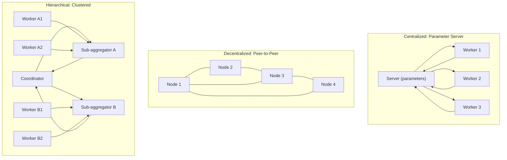

## Distributed Optimization Architectures

### Scope and Framing

This topic surveys the architectural patterns used to organize computation and communication across multiple nodes when solving large-scale optimization problems — as distinct from the algorithms (ADMM, proximal gradient, etc.) that run within those architectures. The choice of architecture governs communication topology, fault tolerance, synchronization requirements, and which algorithmic variants are viable.

### Problem Structures Motivating Distribution

**Key Points**

Distributed optimization is typically motivated by one or both of two data/model characteristics:

- **Data parallelism**: The objective decomposes as a sum over data shards, $\min_x \sum_{i=1}^N f_i(x)$, where each node $i$ holds a subset of training examples and $f_i$ depends only on the shared model $x$. This is the dominant structure in large-scale machine learning training.
- **Model parallelism**: The variable itself is partitioned across nodes, $x = (x_1, \ldots, x_N)$, because the model is too large to fit in a single node's memory, or because the problem has a natural block structure (e.g., multi-agent systems, network resource allocation).

Many practical systems combine both forms of parallelism simultaneously, and the architectural choice below interacts with, but is distinct from, this data/model split.

### Centralized (Parameter Server) Architecture

**Key Points**

- **Structure**: One or more designated server nodes hold the authoritative copy of the optimization variable (the "parameters"); worker nodes compute local updates (e.g., gradients on their data shard) and send them to the server, which aggregates and applies the update, then sends the new parameters back to workers.
- **Communication pattern**: Star-like or hierarchical topology — workers communicate only with servers, not directly with each other. This simplifies aggregation logic (a straightforward sum or average at the server) at the cost of making the server a potential bottleneck and single point of failure, mitigated in practice by sharding parameters across multiple server nodes.
- **Synchronization modes**:
  - *Synchronous*: The server waits for updates from all (or a quorum of) workers before applying an aggregated update and broadcasting new parameters — straightforward to analyze and matches standard convergence proofs for distributed gradient methods, but overall throughput is limited by the slowest worker (the straggler problem).
  - *Asynchronous*: The server applies each worker's update as soon as it arrives, without waiting for others, and immediately sends back the current parameters — improves throughput and straggler resilience but introduces **staleness**: a worker's update reflects gradients computed at an older parameter version than the one it is applied to, which complicates convergence analysis and can slow or destabilize convergence if staleness grows unbounded. [Inference: the precise convergence degradation from staleness is architecture- and algorithm-specific, and bounded-staleness assumptions are typically required to retain formal guarantees.]
- **Fault tolerance**: A single unsharded server is a single point of failure; sharding and replication schemes address this but add coordination overhead.

### Decentralized (Peer-to-Peer / Gossip) Architecture

**Key Points**

- **Structure**: No designated server; nodes communicate directly with a subset of neighbors defined by a communication graph (which may be fixed or time-varying), each maintaining and updating its own local copy of the variable.
- **Consensus mechanism**: Convergence to a common solution relies on **consensus averaging** — nodes iteratively mix their local variable with neighbors' values (e.g., $x_i^{k+1} = \sum_{j \in \mathcal{N}(i)} w_{ij} x_j^k$ for appropriately chosen mixing weights $w_{ij}$) interleaved with local gradient or proximal steps. The rate at which local variables converge to consensus depends on the spectral properties (specifically the second-largest eigenvalue magnitude) of the mixing matrix, which in turn depends on the graph topology.
- **Communication pattern**: Typically much lower per-node communication volume than a centralized architecture with a single server (each node talks only to its neighbors), but achieving global consensus can require many communication rounds, particularly on sparsely connected or poorly conditioned graphs.
- **Fault tolerance and scalability**: No single point of failure; the architecture degrades gracefully if individual nodes or links fail, and the design (choice of graph, mixing weights) can be adapted independently of the number of nodes, making it attractive for very large or geographically dispersed networks. [Inference: the degree of fault-tolerance benefit realized in practice depends on the specific consensus protocol's handling of dynamic topology changes and node dropout.]

### Hierarchical Architecture

**Key Points**

- **Structure**: A middle ground combining centralized and decentralized patterns — nodes are grouped into clusters, each with a local aggregator (sub-server), and sub-servers communicate with each other or with a higher-level coordinator. This reflects physical or organizational locality (e.g., data center racks, geographic regions, or federated learning across organizations).
- **Rationale**: Reduces communication volume to/from a single global bottleneck by aggregating within clusters first (where communication is typically cheaper — same rack or data center) before a smaller number of cross-cluster or cluster-to-coordinator messages carry the aggregated result.
- **Trade-off**: Introduces additional latency stages (intra-cluster aggregation, then inter-cluster or coordinator aggregation) and additional design parameters (cluster size, aggregation frequency at each level) relative to a single-level centralized or fully decentralized design.

### Synchronization Spectrum

### Communication Topology Overview

### Communication-Reduction Techniques

**Key Points**

Regardless of architecture, several orthogonal techniques reduce the communication burden per synchronization round:

- **Gradient/update compression**: Quantization (reducing numerical precision of transmitted updates) or sparsification (transmitting only the largest-magnitude components of an update) reduce bytes transmitted per round; convergence analyses for compressed distributed methods typically require the compression operator to satisfy a bounded-bias or bounded-variance property to retain guarantees. [Inference: the specific compression scheme's effect on final accuracy or convergence speed is scheme- and problem-dependent.]
- **Local update / periodic averaging**: Nodes perform multiple local optimization steps between communication rounds (as in local-SGD-type schemes) rather than synchronizing after every single step, directly trading off communication frequency against increased divergence between local and global iterates between synchronization points.
- **Momentum and error-feedback accumulation**: When compression or infrequent communication introduces bias, accumulating the discarded/error component locally and re-injecting it in subsequent rounds (error feedback) is a common technique to preserve convergence guarantees that would otherwise be lost.

### Fault Tolerance and Reliability Considerations

**Key Points**

- **Straggler mitigation**: Beyond asynchrony, techniques include over-provisioning (assigning redundant computation to multiple nodes and using the first result), timeout-based partial aggregation (proceeding with whichever subset of updates arrived within a time budget), and coded computation approaches that introduce redundancy directly into the computation itself. [Inference: the relative effectiveness of these mitigation strategies is workload- and infrastructure-dependent.]
- **Node/link failure**: Centralized architectures require explicit server replication or checkpointing to survive server failure; decentralized architectures are more naturally robust to individual node loss since no single node holds unique authoritative state, provided the remaining communication graph stays connected.
- **Byzantine robustness**: In settings where some nodes may return arbitrary or adversarial updates (rather than merely failing silently), specialized robust aggregation rules (e.g., coordinate-wise median or trimmed-mean aggregation instead of simple averaging) are used in place of standard averaging, at the cost of weaker statistical efficiency compared to averaging under the assumption all nodes are honest. [Inference: the necessity and design of Byzantine-robust aggregation depends on the specific trust model assumed for the deployment.]

### Comparison of Architectures

| Property | Centralized (Parameter Server) | Decentralized (Peer-to-Peer) | Hierarchical |
| --- | --- | --- | --- |
| Single point of failure | Yes, unless sharded/replicated | No (if graph stays connected) | At each aggregator level, unless replicated |
| Communication bottleneck | Server bandwidth/compute | Neighbor link bandwidth, consensus rounds | Intra-cluster and inter-cluster links |
| Consistency model | Naturally supports strict synchronous consistency | Consensus-based, gradual convergence to agreement | Mixed — depends on level |
| Scalability limit | Server capacity (mitigated by sharding) | Graph connectivity and mixing time | Number of clusters and coordinator capacity |
| Typical use case | Data-center-scale ML training | Sensor networks, multi-agent systems, federated settings | Geo-distributed or multi-organization training |

### Practical Considerations

- Architecture choice interacts directly with the optimization algorithm selected: ADMM's consensus form maps naturally onto both centralized (server computes the averaging step) and decentralized (neighbors exchange and locally average) architectures, while methods requiring an exact global gradient at every step are more naturally centralized unless a decentralized consensus-gradient variant is used.
- Network topology for decentralized architectures is a design choice with real consequences: sparser graphs reduce per-round communication but slow consensus, and this trade-off is typically tuned per deployment rather than fixed by the algorithm itself. [Inference: the optimal topology for a given deployment depends on the specific latency, bandwidth, and problem-conditioning characteristics of that deployment.]
- Bounded-staleness assumptions used in asynchronous convergence proofs need to be verified against actual system behavior (e.g., real-world straggler delay distributions), since unbounded or heavy-tailed staleness in practice can fall outside what the theoretical guarantees cover. [Inference: the extent of any gap between theoretical staleness assumptions and observed system behavior is deployment-specific.]

### Related Topics

- Parameter server design and sharding strategies
- Decentralized consensus optimization and gossip algorithms
- Federated learning architectures and communication constraints
- Asynchronous stochastic gradient methods and staleness bounds
- Gradient compression, quantization, and sparsification
- Local-SGD and periodic-averaging convergence analysis
- Byzantine-robust distributed optimization
- Straggler mitigation and coded computation