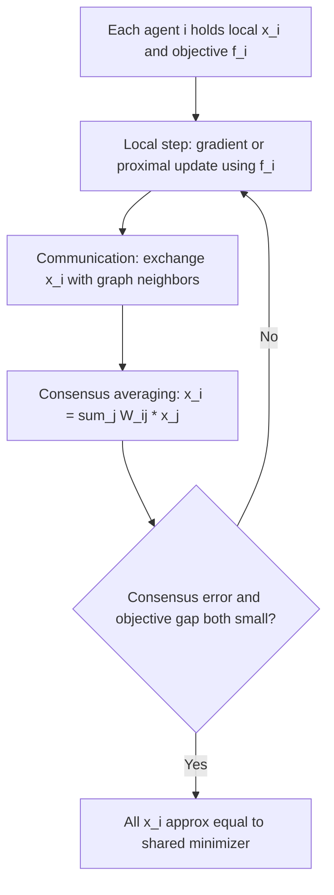

## Consensus Optimization

### Scope and Framing

Consensus optimization addresses problems where multiple agents or nodes each hold a local objective function but must agree on a single shared decision variable. It is the algorithmic core that underlies the consensus-form ADMM and decentralized architectures discussed previously, and it is treated here as its own topic: the consensus constraint structure, the mixing-matrix machinery that drives agreement, and the convergence theory specific to consensus-based methods.

### Problem Formulation

**Key Points**

The canonical consensus optimization problem is:

$$\min_{x_1, \ldots, x_N} \sum_{i=1}^N f_i(x_i) \quad \text{subject to} \quad x_1 = x_2 = \cdots = x_N$$

where each $f_i$ is held privately by agent $i$ (e.g., a local data shard's loss function), and the equality constraints force all local copies to agree on a common value. Equivalently, introducing a global variable $z$ and constraints $x_i = z$ for all $i$ recovers the global consensus ADMM form. The consensus constraint is what distinguishes this from a generic distributed sum-minimization problem: the emphasis is on the mechanism by which agreement is reached, not merely on parallelizing gradient computation.

### The Mixing Matrix and Consensus Averaging

**Key Points**

- In decentralized settings, agreement is reached through repeated local averaging governed by a **mixing matrix** $W \in \mathbb{R}^{N \times N}$, where $W_{ij} > 0$ only if agents $i$ and $j$ are neighbors in the communication graph (or $i = j$), and each row sums to 1 (row-stochastic), often also column-stochastic (doubly stochastic) to ensure the average is preserved exactly.
- A single consensus averaging step updates each agent's variable as

  $$x_i^{k+1} = \sum_{j=1}^N W_{ij} \, x_j^k$$

  which can be written compactly as $x^{k+1} = Wx^k$ for the stacked vector $x^k$.
- **Convergence to consensus**: If $W$ is doubly stochastic, symmetric, and the underlying communication graph is connected, repeated application of $W$ drives all agents' variables to their common average: $x^k \to \frac{1}{N}\mathbf{1}\mathbf{1}^T x^0$ as $k \to \infty$, since $W$'s largest eigenvalue is $1$ (with eigenvector $\mathbf{1}$) and all other eigenvalues have magnitude strictly less than $1$ on a connected graph.
- **Rate of consensus convergence** is governed by the **spectral gap**, $1 - |\lambda_2(W)|, where $\lambda_2(W)
   is the second-largest eigenvalue magnitude of $W$: consensus error decays geometrically at rate $|\lambda_2(W)|^k$, so a mixing matrix with a larger spectral gap reaches agreement in fewer rounds. This is why mixing-matrix design (e.g., Metropolis-Hastings weighting, or optimizing $W$ subject to the graph's sparsity pattern to minimize $|\lambda_2(W)|$) is a distinct sub-problem within consensus optimization.

### Combining Local Optimization with Consensus

**Key Points**

Consensus optimization algorithms interleave local gradient (or proximal) steps with consensus averaging steps. Two broad algorithmic families illustrate this combination:

- **Distributed (sub)gradient descent (DGD)**: Each agent updates

  $$x_i^{k+1} = \sum_{j=1}^N W_{ij} x_j^k - \eta_k \nabla f_i(x_i^k)$$

  combining a consensus-averaging term with a local gradient step. With a diminishing step size $\eta_k$, DGD converges to the true minimizer of $\sum_i f_i$, but at a rate that is typically slower than centralized gradient descent because consensus error and optimization error interact — a persistent, well-documented limitation of the basic DGD scheme. [Inference: the exact rate penalty relative to centralized gradient descent depends on the graph's spectral gap and the step-size schedule used, and differs across specific analyses.]
- **Gradient tracking methods (e.g., DIGing, EXTRA)**: Augment DGD with an auxiliary variable that tracks an estimate of the global average gradient at each agent, correcting for the bias introduced by using only local gradients. This modification allows convergence to the exact minimizer even with a constant (non-diminishing) step size, and typically achieves a linear convergence rate under strong convexity — a meaningful improvement over basic DGD's rate limitations. [Inference: the specific conditions and constants for linear convergence differ across gradient-tracking variants (EXTRA, DIGing, and others) and are established in their respective analyses rather than as one unified result.]

### Consensus ADMM Revisited

As previously introduced, ADMM's global consensus form solves the same problem via local variables $x_i$, a global variable $z$, and constraints $x_i = z$. The resulting updates are:

$$x_i^{k+1} = \arg\min_{x_i} \; f_i(x_i) + \frac{\rho}{2}\|x_i - z^k + u_i^k\|_2^2 \quad \text{(local, parallel across agents)}$$

$$z^{k+1} = \frac{1}{N}\sum_{i=1}^N \left(x_i^{k+1} + u_i^k\right) \quad \text{(global average)}$$

$$u_i^{k+1} = u_i^k + x_i^{k+1} - z^{k+1} \quad \text{(local dual update)}$$

Relative to DGD-family methods, consensus ADMM typically converges in fewer communication rounds for a given accuracy in practice (owing to solving a local subproblem to optimality at each step rather than a single gradient step), at the cost of each local update being a full minimization rather than a single gradient evaluation. [Inference: whether ADMM's per-round progress advantage translates into a net wall-clock advantage depends on the relative cost of the local subproblem solve versus a single gradient step and the communication latency of the deployment.]

### Comparison: DGD, Gradient Tracking, and Consensus ADMM

| Property | Distributed Gradient Descent (DGD) | Gradient Tracking (EXTRA/DIGing) | Consensus ADMM |
| --- | --- | --- | --- |
| Local computation per round | One gradient evaluation | One gradient evaluation + tracking update | Full local subproblem solve |
| Step size | Typically diminishing for exact convergence | Can be constant | Governed by penalty parameter $\rho$ |
| Convergence to exact minimizer | Yes, with diminishing step size | Yes, with constant step size | Yes, under standard ADMM assumptions |
| Rate (strongly convex case) | Sublinear (diminishing step) | Linear | Linear (under matching ADMM conditions) |
| Communication per round | One round of neighbor averaging | One round of neighbor averaging (variable + tracker) | One round of gather average / broadcast |

### Time-Varying and Directed Graphs

**Key Points**

- Communication graphs in real deployments may be **time-varying** (links appear/disappear across rounds, e.g., due to mobility or unreliable connections) rather than fixed. Convergence theory for consensus methods under time-varying graphs typically requires a joint-connectivity condition — that the union of graphs over any sufficiently long window of rounds remains connected — rather than requiring each individual round's graph to be connected.
- **Directed graphs** (where communication is one-way, $i \to j$ but not necessarily $j \to i$) break the doubly-stochastic mixing-matrix assumption used in the basic analysis above. Push-sum and related algorithms extend consensus averaging to directed graphs by tracking an auxiliary weight alongside each variable to correct for the asymmetry, recovering convergence to the correct average despite the lack of a doubly stochastic mixing matrix. [Inference: the precise convergence rate penalty of directed/push-sum consensus relative to the undirected doubly-stochastic case is graph- and algorithm-specific.]

### Consensus Convergence Illustration

### Practical Considerations

- The spectral gap $1 - |\lambda_2(W)|$ is a design lever independent of the local objectives $f_i$: for a fixed communication graph, choosing mixing weights (e.g., via Metropolis-Hastings or an eigenvalue-optimization procedure) to maximize the spectral gap directly reduces the number of communication rounds needed for a target consensus accuracy.
- Basic DGD's coupling of consensus error and step size is a documented practical limitation; when high accuracy is required, gradient-tracking variants or consensus ADMM are the more commonly used alternatives, since they decouple achievable accuracy from a diminishing step-size schedule. [Inference: whether the added algorithmic complexity of gradient tracking or ADMM is worthwhile for a specific application depends on the accuracy requirements and available per-round computation.]
- Time-varying and directed-graph extensions add real overhead (auxiliary tracking variables, joint-connectivity monitoring) and are typically adopted only when the deployment's actual network conditions require them, rather than by default. [Inference: the necessity of these extensions is deployment-specific rather than universal.]

### Related Topics

- Distributed gradient descent and diminishing step-size analysis
- Gradient tracking methods: EXTRA, DIGing, and variants
- Mixing matrix design and spectral gap optimization
- Push-sum and consensus over directed graphs
- Global consensus ADMM and sharing-form ADMM
- Time-varying graph connectivity conditions for distributed convergence
- Decentralized stochastic optimization
- Federated averaging and its relationship to consensus methods