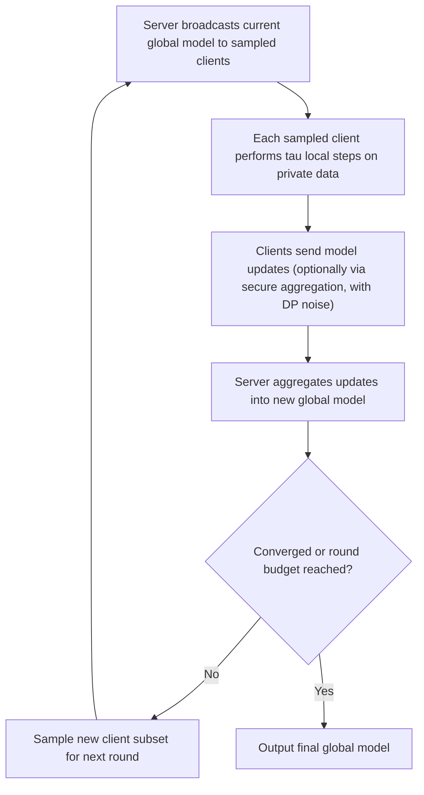

## Federated Optimization Considerations

### Scope and Framing

Federated optimization is a specialization of distributed optimization where the defining constraints are organizational and statistical rather than purely computational: data remains on client devices/organizations for privacy reasons, clients are numerous and unreliable, data distributions differ substantially across clients, and communication is the dominant cost rather than local computation. This topic covers the considerations that distinguish federated optimization from the data-center-style distributed and consensus methods discussed previously.

### Distinguishing Characteristics of the Federated Setting

**Key Points**

- **Data locality and privacy**: Raw data never leaves the client; only model updates (parameters or gradients) are communicated. This is a hard constraint driven by privacy or regulatory requirements, not merely a design preference, and rules out any method requiring direct data sharing or centralized data pooling.
- **Statistical heterogeneity (non-IID data)**: Unlike the data-center setting where data is typically shuffled and partitioned roughly IID across workers, federated clients' local data distributions can differ substantially from each other and from the global population distribution (e.g., each client is a single user's device with idiosyncratic usage patterns). This breaks a common implicit assumption in standard distributed convergence proofs.
- **System heterogeneity**: Clients vary widely in compute power, network bandwidth, and availability (a mobile device may be offline, low on battery, or on a metered connection). This is a more extreme and less predictable version of the straggler problem discussed in general distributed architectures.
- **Massive scale, partial participation**: The total client population can be very large (millions of devices), but only a small, changing subset participates in any given communication round — unlike typical data-center distributed training where the full worker set is available and stable across rounds.
- **Communication as the dominant cost**: Because clients often have limited and asymmetric (especially uplink) bandwidth, minimizing the number of communication rounds and the bytes per round is typically the primary design objective, more so than in centralized data-center distributed training where compute or centralized bandwidth is often more of a bottleneck. [Inference: the relative weight of communication versus compute cost depends on the specific deployment's network and hardware characteristics.]

### Federated Averaging (FedAvg)

**Key Points**

FedAvg is the most widely used baseline federated optimization algorithm, and it operationalizes the local-update / periodic-averaging idea (introduced earlier as a communication-reduction technique) as the core algorithm rather than an optional add-on:

$$x^{k+1} = \sum_{i \in S_k} \frac{n_i}{n_{S_k}} x_i^{k, \tau}$$

where $S_k$ is the (randomly sampled) subset of participating clients in round $k$, $x_i^{k,\tau}$ is client $i$'s local model after $\tau$ local gradient steps starting from the broadcast global model $x^k$, $n_i$ is client $i$'s local data size, and $n_{S_k} = \sum_{i \in S_k} n_i$.

- Each communication round consists of: broadcasting the current global model to sampled clients, each client performing several local gradient steps (not just one, unlike standard distributed SGD), and a weighted average of the resulting local models forming the new global model.
- The number of local steps $\tau$ is a direct communication-computation trade-off knob: larger $\tau$ reduces communication rounds needed but increases **client drift** — the degree to which local models diverge from each other and from the global optimum during local training, particularly under non-IID data.
- On IID data, FedAvg's convergence behavior is closely related to standard local-SGD analysis; under non-IID data, additional error terms proportional to a measure of data heterogeneity (e.g., the variance of local optimal solutions from the global optimum) appear in the convergence bounds, and this heterogeneity-dependent term does not vanish simply by increasing local steps or communication rounds. [Inference: the exact form and magnitude of the heterogeneity-dependent error term differs across specific theoretical analyses of FedAvg.]

### Client Drift and Corrective Variants

**Key Points**

- **Client drift** describes each client's local model moving toward its own local optimum during the $\tau$ local steps, which can differ substantially from the global optimum under non-IID data — the more local steps taken, the further this drift can go before the next averaging step corrects it.
- **FedProx**: Adds a proximal term to each client's local objective, $f_i(x) + \frac{\mu}{2}\|x - x^k\|_2^2$, penalizing local models for moving too far from the current global model during local training — a direct application of the proximal-operator concept (introduced earlier) to bound client drift. This modification improves convergence stability under heterogeneity and partial participation, at the cost of an additional hyperparameter $\mu$ to tune.
- **SCAFFOLD**: Introduces control variates (correction terms) at both the server and each client that estimate and correct for the difference between the client's local gradient direction and the global gradient direction, directly targeting the source of client drift rather than only penalizing distance from the global model. This is conceptually analogous to the gradient-tracking correction used in decentralized consensus methods, adapted to the federated client-server setting. [Inference: the relative practical benefit of SCAFFOLD-style corrections versus simpler proximal penalties depends on the degree of heterogeneity and participation pattern in a given deployment.]
- Both variants aim to preserve the low-communication benefit of multiple local steps while reducing the convergence penalty that heterogeneity otherwise imposes on plain FedAvg.

### Partial Participation and Client Sampling

**Key Points**

- Convergence analyses for federated algorithms must account for the participating subset $S_k$ changing every round; common assumptions include sampling with a fixed known probability distribution over clients (e.g., uniform or size-weighted sampling), which if violated in a real deployment (e.g., availability correlated with time zone or device type) can introduce bias not covered by the standard analysis. [Inference: the impact of realistic non-uniform, correlated participation patterns on convergence is an active and setting-specific concern rather than fully resolved by a single theoretical treatment.]
- Fairness across clients is a related but distinct concern from convergence: an algorithm can converge to a model that performs well on average while performing poorly for systematically underrepresented or infrequently participating clients — this has motivated fairness-aware objective reformulations (e.g., weighting clients to reduce performance variance) as a separate design axis from communication efficiency. [Inference: whether a specific fairness-aware formulation is appropriate depends on the deployment's actual notion of acceptable performance disparity, which is context-specific rather than a purely mathematical property.]

### Privacy Mechanisms Beyond Data Locality

**Key Points**

- Data locality alone (raw data never leaving the device) does not guarantee that transmitted model updates carry no sensitive information — updates can potentially leak information about the underlying local data through inference attacks. Two common complementary mechanisms address this residual leakage:
  - **Secure aggregation**: A cryptographic protocol allowing the server to compute the sum (or average) of client updates without observing any individual client's update in the clear, so only the aggregate is ever revealed.
  - **Differential privacy**: Adding calibrated noise to client updates (or to the aggregate) before or during aggregation, providing a formal, quantifiable privacy guarantee at the cost of some accuracy degradation, with the privacy-accuracy trade-off governed by the chosen privacy budget parameters. [Inference: the specific accuracy cost for a given privacy budget is problem- and dataset-dependent.]
- These mechanisms are typically layered on top of the base federated optimization algorithm (e.g., FedAvg with secure aggregation and differential privacy noise added) rather than being alternatives to it.

### Federated Round Structure

### Comparison: Data-Center Distributed vs. Federated Optimization

| Property | Data-Center Distributed (e.g., parameter server) | Federated Optimization |
| --- | --- | --- |
| Data distribution across nodes | Typically IID (shuffled/partitioned) | Often non-IID, client-specific |
| Worker/client availability | Stable, full participation typical | Intermittent, partial participation typical |
| Communication cost relative to compute | Often secondary to compute | Often the dominant cost |
| Local steps per communication round | Usually one (or few) gradient steps | Often many local steps (FedAvg-style) |
| Privacy requirement | Not typically a hard constraint | Central design constraint (data locality) |
| Fault tolerance need | Moderate (data-center reliability) | High (consumer devices, unreliable networks) |
| Representative algorithms | Parameter-server SGD, distributed ADMM | FedAvg, FedProx, SCAFFOLD |

### Practical Considerations

- Tuning the number of local steps $\tau$ in FedAvg-style methods is a central practical lever: too few steps forfeits the communication savings that motivate the federated approach, while too many steps under high data heterogeneity can slow or destabilize overall convergence via client drift. [Inference: the specific optimal range for $\tau$ is dataset- and heterogeneity-dependent and typically requires empirical tuning per deployment.]
- Client sampling strategy should be checked against the assumptions used in whatever convergence theory is being relied upon; a mismatch between assumed sampling (e.g., uniform) and actual participation patterns (e.g., availability correlated with usage time) is a common source of divergence between theoretical expectations and observed behavior. [Inference: the magnitude of this gap is deployment-specific.]
- Privacy mechanisms (secure aggregation, differential privacy) each introduce their own overhead and trade-offs (computational cost for cryptographic protocols, accuracy cost for DP noise), and the choice of which mechanisms to layer on the base algorithm is typically driven by the specific regulatory or threat-model requirements of the deployment rather than optimization considerations alone.

### Related Topics

- Local-SGD convergence theory and communication-computation trade-offs
- FedProx, SCAFFOLD, and other client-drift correction methods
- Secure aggregation protocols for federated learning
- Differential privacy in distributed and federated optimization
- Client sampling strategies and fairness-aware federated objectives
- Non-IID data heterogeneity measures and their effect on convergence bounds
- Asynchronous and semi-synchronous federated optimization
- Personalization and multi-task formulations in federated learning