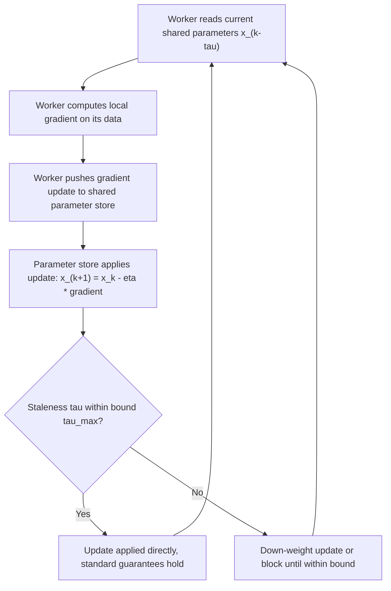

## Parallel and Asynchronous Optimization Algorithms

### Scope and Framing

This topic examines the algorithmic mechanics of running optimization in parallel across multiple compute units, with particular focus on asynchrony — where workers do not wait for each other — as distinct from the architectural and federated concerns already covered. The emphasis here is on the algorithmic update rules, staleness modeling, and convergence trade-offs specific to parallel and asynchronous execution, applicable both within a single multi-core/multi-GPU machine and across distributed nodes.

### Synchronous Parallel Optimization Baseline

**Key Points**

- **Synchronous parallel SGD**: $P$ workers each compute a gradient (or mini-batch gradient) at the same current parameter value $x^k$, and a coordinator averages them before applying a single update:

  $$x^{k+1} = x^k - \eta \cdot \frac{1}{P}\sum_{p=1}^P \nabla f_{i_p}(x^k)$$

  This is mathematically equivalent to standard mini-batch SGD with an effective batch size $P$ times larger than a single worker's batch, and inherits standard SGD convergence guarantees directly under this equivalence.
- The synchronization barrier (waiting for all $P$ workers before proceeding) is the source of the straggler problem: the round's wall-clock time is determined by the slowest worker in that round, not the average, and this cost grows with $P$ and with variance in worker compute time.

### Asynchronous Parallel Gradient Methods

**Key Points**

- **Core mechanism**: Workers compute gradients independently and push updates to a shared parameter store as soon as they finish, without waiting for other workers; the shared parameters may have changed (due to other workers' updates) between when a worker read them and when it pushes its computed gradient. This mismatch is **staleness**.
- **Staleness-aware update model**: A worker that read parameters at iteration $k - \tau$ and computes $\nabla f_i(x^{k-\tau})$ contributes an update applied at iteration $k$:

  $$x^{k+1} = x^k - \eta \, \nabla f_i(x^{k-\tau})$$

  where $\tau \ge 0$ is the **staleness** (delay) of that particular update, generally different for each worker and each round, and dependent on relative worker speeds and communication latency.
- **Bounded staleness assumption**: Most convergence analyses for asynchronous SGD assume a maximum staleness bound, $\tau \le \tau_{\max}$, for all updates. Under this assumption and standard smoothness/convexity conditions, asynchronous SGD converges, typically at a rate matching synchronous SGD up to a factor depending on $\tau_{\max}$ (e.g., an effective slowdown or a requirement that the step size be scaled down as $\tau_{\max}$ grows). [Inference: the precise dependence of the rate constant or required step-size scaling on $\tau_{\max}$ differs across specific analyses and problem-smoothness/convexity assumptions.]
- **Unbounded/heavy-tailed staleness**: If no bound on staleness is enforced or realistic system behavior produces occasional very large delays, standard bounded-staleness convergence guarantees do not directly apply, and additional mechanisms (discussed below) are typically needed to maintain stability.

### The HOGWILD! Algorithm and Lock-Free Updates

**Key Points**

- **HOGWILD!** is an influential asynchronous parallel SGD scheme for shared-memory (single-machine, multi-core) settings that allows workers to read and write to a shared parameter vector **without locks**, i.e., without any mutual-exclusion mechanism preventing simultaneous reads/writes to the same memory.
- **Sparsity assumption**: HOGWILD!'s convergence guarantee relies on the assumption that individual gradient updates are **sparse** — each worker's gradient touches only a small subset of the parameter vector's coordinates — so that simultaneous, unsynchronized updates from different workers rarely conflict (write to the exact same coordinate at the exact same time), keeping the probability and impact of update collisions low. [Inference: the degree of convergence degradation when this sparsity assumption is violated (e.g., dense gradient updates) is problem-specific and not covered by the original sparse-update analysis.]
- Removing locks eliminates synchronization overhead entirely for the shared-memory case, which is the primary practical benefit; the trade-off is that the theoretical guarantees are conditioned on the sparsity structure holding for the specific problem at hand.

### Staleness Compensation Techniques

**Key Points**

- **Staleness-adaptive step size**: Scale down the effective step size for updates with larger observed staleness (e.g., $\eta / (1 + \tau)$ or a similar decreasing function of $\tau$), reducing the influence of updates computed from more outdated parameter reads. [Inference: the specific functional form and its effect on convergence rate constants vary across proposed staleness-adaptive schemes.]
- **Staleness-aware momentum/variance correction**: Some methods explicitly model the expected drift between the read-time parameters and current parameters (e.g., via a first-order Taylor correction using the difference between old and new parameters) to compensate for the staleness bias directly rather than simply down-weighting the update. [Inference: the practical benefit of such corrections over simple down-weighting depends on how well the drift model matches actual parameter dynamics for the given problem.]
- **Bounded-delay enforcement (semi-synchronous)**: Rather than allowing unbounded staleness, a coordinator can enforce a maximum delay by blocking the fastest workers once they get more than $\tau_{\max}$ rounds ahead of the slowest — a hybrid between fully synchronous and fully asynchronous execution, trading some of asynchrony's throughput benefit for a restored theoretical guarantee under a known staleness bound.

### Convergence Rate Comparison

| Property | Synchronous Parallel SGD | Asynchronous SGD (bounded staleness) | HOGWILD! (sparse updates) |
| --- | --- | --- | --- |
| Waits for all workers | Yes | No | No |
| Staleness in updates | None (all use current parameters) | Bounded by $\tau_{\max}$ | Implicit, generally small under sparsity |
| Locking / synchronization overhead | High (barrier each round) | Low to moderate | None (lock-free) |
| Convergence rate (convex, standard assumptions) | Matches serial SGD (batch-size adjusted) | Matches serial SGD up to a $\tau_{\max}$-dependent factor | Matches serial SGD under sparsity, subject to problem-specific conditions |
| Straggler sensitivity | High | Low | Low |
| Key structural requirement | None beyond standard SGD assumptions | Bounded staleness | Sparse gradient updates |

### Asynchronous Update Flow

### Extensions Beyond Plain SGD

**Key Points**

- **Asynchronous proximal methods**: Asynchronous variants of proximal gradient and coordinate descent methods exist, applying a proximal step to a possibly stale point; convergence analysis again typically requires a bounded-staleness assumption, combined with the standard proximal-operator nonexpansiveness property to control how staleness propagates through the proximal step. [Inference: the specific rate penalty from staleness in the proximal setting depends on the interaction between staleness bound and the nonsmooth term's structure, which is analysis-specific.]
- **Asynchronous coordinate descent**: Rather than each worker computing a full gradient, each worker updates a randomly selected block or coordinate of the parameter vector asynchronously — a natural extension of HOGWILD!'s sparsity intuition to a setting explicitly organized around coordinate blocks, common in large-scale problems with natural block-separable structure (e.g., matrix factorization).
- **Asynchronous ADMM**: Relaxes ADMM's alternating updates to allow agents to update on locally available (possibly stale) information about other agents' or the global variable's state rather than waiting for synchronized rounds; convergence analyses for asynchronous ADMM variants generally require staleness bounds and/or diminishing step-size-like conditions on the penalty parameter, analogous to the bounded-staleness requirement in asynchronous SGD. [Inference: exact conditions vary by specific asynchronous ADMM variant in the literature.]

### Practical Considerations

- The core practical trade-off in choosing synchronous versus asynchronous execution is straggler resilience and throughput versus the added complexity of staleness bookkeeping and potentially weaker or more conditional convergence guarantees; the right choice depends on the actual variance in worker speed observed in a given deployment. [Inference: this trade-off's magnitude is system- and workload-specific.]
- HOGWILD!-style lock-free updates are attractive primarily in shared-memory settings where the sparsity assumption is plausible (e.g., many sparse feature-based models); applying the same lock-free philosophy to dense-gradient problems (e.g., most deep neural network training) departs from the assumption underlying the original convergence guarantee. [Inference: empirical behavior of lock-free updates on dense-gradient problems should be verified rather than assumed to inherit HOGWILD!'s guarantees.]
- Semi-synchronous (bounded-delay) execution is often adopted as a practical middle ground precisely because it restores a staleness bound needed for cleaner convergence guarantees while still capturing much of asynchrony's throughput benefit relative to full synchrony. [Inference: how much throughput benefit is retained depends on how tightly the delay bound is set relative to the actual worker speed distribution.]

### Related Topics

- HOGWILD! and lock-free shared-memory optimization
- Staleness-aware convergence analysis for asynchronous SGD
- Asynchronous coordinate descent methods
- Asynchronous ADMM and asynchronous proximal splitting
- Bounded-delay and semi-synchronous execution models
- Straggler mitigation in synchronous parallel training
- Variance reduction in parallel and asynchronous stochastic methods
- Communication-efficient parallel optimization architectures