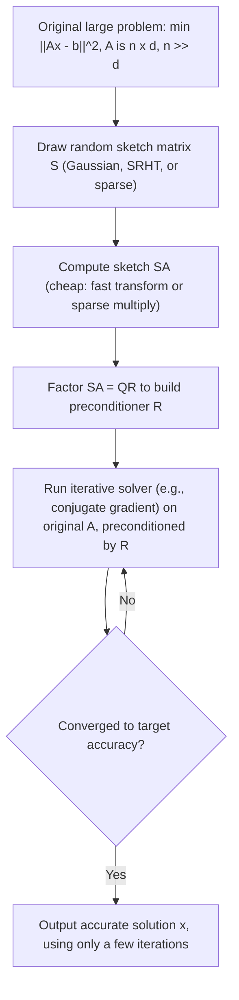

## Sketching and Randomized Linear Algebra for Optimization

### Scope and Framing

Sketching and randomized linear algebra provide a distinct lever for scaling optimization: rather than distributing computation across nodes or exploiting problem structure via proximal operators, these techniques reduce the effective dimensionality or sample size of the linear-algebraic operations (matrix products, factorizations, solves) that dominate the cost of many large-scale optimization algorithms, using randomized projections with provable approximation guarantees.

### Core Idea: Random Projections and the Johnson-Lindenstrauss Lemma

**Key Points**

- A **sketch** of a matrix $A \in \mathbb{R}^{n \times d}$ (with $n \gg d$, the tall-and-thin regime common in large-scale regression and empirical risk minimization) is a smaller matrix $SA \in \mathbb{R}^{m \times d}$ with $m \ll n$, formed by applying a random matrix $S \in \mathbb{R}^{m \times n}$ to $A$. The goal is for $SA$ to approximately preserve the geometric quantities (norms, inner products, or the action of $A^TA$) needed by the downstream optimization algorithm, while being much cheaper to compute with.
- The theoretical basis is the **Johnson-Lindenstrauss (JL) lemma**: a random projection to a dimension $m = O(\log(n)/\epsilon^2)$ preserves pairwise distances among $n$ points up to a $(1 \pm \epsilon)$ multiplicative factor with high probability, independent of the original ambient dimension $d$. This is what allows sketch size $m$ to depend only logarithmically on the number of points/rows rather than on $d$ or $n$ directly in many applications.
- Common sketch constructions include: **Gaussian random matrices** (each entry i.i.d. Gaussian, simplest to analyze but $O(mnd)$ cost to apply), **subsampled randomized Hadamard/Fourier transforms (SRHT/SRFT)** (structured matrices enabling $O(nd\log n)$ application cost via fast transform algorithms), and **sparse (CountSketch-type) embeddings** (each column of $S$ has very few nonzeros, enabling application in time proportional to the number of nonzeros in $A$ rather than $O(mnd)$).

### Sketch-and-Solve for Least Squares

**Key Points**

For the overdetermined least squares problem $\min_x \|Ax - b\|_2^2$ with $A \in \mathbb{R}^{n\times d}$, $n \gg d$:

- **Sketch-and-solve**: Form $SA$ and $Sb$ using a sketching matrix $S \in \mathbb{R}^{m \times n}$ with $m = O(d/\epsilon^2)$ (a dimension depending on $d$, distinct from the JL lemma's dependence on the number of points, since the relevant geometric object here is the $d$-dimensional column space of $A$), and solve the much smaller problem $\min_x \|SAx - Sb\|_2^2$ directly. Under standard subspace-embedding guarantees for $S$, the resulting solution $\hat{x}$ satisfies $\|A\hat{x} - b\|_2 \le (1+\epsilon)\|Ax^\star - b\|_2$ with high probability, where $x^\star$ is the true least-squares minimizer.
- This is a **one-shot approximation** method (not an iterative optimization algorithm) — the sketch is formed once, and a single smaller least-squares problem is solved, making the total cost dominated by the cost of applying $S$ to $A$ plus solving the $m \times d$ reduced problem, both far cheaper than solving the original $n \times d$ problem directly when $n \gg d$.
- The approximation quality is controlled entirely by $\epsilon$ and the sketch size $m$; achieving very high accuracy (small $\epsilon$) requires correspondingly larger $m$, which reintroduces cost — sketch-and-solve is best suited to settings where a moderate-accuracy solution suffices or serves as a strong initialization for refinement. [Inference: the accuracy-cost trade-off point that is "worthwhile" depends on the specific downstream use of the solution.]

### Sketching for Iterative Refinement and Preconditioning

**Key Points**

- **Iterative Hessian sketch / sketch-and-precondition**: Rather than solving the sketched problem once and accepting its approximation error directly, use the sketch to construct a **preconditioner** for an iterative method (e.g., conjugate gradient or a Newton-type solve on the original, unsketched problem). A common scheme computes a factorization (e.g., QR) of the sketch $SA = QR$ and uses $R^{-1}$ as a preconditioner for solving the original normal equations, converging to the exact solution (up to numerical precision) in a small, sketch-quality-dependent number of iterations rather than accepting the one-shot sketch error.
- This combines the cost savings of sketching (a single cheap sketch construction) with the exactness of iterative refinement on the true problem, and is generally preferred over plain sketch-and-solve when high final accuracy is required. [Inference: the specific number of iterations needed to reach a target accuracy depends on the sketch's subspace-embedding quality and the conditioning of the original problem.]
- **Randomized Newton-type methods**: For problems requiring repeated Hessian-vector products or full Hessian solves (e.g., Newton's method on large-scale generalized linear models), a fresh sketch of the Hessian (or Hessian-related matrix) can be drawn at each iteration, replacing an exact Hessian solve with a sketched approximation — trading exactness of each step for a much cheaper per-iteration cost, with convergence analysis typically requiring the sketch dimension to be large enough for the sketched Hessian to approximate the true Hessian's action within a controlled multiplicative error at each step. [Inference: whether per-iteration sketch quality requirements are met in practice for a specific problem is implementation- and problem-dependent.]

### Randomized SVD and Low-Rank Approximation

**Key Points**

- The **randomized SVD (rSVD)** algorithm computes a near-optimal rank-$k$ approximation of a matrix $A \in \mathbb{R}^{n \times d}$ using random projection: (1) draw a random test matrix $\Omega \in \mathbb{R}^{d \times (k+p)}$ (with $p$ a small oversampling parameter), (2) form $Y = A\Omega$ and compute an orthonormal basis $Q$ for its range (via QR), (3) form the smaller matrix $B = Q^TA$ and compute its SVD directly, (4) assemble the approximate SVD of $A$ from $Q$ and $B$'s factors.
- rSVD's cost is dominated by two matrix-matrix products with $A$ (forming $Y$ and $B$) plus the SVD of the much smaller matrix $B \in \mathbb{R}^{(k+p)\times d}$, making it substantially cheaper than a full/exact SVD when $k \ll \min(n,d)$, which is the common regime in low-rank optimization problems (matrix completion, PCA-based dimensionality reduction, nuclear-norm-regularized problems).
- Randomized SVD is directly relevant to the nuclear-norm proximal operator (introduced earlier in the proximal operators discussion): computing $\text{prox}_{\lambda\|\cdot\|_*}$ requires an SVD at every iteration of algorithms like proximal gradient for matrix completion, and replacing the exact SVD with a randomized approximation is a standard technique to make these iterations tractable at scale, provided the target rank $k$ is known or can be estimated/upper-bounded. [Inference: the appropriate oversampling parameter $p$ and resulting approximation accuracy for a specific problem's SVD step should be validated empirically rather than assumed from a single fixed default.]

### Sketching for Stochastic and Coordinate Methods

**Key Points**

- **Sketched stochastic gradient**: Rather than sampling a mini-batch of rows directly (as in standard SGD), a structured random sketch of the data matrix can be used to form gradient estimates with lower variance for a given sample budget in some regimes, connecting sketching techniques to variance-reduction ideas used in stochastic optimization. [Inference: whether sketch-based gradient estimation offers a variance advantage over plain mini-batch sampling depends on the specific data structure and sketch type used.]
- **Randomized coordinate/block selection**: Some randomized coordinate descent variants use sketching-inspired importance sampling (e.g., sampling coordinates or blocks with probability related to their contribution to the Lipschitz constant or Hessian diagonal) rather than uniform sampling, improving convergence constants relative to uniform sampling under matching per-iteration cost. [Inference: the magnitude of improvement from importance sampling versus uniform sampling depends on the heterogeneity of the per-coordinate Lipschitz constants for the specific problem.]

### Sketch Construction Comparison

| Sketch Type | Application Cost | Sketch Size $m$ Dependence | Notes |
| --- | --- | --- | --- |
| Dense Gaussian | $O(mnd)$ | $O(d/\epsilon^2)$ (subspace embedding) | Simplest to analyze; costly to apply directly |
| Subsampled Randomized Hadamard (SRHT) | $O(nd \log n)$ | $O(d\log d/\epsilon^2)$ (typical) | Fast transform-based; near-optimal in practice |
| Sparse/CountSketch | $O(\text{nnz}(A))$ | $O(d^2/\epsilon^2)$ (typical, higher than Gaussian) | Very fast to apply; larger sketch size needed for same guarantee |
| Leverage-score sampling | $O(nnz(A))$ to compute scores + sampling cost | $O(d \log d /\epsilon^2)$ | Data-dependent (non-oblivious) sketch; requires estimating leverage scores first |

### Sketch-and-Precondition Workflow

### Worked Example: Sketched Least Squares

**Example**

Given $A \in \mathbb{R}^{10^6 \times 50}$ (a million rows, 50 columns — a heavily overdetermined regression problem) and target relative accuracy $\epsilon = 0.05$:

1. Choose a sketch size $m = O(d/\epsilon^2) \approx O(50/0.0025) = O(20000)$, so $m \approx 20{,}000$ rows, roughly 50 times smaller than the original $10^6$ rows. [Inference: the constant hidden in the $O(\cdot)$ notation and thus the exact practical sketch size needed for a specific target accuracy depends on the sketch construction and the failure probability tolerated.]
2. Apply an SRHT sketch, costing roughly $O(nd\log n) = O(10^6 \cdot 50 \cdot \log(10^6))$ operations — asymptotically much cheaper than the $O(nd^2) = O(10^6 \cdot 2500)$ cost of forming the normal equations $A^TA$ directly from the full data for large $n$.
3. Solve the reduced $20{,}000 \times 50$ least squares problem directly (cheap, since it is now a small dense problem), yielding a solution within the $(1\pm\epsilon)$ guarantee of the true least-squares optimum, or use it as a preconditioner for a few conjugate-gradient iterations on the full problem to reach near-exact accuracy.

### Practical Considerations

- Sketching techniques are most beneficial in the tall-and-thin regime ($n \gg d$) common in overdetermined regression and empirical risk minimization; for problems where $d$ is also very large (e.g., $d$ comparable to $n$), the sketch size requirements scale with $d$ and the relative savings diminish. [Inference: the specific $n$-to-$d$ ratio at which sketching becomes practically worthwhile depends on the sketch construction and implementation constants.]
- Choosing between sketch-and-solve (one-shot, moderate accuracy) and sketch-and-precondition (iterative, high accuracy) is a direct trade-off between implementation simplicity and final accuracy requirements, and should be matched to how the downstream application will use the solution.
- Randomized SVD's accuracy depends on the true (or effective) rank of the problem being reasonably close to the chosen target rank $k$; applying rSVD with a target rank far smaller than the matrix's effective rank can produce a poor approximation regardless of oversampling, since oversampling primarily corrects for concentration/failure-probability issues rather than a fundamentally mismatched rank choice. [Inference: what constitutes an adequately matched target rank is data-dependent and often requires preliminary estimation.]

### Related Topics

- Johnson-Lindenstrauss lemma and subspace embeddings
- Randomized SVD and low-rank matrix approximation
- Leverage score sampling and its statistical interpretation
- Sketch-and-precondition methods for large-scale least squares
- Randomized Newton and second-order sketching methods
- Nuclear norm proximal operators and scalable SVD computation
- Variance reduction in stochastic and coordinate-based optimization
- Fast structured transforms (Hadamard, Fourier) for sketching