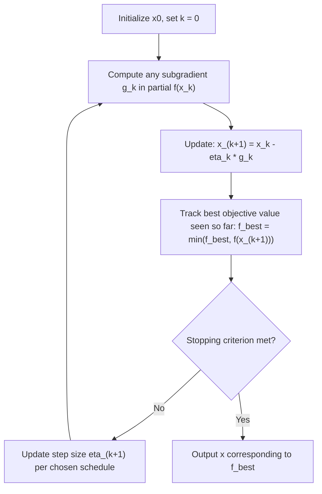

## Subgradient Methods

### Motivation and Background

Many convex optimization problems involve functions that are not differentiable everywhere — the $\ell_1$ norm, the maximum of several functions, or general nonsmooth convex losses. Subgradient methods extend gradient descent to this setting by replacing the gradient with a **subgradient**, a generalization that exists for any convex function even at points of non-differentiability. Subgradient methods are historically important as the precursor to proximal-gradient-type methods, and remain relevant when the nonsmooth term does not admit an easy proximal operator or when a problem's structure is not naturally split into smooth-plus-simple form.

### The Subgradient and Subdifferential

**Key Points**

For a convex function $f: \mathbb{R}^n \to \mathbb{R} \cup \{+\infty\}$, a vector $g \in \mathbb{R}^n$ is a **subgradient** of $f$ at $x$ if it satisfies the global underestimation property:

$$f(y) \ge f(x) + g^T(y - x) \quad \text{for all } y$$

- The set of all subgradients at $x$ is the **subdifferential**, denoted $\partial f(x)$. At points where $f$ is differentiable, $\partial f(x) = \{\nabla f(x)\}$, a single vector — the subdifferential reduces exactly to the ordinary gradient. At non-differentiable points, $\partial f(x)$ is generally a convex set containing more than one vector.
- **Example**: For $f(x) = |x|$ at $x=0$, the subdifferential is the interval $\partial f(0) = [-1, 1]$, since any slope between $-1$ and $1$ satisfies the underestimation property at that kink; away from $x=0$, $\partial f(x) = \{\text{sign}(x)\}$, matching the ordinary derivative.
- **Optimality condition**: $x^\star$ minimizes convex $f$ if and only if $0 \in \partial f(x^\star)$ — a direct generalization of the first-order stationarity condition $\nabla f(x^\star) = 0$ for differentiable functions.
- **Subdifferential calculus**: For $f = f_1 + f_2$, $\partial f(x) \supseteq \partial f_1(x) + \partial f_2(x)$, with equality under mild regularity conditions (e.g., relative interior conditions on the domains), analogous to linearity of the gradient for smooth sums. For $f(x) = \max_i f_i(x)$ with each $f_i$ differentiable, $\partial f(x) = \text{conv}\{\nabla f_i(x) : i \in \arg\max_j f_j(x)\}$, the convex hull of gradients of the "active" functions at $x$.

### Core Subgradient Method Update

**Key Points**

The basic subgradient method iterates:

$$x^{k+1} = x^k - \eta_k \, g^k, \qquad g^k \in \partial f(x^k)$$

where $g^k$ is any subgradient of $f$ at $x^k$ (any element of the subdifferential set is a valid choice).

- Unlike gradient descent on smooth functions, the subgradient method is **not** necessarily a descent method: $f(x^{k+1})$ can be larger than $f(x^k)$ at any given iteration, even with an appropriately chosen step size — this is a fundamental difference from smooth gradient descent and shapes both the convergence theory and standard practice of tracking the best iterate seen so far, $f_{\text{best}}^k = \min_{j \le k} f(x^j)$, rather than the final iterate.
- Because any subgradient in $\partial f(x^k)$ is a valid direction (not necessarily a descent direction for the specific chosen $g^k$), the method's convergence relies on statistical/geometric arguments over the whole trajectory rather than a per-step guarantee.

### Step Size Rules

**Key Points**

Step size selection is central to subgradient method convergence, more so than in smooth gradient descent, because a fixed step size does not generally lead to convergence to the exact optimum:

- **Constant step size** ($\eta_k = \eta$): Converges only to a neighborhood of the optimal value, with the neighborhood's size proportional to $\eta$; useful when an approximate solution suffices or as a warm-up phase.
- **Diminishing step size, non-summable** ($\eta_k \to 0$ but $\sum_k \eta_k = \infty$, e.g., $\eta_k = \theta/\sqrt{k}$): Guarantees convergence of $f_{\text{best}}^k \to f(x^\star)$, since the step size shrinks enough to avoid persistent oscillation but not so fast that progress halts prematurely.
- **Square-summable but not summable** ($\sum_k \eta_k^2 < \infty$, $\sum_k \eta_k = \infty$, e.g., $\eta_k = \theta/k$): The classical Robbins-Monro-type condition, also guarantees convergence and is commonly used in both subgradient methods and stochastic approximation more broadly.
- **Polyak step size** (requires knowing or estimating $f(x^\star)$): $\eta_k = \frac{f(x^k) - f(x^\star)}{\|g^k\|_2^2}$, which adapts the step size to the current optimality gap and often yields faster practical convergence when $f(x^\star)$ (or a good estimate) is available. [Inference: the practical advantage of the Polyak step size over standard diminishing schedules depends on the quality of the available estimate of $f(x^\star)$ when the exact value is unknown.]

### Convergence Rate

**Key Points**

- For convex, Lipschitz-continuous $f$ (with Lipschitz constant $G$, i.e., $\|g\|_2 \le G$ for all $g \in \partial f(x)$ encountered), the subgradient method with an appropriately chosen diminishing or fixed-horizon step size achieves

  $$f_{\text{best}}^k - f(x^\star) = O\left(\frac{1}{\sqrt{k}}\right)$$

  This $O(1/\sqrt{k})$ rate is **substantially slower** than the $O(1/k)$ rate of proximal gradient methods on smooth-plus-simple composite problems, and slower still than the $O(1/k^2)$ rate achievable with acceleration on such composite problems — directly illustrating why splitting a problem into smooth-plus-proximable structure (when possible) is generally preferred over applying subgradient methods to the whole nonsmooth objective directly.
- The $O(1/\sqrt{k})$ rate is known to be **optimal** for the general class of nonsmooth Lipschitz convex functions using only subgradient (first-order, black-box) information — no method using only this information can achieve a better worst-case rate on this problem class, which is why proximal-type methods rely on exploiting additional structure (a smooth part, or a "simple" nonsmooth part with a tractable proximal operator) rather than a smarter generic subgradient scheme.
- Under additional strong convexity of $f$, a diminishing step size of the form $\eta_k = \theta/k$ achieves an improved rate of $O(1/k)$ in objective value, still slower than rates achievable when smoothness can be exploited, but better than the general nonsmooth rate.

### Comparison: Subgradient Method vs. Proximal Gradient Method

| Property | Subgradient Method | Proximal Gradient / FISTA |
| --- | --- | --- |
| Applicability | Any convex $f$ (fully nonsmooth) | Requires $g$ smooth + $f$ nonsmooth-but-proximable split |
| Convergence rate (convex) | $O(1/\sqrt{k})$ | $O(1/k)$ (or $O(1/k^2)$ accelerated) |
| Monotonic decrease | No | Yes (ISTA); not guaranteed for FISTA without monotone variant |
| Step size sensitivity | High — requires diminishing schedule for exact convergence | Moderate — fixed step $1/L$ suffices given known Lipschitz constant |
| Per-iteration cost | One subgradient evaluation | One gradient evaluation + one proximal evaluation |
| Structural requirement | None | Exploitable smooth/nonsmooth split |

### Subgradient Method Flow

### Worked Example: Subgradient Method for $\ell_1$-Regularized Loss

**Example**

Consider $\min_x \frac{1}{2}\|Ax-b\|_2^2 + \lambda\|x\|_1$ solved directly via subgradient method rather than via the proximal-gradient/FISTA approach shown in earlier topics (illustrating why the proximal split is generally preferable here).

A subgradient of the full nonsmooth objective at $x^k$ is:

$$g^k = A^T(Ax^k - b) + \lambda \, s^k, \qquad s^k_i \in \begin{cases} \{\text{sign}(x_i^k)\} & x_i^k \ne 0 \\ [-1, 1] & x_i^k = 0 \end{cases}$$

(a common choice at $x_i^k = 0$ is $s_i^k = 0$, an arbitrary but valid selection from the interval). The update is $x^{k+1} = x^k - \eta_k g^k$, using a diminishing step size such as $\eta_k = \theta/\sqrt{k}$.

Because this treats the entire objective as one nonsmooth function, the resulting iterates converge at only $O(1/\sqrt{k})$ and do **not** produce exact sparsity at intermediate iterations (unlike the soft-thresholding proximal step, which can set coordinates to exactly zero) — this contrast is a standard illustration of why the proximal-gradient/FISTA formulation from the earlier LASSO example is generally preferred whenever the nonsmooth term admits a tractable proximal operator.

### Extensions to Large-Scale and Distributed Settings

**Key Points**

- **Stochastic subgradient method**: Replacing the exact subgradient $g^k$ with an unbiased stochastic estimate (e.g., from a single data point or mini-batch) yields the stochastic subgradient method, which retains the same $O(1/\sqrt{k})$ rate in expectation for general convex nonsmooth objectives and underlies many large-scale nonsmooth empirical risk minimization procedures.
- **Distributed subgradient methods**: The distributed gradient descent (DGD) scheme discussed under consensus optimization extends directly to nonsmooth local objectives by replacing each agent's local gradient with a local subgradient, inheriting the same consensus-averaging structure and the same $O(1/\sqrt{k})$-type rate degradation relative to smooth distributed methods. [Inference: the precise rate constant for distributed subgradient methods under a specific graph topology and staleness/step-size schedule is analysis-specific.]
- **Incremental subgradient methods**: For $f(x) = \sum_i f_i(x)$, cycling through component subgradients $\nabla f_i$ one at a time (rather than computing the full sum's subgradient each step) reduces per-iteration cost, at the cost of introducing additional analysis considerations around the cycling order and its interaction with the step-size schedule. [Inference: whether cyclic or randomized component ordering yields better practical convergence is problem-dependent.]

### Practical Considerations

- Because the subgradient method is not monotonically decreasing, practical implementations should track and return the best objective value observed (or a running average of iterates, per ergodic convergence results), not simply the final iterate.
- Step-size tuning is more delicate than in smooth gradient descent: a fixed step size that works well for a differentiable surrogate can cause persistent oscillation around the optimum when applied directly to a genuinely nonsmooth objective, motivating the diminishing-step-size schedules described above as the standard default rather than an optional refinement.
- Whenever a nonsmooth objective can be decomposed into a smooth part plus a "simple" (easily proximable) nonsmooth part, proximal gradient methods are generally preferred over applying the subgradient method to the whole objective directly, given the substantially faster achievable convergence rate demonstrated in the LASSO comparison above. [Inference: cases where no such decomposition exists or the proximal operator itself is intractable are where subgradient methods remain the practical fallback, and this determination is problem-specific.]

### Related Topics

- Subdifferential calculus and optimality conditions for nonsmooth convex functions
- Proximal gradient methods and the smooth-plus-simple decomposition
- Stochastic subgradient methods and nonsmooth empirical risk minimization
- Mirror descent and non-Euclidean subgradient generalizations
- Distributed subgradient methods and consensus optimization
- Polyak step size and adaptive step-size selection
- Incremental and cyclic subgradient methods
- Bundle methods and cutting-plane approaches for nonsmooth optimization