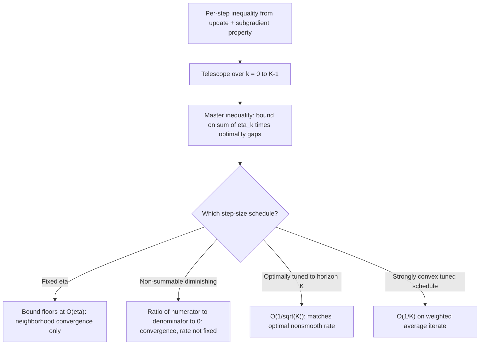

## Subgradient Method Convergence and Step Size Rules

### Scope and Framing

This topic develops the convergence proof mechanics and step-size theory for subgradient methods in more formal depth than the general overview already covered. It derives the fundamental inequality driving all subgradient convergence results, shows precisely how each step-size rule follows from that inequality, and treats the strongly convex case and stopping-criterion subtleties that the introductory treatment left at a high level.

### The Fundamental Subgradient Inequality

**Key Points**

The entire convergence theory for subgradient methods rests on a single algebraic identity, derived directly from the update $x^{k+1} = x^k - \eta_k g^k$ with $g^k \in \partial f(x^k)$:

$$\|x^{k+1} - x^\star\|_2^2 = \|x^k - x^\star\|_2^2 - 2\eta_k \langle g^k, x^k - x^\star\rangle + \eta_k^2 \|g^k\|_2^2$$

obtained by expanding $\|x^k - \eta_k g^k - x^\star\|_2^2$ directly. Applying the subgradient inequality $f(x^\star) \ge f(x^k) + \langle g^k, x^\star - x^k\rangle$, i.e., $\langle g^k, x^k - x^\star \rangle \ge f(x^k) - f(x^\star)$, gives:

$$\|x^{k+1}-x^\star\|_2^2 \le \|x^k - x^\star\|_2^2 - 2\eta_k\left(f(x^k) - f(x^\star)\right) + \eta_k^2\|g^k\|_2^2$$

- This single inequality is the origin of every subsequent result in this topic: telescoping it over $k = 0, \ldots, K-1$ and rearranging directly yields a bound on the average (or best) optimality gap in terms of the initial distance to the optimum, the accumulated step sizes, and the accumulated squared step sizes weighted by subgradient norms.
- Assuming Lipschitz continuity of $f$ with constant $G$, so $\|g^k\|_2 \le G$ for every subgradient encountered, the telescoped inequality becomes:

  $$2\sum_{k=0}^{K-1}\eta_k\left(f(x^k)-f(x^\star)\right) \le \|x^0-x^\star\|_2^2 + G^2\sum_{k=0}^{K-1}\eta_k^2$$

  This is the master inequality from which every step-size rule's convergence behavior below is read off directly.

### Deriving Each Step-Size Rule from the Master Inequality

**Key Points**

- **Fixed step size** ($\eta_k = \eta$): The master inequality gives

  $$\min_{k<K} f(x^k) - f(x^\star) \le \frac{\|x^0-x^\star\|_2^2}{2K\eta} + \frac{G^2\eta}{2}$$

  As $K \to \infty$, the first term vanishes but the second term $G^2\eta/2$ remains — this is the precise algebraic source of the "converges only to a neighborhood" behavior with fixed step size stated in the general overview: the residual error is exactly proportional to $\eta$, so halving the step size halves the asymptotic neighborhood radius.
- **Non-summable diminishing** ($\eta_k \to 0$, $\sum_k \eta_k = \infty$): Dividing the master inequality by $2\sum_{k<K}\eta_k$ gives a weighted average optimality gap bounded by $\frac{\|x^0-x^\star\|_2^2 + G^2\sum_{k<K}\eta_k^2}{2\sum_{k<K}\eta_k}$. Since the numerator's step-size-dependent term grows slower than the denominator whenever $\sum_k \eta_k^2$ converges or grows slower than $\left(\sum_k \eta_k\right)$, this ratio $\to 0$, giving $f_{\text{best}}^K \to f(x^\star)$. This is exactly why non-summability of $\sum_k \eta_k$ is required: it is what forces the denominator to diverge and drive the bound to zero.
- **Square-summable, not summable** ($\sum_k \eta_k^2 < \infty$, $\sum_k \eta_k = \infty$): This is a stronger sufficient condition than the previous case — since $\sum_k \eta_k^2$ converges to a finite constant, the numerator in the ratio above is bounded, so the bound decays at a rate directly tied to how quickly $\sum_{k<K}\eta_k$ grows (e.g., for $\eta_k = \theta/k$, $\sum_{k<K}\eta_k = O(\log K)$, giving a bound of $O(1/\log K)$ — slower than the $O(1/\sqrt{K})$ rate obtained by optimally tuned diminishing schedules below, illustrating that this classical condition guarantees convergence but not the optimal rate by itself).
- **Optimally tuned fixed-horizon step size**: If the total number of iterations $K$ is known in advance, setting $\eta_k = \eta = \frac{\|x^0-x^\star\|_2}{G\sqrt{K}}$ for all $k$ (constant over the horizon, but tuned to $K$) and substituting into the fixed-step bound gives

  $$f_{\text{best}}^K - f(x^\star) \le \frac{G\|x^0-x^\star\|_2}{\sqrt{K}}$$

  which is exactly the $O(1/\sqrt{K})$ rate stated in the general overview, now derived explicitly, and matches the known optimal rate for this problem class using only subgradient information.
- **Time-varying schedule matching the fixed-horizon rate**: Setting $\eta_k = \frac{\|x^0-x^\star\|_2}{G\sqrt{K}}$ requires knowing $K$ in advance; a schedule such as $\eta_k = \theta/\sqrt{k+1}$ (not requiring a known horizon) achieves the same $O(1/\sqrt{K})$ rate up to constant factors, at the cost of a more careful (but still elementary) summation argument bounding $\sum_{k<K} 1/\sqrt{k+1} = O(\sqrt{K})$ and $\sum_{k<K} 1/(k+1) = O(\log K)$ in the master inequality.

### Polyak Step Size: Derivation

**Key Points**

- The **Polyak step size** is derived by directly minimizing the right-hand side of the per-step inequality

  $$\|x^{k+1}-x^\star\|_2^2 \le \|x^k-x^\star\|_2^2 - 2\eta_k(f(x^k)-f(x^\star)) + \eta_k^2\|g^k\|_2^2$$

  over $\eta_k$ for fixed $x^k$: treating the right-hand side as a quadratic in $\eta_k$, the minimizing value is exactly $\eta_k^\star = \frac{f(x^k)-f(x^\star)}{\|g^k\|_2^2}$, which is the Polyak step size introduced in the general overview.
- Substituting this optimal $\eta_k^\star$ back into the per-step inequality yields the tightest possible one-step guarantee: $\|x^{k+1}-x^\star\|_2^2 \le \|x^k-x^\star\|_2^2 - \frac{(f(x^k)-f(x^\star))^2}{\|g^k\|_2^2}$, showing the distance to the optimum is guaranteed to strictly decrease at every step (given $x^k \ne x^\star$) — a per-step guarantee that no fixed or purely-diminishing schedule provides, since those only guarantee decrease of the *bound*, not of $\|x^k - x^\star\|_2^2$ itself at every individual step.
- This derivation makes explicit why the Polyak step size requires knowing (or estimating) $f(x^\star)$: it appears directly in the formula as the target being subtracted, and a poor estimate of $f(x^\star)$ directly degrades the quality of the resulting step size. [Inference: the precise practical degradation from a specific estimation error in $f(x^\star)$ is problem-dependent and not derivable from the general inequality alone.]

### Strongly Convex Case

**Key Points**

- When $f$ is $\mu$-strongly convex, the subgradient inequality strengthens to $f(x^\star) \ge f(x^k) + \langle g^k, x^\star - x^k\rangle + \frac{\mu}{2}\|x^k-x^\star\|_2^2$, which propagates an extra $-\mu\eta_k\|x^k-x^\star\|_2^2$ term into the master inequality.
- With the step-size choice $\eta_k = \frac{2}{\mu(k+1)}$ (a schedule tuned specifically to the strong-convexity constant $\mu$), the resulting telescoped bound gives

  $$f\left(\hat{x}^K\right) - f(x^\star) = O\left(\frac{1}{K}\right)$$

  where $\hat{x}^K$ is a specific weighted average of the iterates (weights proportional to $\eta_k$, not a simple unweighted average) — this is the precise mechanism behind the improved $O(1/k)$ rate under strong convexity mentioned in the general overview, and it requires knowing $\mu$ to set the schedule correctly, unlike the non-strongly-convex diminishing schedules which only require knowing that a decrease-to-zero, non-summable condition is satisfied.
- This $O(1/k)$ rate under strong convexity is still slower than the rates achievable by proximal-type methods when smoothness of part of the objective can additionally be exploited (as established in the general subgradient methods overview), since strong convexity alone, without smoothness, does not remove the fundamental $O(1/\sqrt{k})$-type barrier associated with using only subgradient (not gradient) information — the improvement here is specifically from $O(1/\sqrt{k})$ to $O(1/k)$, not further.

### Rate Summary by Assumption and Step-Size Choice

| Assumptions | Step-Size Rule | Rate (on $f_{\text{best}}^K$ or weighted average) |
| --- | --- | --- |
| Convex, $G$-Lipschitz | Fixed $\eta_k = \eta$ | Converges to $O(\eta)$-neighborhood only |
| Convex, $G$-Lipschitz | Non-summable diminishing ($\eta_k \to 0$, $\sum \eta_k = \infty$) | $\to f(x^\star)$, rate not guaranteed optimal |
| Convex, $G$-Lipschitz | Square-summable, not summable (e.g. $\eta_k = \theta/k$) | Converges, rate can be as slow as $O(1/\log K)$ |
| Convex, $G$-Lipschitz | Optimally tuned fixed-horizon ($\eta_k = \|x^0-x^\star\|_2/(G\sqrt{K})$) | $O(1/\sqrt{K})$ — matches known optimal rate |
| Convex, $G$-Lipschitz | Polyak step size | Guarantees per-step distance decrease; rate matches $O(1/\sqrt{K})$ under standard analysis |
| $\mu$-strongly convex, $G$-Lipschitz | $\eta_k = 2/(\mu(k+1))$ | $O(1/K)$ on a weighted average iterate |

### Convergence Derivation Flow

### Stopping Criteria and Practical Estimation

**Key Points**

- Because the subgradient method does not have a computable, always-available optimality certificate analogous to gradient norm (since $0 \in \partial f(x^k)$ is generally not verifiable without knowing the whole subdifferential set at $x^k$, which is often unavailable in closed form), practical stopping criteria typically rely on a fixed iteration budget, an external estimate or bound on $f(x^\star)$ (e.g., from a dual problem, if available), or monitoring the best-seen objective value for a lack of sufficient improvement over a window of iterations. [Inference: which stopping criterion is most appropriate is specific to whether an external bound on $f(x^\star)$ is available for the given problem.]
- When a dual problem provides a computable lower bound $f_D \le f(x^\star)$, this can substitute for the true $f(x^\star)$ in the Polyak step size formula, yielding a computable step size — the derivation of the Polyak step size above shows why any convergent lower-bound substitute for $f(x^\star)$ still produces a valid (if slightly suboptimal) step, since the quadratic-minimization argument degrades gracefully with an underestimate rather than requiring the exact value. [Inference: the specific degradation in convergence rate from using a lower bound instead of the exact $f(x^\star)$ depends on how tight that bound is for the given problem.]

### Practical Considerations

- The derivation above makes explicit that step-size schedules requiring a known horizon $K$ (the optimally tuned fixed-horizon rule) achieve the same asymptotic rate as horizon-free schedules (e.g., $\eta_k = \theta/\sqrt{k+1}$) up to constants — so knowing $K$ in advance is a convenience for tuning the constant, not a requirement for achieving the $O(1/\sqrt{K})$ rate itself.
- The Polyak step size's requirement of $f(x^\star)$ (or a usable bound) is the main practical barrier to its use; in problems where no such bound is naturally available (e.g., no accessible dual problem), the standard diminishing schedules from the master-inequality derivation remain the default despite their comparatively weaker per-step guarantee. [Inference: whether an accessible bound on $f(x^\star)$ exists is problem-specific and determines whether Polyak-style step sizes are a practical option.]
- Because the strongly-convex step-size schedule $\eta_k = 2/(\mu(k+1))$ depends explicitly on $\mu$, an inaccurate estimate of the strong-convexity constant directly changes the schedule used, and this mistuning is a distinct source of practical rate degradation from the sources already discussed under general step-size sensitivity. [Inference: the specific sensitivity of observed convergence to a misestimated $\mu$ is problem-dependent.]

### Related Topics

- Subgradients, subdifferential calculus, and nonsmooth optimality conditions
- Mirror descent and Bregman-divergence generalizations of the master inequality
- Dual bounds and their use in step-size and stopping-criterion design
- Stochastic subgradient convergence under the same step-size framework
- Ergodic (weighted-average) convergence arguments in nonsmooth optimization
- Bundle methods as a response to subgradient methods' lack of monotonic decrease
- Strongly convex optimization rate barriers for first-order nonsmooth methods
- Distributed and incremental subgradient convergence under this same analysis