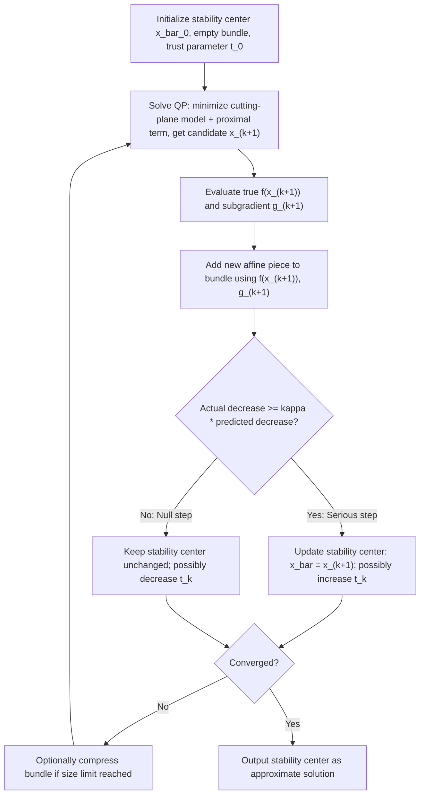

## Bundle Methods

### Motivation and Background

Bundle methods address a core limitation of subgradient methods identified in the preceding topics: a single subgradient at the current point discards almost all of the information gathered at previous iterates, and the resulting $O(1/\sqrt{k})$ rate reflects this information loss. Bundle methods instead accumulate a **bundle** — a growing collection of past subgradients and function values — and use them jointly to build a piecewise-linear model of the objective that is far more informative than any single subgradient, while still requiring only subgradient (not gradient) oracle access at each queried point.

### Cutting-Plane Model of the Objective

**Key Points**

Given past iterates $x^1, \ldots, x^k$ with corresponding function values $f(x^j)$ and subgradients $g^j \in \partial f(x^j)$, the subgradient inequality $f(y) \ge f(x^j) + \langle g^j, y - x^j\rangle$ holds for every $j$ and every $y$. Taking the pointwise maximum over all accumulated linear underestimators gives the **cutting-plane model**:

$$\hat{f}_k(y) = \max_{j=1,\ldots,k} \left[ f(x^j) + \langle g^j, y - x^j\rangle \right]$$

- $\hat{f}_k$ is a piecewise-linear function that **underestimates** $f$ everywhere ($\hat{f}_k(y) \le f(y)$ for all $y$, since each individual affine piece is itself a valid global underestimator), and this underestimation property is exact and requires no approximation — it follows directly from the subgradient inequality applied at each stored point.
- As $k$ grows, $\hat{f}_k$ incorporates strictly more affine pieces (unless a new piece happens to be dominated everywhere by existing ones), so the model can only become a tighter approximation to $f$ over the region of interest as more points are queried — this monotonic tightening is the central mechanism by which bundle methods extract more progress per oracle call than a single-subgradient method.
- The basic **cutting-plane method** simply minimizes $\hat{f}_k$ at each iteration to generate the next query point: $x^{k+1} = \arg\min_y \hat{f}_k(y)$, a linear program (or, if $y$ is also constrained to a polyhedron, still a linear program) rather than a closed-form update — a qualitatively different computational structure from the single-step subgradient update.

### Instability of the Basic Cutting-Plane Method

**Key Points**

- The basic cutting-plane method, despite using strictly more information than the subgradient method, is known to exhibit **unstable, oscillatory behavior** in practice: because $\hat{f}_k$ is only a lower model of $f$ (not an approximation guaranteed to be accurate near the current best point), minimizing it can propose a query point $x^{k+1}$ that is very far from the current region of good approximation, wasting oracle calls on points where the model happens to be loose.
- This instability is a well-documented practical and theoretical weakness of the pure cutting-plane approach, not merely a minor inefficiency — worst-case behavior for the basic method can be as slow as, or in some regimes slower in practice than, the plain subgradient method's $O(1/\sqrt{k})$ guarantee, despite using richer information. [Inference: the precise conditions under which pure cutting-plane methods underperform subgradient methods in practice are problem-dependent and are best understood via the specific counterexamples and analyses documenting this instability rather than as a universal ordering.]
- This instability is the direct motivation for **bundle methods**, which retain the cutting-plane model $\hat{f}_k$ but add a stabilization mechanism to prevent the next query point from jumping arbitrarily far from a trusted region.

### Proximal Bundle Method

**Key Points**

The proximal bundle method stabilizes the cutting-plane subproblem by adding a proximal (quadratic) term centered at the current **stability center** $\bar{x}^k$ (the best point found so far, not necessarily the most recent query point):

$$x^{k+1} = \arg\min_y \; \hat{f}_k(y) + \frac{1}{2t_k}\|y - \bar{x}^k\|_2^2$$

where $t_k > 0$ is a proximal (trust) parameter controlling how far the new query point is allowed to deviate from the stability center.

- This subproblem is directly recognizable as a **proximal operator evaluation on the cutting-plane model** $\hat{f}_k$ — connecting bundle methods explicitly back to the proximal operator machinery introduced earlier: $x^{k+1} = \text{prox}_{t_k \hat{f}_k}(\bar{x}^k)$. Since $\hat{f}_k$ is piecewise-linear (a max of affine functions), this proximal evaluation reduces to a quadratic program, generally solvable efficiently via standard QP solvers, rather than requiring a closed-form proximal formula.
- **Serious step vs. null step decision**: After computing $x^{k+1}$, the method evaluates the true objective $f(x^{k+1})$ and compares the actual decrease $f(\bar{x}^k) - f(x^{k+1})$ to the decrease **predicted** by the model, $f(\bar{x}^k) - \hat{f}_k(x^{k+1})$. If the actual decrease is a sufficiently large fraction (governed by a fixed parameter $\kappa \in (0,1)$) of the predicted decrease, the step is declared a **serious step**: the stability center updates, $\bar{x}^{k+1} = x^{k+1}$. Otherwise it is a **null step**: the stability center stays at $\bar{x}^k$, but the new point's subgradient $g^{k+1} \in \partial f(x^{k+1})$ is still added to the bundle, refining $\hat{f}_{k+1}$ before the next attempt.
- This serious/null step mechanism is the direct stabilization fix for the pure cutting-plane method's instability: rather than always moving to the model's minimizer, the method only commits to moving when the model's prediction is empirically validated by the true function value, while still banking the oracle information gained even on unsuccessful (null) steps.

### Bundle Management

**Key Points**

- Without any pruning, the number of affine pieces in $\hat{f}_k$ grows by one every iteration, and both the storage cost and the cost of solving the quadratic subproblem grow correspondingly — this is a genuine practical scalability concern distinct from convergence-rate considerations.
- **Bundle compression / aggregation**: A common practical technique replaces a subset of the accumulated affine pieces with a single **aggregate cutting plane** — a convex combination of existing pieces (with combination weights taken from the QP subproblem's dual solution) — that preserves the key underestimation property needed for the convergence proof while bounding the bundle size at a fixed maximum, discarding or merging older/redundant pieces once this limit is reached. [Inference: the specific compression scheme and resulting practical trade-off between bundle size and convergence speed differs across bundle-method implementations.]
- Bundle size management interacts with the trust parameter $t_k$: adaptive schemes typically increase $t_k$ (allow larger steps) after a sequence of serious steps and decrease it after null steps, echoing trust-region-style step-size adaptation logic, though the specific adaptation rule varies by implementation. [Inference: the precise adaptation schedule and its effect on overall convergence speed is implementation-specific rather than governed by a single universal rule.]

### Convergence Properties

**Key Points**

- Under the same standing assumptions as the general subgradient method (convex $f$, Lipschitz continuity with constant $G$), the proximal bundle method retains a global convergence guarantee: the sequence of stability centers $\bar{x}^k$ converges to the optimal value $f(x^\star)$, and under mild additional conditions the iterates converge to a minimizer.
- The worst-case theoretical rate for the proximal bundle method on general nonsmooth Lipschitz convex functions remains $O(1/\sqrt{k})$, matching the fundamental barrier established for the subgradient method — bundle methods do not overcome this worst-case rate limit for the general problem class, since that rate is optimal for any first-order method using only subgradient oracle information on this class.
- The practical benefit of bundle methods over plain subgradient methods is therefore in the **typical-case behavior and stability** (fewer wasted oracle calls, less erratic progress, better empirical convergence speed on many problems) rather than in an improved worst-case asymptotic rate — a distinction directly analogous to how acceleration improves proximal-gradient methods' rate on smooth-plus-simple problems, but here the improvement is empirical/practical rather than a change in the worst-case rate exponent. [Inference: the magnitude of practical (as opposed to worst-case) speedup from bundle methods over plain subgradient methods is problem-dependent and best assessed empirically for a specific application.]

### Bundle Method vs. Subgradient Method Comparison

| Property | Subgradient Method | Proximal Bundle Method |
| --- | --- | --- |
| Information used per step | Single subgradient at current point | Accumulated bundle of past subgradients/values |
| Subproblem per iteration | Closed-form update | Quadratic program (proximal step on cutting-plane model) |
| Monotonic decrease of stability center's objective | No | Yes, by construction (serious step criterion enforces it) |
| Worst-case rate (general nonsmooth convex) | $O(1/\sqrt{k})$ | $O(1/\sqrt{k})$ (same worst case) |
| Typical practical behavior | Can oscillate, no model of past information | More stable, typically better practical progress |
| Memory/storage growth | Constant (only current point/subgradient) | Grows with bundle size (managed via compression) |

### Bundle Method Iteration Flow

### Worked Example: Bundle Method on a Piecewise-Linear Objective

**Example**

Consider $f(x) = \max(2x - 3, -x + 4, 0.5x + 1)$, a simple piecewise-linear (and thus nonsmooth at the breakpoints between pieces) convex function of a scalar $x$.

1. At an initial query $x^1 = 0$: the active piece is $f(x^1) = \max(-3, 4, 1) = 4$ (from $-x+4$), with subgradient $g^1 = -1$. The cutting-plane model $\hat{f}_1(y) = 4 - (y - 0) = 4 - y$ is exact only along that one affine piece.
2. Solving the proximal subproblem $\min_y \hat{f}_1(y) + \frac{1}{2t_0}(y-0)^2$ gives a candidate $x^2$ determined by the trust parameter $t_0$; suppose it yields $x^2 = 2$.
3. Evaluating the true function at $x^2=2$: $f(2) = \max(1, 2, 2) = 2$ (from either $-x+4$ or $0.5x+1, both active — a kink point), with a subgradient chosen from the resulting subdifferential (e.g., $g^2 = -1
    or $g^2=0.5$, or any convex combination, per the subdifferential-of-a-max rule from the general subgradient overview). This new piece is added to the bundle, and $\hat{f}_2$ now has two affine pieces, giving a strictly tighter model than $\hat{f}_1$ in the region between $x^1$ and $x^2$.
4. The serious/null step test compares the actual decrease $f(x^1) - f(x^2) = 4 - 2 = 2$ to the model-predicted decrease $f(x^1) - \hat{f}_1(x^2) = 4 - (4-2) = 2$; since these match exactly here (an idealized illustration), the step is accepted as serious, and the stability center moves to $x^2$.

This illustrates concretely how each iteration both refines the piecewise-linear model (via the new affine piece) and tests that refinement against the true function before committing to move — the two mechanisms that together address the pure cutting-plane method's instability.

### Extensions and Related Variants

**Key Points**

- **Level bundle methods**: An alternative stabilization approach that constrains the next query point to a "level set" of the cutting-plane model (points where the model value is below a target level) rather than adding a quadratic proximal penalty — solving a different but related stabilized subproblem each iteration, with its own convergence theory closely paralleling the proximal bundle method's. [Inference: the relative practical performance of level bundle methods versus proximal bundle methods is problem- and implementation-dependent.]
- **Trust-region bundle methods**: Replace the quadratic proximal penalty with an explicit trust-region constraint ($\|y - \bar{x}^k\|_2 \le \Delta_k$) instead of a penalty term, echoing trust-region methods from smooth nonlinear optimization, with the region radius $\Delta_k$ playing a role analogous to the proximal parameter $t_k$.
- **Bundle methods for constrained problems**: The cutting-plane and proximal-stabilization machinery extends to constrained nonsmooth convex optimization by incorporating the feasible set directly into the QP subproblem (when the constraint set is itself polyhedral or otherwise QP-compatible) or by combining bundle methods with penalty or augmented Lagrangian handling of the constraints. [Inference: the specific extension chosen depends on the tractability of incorporating the particular constraint set into the bundle subproblem.]

### Practical Considerations

- Bundle methods trade a more expensive per-iteration subproblem (a QP rather than a closed-form update) for typically fewer oracle calls and more stable progress; whether this trade-off is favorable depends on the relative cost of evaluating $f$ and its subgradient versus the cost of solving the QP subproblem for the specific application. [Inference: this relative cost balance is application-specific and should be assessed for the particular problem at hand.]
- Bundle compression is a practical necessity for long-running instances, since unmanaged bundle growth increases both memory use and QP-solve cost every iteration; the choice of compression scheme and maximum bundle size is typically tuned empirically. [Inference: no single default bundle size or compression rule is optimal across all problem instances.]
- Because bundle methods still only achieve the same $O(1/\sqrt{k})$ worst-case rate as plain subgradient methods, the decision to use a bundle method over a simpler subgradient scheme is generally driven by anticipated practical/typical-case performance and stability rather than by a worst-case theoretical advantage. [Inference: this decision is best informed by empirical trial on representative problem instances rather than by the worst-case rate alone.]

### Related Topics

- Cutting-plane methods and piecewise-linear model construction
- Proximal operators and their role in bundle-method subproblems
- Level bundle methods and trust-region bundle variants
- Subgradient methods and the shared $O(1/\sqrt{k})$ worst-case barrier
- Quadratic programming solvers for bundle subproblem computation
- Augmented Lagrangian and penalty approaches for constrained bundle methods
- Stochastic and inexact bundle methods
- Trust-region methods in smooth nonlinear optimization