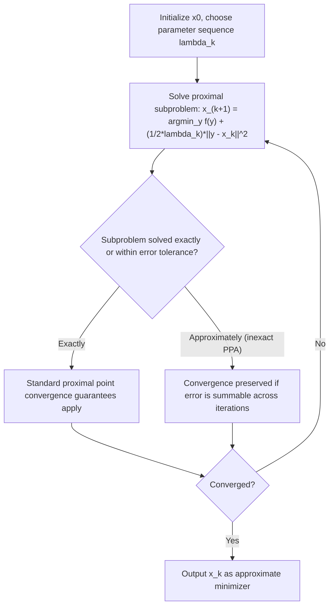

## Proximal Point Algorithms

### Motivation and Background

The proximal point algorithm (PPA) is, in a precise sense, the conceptual root from which most of the proximal, splitting, and bundle machinery covered so far descends: it is the algorithm obtained by applying the proximal operator to $f$ itself, repeatedly, with no gradient step at all. Where proximal gradient methods combine a gradient step on a smooth part with a proximal step on a nonsmooth part, and bundle methods apply a proximal step to an evolving cutting-plane model of $f$, the proximal point algorithm applies the exact proximal operator directly and repeatedly to the true objective. It is less a practical black-box algorithm for general problems (since it requires solving a proximal subproblem on the full $f$ at every step) than a foundational template whose convergence theory underlies ADMM, Douglas-Rachford splitting, and other methods already introduced.

### Core Update Rule

**Key Points**

For $\min_x f(x)$ with $f$ closed, proper, and convex, the proximal point algorithm iterates:

$$x^{k+1} = \text{prox}_{\lambda_k f}(x^k) = \arg\min_y \; f(y) + \frac{1}{2\lambda_k}\|y - x^k\|_2^2$$

where $\lambda_k > 0$ is a sequence of proximal parameters.

- This is exactly the fixed-point characterization from the general proximal operator properties introduced earlier: $x^\star$ minimizes $f$ if and only if $x^\star = \text{prox}_{\lambda f}(x^\star)$ for any $\lambda > 0$. The proximal point algorithm is precisely the fixed-point iteration built from this observation, applied with the operator $\text{prox}_{\lambda_k f}$ at each step.
- Equivalently, using the resolvent characterization $\text{prox}_{\lambda f} = (I + \lambda \partial f)^{-1}$ (also established in the general proximal operator discussion), the update is $x^{k+1} = (I + \lambda_k \partial f)^{-1}(x^k)$ — the proximal point algorithm is the resolvent iteration of the (maximal monotone) subdifferential operator $\partial f$, which is the standard entry point for connecting proximal point algorithm theory to the broader monotone operator framework used in Douglas-Rachford splitting and ADMM's convergence proofs.
- Unlike the subgradient method, each proximal point iteration is guaranteed to be a **descent step**: firm nonexpansiveness of the proximal operator directly implies $f(x^{k+1}) \le f(x^k)$ for convex $f$, a consequence of the same nonexpansiveness property established under the general proximal operator properties, here applied with $f$ itself as the function (rather than a nonsmooth term paired with a separate smooth gradient step).

### Convergence Properties

**Key Points**

- Under only closedness, properness, and convexity of $f$ (no Lipschitz gradient assumption, no strong convexity), and with $\lambda_k$ bounded away from zero (e.g., $\lambda_k \ge \lambda_{\min} > 0$ for all $k$), the proximal point algorithm converges: $f(x^k) \to f(x^\star)$, and if a minimizer exists, the iterates $x^k$ converge to a minimizer (not merely the objective value, in contrast to the general subgradient method's weaker guarantee on iterate convergence).
- **Convergence rate**: the objective suboptimality satisfies

  $$f(x^k) - f(x^\star) \le \frac{\|x^0 - x^\star\|_2^2}{2\sum_{j=1}^k \lambda_j}$$

  so with a fixed proximal parameter $\lambda_k = \lambda$, this gives an $O(1/k)$ rate — matching the rate of ordinary proximal gradient descent (ISTA) on composite problems, despite the proximal point algorithm requiring no smoothness assumption on $f$ at all, only convexity. This is a notable contrast with the general (subgradient-only) nonsmooth convex rate of $O(1/\sqrt{k})$: the exact proximal step, rather than a linearized subgradient step, is what recovers the faster $O(1/k)$ rate here.
- Under additional strong convexity of $f$ (modulus $\mu$), the proximal point algorithm converges **linearly**: $\|x^{k+1} - x^\star\|_2 \le \frac{1}{1+\lambda_k\mu}\|x^k - x^\star\|_2$, so larger $\lambda_k$ directly improves the per-step contraction factor — in contrast to gradient-based methods, where increasing the step size beyond a Lipschitz-constant-dependent threshold causes divergence, the proximal point algorithm's linear-convergence guarantee **improves monotonically** as $\lambda_k$ grows, since the proximal subproblem itself absorbs the numerical stiffness that a larger step would otherwise cause in an explicit gradient method. [Inference: in practice, very large $\lambda_k$ makes the proximal subproblem itself increasingly ill-conditioned to solve, so this monotonic theoretical improvement in contraction factor is generally traded off against increasing subproblem-solve difficulty, a trade-off that is implementation- and problem-specific.]

### Why the Proximal Subproblem Is Not Free

**Key Points**

- The favorable convergence-rate properties above come at a structural cost that distinguishes the proximal point algorithm from a practical black-box method: each iteration requires solving $\arg\min_y f(y) + \frac{1}{2\lambda_k}\|y-x^k\|_2^2$ **exactly** (or to high accuracy), and for general convex $f$ without special structure, this subproblem can be as hard as the original problem itself.
- This is precisely why the proximal point algorithm is used in practice primarily as a **conceptual and derivational tool** — a foundation from which more practical algorithms are built by choosing an $f$ (or a splitting of the problem) for which the proximal subproblem is tractable — rather than as a general-purpose solver applied directly to an arbitrary $f$. The closed-form proximal operator examples catalogued earlier (soft-thresholding, projection onto simple sets, and so on) are exactly the special cases where a "proximal point step" is genuinely cheap.
- **Inexact proximal point methods** relax the requirement of solving the subproblem exactly, permitting an approximate solution $x^{k+1} \approx \text{prox}_{\lambda_k f}(x^k)$ satisfying a bounded-error criterion (e.g., a summable-error condition on the sequence of approximation errors). Convergence is preserved under such summable-error conditions, extending the algorithm's practical reach to cases where the subproblem is tractable only approximately (e.g., via a bounded number of inner iterations of another method). [Inference: the precise error tolerance required to preserve a given convergence rate depends on the specific inexact-proximal-point convergence analysis being applied.]

### Relation to ADMM and Douglas-Rachford Splitting

**Key Points**

- ADMM (introduced in the earlier topic) can itself be derived as an application of the proximal point algorithm to the **dual problem** of the original constrained problem, or equivalently, as a Douglas-Rachford splitting iteration applied to the sum of two monotone operators $\partial f$ and $\partial g$ after the constraint-coupling change of variables established in the ADMM convergence theory topic — the proximal point algorithm's resolvent-iteration view is the unifying mathematical object underlying both derivations.
- This means the proximal point algorithm's convergence theory (in particular, the Fejér-monotonicity argument used in the general monotone-operator convergence proof sketch for ADMM) is not a separate body of theory from ADMM's — ADMM's convergence proof is, at a structural level, an instance of proximal-point/monotone-operator convergence theory specialized to the two-operator splitting case.
- The **augmented Lagrangian method** itself can be viewed as the proximal point algorithm applied to the dual function of a constrained optimization problem: the dual proximal step corresponds exactly to the primal augmented Lagrangian minimization, which is the historical route by which the proximal point algorithm and augmented Lagrangian methods were shown to be closely related, well before their common role in motivating ADMM was established.

### Proximal Point vs. Proximal Gradient vs. Bundle Methods

| Property | Proximal Point Algorithm | Proximal Gradient (ISTA/FISTA) | Proximal Bundle Method |
| --- | --- | --- | --- |
| Function handled by the proximal step | The entire objective $f$ | Only the nonsmooth part; smooth part handled by gradient step | A piecewise-linear model of $f$ (not $f$ itself) |
| Requires smoothness of any part | No | Yes, for the non-proximal part | No |
| Per-iteration subproblem | Exact minimization of $f(y) + \frac{1}{2\lambda}\|y-x^k\|_2^2$ | Closed-form or cheap proximal operator on the simple part | Quadratic program on the cutting-plane model |
| Convergence rate (convex) | $O(1/k)$ | $O(1/k)$ (ISTA), $O(1/k^2)$ (FISTA) | $O(1/\sqrt{k})$ worst case |
| Practical tractability for general $f$ | Often intractable (subproblem as hard as original) | Tractable when nonsmooth part is "simple" | Tractable (subproblem is a QP) |
| Primary practical role | Conceptual/derivational foundation | Directly practical for composite problems | Directly practical for general nonsmooth problems |

### Iteration Flow

### Worked Example: Proximal Point Algorithm on a Quadratic

**Example**

Consider $f(x) = \frac{1}{2}(x-3)^2$ for scalar $x$ (a simple strongly convex quadratic, chosen so the proximal subproblem itself has an easy closed form, illustrating the mechanics without subproblem-tractability concerns).

The proximal subproblem is

$$x^{k+1} = \arg\min_y \; \frac{1}{2}(y-3)^2 + \frac{1}{2\lambda}(y-x^k)^2$$

Differentiating and solving directly gives the closed form

$$x^{k+1} = \frac{x^k + \lambda \cdot 3}{1+\lambda}$$

which is a weighted average of the current iterate and the true minimizer $x^\star = 3$, with weight $\frac{\lambda}{1+\lambda}$ on the minimizer. Since $f$ is $\mu=1$-strongly convex, the linear-convergence bound from above gives contraction factor $\frac{1}{1+\lambda}$ per step — directly visible in the closed form: larger $\lambda$ pulls $x^{k+1}$ closer to $x^\star=3$ in a single step, consistent with the general claim that larger $\lambda_k$ improves the contraction factor monotonically. With $\lambda = 1$, each step's distance to $x^\star$ is halved; with $\lambda = 9$, each step's distance is reduced by a factor of $10$.

### Extensions

**Key Points**

- **Accelerated proximal point methods**: Applying Nesterov-style momentum extrapolation to the proximal point iteration (analogous to how FISTA accelerates ISTA) improves the convex-case rate from $O(1/k)$ to $O(1/k^2)$, following the same acceleration mechanics established for proximal gradient methods, now applied with the entire $f$ inside the proximal step rather than only a nonsmooth component.
- **Generalized proximal point methods with Bregman distances**: Replacing the Euclidean penalty $\frac{1}{2\lambda}\|y-x^k\|_2^2$ with a Bregman divergence $D_\phi(y, x^k)$ for a suitable convex $\phi$ generalizes the proximal point algorithm in the same way that mirror descent generalizes ordinary gradient descent, adapting the geometry of the proximal step to better match problem structure (e.g., for problems naturally posed on the simplex or other non-Euclidean domains). [Inference: whether a Bregman-based generalization improves practical performance for a specific problem depends on how well the chosen Bregman geometry matches that problem's structure.]
- **Proximal point methods for monotone inclusions**: The algorithm generalizes beyond convex minimization to finding a zero of any maximal monotone operator $T$ (not necessarily a subdifferential of a convex function), via $x^{k+1} = (I+\lambda_k T)^{-1}(x^k)$ — this generalization is exactly the level of abstraction at which the connection to Douglas-Rachford splitting and ADMM (both ultimately concerned with monotone operators, not only convex subdifferentials) becomes most direct.

### Practical Considerations

- The proximal point algorithm's chief practical value is rarely as a direct solver for a generic $f$; the exact-subproblem requirement is the binding constraint, and in practice it is deployed either (a) when the specific $f$ happens to have a tractable proximal operator (in which case it is genuinely useful, as in the strongly convex quadratic example above, or its splitting-based descendants like ADMM), or (b) as an inexact method where the inner subproblem is solved only approximately by a bounded number of steps of another algorithm. [Inference: the choice between these two practical modes is determined by whether the specific $f$ in a given application admits a tractable exact or approximate proximal evaluation.]
- Because larger $\lambda_k$ improves the theoretical linear-convergence contraction factor without the divergence risk seen in explicit gradient methods, tuning $\lambda_k$ in an exact-subproblem setting is primarily a trade-off against the increasing computational cost of solving that larger-$\lambda_k$ subproblem, rather than a stability concern. [Inference: the specific point at which increasing $\lambda_k$ stops being worthwhile is determined by the subproblem solver's cost scaling for the specific $f$ involved.]
- Recognizing when a practical algorithm (ADMM, a specific proximal gradient method, a specific splitting scheme) is structurally a proximal point algorithm applied to a transformed or dual problem is often the fastest route to importing an existing convergence-rate or stability result, rather than re-deriving convergence from first principles for the specific method at hand.

### Related Topics

- Monotone operator theory and resolvents of maximal monotone operators
- Douglas-Rachford splitting and its equivalence to ADMM
- Augmented Lagrangian methods and dual proximal point interpretations
- Accelerated proximal point methods and Nesterov-style extrapolation
- Bregman divergences and mirror-descent-style generalizations
- Inexact proximal methods and summable-error convergence conditions
- ADMM convergence theory and its monotone-operator foundations
- Proximal operator computation and properties for specific function classes