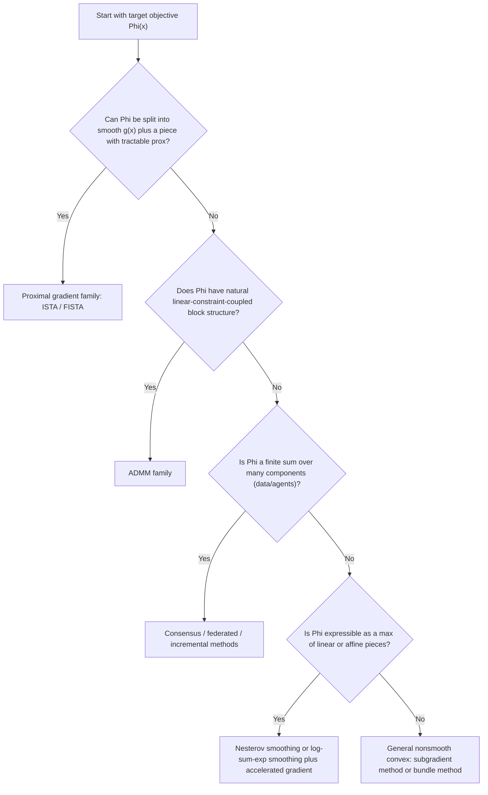

## Composite Optimization Formulations

### Scope and Framing

This topic steps back from individual algorithms to examine composite optimization as a **problem-formulation** framework: the ways a target objective is decomposed into constituent pieces, what structural properties each piece is assumed to have, and how that decomposition choice determines which of the algorithms already covered (proximal gradient, ADMM, subgradient, bundle) becomes applicable. Composite formulation is the modeling layer that sits above the algorithmic layer covered in previous topics.

### The General Composite Template

**Key Points**

The unifying template for composite optimization is:

$$\min_x \; \Phi(x) = \sum_{i=1}^m \phi_i(H_i(x))$$

where each $\phi_i$ is a (possibly nonsmooth) convex function and each $H_i$ is a (possibly linear, possibly nonlinear) mapping. Most problems encountered in the earlier topics are special cases of this template:

- **Two-term smooth-plus-simple**: $\Phi(x) = g(x) + f(x)$ with $g$ smooth and $f$ "simple" (tractable proximal operator) — the exact template underlying proximal gradient descent and FISTA.
- **Linearly-constrained two-block**: $\Phi(x,z) = f(x) + g(z)$ subject to $Ax+Bz=c$ — the template underlying ADMM, recovered by treating the constraint as a hard composite piece via an indicator function: $\phi_2(H_2(x,z)) = \iota_{\{0\}}(Ax+Bz-c)$.
- **Max-of-affine / max-of-smooth**: $\Phi(x) = \max_i \phi_i(x)$ — the template underlying subgradient and bundle methods when no smooth-plus-simple split is available, and underlying Nesterov/log-sum-exp smoothing when the max has the specific linear-in-$x$ structure noted in the Moreau envelope topic.
- **Sum of many terms**: $\Phi(x) = \sum_{i=1}^N f_i(x)$ (a finite sum over data points or agents) — the template underlying consensus optimization, federated optimization, and stochastic/incremental methods, where each $f_i$ is typically smooth but the sum itself may be too expensive to evaluate or differentiate exactly at every step.

Recognizing which special case a given $\Phi$ falls into is the primary modeling decision that determines algorithm choice, and a single problem can often be written in more than one of these forms via different choices of splitting.

### Smoothness and Simplicity as Modeling Choices, Not Fixed Properties

**Key Points**

- Whether a term is treated as "the smooth part" or "the simple nonsmooth part" is a **modeling decision**, not an inherent property of the underlying real-world problem. The LASSO objective $\frac{1}{2}\|Ax-b\|_2^2 + \lambda\|x\|_1$ was solved via proximal gradient (smooth-plus-simple split) in the accelerated proximal gradient topic, via ADMM (linearly-constrained two-block split, introducing $z=x$) in the ADMM topic, and could equally be attacked via subgradient methods (treating the whole sum as one nonsmooth function) as shown explicitly in the subgradient methods topic — the same underlying problem, three different composite formulations, three different algorithms, with substantially different convergence rates as a direct consequence of the formulation choice (the subgradient approach's $O(1/\sqrt{k})$ versus the proximal-split approaches' $O(1/k)$ or better).
- This means the central modeling question in composite optimization is not "what algorithm should I use?" in isolation, but "what decomposition of my objective exposes the most exploitable structure?" — smoothness of a piece, tractability of a piece's proximal operator, and separability across blocks or data are the three structural properties that, once identified in a candidate decomposition, determine which algorithm family becomes available.

### Structural Properties That Drive Algorithm Selection

**Key Points**

- **Smoothness (Lipschitz gradient)**: A piece with this property permits an explicit gradient step, unlocking proximal gradient methods and their $O(1/k)$–$O(1/k^2)$ rates, as opposed to leaving that piece inside a black-box nonsmooth term handled only by subgradients at the $O(1/\sqrt{k})$ rate.
- **Proximal tractability ("simplicity")**: A piece with a closed-form or cheaply computable proximal operator (per the catalogue established in the general proximal operator topic) permits proximal-splitting-based handling, whether via proximal gradient, ADMM, or the proximal point algorithm, all of which require this property for at least one piece of the decomposition.
- **Separability**: A piece that decomposes across coordinates, blocks, or data-points/agents permits parallel or distributed handling — this is the structural property that made consensus optimization, federated optimization, and block/coordinate methods viable, entirely independent of whether the separable piece is itself smooth or simple.
- **Linear-constraint coupling**: A piece expressible as an indicator of a linear-equality constraint set is the structural property specifically exploited by ADMM's splitting mechanism, distinguishing it from proximal gradient's smooth-plus-simple mechanism even though both ultimately rely on proximal tractability of the nonsmooth piece(s) involved.
- A single term in a real problem can possess more than one of these properties simultaneously (e.g., a smooth term that is also separable across data, as in most empirical risk minimization losses), and the choice of which property to foreground in the algorithm design is itself part of the composite-formulation modeling process.

### Decision Flow: From Objective Structure to Algorithm Family

### Worked Example: Reformulating a Single Problem Three Ways

**Example**

Consider group-sparse regression: $\min_x \frac{1}{2}\|Ax-b\|_2^2 + \lambda\sum_g \|x_g\|_2$ (a sum-of-squares data term plus a group-lasso penalty over disjoint groups $g$, with the group-lasso proximal operator already catalogued in the general proximal operators topic).

1. **Smooth-plus-simple formulation**: $g(x) = \frac{1}{2}\|Ax-b\|_2^2$ (smooth, Lipschitz gradient $L=\|A^TA\|_2$), $f(x) = \lambda\sum_g\|x_g\|_2$ (nonsmooth but with the tractable block-soft-thresholding proximal operator). This decomposition directly enables FISTA, achieving the accelerated $O(1/k^2)$ rate.
2. **Linearly-constrained two-block formulation**: Introduce $z=x$, giving $f(x) = \frac{1}{2}\|Ax-b\|_2^2$, $g(z) = \lambda\sum_g\|z_g\|_2$, constraint $x-z=0$ — recovering the ADMM template, with the same per-iteration proximal-operator building blocks but a different iteration structure and $O(1/k)$ ergodic rate (per the ADMM convergence theory topic).
3. **Distributed-data formulation**: If $A$ and $b$ are additionally row-partitioned across $N$ agents (each holding a subset of observations), $\frac{1}{2}\|Ax-b\|_2^2 = \sum_{i=1}^N \frac{1}{2}\|A_ix-b_i\|_2^2$ becomes a finite sum, and consensus ADMM (introduced in the consensus optimization topic) becomes the natural formulation, combining the group-lasso proximal step with a distributed averaging step across agents.

The same target objective supports all three decompositions; which is preferable depends on whether data is centralized or distributed (favoring formulation 1 or 2 versus formulation 3), and on whether the accelerated single-machine rate of FISTA or ADMM's natural fit to constraint-style splitting is more valuable for the specific deployment. [Inference: the specific preferred formulation for a given deployment depends on its data distribution, available compute, and accuracy requirements, and is not fixed by the objective's mathematical form alone.]

### Comparison of Composite Formulations

| Formulation | Structural Property Exploited | Algorithm Family Unlocked | Typical Rate (convex case) |
| --- | --- | --- | --- |
| Smooth-plus-simple: $g(x)+f(x)$ | Smoothness of $g$, prox-tractability of $f$ | Proximal gradient / FISTA | $O(1/k)$ – $O(1/k^2)$ |
| Linearly-constrained two-block: $f(x)+g(z)$, $Ax+Bz=c$ | Prox-tractability of $f$, $g$; constraint coupling | ADMM | $O(1/k)$ ergodic |
| Finite sum: $\sum_i f_i(x)$ | Separability across data/agents | Consensus, federated, incremental methods | Varies by base method used per component |
| Max-of-linear/affine: $\max_i \phi_i(x)$ | Saddle-point / finite-max structure | Nesterov or log-sum-exp smoothing + acceleration | $O(1/k)$ on the smoothed surrogate |
| General nonsmooth, no exploitable split | None beyond convexity | Subgradient or bundle methods | $O(1/\sqrt{k})$ |

### Multi-Term and Nested Composite Structures

**Key Points**

- Real large-scale problems frequently combine **more than two** structurally distinct pieces simultaneously — e.g., a smooth data-fitting loss, a nonsmooth sparsity-inducing regularizer, and a hard linear constraint, all in one objective. Handling three or more structurally distinct pieces is exactly the setting where the multi-block ADMM caveats established in the ADMM convergence theory topic become directly relevant: naively extending a two-piece splitting algorithm to three or more pieces can lose convergence guarantees, motivating either a regrouping of pieces back into two effective blocks or the use of a variant specifically designed for multiple blocks.
- **Nested composite structure** arises when a piece $\phi_i(H_i(x))$ has $H_i$ itself nonlinear (e.g., a neural-network-type mapping) rather than linear — this departs from the linear-composition assumption implicit in most of the algorithms covered so far (proximal gradient, ADMM, and their convergence theories generally assume linear coupling maps), and generally requires either a different structural assumption (e.g., a Lipschitz-gradient or prox-friendliness assumption on the composition as a whole, verified case by case) or specialized nonconvex composite optimization techniques. [Inference: which specific technique applies to a given nonlinear-composition problem depends on the particular structural properties the composition possesses, verified on a per-problem basis rather than following from a single unified theory.]

### Practical Considerations

- Before selecting an algorithm, it is generally more productive to enumerate the candidate decompositions of the target objective and check each against the structural properties (smoothness, proximal tractability, separability, linear-constraint coupling) than to start from a preferred algorithm and force the problem into its required template. [Inference: the relative payoff of this decomposition-first approach versus an algorithm-first approach depends on how much structural flexibility the specific problem actually admits.]
- When a problem admits multiple valid decompositions (as in the group-sparse regression example), the choice is frequently driven by external deployment constraints (data locality, available compute architecture, required solution accuracy) rather than by the objective's mathematical form alone — the same mathematical problem can have different "best" formulations in a single-machine setting versus a distributed setting.
- Extending a two-piece algorithm (proximal gradient, standard ADMM) to a genuinely three-or-more-piece composite structure should not be assumed to inherit the two-piece convergence guarantees automatically; this is precisely the caution already established for multi-block ADMM and applies by the same logic to other splitting-based methods when naively extended beyond their originally proven two-piece structure. [Inference: whether a specific multi-piece extension retains convergence guarantees must be checked against that extension's own published analysis rather than assumed from the two-piece case.]

### Related Topics

- Proximal gradient methods and the smooth-plus-simple template
- ADMM and linearly-constrained two-block splitting
- Multi-block ADMM and convergence-restoring modifications
- Consensus and federated optimization for finite-sum composite structures
- Nesterov and log-sum-exp smoothing for max-structured objectives
- Subgradient and bundle methods for unstructured nonsmooth composites
- Nonconvex composite optimization and nonlinear composition structures
- Proximal operator computation and properties for common composite pieces