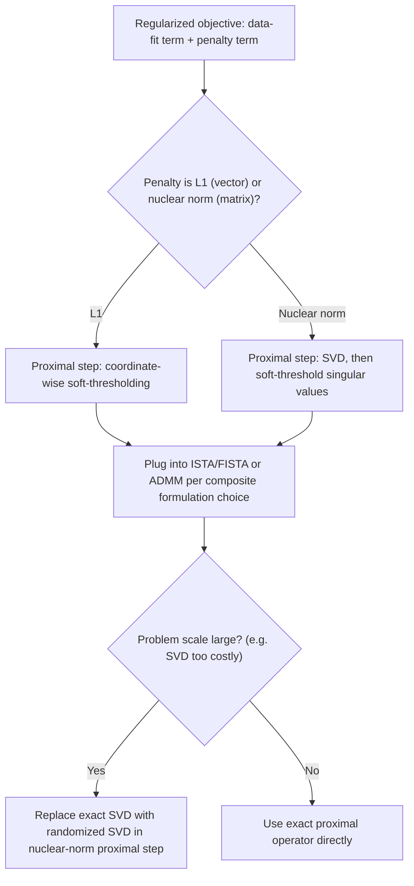

## Regularized Optimization with L1 and Nuclear Norm Penalties

### Scope and Framing

This topic consolidates the $\ell_1$ and nuclear-norm regularizers that have appeared as recurring closed-form examples throughout earlier topics (proximal operators, FISTA, ADMM, subgradient methods) into a focused treatment of the regularization problem class itself: why these two penalties are used, the structural (sparsity/low-rank) guarantees they provide, how those guarantees interact with the algorithms already covered, and the practical considerations specific to tuning and deploying them at scale.

### Why Sparsity- and Rank-Inducing Penalties

**Key Points**

- **$\ell_1$ regularization** is added to promote **exact sparsity** in the solution vector $x$ — many entries of $x$ set exactly to zero, not merely small. This is used when the true underlying signal or model is believed to depend on only a small subset of available features/variables, or when a sparse solution is preferred for interpretability, storage, or downstream computational reasons.
- **Nuclear norm regularization** is the direct matrix analogue: added to promote **low rank** in a matrix variable $X$, used when the underlying signal is believed to be well-approximated by a low-rank matrix (e.g., a recommender-system rating matrix assumed to depend on a small number of latent factors, or a covariance/kernel matrix assumed to have low intrinsic dimensionality).
- Both penalties are **convex surrogates** for a combinatorial, non-convex ideal: $\ell_1$ is the convex relaxation of the $\ell_0$ "norm" (count of nonzero entries), and the nuclear norm is the convex relaxation of matrix rank — in each case, the true sparsity/rank-minimization problem is combinatorial and generally intractable, while the convex surrogate is tractable via the proximal-operator and splitting machinery already developed. This convex-relaxation framing is why both penalties admit the same broad family of algorithms (proximal gradient, ADMM) despite operating on structurally different objects (vectors versus matrices).

### The L1-Regularized (LASSO) Formulation Revisited

**Key Points**

The canonical $\ell_1$-regularized least squares problem, already used as a running example in the FISTA and ADMM topics, is:

$$\min_x \; \frac{1}{2}\|Ax-b\|_2^2 + \lambda\|x\|_1$$

- The regularization parameter $\lambda \ge 0$ directly controls the sparsity-fit trade-off: $\lambda = 0$ recovers ordinary least squares (generically no exact zeros), while increasing $\lambda$ increases the number of coordinates driven exactly to zero, with $\lambda$ sufficiently large driving the entire solution to $x=0$.
- **Exact sparsity mechanism**: the soft-thresholding proximal operator $S_\lambda(v)_i = \text{sign}(v_i)\max(|v_i|-\lambda,0)$ (established in the general proximal operators topic) is what produces exact zeros at each iteration of ISTA/FISTA — any coordinate with $|v_i| \le \lambda$ at the gradient-step point is mapped to exactly zero, not merely shrunk toward it. This is the precise mechanistic reason $\ell_1$-regularized problems are solved via proximal methods rather than smooth surrogates: a smooth relaxation of $\|x\|_1$ (e.g., a smoothed/differentiable approximation) would not produce exact zeros under ordinary gradient descent, only values close to zero.
- The subgradient-method treatment of the same problem, shown explicitly in the subgradient methods topic, does **not** produce exact sparsity at intermediate iterates — this contrast was highlighted there specifically to motivate the proximal-gradient formulation as generally preferable whenever the regularizer's proximal operator is tractable, which is the case here.

### The Nuclear-Norm-Regularized (Matrix Completion) Formulation

**Key Points**

The matrix analogue, commonly arising in low-rank matrix recovery and matrix completion, is:

$$\min_X \; \frac{1}{2}\|\mathcal{A}(X) - b\|_2^2 + \lambda\|X\|_*$$

where $\|X\|_* = \sum_i \sigma_i(X)$ is the nuclear norm (sum of singular values), and $\mathcal{A}$ is a linear measurement operator — in the matrix completion special case, $\mathcal{A}$ simply selects a subset $\Omega$ of observed matrix entries, so the data term becomes $\frac{1}{2}\sum_{(i,j)\in\Omega}(X_{ij}-b_{ij})^2$.

- **Exact low-rank mechanism**: the singular value soft-thresholding proximal operator (established in the general proximal operators topic) $\text{prox}_{\lambda\|\cdot\|_*}(V) = U S_\lambda(\Sigma)V^T$ zeroes out singular values below $\lambda$ exactly, directly analogous to how the vector soft-thresholding operator zeroes out small coordinates — this is the exact mechanistic parallel between the two penalties, differing only in which "coordinates" (vector entries versus singular values) are being thresholded.
- Because this proximal operator requires computing an SVD at every iteration, the sketching and randomized-SVD techniques (covered in the earlier randomized linear algebra topic) are directly and specifically relevant here: proximal gradient methods for nuclear-norm problems at scale commonly replace the exact SVD in each proximal step with a randomized SVD restricted to the target rank (or a rank estimate with oversampling), trading exact proximal evaluation for a much cheaper approximate one, following the general inexact-proximal-evaluation tolerance considerations already noted for proximal-gradient-type methods.

### Structural (Statistical) Guarantees

**Key Points**

- **Exact recovery conditions for $\ell_1$**: Under conditions such as the restricted isometry property (RIP) or restricted eigenvalue conditions on $A$, and a sufficiently sparse true signal, $\ell_1$-regularized (or constrained) least squares recovers the true sparse signal exactly (in the noiseless case) or with bounded error proportional to the noise level (in the noisy case) — these are the standard compressed-sensing-type guarantees. [Inference: whether a specific measurement matrix $A$ in a given application satisfies the RIP or restricted eigenvalue condition needed for these guarantees is problem-specific and generally requires separate verification, either analytically for structured $A$ or empirically.]
- **Exact recovery conditions for nuclear norm**: Under an analogous restricted-isometry-type condition on the linear operator $\mathcal{A}$ (or, in the matrix completion special case, under incoherence conditions on the true low-rank matrix's singular vectors together with a sufficient number of randomly observed entries), nuclear-norm minimization recovers the true low-rank matrix exactly (noiseless case) or with bounded error (noisy case). [Inference: the specific sample-complexity and incoherence requirements for a given matrix completion instance depend on the true matrix's rank and singular-vector structure, and are established in the corresponding matrix-completion recovery theory rather than holding unconditionally.]
- Both sets of guarantees are of the same qualitative shape — a structural condition on the linear operator/sampling pattern, plus a bound on the true signal's sparsity/rank, yields exact or near-exact recovery via the convex relaxation — reflecting the parallel between the two penalties at the level of both algorithms and theory.

### Regularization Path and Parameter Selection

**Key Points**

- As $\lambda$ varies from $0$ to a value large enough to force the trivial solution ($x=0$ or $X=0$), the solution traces a **regularization path**: for $\ell_1$, this path is piecewise linear in $\lambda$ for the LASSO specifically (an exploitable structural property used by dedicated path-following solvers, e.g. LARS-type algorithms, distinct from the proximal-gradient/ADMM approaches covered elsewhere in this series), while for nuclear-norm problems the path's structure is generally more complex (rank can change non-smoothly with $\lambda$ as singular values cross the thresholding boundary).
- **Selecting $\lambda$** is typically done via cross-validation (evaluating held-out prediction error across a grid of $\lambda$ values) or information-criterion-based methods (e.g., an effective-degrees-of-freedom-adjusted criterion), rather than by a closed-form rule, since the "correct" $\lambda$ depends on the unknown true sparsity/rank level and the noise level in the data. [Inference: the specific selection procedure best suited to a given application depends on the availability of held-out data and the acceptable computational cost of a cross-validation grid search.]
- **Warm-starting across a $\lambda$-grid**: A common practical acceleration is to solve the regularized problem across a decreasing sequence of $\lambda$ values, initializing each new solve from the previous $\lambda$'s solution — since the two solutions are typically close for nearby $\lambda$ values, this warm-starting substantially reduces the number of iterations needed at each grid point relative to a cold start, for both the $\ell_1$ and nuclear-norm cases. [Inference: the specific speedup from warm-starting depends on the granularity of the $\lambda$-grid and the smoothness of the true regularization path for the given problem instance.]

### Algorithmic Options Recap

| Aspect | $\ell_1$ (LASSO-type) | Nuclear Norm (Matrix Completion-type) |
| --- | --- | --- |
| Proximal operator | Soft-thresholding, coordinate-wise, closed form | Singular-value soft-thresholding, requires SVD |
| Typical algorithm (single machine) | ISTA / FISTA | ISTA / FISTA, with (randomized) SVD per step |
| Typical algorithm (distributed/constrained) | ADMM (consensus or sharing form) | ADMM, with SVD-based proximal step per block |
| Exact structural effect at proximal step | Coordinates set exactly to zero | Singular values set exactly to zero |
| Scalability bottleneck | Matrix-vector products with $A$ | SVD computation (mitigated via randomized SVD) |
| Recovery theory | RIP / restricted eigenvalue conditions | Incoherence + sampling-rate conditions |

### Composite Formulation View

Both problems fit the smooth-plus-simple composite template established in the composite optimization formulations topic — $g$ the smooth quadratic data-fit term, $f$ the nonsmooth but prox-tractable regularizer — and both can equally be recast into ADMM's linearly-constrained two-block form by introducing a splitting variable, exactly as shown for the vector case in the ADMM topic's worked example.

### Worked Example: Choosing Between the Two Penalties on a Combined Problem

**Example**

Consider a robust PCA-style problem, $\min_{L,S} \|L\|_* + \lambda\|S\|_1$ subject to $L + S = M$ (decomposing an observed matrix $M$ into a low-rank component $L$ and a sparse component $S$) — a direct combination of both penalties in a single problem, naturally fitting ADMM's linearly-constrained two-block template with $f(L) = \|L\|_*$, $g(S) = \lambda\|S\|_1$, constraint $L+S=M$.

Each ADMM iteration alternates: an $L$-update via the nuclear-norm proximal operator (SVD-based singular value thresholding) on a shifted version of $M-S+u$, and an $S$-update via the coordinate-wise soft-thresholding proximal operator on a shifted version of $M-L+u$, followed by the standard dual update — directly reusing both proximal operators catalogued earlier without any new algorithmic machinery, illustrating how the composite-formulation perspective lets two previously separate penalty types combine into one ADMM instance.

### Practical Considerations

- Because both penalties share the exact-zeroing mechanism (coordinates or singular values below the threshold $\lambda$ or $\lambda/\rho$ depending on the algorithm), monitoring the number of nonzero coordinates (for $\ell_1$) or the numerical rank (for nuclear norm) across iterations is a natural, cheap diagnostic for whether the current iterate has reached its expected sparsity/rank level, independent of the standard primal/dual residual or objective-gap stopping criteria already established for the base algorithms.
- For nuclear-norm problems at meaningful scale, using an exact SVD at every proximal step is frequently the actual computational bottleneck rather than the surrounding gradient or ADMM machinery — this is precisely the scenario the randomized SVD techniques were introduced to address, and adopting them is generally a higher-leverage optimization than tuning the outer algorithm's step size or penalty parameter. [Inference: whether SVD cost genuinely dominates for a specific deployment's matrix dimensions and target rank should be profiled rather than assumed.]
- Selecting $\lambda$ via a cross-validation grid interacts directly with warm-starting: a well-ordered (e.g., geometrically decreasing) $\lambda$-grid combined with warm-starting is a standard practical recipe for making the overall parameter-selection process affordable, since it avoids a full cold-start solve at every grid point. [Inference: the specific grid spacing and warm-start benefit trade-off is best tuned empirically per application.]

### Related Topics

- Proximal operator computation and properties (soft-thresholding, singular value thresholding)
- Accelerated proximal gradient methods (FISTA) for smooth-plus-simple problems
- Alternating direction method of multipliers for linearly-constrained splittings
- Sketching and randomized linear algebra for scalable SVD computation
- Compressed sensing and restricted isometry property theory
- Matrix completion and incoherence-based recovery guarantees
- Robust PCA and low-rank-plus-sparse decomposition
- Cross-validation and regularization path algorithms