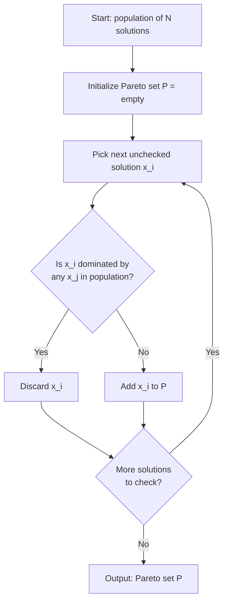
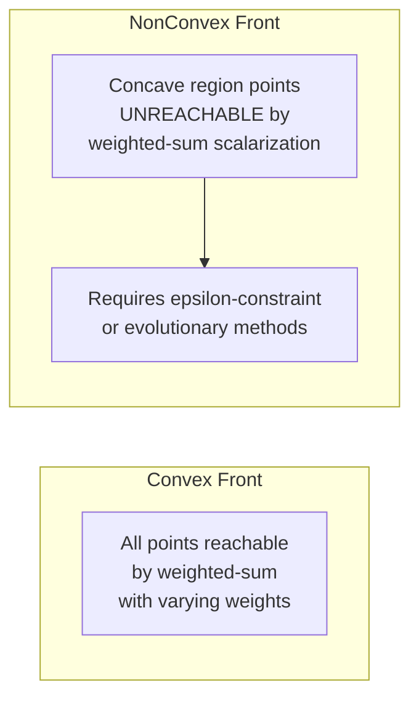

## Pareto Optimality and Dominance

### Overview

Multi-objective optimization problems involve simultaneously optimizing $k \geq 2$ conflicting objective functions rather than a single scalar objective. Because objectives typically conflict — improving one degrades another — there is generally no single point that minimizes all objectives simultaneously. Pareto optimality provides the mathematical framework for defining what "optimal" means when trade-offs are unavoidable, replacing the notion of a unique optimum with a set of mutually non-dominated solutions.

### Problem Formulation

A general multi-objective optimization problem (MOP) is stated as:

$$\min_{x \in \Omega} \; F(x) = \left[ f_1(x), f_2(x), \dots, f_k(x) \right]^T$$

where:

- $x \in \mathbb{R}^n$ is the decision vector
- $\Omega \subseteq \mathbb{R}^n$ is the feasible decision space, typically defined by constraints $g_i(x) \leq 0$ and $h_j(x) = 0$
- $F: \Omega \to \mathbb{R}^k$ maps decision vectors into objective space
- $f_1, \dots, f_k$ are the individual objective functions, assumed conflicting

The image $F(\Omega) \subseteq \mathbb{R}^k$ is called the **attainable objective set**. Solving a MOP means characterizing a specific subset of $\Omega$ (and its image) rather than a single point.

### Pareto Dominance

Given two feasible decision vectors $x^{(1)}, x^{(2)} \in \Omega$, $x^{(1)}$ is said to **Pareto dominate** $x^{(2)}$ (written $x^{(1)} \prec x^{(2)}$) if and only if:

$$\forall i \in \{1, \dots, k\}: f_i(x^{(1)}) \leq f_i(x^{(2)}) \quad \text{and} \quad \exists j \in \{1, \dots, k\}: f_j(x^{(1)}) < f_j(x^{(2)})$$

In words: $x^{(1)}$ is at least as good as $x^{(2)}$ in every objective, and strictly better in at least one objective. This is a **partial order**, not a total order — unlike scalar comparison, dominance leaves many pairs of solutions incomparable.

**Three possible relationships** between any two feasible solutions:

1. $x^{(1)}$ dominates $x^{(2)}$ (or vice versa)
2. $x^{(1)}$ and $x^{(2)}$ are **non-dominated** with respect to each other (neither dominates the other — they represent different trade-offs)
3. $x^{(1)} = x^{(2)}$ in objective space (indifferent)

### Types of Dominance

Several refinements of the basic dominance relation are used depending on context:

- **Weak dominance** ($x^{(1)} \preceq x^{(2)}$): $f_i(x^{(1)}) \leq f_i(x^{(2)})$ for all $i$, with no requirement of strict improvement in any objective. Every dominating solution weakly dominates, but weak dominance alone does not imply strict dominance.
- **Strict dominance**: $f_i(x^{(1)}) < f_i(x^{(2)})$ for *all* $i$ (strictly better in every objective simultaneously) — a stronger condition than standard Pareto dominance.
- **Strong dominance**: term sometimes used interchangeably with the standard Pareto dominance definition above; usage varies across the literature. [Unverified — terminology for "strong" vs "strict" dominance is not fully standardized across sources.]

### Pareto Optimality

A decision vector $x^* \in \Omega$ is **Pareto optimal** if there exists no other $x \in \Omega$ such that $x$ dominates $x^*$. Formally:

$$x^* \text{ is Pareto optimal} \iff \nexists\, x \in \Omega : x \prec x^*$$

A Pareto optimal solution cannot be improved in any single objective without degrading at least one other objective. This is also referred to as being **non-dominated**, **efficient**, or **non-inferior** — the terms are used largely interchangeably in the literature, though "efficient" is more common in operations research and "non-dominated" in evolutionary computation.

### Pareto Set and Pareto Front

Two related but distinct objects characterize the solution to a MOP:

- **Pareto optimal set** (or **Pareto set**), $\mathcal{P}^*$: the collection of all Pareto optimal decision vectors in decision space $\Omega$.

$$\mathcal{P}^* = \{ x \in \Omega \mid \nexists\, x' \in \Omega : x' \prec x \}$$

- **Pareto front** (or **Pareto frontier**), $\mathcal{PF}^*$: the image of the Pareto set under $F$, i.e., the corresponding points in objective space.

$$\mathcal{PF}^* = \{ F(x) \mid x \in \mathcal{P}^* \}$$

The distinction matters practically: the Pareto set lives in decision space (potentially high-dimensional, $n$-dimensional), while the Pareto front lives in objective space (typically low-dimensional, $k$-dimensional, and directly visualizable for $k = 2$ or $k = 3$). Multiple distinct decision vectors can map to the same point on the Pareto front, and the Pareto set can be disconnected even when the front is connected, or vice versa.

### Geometric Illustration (Two Objectives)

<svg xmlns="http://www.w3.org/2000/svg" viewBox="0 0 640 480">
<text x="320" y="28" text-anchor="middle" font-size="18" font-weight="bold" fill="#1a1a1a">Objective Space: Dominance and Pareto Front (svg_diagram)</text>
<line x1="80" y1="420" x2="80" y2="60" stroke="#333" stroke-width="2" />
<line x1="80" y1="420" x2="580" y2="420" stroke="#333" stroke-width="2" />
<text x="580" y="415" font-size="14" fill="#333">f₁ (minimize →)</text>
<text x="30" y="70" font-size="14" fill="#333">f₂</text>
<text x="30" y="90" font-size="14" fill="#333">(min ↑)</text>

<path d="M 140 380 Q 200 200 260 150 Q 330 110 420 95 Q 480 88 540 85" fill="none" stroke="`#2563eb`" stroke-width="3" />

<text x="330" y="70" font-size="14" fill="`#2563eb`" font-weight="bold">Pareto Front</text>

<circle cx="140" cy="380" r="6" fill="#2563eb" />
<circle cx="200" cy="240" r="6" fill="#2563eb" />
<circle cx="260" cy="150" r="6" fill="#2563eb" />
<circle cx="350" cy="105" r="6" fill="#2563eb" />
<circle cx="420" cy="95" r="6" fill="#2563eb" />
<circle cx="540" cy="85" r="6" fill="#2563eb" />
<circle cx="340" cy="260" r="7" fill="#dc2626" />
<text x="352" y="264" font-size="13" fill="#dc2626">A (dominated)</text>
<circle cx="420" cy="340" r="7" fill="#dc2626" />
<text x="432" y="344" font-size="13" fill="#dc2626">B (dominated)</text>
<rect x="220" y="60" width="120" height="200" fill="#22c55e" opacity="0.12" stroke="none" />
<text x="225" y="255" font-size="11" fill="#16a34a" font-style="italic">dominates A</text>
<line x1="260" y1="150" x2="340" y2="150" stroke="#16a34a" stroke-width="1.5" stroke-dasharray="4,3" />
<line x1="260" y1="150" x2="260" y2="260" stroke="#16a34a" stroke-width="1.5" stroke-dasharray="4,3" />
<line x1="260" y1="150" x2="340" y2="260" stroke="#16a34a" stroke-width="2" />

<text x="90" y="450" font-size="13" fill="#555">Points on the blue curve are mutually non-dominated (the Pareto front).</text>

<text x="90" y="468" font-size="13" fill="#555">Points A and B lie strictly above-right of front points — both objectives worse.</text>

</svg>

In this illustration, any feasible point strictly above and to the right of the Pareto front curve (like A or B) is dominated by at least one front point, since a front point exists that is simultaneously smaller in both $f_1$ and $f_2$. Points on the front itself have no such dominator — moving along the curve trades improvement in one objective for degradation in the other.

### Dominance-Checking Procedure

**Example**

Consider three candidate solutions evaluated on two objectives (both to be minimized):

| Solution | $f_1$ | $f_2$ |
| --- | --- | --- |
| $x^{(1)}$ | 2 | 8 |
| $x^{(2)}$ | 4 | 4 |
| $x^{(3)}$ | 5 | 9 |

Checking $x^{(1)}$ vs $x^{(3)}$: $f_1(x^{(1)}) = 2 \leq 5 = f_1(x^{(3)})$ and $f_2(x^{(1)}) = 8 < 9 = f_2(x^{(3)})$, with at least one strict inequality. Therefore $x^{(1)} \prec x^{(3)}$ — $x^{(1)}$ dominates $x^{(3)}$, so $x^{(3)}$ is eliminated from the Pareto set.

Checking $x^{(1)}$ vs $x^{(2)}$: $f_1(x^{(1)}) = 2 < 4$, but $f_2(x^{(1)}) = 8 > 4 = f_2(x^{(2)})$. Neither vector is uniformly better — $x^{(1)}$ wins on $f_1$, $x^{(2)}$ wins on $f_2$. They are mutually non-dominated.

Checking $x^{(2)}$ vs $x^{(3)}$: $f_1(x^{(2)}) = 4 < 5$ and $f_2(x^{(2)}) = 4 < 9$. $x^{(2)}$ dominates $x^{(3)}$.

Resulting Pareto set from this candidate pool: $\{x^{(1)}, x^{(2)}\}$; $x^{(3)}$ is discarded as dominated.

### Algorithmic Identification of the Pareto Set (Naive Approach)

For a finite population of $N$ candidate solutions, the naive dominance-sorting procedure compares every pair:

This brute-force pairwise comparison has $O(N^2 k)$ complexity ($N^2$ comparisons, each requiring $O(k)$ work across objectives), which is used as a baseline in many evolutionary multi-objective algorithms (e.g., the non-dominated sorting step in NSGA-II) though faster non-dominated sorting variants with improved average-case complexity exist. [Inference — exact complexity bounds for specific fast non-dominated sorting variants depend on implementation and are not restated here without a specific reference.]

### Pareto Optimality: Weak vs. Strong Forms

- **Weakly Pareto optimal**: $x^*$ is weakly Pareto optimal if no other feasible $x$ exists with $f_i(x) < f_i(x^*)$ for *all* $i$ simultaneously (strict improvement in every objective at once). This is a looser condition — the weakly Pareto optimal set is a superset of the (strictly) Pareto optimal set.
- **Strongly (properly) Pareto optimal**: the standard definition given above — no $x$ exists that is at least as good in all objectives and strictly better in at least one.

The distinction matters because weakly Pareto optimal points can include solutions with an obvious one-objective improvement available (as long as it isn't achievable in *every* objective simultaneously), making the strong/proper definition the more practically meaningful one for decision-making.

### Ideal Point, Nadir Point, and Utopia Point

Several reference points are defined relative to the Pareto front and used in scalarization methods and visualization:

- **Ideal point** $z^{ideal}$: the vector formed by the individual minimum of each objective, computed independently:

$$z_i^{ideal} = \min_{x \in \Omega} f_i(x), \quad i = 1, \dots, k$$

The ideal point is generally infeasible (unattainable) as a joint solution, since it optimizes each objective independently, ignoring the others.

- **Nadir point** $z^{nadir}$: the vector formed by the worst value of each objective *among Pareto optimal solutions only*:

$$z_i^{nadir} = \max_{x \in \mathcal{P}^*} f_i(x), \quad i = 1, \dots, k$$

The nadir point is significantly harder to compute exactly than the ideal point for $k > 2$ objectives, since it requires knowledge of the entire Pareto set rather than independent single-objective optimization. [Inference — practical nadir-point estimation typically relies on approximation via payoff tables or the full non-dominated set rather than an exact closed-form procedure for $k > 2$.]

- **Utopia point**: sometimes used synonymously with the ideal point; other sources define it as the ideal point offset by a small $\epsilon$ to ensure strict infeasibility in scalarization formulations. [Unverified — usage of "utopia point" vs "ideal point" varies by source.]

These reference points are central to normalization in scalarization-based methods (e.g., weighted sum, $\epsilon$-constraint, goal programming), which will be covered separately as solution techniques.

### Convex vs. Non-Convex Pareto Fronts

The shape of the Pareto front has significant algorithmic implications:

- A **convex** Pareto front can be fully traced using the weighted-sum scalarization method by varying weights, since every point on a convex front corresponds to some non-negative weight vector.
- A **non-convex** (concave) Pareto front has regions that weighted-sum scalarization cannot reach, regardless of weight choice — these are sometimes called "duality gap" regions. Alternative methods such as the $\epsilon$-constraint method or evolutionary approaches are needed to recover the full front in these cases.

### Cardinality and Structure of the Pareto Set

- For continuous, well-behaved MOPs, the Pareto optimal set is typically an $(k-1)$-dimensional manifold (a curve for $k=2$, a surface for $k=3$), though this need not hold in general — degenerate cases, disconnected fronts, and discrete problems (combinatorial MOPs) can produce Pareto sets with very different structure, including finite, disconnected, or fractal-like fronts. [Inference — dimensionality claims assume smoothness and regularity conditions on $f_i$ and $\Omega$ that do not hold for all MOP instances.]
- In combinatorial optimization (e.g., multi-objective knapsack, multi-objective shortest path), the Pareto front can have exponentially many points relative to problem size in the worst case, motivating approximation approaches.

### Key Points

- Pareto dominance is a **partial order**: not all solution pairs are comparable, which is precisely why a *set* of optimal solutions (rather than a single optimum) is needed.
- A solution is Pareto optimal if no feasible alternative improves at least one objective without worsening another.
- The **Pareto set** lives in decision space; the **Pareto front** is its image in objective space — they are related but distinct objects.
- **Ideal** and **nadir** points bound the Pareto front and anchor normalization/scalarization techniques.
- Front **convexity** determines whether simple weighted-sum scalarization can recover the entire Pareto front or only part of it.

### Related Topics

- Scalarization methods: weighted sum, $\epsilon$-constraint, goal programming, Chebyshev (Tchebycheff) method
- Evolutionary multi-objective algorithms: NSGA-II, NSGA-III, SPEA2, MOEA/D
- Hypervolume indicator and other Pareto front quality metrics
- Decision-maker preference articulation (a priori, a posteriori, interactive methods)
- Many-objective optimization ($k > 3$) and the curse of dimensionality in dominance-based selection
- Crowding distance and diversity preservation mechanisms in evolutionary MOO