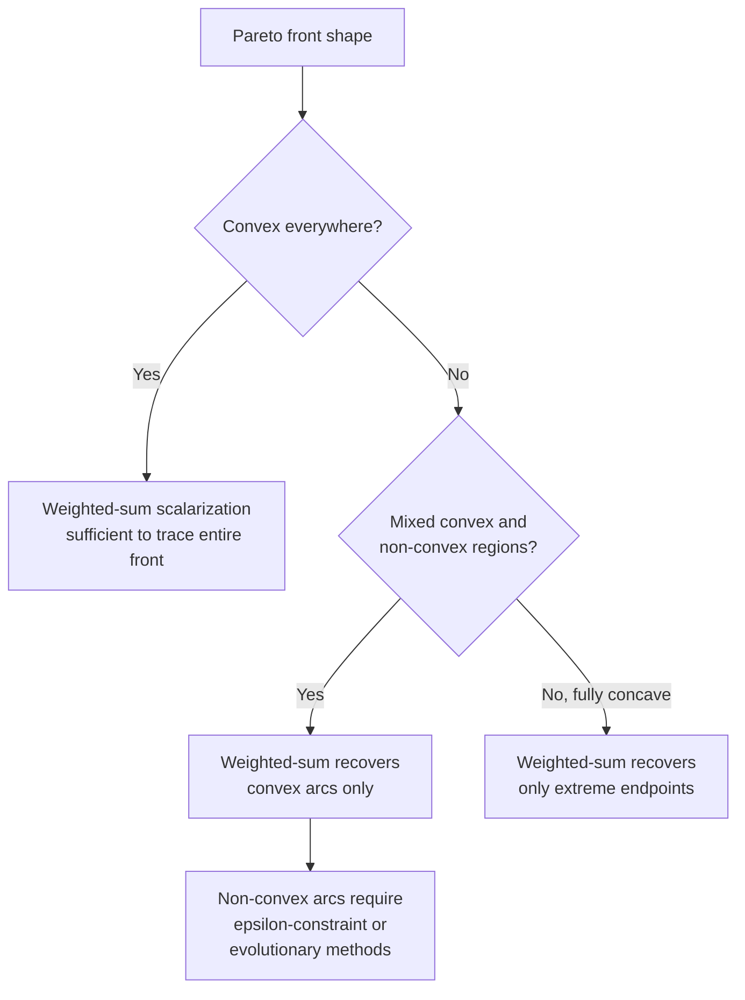
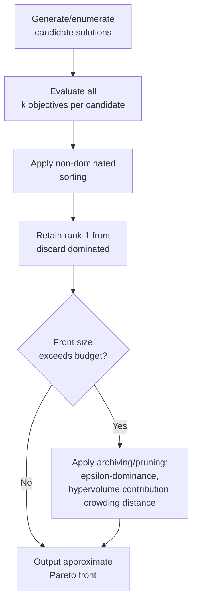
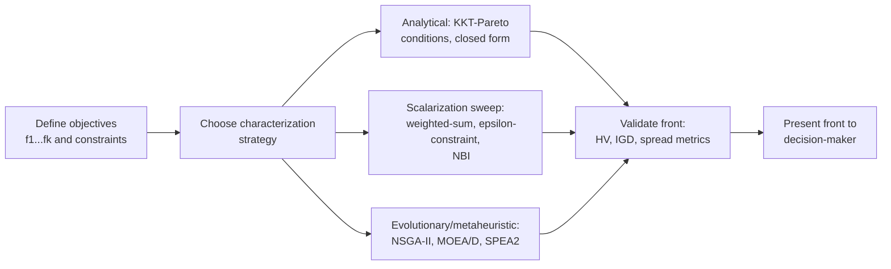

## Pareto Frontier Characterization

### Overview

Once the Pareto front is defined as the image of non-dominated solutions in objective space, a central practical question arises: how is this front actually characterized, computed, and described mathematically? Characterization spans geometric properties (shape, connectivity, curvature), analytical conditions (necessary/sufficient conditions from optimality theory), and computational strategies for generating a representative approximation of the front when a closed form is unavailable.

### Analytical Conditions for Pareto Optimality

For differentiable objective functions, first-order necessary conditions extend the single-objective KKT (Karush-Kuhn-Tucker) framework to the multi-objective case. A point $x^*$ satisfying the following is called a **KKT-Pareto point** (necessary condition for local Pareto optimality under constraint qualification):

$$\exists \lambda \in \mathbb{R}^k, \; \lambda \geq 0, \; \lambda \neq 0, \; \sum_{i=1}^{k} \lambda_i = 1 \quad \text{such that} \quad \sum_{i=1}^{k} \lambda_i \nabla f_i(x^*) + \sum_{j} \mu_j \nabla g_j(x^*) = 0$$

subject to standard complementary slackness ($\mu_j g_j(x^*) = 0$, $\mu_j \geq 0$) on inequality constraints $g_j(x) \leq 0$.

This is the **Fritz John / KKT multi-objective condition**: at a Pareto optimal point, there exists a non-negative, non-zero weighting $\lambda$ of the objective gradients whose weighted sum lies in the cone spanned by the active constraint gradients. Geometrically, this means no feasible descent direction exists that simultaneously improves (or does not worsen) every objective — if such a direction existed, it could be followed to produce a dominating point, contradicting Pareto optimality.

**Key distinction from single-objective KKT**: in single-objective optimization, KKT conditions are necessary (and, under convexity, sufficient) for a *unique type* of optimum. In the multi-objective case, KKT-Pareto conditions characterize an entire *manifold* of points — the weighting vector $\lambda$ varies continuously (or discretely, depending on front geometry) across the Pareto set, with each $\lambda$ corresponding to a different trade-off emphasis among objectives.

### Sufficiency Under Convexity

If all $f_i$ are convex and $\Omega$ is a convex set, the KKT-Pareto condition becomes **sufficient** as well as necessary for (global) Pareto optimality. This convexity assumption underlies the weighted-sum scalarization approach: solving

$$\min_{x \in \Omega} \sum_{i=1}^{k} \lambda_i f_i(x), \quad \lambda_i \geq 0, \; \sum_i \lambda_i = 1$$

for a fixed weight vector $\lambda$ yields a Pareto optimal solution whenever $\lambda_i > 0$ for all $i$ (strictly positive weights guarantee strict, not merely weak, Pareto optimality). Sweeping $\lambda$ across the simplex $\{\lambda \geq 0 : \sum \lambda_i = 1\}$ traces out the front — but only the **convex hull** of the true front is reachable this way, which is exactly why non-convex regions are missed (as established when discussing convex vs. non-convex fronts).

### Characterizing Front Geometry

**Local curvature and trade-off rate.** At a smooth point on a two-objective Pareto front, the local slope $df_2/df_1$ represents the **marginal rate of substitution** between objectives — how much $f_2$ must be sacrificed for a unit improvement in $f_1$. This slope is directly related to the ratio of weights $\lambda_1/\lambda_2$ that would select that point under weighted-sum scalarization, since at an interior optimum:

$$\frac{\lambda_1}{\lambda_2} = -\frac{df_2}{df_1}$$

Regions where this slope changes rapidly indicate "knee points" (see below); regions of near-constant slope indicate the front is locally close to linear.

**Convexity classification:**

- **Globally convex front**: the front is the boundary of a convex feasible region in objective space; weighted-sum scalarization with varying $\lambda$ recovers the entire front.
- **Globally concave (non-convex) front**: weighted-sum scalarization can only ever reach the two extreme (individually optimal) endpoints, never interior points — this is a well-known pathological case in bi-objective linear-fractional and combinatorial problems.
- **Mixed / partially convex front**: the common case in practice, where convex sub-arcs alternate with non-convex sub-arcs, requiring hybrid or non-weighted-sum methods ($\epsilon$-constraint, achievement scalarizing functions, or evolutionary search) to characterize fully.

### Knee Points

A **knee point** (or "knee region") on the Pareto front is a location where a small improvement in one objective requires a disproportionately large sacrifice in another — i.e., a point of maximum local curvature where the trade-off rate changes sharply. Knee points are of particular practical interest because they often represent the most "balanced" or intuitively attractive compromise solutions without requiring explicit preference weights from a decision-maker.

Formally, one common characterization identifies knee points via the point on the front with maximum perpendicular distance from the line (in $k=2$) or hyperplane (in general $k$) connecting the extreme points of the front:

$$\text{knee} = \arg\max_{z \in \mathcal{PF}^*} \; \text{dist}(z, \, \text{hyperplane through extreme points})$$

[Inference — multiple competing formal definitions of "knee point" exist in the literature (e.g., based on trade-off ratios, angle-based measures, or utility-based measures); the perpendicular-distance definition is one common but not universally adopted formalization.]

### Geometric Illustration: Convex, Concave, and Knee Regions

<svg xmlns="http://www.w3.org/2000/svg" viewBox="0 0 640 460">
<text x="320" y="26" text-anchor="middle" font-size="17" font-weight="bold" fill="#1a1a1a">Front Geometry: Convex vs Concave vs Knee (svg_diagram)</text>
<line x1="70" y1="400" x2="70" y2="50" stroke="#333" stroke-width="2" />
<line x1="70" y1="400" x2="300" y2="400" stroke="#333" stroke-width="2" />
<text x="250" y="418" font-size="12" fill="#333">f₁ →</text>
<text x="30" y="60" font-size="12" fill="#333">f₂</text>
<path d="M 100 370 Q 180 200 280 90" fill="none" stroke="#2563eb" stroke-width="3" />
<text x="90" y="430" font-size="12" fill="#2563eb" font-weight="bold">Convex front</text>
<text x="90" y="444" font-size="10" fill="#555">(weighted-sum reaches all points)</text>
<line x1="340" y1="400" x2="340" y2="50" stroke="#333" stroke-width="2" />
<line x1="340" y1="400" x2="570" y2="400" stroke="#333" stroke-width="2" />
<text x="520" y="418" font-size="12" fill="#333">f₁ →</text>
<path d="M 370 370 Q 460 340 560 90" fill="none" stroke="#dc2626" stroke-width="3" />
<line x1="370" y1="370" x2="560" y2="90" stroke="#999" stroke-width="1.5" stroke-dasharray="5,4" />
<circle cx="370" cy="370" r="5" fill="#dc2626" />
<circle cx="560" cy="90" r="5" fill="#dc2626" />
<text x="360" y="430" font-size="12" fill="#dc2626" font-weight="bold">Concave front</text>
<text x="355" y="444" font-size="10" fill="#555">(weighted-sum reaches endpoints only)</text>
<path d="M 100 370 Q 180 200 280 90" fill="none" stroke="none" />
<circle cx="178" cy="205" r="7" fill="#16a34a" />
<text x="185" y="200" font-size="11" fill="#16a34a" font-weight="bold">knee point</text>
<line x1="100" y1="370" x2="280" y2="90" stroke="#16a34a" stroke-width="1" stroke-dasharray="3,3" opacity="0.5" />
</svg>

### Computational Characterization: Continuous Case

When $f_i$ are given analytically and $\Omega$ is described by smooth constraints, the front can sometimes be characterized in closed form by parametrizing the KKT-Pareto conditions over $\lambda$, or via **normal boundary intersection (NBI)** and similar continuation methods that trace the front by solving a sequence of constrained subproblems anchored to evenly spaced points on the convex hull of individual optima. NBI and related methods (e.g., normal constraint method) are specifically designed to produce an **evenly distributed** discretization of the front, correcting a known weakness of naive weighted-sum sweeps, which tend to cluster generated points unevenly (sparse in some regions, dense in others) even on convex fronts.

### Computational Characterization: Discrete / Combinatorial Case

For combinatorial MOPs (e.g., multi-objective shortest path, assignment, knapsack), the front is generally characterized via **enumeration with dominance pruning**:

Exact enumeration is only tractable for small instances since the true Pareto front size can grow exponentially with problem size in the worst case (e.g., the multi-objective shortest path problem is known to have fronts of exponential cardinality in general graphs). [Inference — exponential-cardinality results are specific to certain combinatorial problem classes and graph structures; not all combinatorial MOPs exhibit this worst-case behavior equally.] For larger instances, metaheuristic approaches (evolutionary algorithms, e.g., NSGA-II/III, MOEA/D) generate an **approximate front** rather than the exact one, trading guaranteed optimality for tractability.

### Quality Indicators for Approximated Fronts

Because most practical characterizations of the Pareto front are approximations (finite point sets from an evolutionary run, or a discretized NBI trace), quantitative indicators are used to assess how well an approximation set $A$ represents the true front:

- **Hypervolume (HV)**: the volume of objective space dominated by $A$ and bounded by a reference point; larger is better; simultaneously rewards convergence toward the true front and spread across it. Widely regarded as the most information-rich single scalar indicator, though computationally expensive for large $k$.
- **Generational Distance (GD)**: average distance from points in $A$ to the nearest point on the true (or best-known) front; measures convergence only, not spread.
- **Inverted Generational Distance (IGD)**: average distance from points on the true front to the nearest point in $A$; captures both convergence and coverage/spread, since a poorly spread $A$ leaves some true-front points far from any approximation point.
- **Spacing / Spread metrics**: quantify the uniformity of distribution of points within $A$ itself, independent of proximity to the true front.
- **$\epsilon$-indicator**: the smallest $\epsilon$ such that every point of the true front is $\epsilon$-dominated by some point in $A$; connects to the formal notion of $\epsilon$-dominance used in archive pruning.

**Example**

Suppose an evolutionary algorithm returns 50 candidate points after non-dominated sorting, and a reference point $z^{ref} = (10, 10)$ is set slightly beyond the empirical nadir. The hypervolume indicator would sum the area (in $k=2$) of objective space between each front point and $z^{ref}$, taking the union across all points to avoid double-counting overlapping dominated regions — a higher resulting area indicates the approximation both extends closer to the ideal point and covers a wider spread of trade-offs.

### Practical Characterization Workflow

### Key Points

- KKT-Pareto conditions generalize single-objective optimality conditions; under convexity they are both necessary and sufficient, underpinning weighted-sum scalarization.
- Front **convexity** (or lack thereof) determines whether simple scalarization sweeps can characterize the entire front or only part of it.
- **Knee points** offer decision-maker-friendly compromise solutions without requiring explicit preference weights, though their formal definition is not fully standardized.
- Exact characterization is tractable only for small/structured problems (continuous convex cases, small combinatorial instances); most practical work relies on **approximated** fronts assessed via indicators like hypervolume and IGD.
- Evenly distributed sampling (e.g., via NBI) addresses the known clustering weakness of naive weighted-sum scalarization.

### Related Topics

- Normal boundary intersection (NBI) and normal constraint methods in detail
- $\epsilon$-constraint method mechanics and epsilon-dominance archiving
- Hypervolume computation algorithms and their scalability with $k$
- Many-objective front characterization challenges ($k > 3$)
- Decision-maker preference incorporation: reference points, achievement scalarizing functions
- Robustness and sensitivity of Pareto fronts under uncertain objective functions