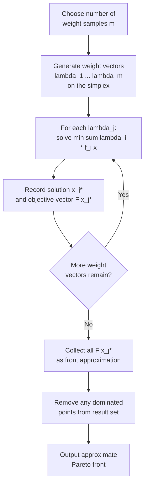

## Weighted Sum Scalarization Method

### Overview

The weighted sum method is the most straightforward approach to converting a multi-objective optimization problem into a single-objective one: each objective is multiplied by a non-negative weight reflecting its relative importance, and the weighted terms are summed into a single scalar objective. Solving the resulting single-objective problem for a given weight vector yields one point on (or near) the Pareto front; varying the weights across multiple solves traces out a family of Pareto optimal solutions. Its simplicity, ease of implementation with any single-objective solver, and direct connection to KKT-Pareto optimality conditions make it the standard starting point for scalarization-based multi-objective optimization, despite well-documented limitations.

### Formulation

Given the multi-objective problem $\min_{x \in \Omega} F(x) = [f_1(x), \dots, f_k(x)]^T$, the weighted sum scalarized problem is:

$$\min_{x \in \Omega} \; \sum_{i=1}^{k} \lambda_i f_i(x)$$

subject to:

$$\lambda_i \geq 0 \quad \forall i, \qquad \sum_{i=1}^{k} \lambda_i = 1$$

The normalization $\sum \lambda_i = 1$ is a convention, not a strict requirement — any positive scaling of $\lambda$ produces the same optimal solution set, since scaling the objective by a positive constant does not change the minimizer. Restricting weights to the standard simplex simply gives $\lambda$ an interpretable range.

### Connection to Pareto Optimality

**Sufficiency result.** If $x^*$ solves the weighted sum problem for some $\lambda$ with $\lambda_i > 0$ for all $i$ (strictly positive weights), then $x^*$ is Pareto optimal (strongly, not merely weakly). This holds regardless of convexity — it is a general sufficient condition.

*Proof sketch:* Suppose $x^*$ solves the weighted problem but is not Pareto optimal. Then some $x'$ dominates $x^*$: $f_i(x') \leq f_i(x^*)$ for all $i$, with strict inequality for at least one $j$. Since all $\lambda_i > 0$:

$$\sum_i \lambda_i f_i(x') \leq \sum_i \lambda_i f_i(x^*)$$

with strict inequality contributed by the $\lambda_j$ term, so $\sum_i \lambda_i f_i(x') < \sum_i \lambda_i f_i(x^*)$, contradicting that $x^*$ minimizes the weighted sum. Hence no such dominating $x'$ exists. $\blacksquare$

**Weak vs. strong optimality with zero weights.** If some $\lambda_i = 0$, the solution obtained is only guaranteed to be **weakly** Pareto optimal — the zero-weighted objective is not being considered at all in the optimization, so there may exist an alternative feasible solution that improves that objective for free (at no cost to the others), which the weighted-sum solve would not detect.

**Necessity requires convexity.** The converse — that every Pareto optimal solution corresponds to *some* choice of weights — only holds when $F(\Omega)$ (or at least its attainable set boundary) is convex. This is the central limitation of the method: on a non-convex front, entire regions of genuinely Pareto optimal solutions are unreachable by any weight vector.

### Why Non-Convex Regions Are Unreachable

Geometrically, the weighted sum objective $\sum_i \lambda_i f_i(x)$ defines a family of parallel hyperplanes in objective space (for fixed $\lambda$, level sets of the linear functional $\lambda^T z$). Minimizing the weighted sum is equivalent to sliding this hyperplane in the direction of decreasing $\lambda^T z$ until it last touches the attainable objective set $F(\Omega)$ — the touching point is the solution.

On a **convex** front, every boundary point admits a supporting hyperplane, so some $\lambda$ exists that makes that point the unique last-touching point. On a **non-convex (concave)** region of the front, points in the "dent" never serve as the last touching point for *any* linear hyperplane — the hyperplane instead jumps directly from one side of the dent to the other as $\lambda$ varies continuously, skipping the concave region entirely.

<svg xmlns="http://www.w3.org/2000/svg" viewBox="0 0 640 460">
<text x="320" y="26" text-anchor="middle" font-size="17" font-weight="bold" fill="#1a1a1a">Weighted-Sum Hyperplane Sweep (svg_diagram)</text>
<line x1="80" y1="410" x2="80" y2="60" stroke="#333" stroke-width="2" />
<line x1="80" y1="410" x2="580" y2="410" stroke="#333" stroke-width="2" />
<text x="560" y="428" font-size="13" fill="#333">f₁ →</text>
<text x="40" y="70" font-size="13" fill="#333">f₂</text>

<path d="M 120 380 Q 220 300 300 320 Q 380 340 460 200 Q 500 130 540 90" fill="none" stroke="`#dc2626`" stroke-width="3" />

<text x="250" y="365" font-size="12" fill="`#dc2626`" font-weight="bold">non-convex "dent"</text>

<line x1="120" y1="380" x2="300" y2="140" stroke="#16a34a" stroke-width="1.5" stroke-dasharray="5,4" />
<line x1="180" y1="380" x2="360" y2="140" stroke="#16a34a" stroke-width="1.5" stroke-dasharray="5,4" />
<line x1="240" y1="380" x2="420" y2="140" stroke="#16a34a" stroke-width="1.5" stroke-dasharray="5,4" />
<circle cx="120" cy="380" r="6" fill="#2563eb" />
<circle cx="540" cy="90" r="6" fill="#2563eb" />
<text x="90" y="405" font-size="11" fill="#2563eb">reachable endpoint</text>
<text x="480" y="80" font-size="11" fill="#2563eb">reachable endpoint</text>

<text x="120" y="440" font-size="12" fill="#555">Green dashed lines: weighted-sum hyperplanes at varying λ.</text>

<text x="120" y="456" font-size="12" fill="#555">None ever touches the concave "dent" — those points are unreachable.</text>

</svg>

### Algorithm: Weighted Sum Sweep

### Weight Generation Strategies

- **Uniform grid on the simplex**: for $k=2$, simple linear spacing $\lambda_1 \in \{0, 1/m, 2/m, \dots, 1\}$, $\lambda_2 = 1-\lambda_1$. For $k > 2$, uniform grids on the simplex require combinatorial generation (e.g., the simplex-lattice design), and the number of grid points grows combinatorially with both $k$ and grid resolution.
- **Random sampling**: draw $\lambda$ uniformly from the simplex (e.g., via normalized exponential/Dirichlet sampling) — simple but can leave gaps in coverage.
- **Adaptive/NBI-style refinement**: iteratively add weight vectors in regions of the front that are sparsely populated after an initial pass, improving spread efficiency relative to naive uniform grids.

**Important caveat**: even with a perfectly uniform grid of weights, the resulting points on a convex front are typically **not evenly spaced** in objective space — points cluster near regions of high curvature and thin out near flatter regions. This is the well-documented weakness that motivates alternatives such as the normal boundary intersection (NBI) method for even spread.

### Worked Example

**Example**

Consider a bi-objective problem minimizing cost $f_1(x)$ and delivery time $f_2(x)$ for a scheduling variable $x \in [0, 10]$, with:

$$f_1(x) = x^2, \qquad f_2(x) = (10-x)^2$$

Both are convex, so the attainable set is convex and weighted-sum scalarization can trace the full front. The scalarized problem for weight $\lambda \in [0,1]$ (with $\lambda_2 = 1-\lambda$):

$$\min_{x \in [0,10]} \; \lambda x^2 + (1-\lambda)(10-x)^2$$

Taking the derivative and setting it to zero:

$$2\lambda x - 2(1-\lambda)(10-x) = 0 \implies \lambda x = (1-\lambda)(10-x) \implies x^* = 10(1-\lambda)$$

- At $\lambda = 0$: $x^* = 10$, giving $F(x^*) = (100, 0)$ — minimizes $f_2$ entirely, ignoring $f_1$.
- At $\lambda = 0.5$: $x^* = 5$, giving $F(x^*) = (25, 25)$ — the balanced midpoint.
- At $\lambda = 1$: $x^* = 0$, giving $F(x^*) = (0, 100)$ — minimizes $f_1$ entirely, ignoring $f_2$.

Sweeping $\lambda$ continuously from 0 to 1 traces the entire Pareto front $\{(x^2, (10-x)^2) : x \in [0,10]\}$, confirming full coverage on this convex instance.

| $\lambda$ | $x^*$ | $f_1(x^*)$ | $f_2(x^*)$ |
| --- | --- | --- | --- |
| 0.0 | 10.0 | 100.0 | 0.0 |
| 0.25 | 7.5 | 56.25 | 6.25 |
| 0.5 | 5.0 | 25.0 | 25.0 |
| 0.75 | 2.5 | 6.25 | 56.25 |
| 1.0 | 0.0 | 0.0 | 100.0 |

Note the non-uniform spacing in $(f_1, f_2)$ space despite uniform steps in $\lambda$ — illustrating the clustering behavior described above: objective-space points bunch more tightly near the extremes than the midpoint in this particular parametrization.

### Normalization Considerations

When objectives have very different scales or units (e.g., cost in thousands of dollars vs. delivery time in hours), raw weighted summation can be dominated numerically by whichever objective has the larger magnitude, regardless of the intended $\lambda$ values. Standard practice normalizes each objective before applying weights, commonly via:

$$\tilde{f}_i(x) = \frac{f_i(x) - z_i^{ideal}}{z_i^{nadir} - z_i^{ideal}}$$

using the ideal and nadir points, so each normalized objective ranges roughly over $[0,1]$ before weighting. Without this step, the weight vector $\lambda$ does not correspond to the decision-maker's intended trade-off preference in any meaningful sense. [Inference — the specific normalization formula shown is one standard convention; alternative normalizations (e.g., z-score standardization) are used in some practical implementations.]

### Advantages and Limitations

**Advantages:**

- Trivial to implement — reduces to repeated single-objective optimization, reusable with any existing solver (gradient-based, LP/QP, etc.)
- Computationally cheap per solve relative to more elaborate scalarization or evolutionary methods
- Directly connects to the theoretical KKT-Pareto sufficiency result
- Well-suited when the true front is known or expected to be convex (common in many convex programming applications: linear, quadratic, and other convex-structured problems)

**Limitations:**

- Cannot recover non-convex regions of the Pareto front, regardless of how many weight vectors are sampled
- Uniform weight sampling does not produce uniform coverage of the front in objective space
- Sensitive to objective scaling; requires careful normalization
- Provides no direct control over *where* on the front a solution lands — the mapping from $\lambda$ to the resulting front point is generally nonlinear and problem-dependent, making it hard to target a specific desired trade-off in advance
- Zero-weight components only guarantee weak, not strong, Pareto optimality

### Key Points

- Weighted sum scalarization solves $\min \sum_i \lambda_i f_i(x)$ over $\lambda$ on the simplex; strictly positive weights guarantee (strong) Pareto optimality of the solution.
- The method is **sufficient but not necessary** for Pareto optimality in general — necessity (reaching *every* Pareto point via some $\lambda$) requires convexity of the attainable objective set.
- Geometrically, the method slides a linear hyperplane across objective space; non-convex "dents" in the front are never touched by any hyperplane and are therefore unreachable.
- Uniform grids in weight space do not translate to uniform spacing on the front — a key motivation for alternatives like NBI.
- Normalization of objectives prior to weighting is standard practice when objectives have differing scales.

### Related Topics

- $\epsilon$-constraint method (recovers non-convex regions that weighted sum cannot)
- Normal boundary intersection (NBI) for evenly distributed front sampling
- Achievement scalarizing functions and Chebyshev (Tchebycheff) scalarization
- Goal programming as an alternative preference-driven scalarization
- Normalization strategies using ideal and nadir points
- Convexity conditions and their role in scalarization method selection