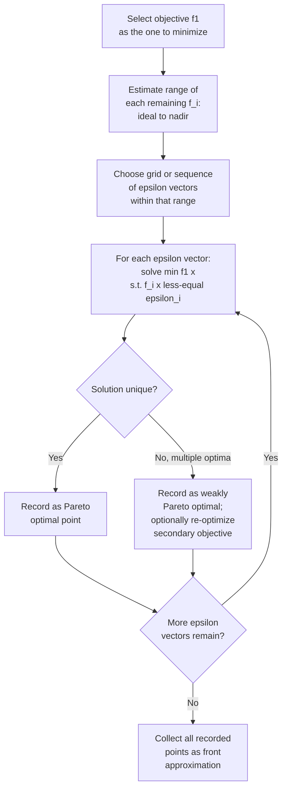

## Epsilon-Constraint Method

### Overview

The $\epsilon$-constraint method addresses the central limitation of weighted sum scalarization: its inability to recover non-convex regions of the Pareto front. Rather than combining all objectives into a single weighted sum, the $\epsilon$-constraint method optimizes **one** primary objective while converting all remaining objectives into inequality constraints bounded by parameter values $\epsilon_i$. By systematically varying the $\epsilon$ bounds, the method traces out the Pareto front — including concave regions that weighted sum cannot reach — since it relies on a fundamentally different mechanism (constraint-boundary optimization rather than linear hyperplane sweeping).

### Formulation

Given the multi-objective problem $\min_{x \in \Omega} F(x) = [f_1(x), \dots, f_k(x)]^T$, select one objective (conventionally $f_1$) to retain as the optimization objective, and convert the rest into constraints:

$$\min_{x \in \Omega} \; f_1(x)$$

$$\text{subject to:} \quad f_i(x) \leq \epsilon_i, \quad i = 2, \dots, k$$

where $\epsilon_i$ are scalar bounds chosen by the practitioner, typically ranging between the ideal and nadir values of $f_i$: $z_i^{ideal} \leq \epsilon_i \leq z_i^{nadir}$. Solving this constrained single-objective problem for a given $\epsilon = (\epsilon_2, \dots, \epsilon_k)$ vector yields one point on the Pareto front (subject to the proper-efficiency conditions discussed below). Systematically varying $\epsilon$ across its feasible range and re-solving produces a discretized approximation of the entire front.

### Why It Recovers Non-Convex Regions

Unlike weighted sum, which geometrically slides a linear hyperplane across objective space, the $\epsilon$-constraint method carves out an **axis-aligned box** (in the $k-1$ constrained objectives) and finds the extreme point of the attainable set within that box along the $f_1$ direction. This box-constrained search is not restricted to touching only convex-supportable boundary points — it can find the minimum of $f_1$ at any feasible point satisfying $f_i(x) \leq \epsilon_i$, including points in concave "dents" that no linear functional could ever select as its minimizer.

<svg xmlns="http://www.w3.org/2000/svg" viewBox="0 0 640 460">
<text x="320" y="26" text-anchor="middle" font-size="17" font-weight="bold" fill="#1a1a1a">Epsilon-Constraint Recovering a Concave Region (svg_diagram)</text>
<line x1="80" y1="410" x2="80" y2="60" stroke="#333" stroke-width="2" />
<line x1="80" y1="410" x2="580" y2="410" stroke="#333" stroke-width="2" />
<text x="560" y="428" font-size="13" fill="#333">f₁ →</text>
<text x="40" y="70" font-size="13" fill="#333">f₂</text>

<path d="M 120 380 Q 220 300 300 320 Q 380 340 460 200 Q 500 130 540 90" fill="none" stroke="`#dc2626`" stroke-width="3" />

<text x="230" y="368" font-size="12" fill="`#dc2626`" font-weight="bold">non-convex "dent"</text>

<line x1="80" y1="320" x2="580" y2="320" stroke="#16a34a" stroke-width="1.5" stroke-dasharray="6,4" />
<text x="500" y="313" font-size="12" fill="#16a34a">f₂ ≤ ε (constraint bound)</text>
<rect x="80" y="320" width="500" height="90" fill="#22c55e" opacity="0.10" />
<text x="90" y="405" font-size="11" fill="#16a34a">feasible region under constraint</text>
<circle cx="300" cy="320" r="7" fill="#16a34a" />
<text x="312" y="316" font-size="12" fill="#16a34a" font-weight="bold">min f₁ within box → recovered point</text>

<text x="90" y="440" font-size="12" fill="#555">The horizontal epsilon bound "slices" the front at a fixed f₂ level;</text>

<text x="90" y="456" font-size="12" fill="#555">minimizing f₁ below that slice reaches the dent directly.</text>

</svg>

### Optimality Guarantees

**Sufficiency (proper efficiency).** If $x^*$ is the *unique* solution to the $\epsilon$-constraint problem for some $\epsilon$, then $x^*$ is Pareto optimal. If $x^*$ is a solution but not unique (i.e., multiple optimal solutions exist to the constrained problem), $x^*$ is only guaranteed to be **weakly** Pareto optimal — some alternative optimal solution to the same constrained problem might dominate it in the remaining objectives while keeping $f_1$ equal.

**Necessity (completeness).** Crucially, and in contrast to weighted sum, the $\epsilon$-constraint method is a **necessary and sufficient** characterization of the entire Pareto front — every Pareto optimal solution can be recovered by *some* choice of the objective to minimize and the $\epsilon$ bounds on the rest, regardless of convexity. This completeness property is the primary theoretical advantage over weighted sum scalarization.

### Algorithm

### Handling Non-Uniqueness

Because non-unique optimal solutions to the constrained subproblem only guarantee weak Pareto optimality, a common refinement is the **augmented $\epsilon$-constraint** approach: add a small penalty term for the constrained objectives directly into the minimized objective, converting slack in the constraints into an explicit secondary optimization signal:

$$\min_{x \in \Omega} \; f_1(x) - \rho \sum_{i=2}^{k} s_i$$

subject to $f_i(x) + s_i = \epsilon_i$, $s_i \geq 0$, where $s_i$ are slack variables and $\rho > 0$ is a small positive scalar. This formulation pushes the optimizer to also minimize $f_i$ as far below $\epsilon_i$ as possible (maximizing slack) whenever multiple $x$ achieve the same $f_1$ value, restoring strong Pareto optimality guarantees in the resulting solution. [Inference — the augmented formulation and its exact penalty structure vary somewhat across sources; the version shown reflects the common structure of AUGMECON-style methods without claiming to reproduce any single specific published algorithm verbatim.]

### Choosing the Epsilon Grid

The practical effectiveness of the method depends heavily on how the $\epsilon$ bounds are chosen:

- **Range estimation**: bounds for each $\epsilon_i$ are typically set between $z_i^{ideal}$ (from single-objective optimization of $f_i$ alone) and $z_i^{nadir}$ (estimated via a payoff table — solving each objective individually and recording the resulting values of the others).
- **Uniform grid**: divide the range $[z_i^{ideal}, z_i^{nadir}]$ into $q$ equal intervals per constrained objective; for $k-1$ constrained objectives this produces $q^{k-1}$ subproblems, so cost grows exponentially with the number of objectives — a significant scalability concern for $k > 3$.
- **Adaptive refinement**: solve a coarse grid first, then refine $\epsilon$ spacing in regions where consecutive front points are far apart in objective space, improving spread efficiency similarly to adaptive weighted-sum refinement.

### Worked Example

**Example**

Reusing the bi-objective scheduling problem from weighted sum ($f_1(x) = x^2$, $f_2(x) = (10-x)^2$, $x \in [0,10]$), the $\epsilon$-constraint formulation minimizing $f_1$ subject to a bound on $f_2$:

$$\min_{x \in [0,10]} \; x^2 \quad \text{subject to} \quad (10-x)^2 \leq \epsilon$$

The constraint $(10-x)^2 \leq \epsilon$ is equivalent to $10 - \sqrt{\epsilon} \leq x \leq 10 + \sqrt{\epsilon}; intersected with $x \in [0,10]
, the binding lower bound is $x \geq 10 - \sqrt{\epsilon}$ (since minimizing $x^2$ pushes $x$ as small as possible, the constraint is active at its lower bound). Hence $x^* = \max(0, 10 - \sqrt{\epsilon})$.

| $\epsilon$ (bound on $f_2$) | $x^*$ | $f_1(x^*)$ | $f_2(x^*)$ |
| --- | --- | --- | --- |
| 100 | 0.0 | 0.0 | 100.0 |
| 56.25 | 2.5 | 6.25 | 56.25 |
| 25 | 5.0 | 25.0 | 25.0 |
| 6.25 | 7.5 | 56.25 | 6.25 |
| 0 | 10.0 | 100.0 | 0.0 |

Since this particular test problem is convex, results match the weighted sum example point-for-point — a useful sanity check, since both methods must agree on convex fronts even though they differ fundamentally in mechanism and in their behavior on non-convex problems.

### Comparison with Weighted Sum

| Property | Weighted Sum | $\epsilon$-Constraint |
| --- | --- | --- |
| Recovers convex regions | Yes | Yes |
| Recovers non-convex regions | No | Yes |
| Theoretical completeness | Sufficient only (necessity needs convexity) | Necessary and sufficient |
| Subproblem type | Unconstrained (or original constraints only) | Original constraints plus $k-1$ new inequality constraints |
| Scaling with $k$ | Weight simplex sampling, moderate growth | Grid on $\epsilon$ bounds, can grow as $q^{k-1}$ |
| Parameter tuning difficulty | Requires objective normalization | Requires reasonable ideal/nadir range estimates per objective |
| Risk of infeasibility | None (always some minimizer exists over $\Omega$) | Possible — poorly chosen $\epsilon$ can make the constrained subproblem infeasible |

### Practical Considerations and Pitfalls

- **Infeasibility risk**: unlike weighted sum (which always has a well-defined minimizer over the original feasible set, assuming one exists), a poorly chosen $\epsilon$ vector can render the constrained subproblem infeasible entirely, requiring the practitioner to detect and discard or adjust such cases.
- **Computational cost per subproblem**: because each solve now carries $k-1$ additional constraints, the constrained subproblems can be harder to solve than the unconstrained (or lightly constrained) weighted-sum subproblems, particularly for nonlinear, non-convex $f_i$.
- **Objective choice matters**: which objective is designated as $f_1$ (the one directly minimized) versus which become $\epsilon$-bounded constraints can affect numerical conditioning and solver behavior, though the theoretical completeness result holds regardless of this choice, provided all valid combinations are eventually explored.

### Key Points

- The $\epsilon$-constraint method optimizes one objective while bounding the rest as inequality constraints, in contrast to weighted sum's linear combination approach.
- It is **necessary and sufficient** for full Pareto front characterization — unlike weighted sum, it can recover concave/non-convex regions.
- Solution uniqueness at each $\epsilon$ determines strong vs. weak Pareto optimality; the augmented $\epsilon$-constraint variant restores strong guarantees via slack-maximizing penalty terms.
- Grid-based $\epsilon$ sampling scales as $q^{k-1}$, a significant cost concern for problems with more than a few objectives.
- Poorly chosen $\epsilon$ bounds can produce infeasible subproblems, a failure mode weighted sum does not share.

### Related Topics

- Augmented $\epsilon$-constraint (AUGMECON-style) methods in detail
- Payoff table construction for estimating nadir points
- Normal boundary intersection (NBI) as an alternative even-spread method
- Achievement scalarizing functions and Chebyshev scalarization
- Bi-level and adaptive grid refinement strategies for $\epsilon$ selection
- Scalability challenges in many-objective ($k > 3$) scalarization methods