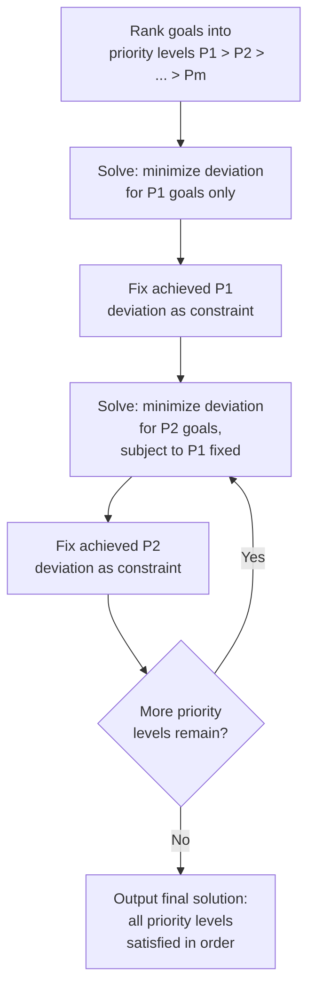

## Goal Programming

### Overview

Goal programming (GP) is a scalarization approach to multi-objective optimization that reframes each objective as a **target (goal) to be achieved** rather than a quantity to be strictly minimized or maximized. Instead of directly optimizing $f_i(x)$, the decision-maker specifies a target value $t_i$ for each objective, and the optimization problem minimizes the total **deviation** from these targets — typically weighted by importance or achieved in a strict priority order. This reframing is philosophically distinct from weighted sum and $\epsilon$-constraint methods: rather than characterizing the entire Pareto front, goal programming is explicitly a **preference-driven, single-solution** method, most suited to decision contexts where the decision-maker has concrete, meaningful target values in mind (e.g., a budget ceiling, a minimum service level) rather than an abstract desire to explore trade-offs.

### Core Formulation

For each objective $f_i(x)$, a goal (target) $t_i$ is specified, and **deviation variables** $d_i^-$ (underachievement) and $d_i^+$ (overachievement) are introduced via a **goal constraint**:

$$f_i(x) + d_i^- - d_i^+ = t_i, \qquad d_i^-, d_i^+ \geq 0$$

By construction, at most one of $d_i^-, d_i^+$ is nonzero at the optimum (driving both to zero simultaneously would only be suboptimal, since it wastes achievable slack) — if $f_i(x) < t_i$, then $d_i^- = t_i - f_i(x) > 0$ and $d_i^+ = 0$; if $f_i(x) > t_i$, the reverse holds. The optimization problem then minimizes some function of these deviations, subject to the goal constraints and the original feasibility constraints $x \in \Omega$.

Which deviation direction is penalized depends on the **nature of the goal**:

- If $f_i$ should be minimized (goal is an upper bound, "at most $t_i$"), only $d_i^+$ (overachievement above target) is penalized.
- If $f_i$ should be maximized (goal is a lower bound, "at least $t_i$"), only $d_i^-$ (underachievement below target) is penalized.
- If $f_i$ should hit the target exactly (goal is an equality target), both $d_i^-$ and $d_i^+$ are penalized.

### Weighted (Archimedean) Goal Programming

The most common variant minimizes a single weighted sum of all deviations simultaneously:

$$\min_{x \in \Omega,\, d^-, d^+} \; \sum_{i=1}^{k} \left( w_i^- d_i^- + w_i^+ d_i^+ \right)$$

$$\text{subject to:} \quad f_i(x) + d_i^- - d_i^+ = t_i, \quad d_i^-, d_i^+ \geq 0, \quad i = 1, \dots, k$$

where $w_i^-, w_i^+ \geq 0$ are weights reflecting the relative penalty for under- versus over-achieving each goal (set to zero for whichever direction is not penalized, per the goal's nature above). This is termed **Archimedean** (or weighted) goal programming because all deviations are combined into a single scalar-valued penalty, structurally analogous to weighted sum scalarization but applied to deviations from targets rather than to the raw objectives themselves.

### Lexicographic (Preemptive) Goal Programming

An alternative to weighted combination is **lexicographic (preemptive) goal programming**, used when goals have a strict priority ranking rather than commensurable relative weights. Goals are partitioned into priority levels $P_1 \succ P_2 \succ \dots \succ P_m$ (read: $P_1$ is infinitely more important than $P_2$, and so on), and the problem is solved as a **sequence** of optimizations:

1. Minimize the weighted deviation sum for priority-1 goals only, over all $x \in \Omega$.
2. Fix the priority-1 optimal deviation value(s) as an additional constraint; minimize the weighted deviation sum for priority-2 goals, over the remaining feasible region.
3. Continue sequentially through all priority levels, each time freezing prior levels' achieved deviation as a hard constraint before optimizing the next.

This guarantees that no improvement in a lower-priority goal is ever accepted at the cost of degrading a higher-priority goal's achieved deviation — a strict lexicographic ordering, structurally similar to lexicographic optimization in single-objective contexts but applied across goal priority tiers rather than individual objectives directly.

### Relationship to Pareto Optimality

Goal programming solutions are **not guaranteed to be Pareto optimal** in general. This is a key distinction from weighted sum and $\epsilon$-constraint methods, both of which carry formal Pareto optimality guarantees under stated conditions.

**Why non-optimality can occur**: if a chosen target $t_i$ is set *inside* the attainable region (i.e., $t_i$ is achievable or exceedable without any trade-off cost), the optimizer may stop improving $f_i$ once the target is met, even though further improvement in $f_i$ would have been available at zero cost to other objectives. Because goal programming minimizes distance-to-target rather than the objectives directly, once $d_i^- = d_i^+ = 0$ for a given goal, that goal exerts no further pull on the solution — leaving potential dominance-improving moves unexplored. [Inference — whether a specific GP solution is Pareto optimal depends on the interaction between chosen targets and the true attainable set boundary; this is a general risk of the method rather than a universal failure in every instance.]

A goal programming solution is guaranteed Pareto optimal only under specific conditions — most notably when **all target values are set outside the attainable region** in the direction of improvement (i.e., every $t_i$ is more ambitious than the best attainable value, guaranteeing every deviation variable remains active and pulling toward improvement at the optimum). In practice, this condition is difficult to verify a priori without already knowing the ideal point, and even satisfying it does not by itself guarantee optimality without additional care in the deviation-penalty structure.

### Illustration: Deviation Variables in Objective Space

<svg xmlns="http://www.w3.org/2000/svg" viewBox="0 0 640 460">
<text x="320" y="26" text-anchor="middle" font-size="17" font-weight="bold" fill="#1a1a1a">Goal Programming: Target and Deviations (svg_diagram)</text>
<line x1="80" y1="410" x2="80" y2="60" stroke="#333" stroke-width="2" />
<line x1="80" y1="410" x2="580" y2="410" stroke="#333" stroke-width="2" />
<text x="560" y="428" font-size="13" fill="#333">f₁ →</text>
<text x="40" y="70" font-size="13" fill="#333">f₂</text>
<path d="M 120 380 Q 220 260 320 200 Q 420 140 520 100" fill="none" stroke="#2563eb" stroke-width="3" />
<text x="330" y="130" font-size="12" fill="#2563eb" font-weight="bold">Pareto front</text>
<circle cx="260" cy="150" r="7" fill="#9333ea" />
<text x="270" y="145" font-size="12" fill="#9333ea" font-weight="bold">target t = (t1, t2)</text>
<line x1="260" y1="150" x2="260" y2="410" stroke="#9333ea" stroke-width="1" stroke-dasharray="4,3" />
<line x1="260" y1="150" x2="80" y2="150" stroke="#9333ea" stroke-width="1" stroke-dasharray="4,3" />
<circle cx="300" cy="205" r="6" fill="#16a34a" />
<text x="310" y="215" font-size="11" fill="#16a34a">closest attainable point (GP solution)</text>
<line x1="260" y1="150" x2="300" y2="205" stroke="#16a34a" stroke-width="2" />
<text x="240" y="190" font-size="10" fill="#16a34a">deviation</text>

<text x="90" y="440" font-size="12" fill="#555">Target inside attainable set — GP finds nearest feasible point.</text>

<text x="90" y="456" font-size="12" fill="#555">If target were infeasible (beyond front), solution lands on front, likely Pareto optimal.</text>

</svg>

### Worked Example

**Example**

A city planning office (analogous in spirit to municipal resource allocation) sets two goals for a document-processing workflow redesign: (1) average processing time $f_1(x)$ should be **at most** 5 days, and (2) throughput $f_2(x)$, i.e., documents processed per week, should be **at least** 200. Suppose the achievable trade-off is governed by $f_1(x) = 10 - 0.02x$ and $f_2(x) = 5x$ for a staffing-level decision variable $x \in [0, 100]$ (interpreted loosely as an allocation of processing capacity).

Goal constraints:

$$f_1(x) + d_1^- - d_1^+ = 5 \quad (\text{penalize } d_1^+, \text{ since goal is "at most"})$$

$$f_2(x) + d_2^- - d_2^+ = 200 \quad (\text{penalize } d_2^-, \text{ since goal is "at least"})$$

Weighted GP objective (equal weights for simplicity): $\min \; d_1^+ + d_2^-$.

Substituting: $d_1^+ = \max(0, f_1(x) - 5) = \max(0, 5 - 0.02x)$, and $d_2^- = \max(0, 200 - f_2(x)) = \max(0, 200 - 5x)$.

- $d_1^+ = 0$ requires $x \geq 250$ — infeasible since $x \leq 100$, so $d_1^+$ cannot be driven to zero within the feasible region; it is minimized by taking $x$ as large as possible.
- $d_2^- = 0$ requires $x \geq 40$.

At $x = 100$ (upper bound, minimizing $d_1^+$ as much as feasible): $f_1(100) = 8$, so $d_1^+ = 3$; $f_2(100) = 500 \geq 200$, so $d_2^- = 0$. Total deviation $= 3$.

At $x = 40$: $f_1(40) = 9.2$, so $d_1^+ = 4.2$; $f_2(40) = 200$, so $d_2^- = 0$. Total deviation $= 4.2$ — worse than $x=100$.

Since increasing $x$ only helps $d_1^+$ (decreasing) and keeps $d_2^-$ at zero once $x \geq 40$, the optimal solution is $x^* = 100$, achieving total weighted deviation $3$ — the processing-time goal is missed by 3 days, but the throughput goal is fully met with slack.

### Comparison with Weighted Sum and Epsilon-Constraint

| Property | Weighted Sum | $\epsilon$-Constraint | Goal Programming |
| --- | --- | --- | --- |
| Core mechanism | Linear combination of objectives | One objective minimized, rest constrained | Minimize deviation from targets |
| Requires target/goal values | No | No (uses bounds, not targets) | Yes — central to the method |
| Pareto optimality guarantee | Yes, if weights strictly positive | Yes, if solution unique | Not guaranteed in general |
| Typical use case | Front exploration, convex problems | Full front characterization, any convexity | Satisficing decision-making with known targets |
| Output | One front point per weight vector | One front point per $\epsilon$ vector | One solution reflecting target achievement |
| Convexity sensitivity | High (misses non-convex regions) | None | Not directly applicable — different objective structure |

### When Goal Programming Is the Appropriate Choice

Goal programming is best suited to **satisficing** decision contexts — where the decision-maker has concrete, meaningful reference values (regulatory minimums, budget ceilings, service-level agreements) rather than an abstract desire to map the full trade-off curve. It is widely used in operations research applications such as production planning, portfolio construction with return/risk targets, and public-sector resource allocation, where stakeholders can articulate "good enough" thresholds more readily than abstract objective weights. It is less appropriate when the goal is genuinely to *discover* the shape of the trade-off space (front characterization), for which weighted sum, $\epsilon$-constraint, or evolutionary methods are the more direct tools.

### Key Points

- Goal programming converts objectives into **targets**, minimizing weighted deviation from those targets rather than the objectives themselves.
- **Archimedean (weighted) GP** combines all deviations into one scalar penalty; **lexicographic (preemptive) GP** solves goals in strict priority sequence, freezing higher-priority achievement before addressing lower priorities.
- GP solutions are **not guaranteed Pareto optimal** in general — a key theoretical weakness relative to weighted sum and $\epsilon$-constraint methods.
- The method is best suited to satisficing decisions with concrete target values, not full front exploration.
- Deviation variables $d_i^-, d_i^+$ are structured so only the relevant direction (under- or over-achievement) is penalized, based on whether the goal is a minimum, maximum, or exact target.

### Related Topics

- Lexicographic optimization in single-objective and multi-objective contexts
- Achievement scalarizing functions (a Pareto-optimality-preserving alternative to raw GP)
- Fuzzy goal programming for imprecise or interval-valued targets
- Interactive multi-objective methods incorporating iterative decision-maker feedback
- Compromise programming and distance-based metrics ($L_p$ norms) to a reference point
- Portfolio optimization and production planning applications of goal programming