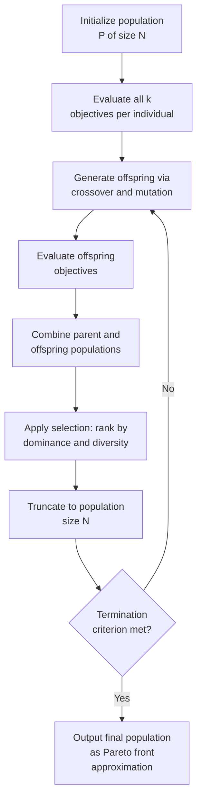
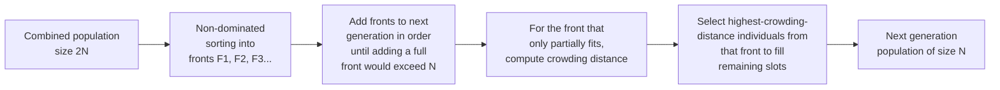

## Multi-Objective Evolutionary Algorithms

### Overview

Multi-objective evolutionary algorithms (MOEAs) are population-based metaheuristics that approximate the Pareto front by evolving an entire population of candidate solutions simultaneously, rather than solving a sequence of scalarized single-objective subproblems as in weighted sum or $\epsilon$-constraint methods. Because a population naturally represents multiple solutions at once, MOEAs are particularly well-suited to producing a diverse, spread-out approximation of the Pareto front in a single run, and they do not require convexity assumptions or explicit target/weight specification from the decision-maker. This makes them the dominant practical approach for problems with complex, non-convex, disconnected, or black-box (non-differentiable) objective landscapes where classical scalarization struggles.

### Core Evolutionary Loop

All MOEAs share a common population-based skeleton, differing primarily in **selection mechanism** (how dominance and diversity are used to choose survivors):

The critical design choice distinguishing MOEA families is step F: how dominance rank and diversity/spread are combined into a single selection criterion, since raw Pareto dominance alone is only a partial order and cannot rank a full population by itself once many individuals become mutually non-dominated.

### Non-Dominated Sorting

A foundational operation in most Pareto-based MOEAs is partitioning the population into successive **non-domination fronts**:

- **Front 1 ($F_1$)**: all individuals not dominated by any other individual in the population (the current non-dominated set).
- **Front 2 ($F_2$)**: individuals not dominated by anyone remaining after $F_1$ is removed.
- Continue iteratively until all individuals are assigned a front rank.

This produces a full ranking of the population even though dominance itself is only a partial order — individuals are primarily compared by front rank (lower is better), with a secondary diversity-based criterion breaking ties within the same front.

**Fast non-dominated sorting** (as introduced in NSGA-II) computes this partition in $O(MN^2)$ time for $M$ objectives and $N$ individuals, by tracking, for each individual, a domination count (number of individuals dominating it) and a list of individuals it dominates — avoiding the naive $O(MN^3)$ approach of re-scanning the population for every front. [Inference — the $O(MN^2)$ complexity figure reflects the standard fast non-dominated sorting procedure; exact complexity can vary with implementation details and population structure.]

### NSGA-II (Non-dominated Sorting Genetic Algorithm II)

NSGA-II is among the most widely used MOEAs, combining fast non-dominated sorting with a diversity-preservation mechanism called **crowding distance**.

**Crowding distance** estimates the density of solutions surrounding a given individual within its front, computed per-objective as the normalized distance between its two neighboring individuals (sorted by that objective), summed across all objectives:

$$CD_i = \sum_{m=1}^{k} \frac{f_m(x_{i+1}) - f_m(x_{i-1})}{f_m^{max} - f_m^{min}}$$

Boundary individuals (smallest or largest value in any objective within the front) are assigned infinite crowding distance, ensuring extreme trade-off points are always preserved.

**Selection rule (crowded-comparison operator)**: individual $i$ is preferred over individual $j$ if:

1. $i$ has a better (lower) front rank, **or**
2. $i$ and $j$ are in the same front and $i$ has a larger crowding distance (i.e., resides in a less crowded region).

This two-level comparison — dominance rank first, diversity second — gives NSGA-II both convergence pressure (toward the front) and spread pressure (across the front) without requiring any explicit weight or target parameter.

### SPEA2 (Strength Pareto Evolutionary Algorithm 2)

SPEA2 uses an **external archive** maintained alongside the main population to preserve non-dominated solutions found across generations, combined with a fitness assignment scheme based on both dominance and density:

- **Strength value** $S(i)$: the number of individuals that $i$ dominates.
- **Raggedness/fitness** $R(i)$: the sum of strength values of all individuals that dominate $i$ (so $R(i) = 0$ only for non-dominated individuals; lower is better).
- **Density estimate**: computed via a $k$-th nearest neighbor method in objective space (commonly the inverse distance to the $k$-th nearest neighbor, with $k$ typically set to the square root of the combined population and archive size), added to $R(i)$ to break ties among equally non-dominated individuals and encourage spread.

Final fitness: $F(i) = R(i) + D(i)$, where $D(i)$ is the density term — lower total fitness is better, with archive membership prioritized for individuals with $F(i) < 1$ (i.e., non-dominated, $R(i)=0$, density term $<1$). If the archive would exceed its fixed size, a truncation procedure iteratively removes the individual with the smallest distance to its nearest neighbor (favoring spread preservation over recency).

### NSGA-III and Reference-Point-Based Selection

NSGA-III extends the NSGA-II framework to **many-objective** problems ($k > 3$), where crowding-distance-based diversity preservation degrades significantly — in high-dimensional objective space, most individuals in a random or evolved population tend to be mutually non-dominated, causing front rank alone to lose most of its selective power, while crowding distance becomes a poor proxy for true spread across a high-dimensional front. [Inference — this degradation of Pareto-dominance selective pressure in many-objective settings is a widely documented phenomenon, though the precise threshold at which it becomes problematic varies by problem structure.]

NSGA-III replaces crowding distance with **reference-point-based niching**:

1. A set of well-spread reference points is generated on a normalized hyperplane (e.g., via a systematic simplex-lattice design, similar in spirit to the uniform weight grids discussed for weighted-sum scalarization).
2. Each population member is associated with its nearest reference point (via perpendicular distance in normalized objective space).
3. Selection favors filling **every** reference point's associated niche with at least one individual before allowing crowding within any single niche, explicitly promoting even coverage across the many-dimensional front rather than relying on emergent density-based spread.

### MOEA/D (Multi-Objective Evolutionary Algorithm based on Decomposition)

MOEA/D takes a fundamentally different approach: rather than using Pareto dominance directly for selection, it **decomposes** the multi-objective problem into a large number of scalar subproblems (via weighted sum, Chebyshev/Tchebycheff, or boundary intersection decomposition) and evolves them **simultaneously and cooperatively**, exploiting neighborhood relationships between subproblems with similar weight vectors.

$$g^{te}(x \mid \lambda, z^*) = \max_{i=1,\dots,k} \left\{ \lambda_i \left| f_i(x) - z_i^* \right| \right\}$$

is a common Chebyshev-decomposition scalarizing function, where $z^*$ is the (estimated) ideal point. Each individual in the MOEA/D population corresponds to one weight vector $\lambda$ and its associated subproblem; neighboring subproblems (similar $\lambda$) share genetic material during reproduction, and each subproblem's incumbent solution is updated whenever a neighbor's offspring improves its own scalarized value. This tight integration of decomposition-based scalarization (structurally related to weighted sum, but using Chebyshev rather than linear combination to handle non-convex regions) with population-based search gives MOEA/D strong performance on many-objective problems at typically lower computational overhead per generation than dominance-rank-based approaches, since sorting the entire population by dominance is avoided.

### Comparison of Major MOEA Families

| Algorithm | Selection Mechanism | Diversity Mechanism | Best Suited For |
| --- | --- | --- | --- |
| NSGA-II | Non-dominated sorting (front rank) | Crowding distance | General bi/tri-objective problems |
| SPEA2 | Strength/raggedness fitness + external archive | $k$-th nearest neighbor density | Problems benefiting from archive-based elitism |
| NSGA-III | Non-dominated sorting (front rank) | Reference-point niching | Many-objective problems ($k > 3$) |
| MOEA/D | Decomposition into scalar subproblems | Neighborhood-based weight spread | Many-objective, computationally constrained settings |

### Constraint Handling in MOEAs

Real-world MOPs frequently include constraints $g_j(x) \leq 0$ in addition to multiple objectives. A common general strategy, **constrained-dominance**, modifies the dominance comparison itself:

1. A feasible solution always dominates an infeasible one, regardless of objective values.
2. Between two infeasible solutions, the one with smaller total constraint violation dominates.
3. Between two feasible solutions, standard Pareto dominance applies.

This constrained-dominance rule integrates naturally into the non-dominated sorting step of NSGA-II and NSGA-III without requiring separate penalty-function tuning, though penalty-based and repair-based constraint handling are also used in various MOEA implementations. [Inference — the specific constraint-handling strategy employed varies across MOEA implementations and problem domains; constrained-dominance is one common and widely adopted approach but not universal.]

### Illustration: Population Evolving Toward the Front

<svg xmlns="http://www.w3.org/2000/svg" viewBox="0 0 640 460">
<text x="320" y="26" text-anchor="middle" font-size="17" font-weight="bold" fill="#1a1a1a">MOEA Population Convergence and Spread (svg_diagram)</text>
<line x1="80" y1="410" x2="80" y2="60" stroke="#333" stroke-width="2" />
<line x1="80" y1="410" x2="580" y2="410" stroke="#333" stroke-width="2" />
<text x="560" y="428" font-size="13" fill="#333">f₁ →</text>
<text x="40" y="70" font-size="13" fill="#333">f₂</text>
<path d="M 120 380 Q 220 260 320 200 Q 420 140 520 100" fill="none" stroke="#2563eb" stroke-width="3" stroke-dasharray="2,4" />
<text x="330" y="130" font-size="12" fill="#2563eb" font-weight="bold">true Pareto front</text>
<circle cx="200" cy="330" r="5" fill="#9ca3af" />
<circle cx="280" cy="300" r="5" fill="#9ca3af" />
<circle cx="350" cy="270" r="5" fill="#9ca3af" />
<circle cx="420" cy="230" r="5" fill="#9ca3af" />
<circle cx="460" cy="200" r="5" fill="#9ca3af" />
<text x="200" y="355" font-size="10" fill="#6b7280">early generation (unconverged)</text>
<circle cx="130" cy="375" r="6" fill="#16a34a" />
<circle cx="200" cy="278" r="6" fill="#16a34a" />
<circle cx="280" cy="222" r="6" fill="#16a34a" />
<circle cx="370" cy="178" r="6" fill="#16a34a" />
<circle cx="450" cy="128" r="6" fill="#16a34a" />
<circle cx="510" cy="100" r="6" fill="#16a34a" />
<text x="330" y="95" font-size="10" fill="#16a34a">final generation (converged and spread)</text>
</svg>

### Advantages and Limitations Relative to Scalarization Methods

**Advantages:**

- A single run produces an entire population-based front approximation, rather than requiring many independent scalarized solves.
- No convexity assumption required — dominance-based and decomposition-based (Chebyshev) selection both handle non-convex fronts.
- Naturally accommodates black-box, non-differentiable, noisy, or discrete objective functions, since no gradient or KKT structure is required.
- Diversity-preservation mechanisms (crowding distance, reference points, neighborhood structure) directly target even front coverage, addressing the clustering weakness of naive weighted-sum sweeps.

**Limitations:**

- No formal optimality guarantee — MOEAs are heuristic search methods; the returned population is an *approximation* of the true front, not a certified Pareto optimal set.
- Computationally expensive relative to a single scalarized solve, particularly for expensive-to-evaluate objective functions, since many generations of population evaluation are typically required.
- Performance and required population size scale poorly with the number of objectives $k$ in dominance-rank-based variants (the "many-objective" degradation problem addressed by NSGA-III and MOEA/D-style decomposition).
- Requires tuning of evolutionary hyperparameters (population size, crossover/mutation rates, archive size) that have no direct analog in classical scalarization methods.

### Key Points

- MOEAs approximate the entire Pareto front in a single population-based run, contrasting with the repeated single-solve structure of weighted sum and $\epsilon$-constraint methods.
- **Non-dominated sorting** ranks a population into successive dominance fronts; a secondary **diversity mechanism** (crowding distance, density estimation, or reference points) is required to fully order individuals within a front.
- NSGA-II (crowding distance), SPEA2 (archive + density fitness), NSGA-III (reference-point niching), and MOEA/D (decomposition into scalar subproblems) represent the major algorithmic families, each with different strengths particularly regarding scalability to many objectives.
- Pareto-dominance-based selection pressure degrades in many-objective settings, motivating reference-point and decomposition-based alternatives.
- MOEAs provide no formal Pareto optimality certificate — they are approximation methods, evaluated empirically via indicators such as hypervolume and IGD.

### Related Topics

- Hypervolume and IGD indicator computation for evaluating MOEA output quality
- Many-objective optimization challenges beyond $k=3$
- Constraint-handling techniques in evolutionary multi-objective optimization
- Surrogate-assisted MOEAs for expensive black-box objective functions
- Multi-objective particle swarm optimization and other non-GA metaheuristics
- Hyperparameter tuning and population sizing strategies for evolutionary algorithms