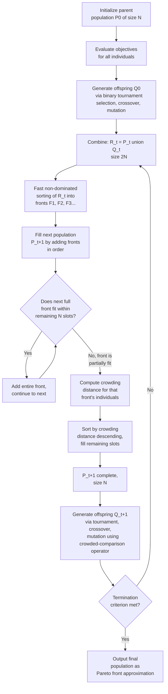

## NSGA-II Algorithm Mechanics

### Overview

NSGA-II (Non-dominated Sorting Genetic Algorithm II) is a population-based multi-objective evolutionary algorithm built on two core mechanisms: **fast non-dominated sorting**, which ranks a population into successive dominance fronts in $O(MN^2)$ time, and **crowding distance**, which preserves diversity within each front without requiring any user-specified niching parameter. Introduced as an improvement over the original NSGA (which relied on a slower non-dominated sorting procedure and a manually-tuned sharing-function parameter for diversity), NSGA-II's combination of computational efficiency, parameter-free diversity preservation, and elitism made it one of the most widely adopted MOEAs for two- and three-objective problems.

### Overall Algorithm Structure

### Step 1: Fast Non-Dominated Sorting

Given a combined population $R_t$ of size $2N$ (parents plus offspring), the algorithm partitions individuals into fronts $F_1, F_2, \dots$ using two tracked quantities per individual $p$:

- $n_p$: the **domination count** — the number of individuals in the population that dominate $p$.
- $S_p$: the **domination set** — the set of individuals that $p$ itself dominates.

**Procedure:**

1. For every pair $(p, q)$ in the population, compare via Pareto dominance. If $p \prec q$, add $q$ to $S_p$. If $q \prec p$, increment $n_p$.
2. All individuals with $n_p = 0$ (dominated by no one) form front $F_1$.
3. For each $p \in F_1$, decrement $n_q$ for every $q \in S_p$ (since $p$'s dominance no longer "counts" once $p$ is assigned a front). Any $q$ whose $n_q$ drops to zero joins the next front, $F_2$.
4. Repeat step 3 iteratively — each successive front is formed from individuals whose domination count reaches zero once all prior fronts are removed from consideration — until every individual is assigned a front.

This bookkeeping approach avoids re-scanning the entire remaining population for every front (the naive $O(MN^3)$ approach), since each pairwise comparison in step 1 is performed exactly once and the front-assignment propagation in steps 2–4 is a queue-like linear pass. This step is $O(MN^2)$ overall for $M$ objectives and $N$ individuals in the combined population (here $2N, so more precisely $O(M(2N)^2)
, i.e. $O(MN^2)$ up to constant factor). [Inference — the exact constant factors depend on implementation details such as data structure choices for tracking $S_p$ and $n_p$.]

### Step 2: Crowding Distance Assignment

Within a single front, crowding distance estimates local solution density around each individual, used purely as a tie-breaking diversity measure (it has no meaning across different fronts). For a front with $l$ individuals:

**Procedure per objective $m$:**

1. Sort all individuals in the front by objective value $f_m$.
2. Assign the two boundary individuals (smallest and largest $f_m$ in the front) an infinite crowding distance — this guarantees extreme points are never discarded for being "too crowded."
3. For each interior individual $i$ (sorted position), add to its running crowding distance:

$$CD_i \mathrel{+}= \frac{f_m(x_{i+1}) - f_m(x_{i-1})}{f_m^{max} - f_m^{min}}$$

where $x_{i-1}, x_{i+1}$ are its immediate neighbors in the $f_m$-sorted order, and $f_m^{max}, f_m^{min}$ are the maximum and minimum values of $f_m$ within the front (used for normalization across objectives with different scales).

4. Repeat for all $M$ objectives, accumulating the sum into $CD_i$ for each individual.

The result is that $CD_i$ approximates the perimeter of the largest cuboid (in objective space) enclosing individual $i$ without containing any other individual in the front — a larger $CD_i$ means $i$ sits in a sparser region, and is therefore more valuable to retain for diversity.

<svg xmlns="http://www.w3.org/2000/svg" viewBox="0 0 640 420">
<text x="320" y="26" text-anchor="middle" font-size="17" font-weight="bold" fill="#1a1a1a">Crowding Distance Geometry (svg_diagram)</text>
<line x1="80" y1="370" x2="80" y2="60" stroke="#333" stroke-width="2" />
<line x1="80" y1="370" x2="580" y2="370" stroke="#333" stroke-width="2" />
<text x="560" y="388" font-size="13" fill="#333">f₁ →</text>
<text x="40" y="70" font-size="13" fill="#333">f₂</text>
<path d="M 120 340 Q 220 250 320 190 Q 420 130 520 90" fill="none" stroke="#2563eb" stroke-width="2" stroke-dasharray="3,3" />
<circle cx="120" cy="340" r="6" fill="#dc2626" />
<text x="95" y="360" font-size="10" fill="#dc2626">boundary (CD = infinity)</text>
<circle cx="230" cy="250" r="6" fill="#16a34a" />
<circle cx="320" cy="190" r="6" fill="#16a34a" />
<circle cx="410" cy="150" r="6" fill="#16a34a" />
<rect x="230" y="150" width="180" height="100" fill="none" stroke="#16a34a" stroke-width="1.5" stroke-dasharray="4,3" />
<text x="240" y="140" font-size="11" fill="#16a34a">cuboid around middle point (x320,y190)</text>
<circle cx="520" cy="90" r="6" fill="#dc2626" />
<text x="480" y="75" font-size="10" fill="#dc2626">boundary (CD = infinity)</text>

<text x="90" y="400" font-size="12" fill="#555">Crowding distance ≈ perimeter of the cuboid formed by an individual's nearest neighbors per objective.</text>

</svg>

### Step 3: Crowded-Comparison Operator ($\prec_n$)

Individual $i$ is preferred to individual $j$ under the crowded-comparison operator if and only if:

$$i \prec_n j \iff (rank_i < rank_j) \; \lor \; \left( rank_i = rank_j \; \land \; CD_i > CD_j \right)$$

This defines a **total order** over the entire population (breaking the partial order of raw Pareto dominance): front rank is the primary criterion, and within a tied front, larger crowding distance wins. This operator is used both in **environmental selection** (choosing which individuals survive into $P_{t+1}$, described in Step 4 below) and in **mating selection** (binary tournament selection for choosing parents to produce offspring), giving consistent selection pressure toward both convergence and diversity throughout the algorithm, not just at the final truncation step.

### Step 4: Elitist Environmental Selection

Given the combined population $R_t = P_t \cup Q_t$ of size $2N, sorted into fronts $F_1, F_2, \dots
:

1. Add $F_1$ to $P_{t+1}$. If $|P_{t+1}| + |F_2| \leq N$, add $F_2$ as well, and continue adding whole fronts in order.
2. At the first front $F_l$ where adding the entire front would exceed $N$, compute crowding distance for all individuals in $F_l$ specifically (crowding distance is always computed relative to the front currently being considered, not the whole combined population).
3. Sort $F_l$ by crowding distance descending, and select the top $N - |P_{t+1}|$ individuals to fill the remaining slots exactly.

This procedure is **elitist**: because parents and offspring are combined *before* selection, a high-quality parent can never be lost simply because its offspring happened to be worse — it competes on equal footing and survives if it remains non-dominated and sufficiently spread out relative to the rest of the combined pool.

### Step 5: Offspring Generation

Offspring are produced via standard genetic operators, using the crowded-comparison operator for parent selection:

- **Binary tournament selection**: two individuals are drawn at random from $P_t$; the one preferred by $\prec_n$ (better rank, or equal rank with larger crowding distance) is selected as a parent. This is repeated to build a mating pool of size $N$.
- **Crossover**: for real-valued decision variables, **simulated binary crossover (SBX)** is the conventional choice, designed to mimic the spread-preserving behavior of single-point crossover in binary-encoded GAs while operating directly on continuous variables.
- **Mutation**: **polynomial mutation** is the standard choice paired with SBX, perturbing a variable within its bounds with a distribution shape controlled by a distribution index parameter (higher index concentrates perturbations closer to the original value).

[Inference — SBX and polynomial mutation are the conventional operator choices in the original NSGA-II formulation for real-valued problems; alternative operators (e.g., differential evolution variants, problem-specific encodings for combinatorial problems) are commonly substituted in practice depending on the decision variable representation.]

### Worked Example: One Generation of Sorting and Selection

**Example**

Suppose a combined population $R_t$ of 6 individuals (so $N=3$ for this simplified illustration) has the following bi-objective values (both minimized):

| Individual | $f_1$ | $f_2$ |
| --- | --- | --- |
| A | 1 | 6 |
| B | 2 | 4 |
| C | 3 | 3 |
| D | 4 | 5 |
| E | 5 | 2 |
| F | 6 | 1 |

**Dominance check:** D is dominated by both B ($2<4, 4<5) and C ($3<4, 3<5
). No other domination relationships hold among A, B, C, E, F (each pair has one objective favoring each side). So:

- $F_1 = \{A, B, C, E, F\}$ (5 individuals, mutually non-dominated)
- $F_2 = \{D\}$ (dominated only by members of $F_1$)

Since $N=3$ and $|F_1| = 5 > 3$, $F_1$ alone exceeds capacity — crowding distance must be computed within $F_1$ to select 3 of its 5 members; $F_2$ is not reached at all this generation.

**Crowding distance within $F_1$** (sorted by $f_1$: A=1, B=2, C=3, E=5, F=6; range $f_1^{max}-f_1^{min} = 6-1=5$; sorted by $f_2$: F=1, E=2, C=3, B=4, A=6; range $f_2^{max}-f_2^{min}=6-1=5$):

- A and F are boundary in $f_1$ (min and max) → infinite contribution from $f_1$ term.
- F and A are boundary in $f_2$ as well (F has $f_2^{min}=1$, A has $f_2^{max}=6$) → infinite contribution from $f_2$ term too.
- So A and F both have $CD = \infty$ regardless of interior calculations.
- B (interior in $f_1$, neighbors A and C): $f_1$ term $= (3-1)/5 = 0.4$. In $f_2$-sorted order, B's neighbors are C and A: $f_2$ term $=(6-3)/5 = 0.6$. $CD_B = 0.4+0.6=1.0$.
- C (interior in $f_1$, neighbors B and E): $f_1$ term $=(5-2)/5=0.6$. In $f_2$-sorted order, C's neighbors are E and B: $f_2$ term $=(4-2)/5=0.4$. $CD_C=0.6+0.4=1.0$.
- E (interior in $f_1$, neighbors C and F): $f_1$ term $=(6-3)/5=0.6$. In $f_2$-sorted order, E's neighbors are F and C: $f_2$ term $=(3-1)/5=0.4$. $CD_E=0.6+0.4=1.0$.

Selecting top 3 by crowding distance: A and F are automatically retained (infinite CD), and among B, C, E (all tied at $CD=1.0$ in this small symmetric example), any one suffices to fill the third slot — ties are typically broken arbitrarily or by insertion order in practice. Final $P_{t+1} = \{A, F, \text{one of } B/C/E\}$, illustrating how the boundary/extreme trade-off solutions are always prioritized for survival.

### Computational Complexity Summary

| Step | Complexity | Bottleneck |
| --- | --- | --- |
| Fast non-dominated sorting | $O(MN^2)$ | Pairwise dominance comparisons |
| Crowding distance (per front) | $O(M \cdot l \log l)$ | Sorting front of size $l$ by each objective |
| Overall per generation | $O(MN^2)$ | Dominated by non-dominated sorting for large $N$ |

The $O(MN^2)$ non-dominated sorting cost is the primary scalability bottleneck for large population sizes $N$, and — combined with the many-objective degradation of dominance-based selective pressure discussed for MOEAs generally — motivates NSGA-III's reference-point approach for problems with more than roughly three objectives.

### Key Parameters

- **Population size $N$**: larger populations improve front coverage but increase per-generation cost quadratically via non-dominated sorting.
- **Crossover probability and SBX distribution index**: controls how much offspring resemble parents versus explore new regions.
- **Mutation probability and polynomial mutation distribution index**: controls perturbation magnitude; typically set inversely proportional to the number of decision variables.
- **Number of generations / termination criterion**: fixed generation count, convergence-based stopping (e.g., stagnant hypervolume), or evaluation budget, depending on problem cost.

### Key Points

- NSGA-II combines fast non-dominated sorting ($O(MN^2)$) with crowding distance to achieve both convergence and diversity without a tunable niching parameter.
- The crowded-comparison operator ($\prec_n$) imposes a total order on the population — front rank first, crowding distance as tie-breaker — used consistently in both mating and environmental selection.
- Elitism arises from combining parent and offspring populations *before* selection, ensuring good solutions are never lost to a single bad generation of offspring.
- Boundary (extreme) solutions in each front always receive infinite crowding distance and are therefore always preserved.
- The $O(MN^2)$ sorting cost and degrading dominance-based selection pressure at high $k$ are the primary motivations for NSGA-III in many-objective settings.

### Related Topics

- NSGA-III reference-point niching for many-objective problems
- Simulated binary crossover (SBX) and polynomial mutation operator details
- Hypervolume and IGD as external quality indicators for NSGA-II output
- SPEA2's archive-based alternative to generational elitism
- Constrained-dominance handling within the non-dominated sorting step
- Real-world application patterns: engineering design, scheduling, portfolio optimization