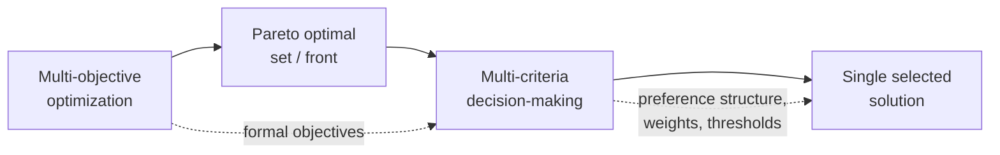

## Decision-Making Under Multiple Criteria

### Overview

Generating a Pareto front — whether via scalarization or evolutionary methods — solves only half of the multi-objective optimization problem. The remaining, often harder half is **selecting a single preferred solution** from the (typically infinite or large) set of Pareto optimal alternatives. This is the domain of multi-criteria decision-making (MCDM), a body of theory and methods concerned with structuring preferences, weighting criteria, and choosing among non-dominated alternatives in a principled, defensible way. MCDM connects the mathematical output of multi-objective optimization to the human, organizational, or policy context in which a final decision must actually be made.

### Why a Second Stage Is Needed

Pareto optimality alone provides no ranking among non-dominated solutions — by definition, none dominates another, so a purely mathematical criterion cannot break the tie. Choosing a final solution requires additional information not contained in the objective functions themselves: the decision-maker's (DM's) relative priorities, risk tolerance, and qualitative considerations that may not have been captured as formal objectives at all. MCDM methods provide structured ways to elicit and apply this additional information.

### Classification by Timing of Preference Articulation

MCDM approaches are commonly classified by **when** the decision-maker's preferences enter the process relative to the optimization itself:

- **A priori methods**: preferences (weights, targets, priority order) are specified *before* optimization begins, and a single scalarized solve (weighted sum, goal programming, achievement scalarizing function) produces one solution directly. Advantage: computationally efficient, single solve. Disadvantage: the DM must commit to preferences without having seen the actual trade-off space, risking a poorly-informed or infeasible target.
- **A posteriori methods**: the full (or approximated) Pareto front is generated first — via $\epsilon$-constraint sweeps or MOEAs — and the DM selects from the presented set afterward. Advantage: the DM sees actual achievable trade-offs before committing. Disadvantage: computationally expensive to generate the full front, and presenting a large or high-dimensional front to a human DM can itself be overwhelming.
- **Interactive methods**: preferences are elicited progressively, alternating between small optimization steps and DM feedback, converging toward a satisfactory solution without ever fully enumerating the front. Advantage: balances computational cost against informed preference articulation. Disadvantage: requires sustained DM engagement throughout the process rather than a single upfront or downstream interaction.

| Approach | When preferences enter | Computational cost | DM burden |
| --- | --- | --- | --- |
| A priori | Before optimization | Low (single solve) | High (commit blind) |
| A posteriori | After full front generated | High (full front) | Moderate (select from set) |
| Interactive | Throughout, iteratively | Moderate (progressive) | Sustained (ongoing feedback) |

### Multi-Attribute Utility Theory (MAUT)

MAUT provides an axiomatic framework for aggregating multiple criteria into a single scalar **utility function** $U(x)$ that represents the DM's preferences consistently, provided the DM's choices satisfy certain rationality axioms (completeness, transitivity, and independence conditions across attributes).

**Additive utility form** (valid under mutual preferential independence of attributes):

$$U(x) = \sum_{i=1}^{k} w_i \, u_i(f_i(x))$$

where $u_i(\cdot)$ is a single-attribute utility function (typically normalized to $[0,1]$, capturing possibly nonlinear DM sensitivity to changes in $f_i$) and $w_i$ are scaling constants reflecting relative importance, with $\sum_i w_i = 1$.

**Key distinction from weighted sum scalarization**: weighted sum applies weights directly to raw objective values $f_i(x)$, implicitly assuming the DM's utility is linear in each objective. MAUT explicitly separates the **shape** of preference (captured by $u_i$, which can be concave, convex, or S-shaped to reflect diminishing sensitivity, risk aversion, or threshold effects) from the **relative importance** (captured by $w_i$), producing a more behaviorally grounded aggregation when the DM's true preferences are nonlinear in the underlying objectives.

Eliciting single-attribute utility functions typically involves structured techniques such as the **certainty equivalent method** or **lottery-based elicitation**, where the DM is asked to compare a certain outcome against a probabilistic gamble to reveal risk attitude — a process that can be time-consuming and requires the DM to reason consistently about hypothetical trade-offs. [Inference — the practical difficulty and reliability of utility elicitation varies substantially with DM expertise and the number of attributes involved; this is a widely noted practical limitation of MAUT rather than a settled quantitative finding.]

### Analytic Hierarchy Process (AHP)

AHP structures decision-making as a hierarchy (goal → criteria → sub-criteria → alternatives) and derives weights through **pairwise comparison** rather than direct numerical assignment, which is often cognitively easier for a DM than assigning absolute weights simultaneously across many criteria.

**Procedure:**

1. Construct a pairwise comparison matrix $A$ for the criteria, where $a_{ij}$ represents how many times more important criterion $i$ is than criterion $j$, typically on Saaty's 1–9 verbal-numerical scale (1 = equal importance, 9 = extreme importance), with $a_{ji} = 1/a_{ij}$ enforced (reciprocal matrix).
2. Compute the **principal eigenvector** of $A$; after normalization, this eigenvector gives the derived weight vector $w$.
3. Check **consistency** via the consistency ratio $CR = CI / RI$, where $CI = (\lambda_{max} - k)/(k-1)$ ($\lambda_{max}$ is the matrix's principal eigenvalue, $k$ the number of criteria) and $RI$ is a random-index benchmark value for matrices of that size. A commonly cited threshold is $CR < 0.1$, indicating the DM's pairwise judgments are sufficiently internally consistent to trust the derived weights; higher values suggest the DM should revise their comparisons.
4. Repeat pairwise comparison at the alternative level for each criterion (how alternatives compare to each other under each criterion), then aggregate via the criteria weights to produce a final ranking.

**Worked micro-example**

**Example**

Suppose a DM compares three criteria — cost, quality, and delivery speed — pairwise, judging cost moderately more important than quality (value 3), cost strongly more important than delivery speed (value 5), and quality slightly more important than delivery speed (value 2):

$$A = \begin{pmatrix} 1 & 3 & 5 \\ 1/3 & 1 & 2 \\ 1/5 & 1/2 & 1 \end{pmatrix}$$

An approximate weight vector can be estimated by normalizing the geometric mean of each row: row products are $1 \times 3 \times 5 = 15, $\frac{1}{3}\times 1\times 2 \approx 0.667
, $\frac{1}{5}\times\frac{1}{2}\times 1 = 0.1$; cube roots (since $k=3$) are approximately $2.466, $0.874
, $0.464$; normalizing by their sum ($\approx 3.804) gives weights approximately $w \approx (0.648, 0.230, 0.122)
 — cost weighted roughly 65%, quality 23%, delivery speed 12%. [Inference — the geometric mean row method is a standard simplified approximation to the true principal eigenvector; results are very close but not always numerically identical to the exact eigenvector solution, particularly for less consistent matrices.]

### TOPSIS (Technique for Order of Preference by Similarity to Ideal Solution)

TOPSIS ranks alternatives by **geometric distance** to both an ideal (best-case) and a negative-ideal (worst-case) reference point in normalized, weighted criteria space — favoring alternatives simultaneously close to the ideal and far from the negative-ideal.

**Procedure:**

1. Normalize the decision matrix (alternatives × criteria), commonly via vector normalization: $r_{ij} = x_{ij} / \sqrt{\sum_l x_{lj}^2}$.
2. Apply criteria weights: $v_{ij} = w_j \cdot r_{ij}$.
3. Determine the ideal solution $A^+$ (best value per criterion, i.e. the per-criterion analog of the ideal point) and negative-ideal solution $A^-$ (worst value per criterion, analogous to the nadir point but taken independently per criterion rather than restricted to the Pareto set).
4. Compute Euclidean distance from each alternative to $A^+$ (call it $D_i^+$) and to $A^-$ ($D_i^-$).
5. Compute the **relative closeness** score: $C_i = D_i^- / (D_i^+ + D_i^-)$, ranging in $[0,1]$, with higher values indicating a more preferred alternative (closer to ideal, farther from negative-ideal).
6. Rank alternatives by $C_i$ descending.

TOPSIS is conceptually related to compromise programming and Chebyshev-distance-based scalarization discussed in earlier scalarization methods, but is applied post hoc to a discrete, already-generated set of alternatives (such as an a posteriori Pareto front sample) rather than embedded within the optimization process itself.

### Outranking Methods (ELECTRE and PROMETHEE Families)

Unlike MAUT and TOPSIS, which aggregate criteria into a single index, **outranking methods** build pairwise preference relations between alternatives based on **concordance** (evidence supporting a preference) and **discordance** (evidence against it), without requiring full compensability between criteria (i.e., without assuming a large advantage on one criterion can always offset a disadvantage on another).

- **ELECTRE family**: constructs concordance and discordance indices for each pair of alternatives, using threshold-based rules to determine whether one alternative "outranks" another; alternatives with weak or inconsistent outranking relations may remain incomparable, reflecting genuine decision ambiguity rather than forcing a full ranking.
- **PROMETHEE family**: computes pairwise preference degrees via a preference function (which can take various shapes — linear, threshold-based, Gaussian) per criterion, aggregates into an outranking flow, and derives a ranking from positive and negative flow scores.

Outranking methods are particularly suited to situations where criteria are **not mutually compensable** in the DM's true preference structure (e.g., a safety criterion that cannot be traded off against cost beyond a certain threshold, regardless of how favorable the cost is) — a scenario poorly handled by purely additive utility aggregation.

### Comparison of MCDM Methods

| Method | Aggregation Type | Compensability Assumption | Elicitation Burden | Typical Use Case |
| --- | --- | --- | --- | --- |
| Weighted sum / MAUT | Additive scalar utility | Fully compensatory | High (utility functions) or moderate (weights only) | Front generation or post hoc ranking with linear/nonlinear preference shape |
| AHP | Pairwise-derived weighted hierarchy | Fully compensatory | Moderate (pairwise comparisons) | Structured hierarchical criteria with qualitative and quantitative mix |
| TOPSIS | Distance-based composite index | Fully compensatory | Low-moderate (weights + normalization) | Ranking a discrete, already-known alternative set |
| ELECTRE / PROMETHEE | Pairwise outranking relations | Partially/non-compensatory | Moderate-high (thresholds, preference functions) | Criteria with hard trade-off limits or incomparability |

### Illustration: Selecting from a Pareto Front via MCDM

<svg xmlns="http://www.w3.org/2000/svg" viewBox="0 0 640 440">
<text x="320" y="26" text-anchor="middle" font-size="17" font-weight="bold" fill="#1a1a1a">MCDM Selection From a Pareto Front (svg_diagram)</text>
<line x1="80" y1="390" x2="80" y2="60" stroke="#333" stroke-width="2" />
<line x1="80" y1="390" x2="580" y2="390" stroke="#333" stroke-width="2" />
<text x="560" y="408" font-size="13" fill="#333">f₁ (cost) →</text>
<text x="30" y="70" font-size="13" fill="#333">f₂</text>
<text x="15" y="88" font-size="12" fill="#333">(quality loss)</text>
<path d="M 120 360 Q 220 250 320 190 Q 420 130 520 90" fill="none" stroke="#2563eb" stroke-width="3" />
<circle cx="130" cy="350" r="6" fill="#6b7280" />
<circle cx="200" cy="280" r="6" fill="#6b7280" />
<circle cx="280" cy="220" r="7" fill="#9333ea" />
<circle cx="360" cy="170" r="6" fill="#6b7280" />
<circle cx="450" cy="120" r="6" fill="#6b7280" />
<circle cx="510" cy="95" r="6" fill="#6b7280" />

<text x="290" y="215" font-size="12" fill="`#9333ea`" font-weight="bold">TOPSIS-selected point</text>

<text x="290" y="230" font-size="10" fill="`#9333ea`">(closest to ideal, farthest from negative-ideal)</text>

<circle cx="120" cy="90" r="5" fill="#16a34a" />
<text x="130" y="94" font-size="10" fill="#16a34a">ideal point (unattainable)</text>
<circle cx="520" cy="360" r="5" fill="#dc2626" />
<text x="410" y="378" font-size="10" fill="#dc2626">negative-ideal (worst per-criterion)</text>

<text x="90" y="425" font-size="12" fill="#555">Every gray/purple point is Pareto optimal; MCDM selects which one best matches DM preferences.</text>

</svg>

### Interactive Methods

Interactive MCDM approaches alternate between a computational step (solving a scalarized subproblem or generating a local front region) and a feedback step (presenting results to the DM and eliciting refined preference information), avoiding the need to fully characterize the entire front while still incorporating genuine post-hoc DM judgment. Representative mechanics include:

- Presenting a small set of trial solutions and asking the DM to indicate which objectives they would be willing to trade off further, and by how much, tightening $\epsilon$-constraint bounds or reference points on subsequent iterations.
- Reference-point methods, where the DM specifies an **aspiration level** (desired objective vector) after seeing initial results; an achievement scalarizing function then finds the nearest attainable Pareto point, structurally similar in spirit to the goal-programming target concept but explicitly designed to remain Pareto-optimality-preserving (unlike raw goal programming) via a small augmentation term.
- Iterative weight adjustment, where the DM reacts to a shown solution ("too expensive," "quality is fine, reduce cost further") and weights are adjusted accordingly for the next scalarized solve.

This progressive structure trades some computational efficiency (relative to a single a priori solve) for substantially reduced DM cognitive burden compared to evaluating an entire a posteriori front, and it avoids the risk of an a priori method committing to poorly-calibrated weights before any trade-off information is visible.

### Practical Considerations in Method Selection

- **Number of alternatives/criteria**: AHP's pairwise comparison burden grows quadratically with the number of criteria (and alternatives, if compared directly rather than via criteria), becoming impractical beyond roughly 7–9 items per comparison set without hierarchical decomposition into sub-criteria groups.
- **Compensability assumption validity**: if the DM's true preference structure includes hard constraints or thresholds that cannot be traded off (e.g., a regulatory safety minimum), outranking methods (ELECTRE, PROMETHEE) are more behaviorally appropriate than fully compensatory methods (weighted sum, MAUT, TOPSIS).
- **Availability of a full front vs. discrete alternatives**: a posteriori selection tools like TOPSIS assume a pre-existing discrete alternative set (e.g., sampled front points from an MOEA run); interactive methods are better suited when generating the full front is prohibitively expensive.
- **DM expertise and time availability**: utility elicitation (MAUT) demands significant DM engagement and consistency; AHP's pairwise comparisons are cognitively lighter but still require multiple rounds; TOPSIS requires only weight specification, the lightest DM burden among compensatory methods.

### Key Points

- MCDM addresses the selection problem left open after Pareto front generation — choosing one solution among mutually non-dominated alternatives.
- Methods are classified by preference timing: **a priori** (weights before optimization), **a posteriori** (select after full front), and **interactive** (progressive feedback).
- **MAUT** and **AHP** derive weights/utility through structured elicitation (lotteries, pairwise comparison); **TOPSIS** ranks by distance to ideal/negative-ideal reference points; **outranking methods** (ELECTRE, PROMETHEE) avoid the full-compensability assumption underlying the others.
- AHP's eigenvector-derived weights include a built-in consistency check ($CR < 0.1$ conventional threshold) absent from simpler weighting schemes.
- Method choice depends on whether criteria are genuinely compensable, how many criteria/alternatives are involved, and how much DM engagement is feasible.

### Related Topics

- Achievement scalarizing functions and reference-point interactive methods in detail
- Fuzzy MCDM extensions for imprecise or linguistic criteria assessments
- Group decision-making and preference aggregation across multiple stakeholders
- Sensitivity analysis of AHP/TOPSIS rankings to weight perturbation
- Compromise programming and $L_p$-norm distance metrics to reference points
- Behavioral decision theory and bounded rationality in DM preference elicitation