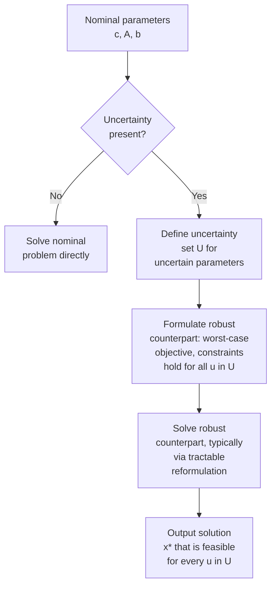

## Robust Optimization Problem Formulation

### Overview

Robust optimization addresses a distinct concern from multi-objective trade-offs: how to formulate and solve optimization problems whose data — objective coefficients, constraint parameters, or the feasible region itself — are **uncertain** at the time a decision must be made, without relying on a full probability distribution over that uncertainty. Rather than optimizing expected performance (the domain of stochastic programming) or a single Pareto trade-off among competing objectives, robust optimization seeks a solution that performs acceptably well — or remains feasible — across an entire **uncertainty set** of possible parameter realizations, typically by optimizing the **worst case** within that set. This makes it especially suited to settings where uncertainty is poorly characterized statistically, where constraint violation carries severe consequences (safety, structural, or regulatory), or where the decision-maker wants a solution whose performance guarantee does not depend on distributional assumptions that may be wrong.

### Motivation: Sensitivity of Nominal Solutions

A **nominal** optimization problem uses point-estimate (best-guess) values for all uncertain parameters and solves as if those estimates were exact:

$$\min_{x \in \Omega} \; c^T x \quad \text{subject to} \quad Ax \leq b$$

If the true realized values of $c$, $A$, or $b$ differ from the nominal estimates — which is expected whenever parameters are estimated, forecasted, or subject to measurement error — the nominal-optimal solution $x^*$ may become **infeasible** (constraint violation) or substantially **suboptimal** under the realized data, even for small perturbations. This sensitivity is well documented in classical results on linear programming, where optimal basic feasible solutions sit at constraint intersections and can be disproportionately sensitive to small coefficient perturbations near degenerate or tightly active constraints. [Inference — the degree of sensitivity is problem-specific and depends heavily on the conditioning of the constraint matrix and the position of the nominal optimum relative to active constraints; it is not a uniform property of all LPs.] Robust optimization directly addresses this fragility by building protection against parameter variation into the formulation itself, rather than treating it as a post hoc sensitivity-analysis concern.

### General Robust Optimization Formulation

Given a nominal problem with uncertain parameter $u$ ranging over an **uncertainty set** $\mathcal{U}$, the robust counterpart is:

$$\min_{x \in \Omega} \; \max_{u \in \mathcal{U}} \; f(x, u)$$

$$\text{subject to:} \quad g(x, u) \leq 0 \quad \forall u \in \mathcal{U}$$

This is a **min-max** formulation: the decision-maker chooses $x$ to minimize the worst-case (maximum) objective value over all possible realizations of $u$ within $\mathcal{U}$, and constraints must hold for **every** $u \in \mathcal{U}$ (robust feasibility), not merely on average or with high probability. This worst-case, "protect against every possible realization within the set" structure is the defining feature distinguishing robust optimization from stochastic programming, which instead optimizes an expectation or a chance (probabilistic) constraint over an assumed distribution of $u$.

### Uncertainty Set Design

The choice of uncertainty set $\mathcal{U}$ is the central modeling decision in robust optimization — it directly determines both the tractability of the resulting robust counterpart and the degree of conservatism in the solution. Common set shapes:

- **Box (interval) uncertainty**: $\mathcal{U} = \{u : |u_i - \bar{u}_i| \leq \delta_i, \; \forall i\}$ — each uncertain parameter varies independently within its own interval. Simple and intuitive, but treats worst cases across all parameters as simultaneously achievable, which is often the **most conservative** (most pessimistic) uncertainty set shape, since it assumes every parameter can be at its individual worst value at the same time.
- **Ellipsoidal uncertainty**: $\mathcal{U} = \{u : (u - \bar{u})^T \Sigma^{-1} (u - \bar{u}) \leq \Omega^2\}$ — parameters vary jointly within an ellipsoid shaped by a covariance-like matrix $\Sigma$, with $\Omega$ controlling the set's size. Less conservative than box uncertainty for correlated parameters (since the ellipsoid excludes joint extreme combinations that a box would include), but the robust counterpart typically becomes a second-order cone constraint rather than a simple linear one, increasing solver complexity.
- **Polyhedral uncertainty**: $\mathcal{U}$ defined by a set of linear inequalities on $u$, offering a flexible middle ground that can be tailored to problem-specific structure while typically preserving linear-programming tractability in the robust counterpart.
- **Budgeted (Bertsimas-Sim) uncertainty**: a refinement of box uncertainty that limits the **number** of parameters allowed to simultaneously deviate to their worst-case value via a budget parameter $\Gamma$, directly controlling the trade-off between robustness and conservatism in a single tunable knob (described in detail below).

<svg xmlns="http://www.w3.org/2000/svg" viewBox="0 0 640 420">
<text x="320" y="26" text-anchor="middle" font-size="17" font-weight="bold" fill="#1a1a1a">Uncertainty Set Shapes (svg_diagram)</text>
<rect x="60" y="60" width="140" height="140" fill="none" stroke="#dc2626" stroke-width="2.5" />
<text x="80" y="220" font-size="12" fill="#dc2626" font-weight="bold">Box</text>
<text x="65" y="236" font-size="10" fill="#555">most conservative</text>
<ellipse cx="320" cy="130" rx="80" ry="45" fill="none" stroke="#2563eb" stroke-width="2.5" transform="rotate(20 320 130)" />
<text x="270" y="220" font-size="12" fill="#2563eb" font-weight="bold">Ellipsoidal</text>
<text x="255" y="236" font-size="10" fill="#555">accounts for correlation</text>
<polygon points="480,60 600,90 580,190 460,200 440,120" fill="none" stroke="#16a34a" stroke-width="2.5" />
<text x="480" y="220" font-size="12" fill="#16a34a" font-weight="bold">Polyhedral</text>
<text x="460" y="236" font-size="10" fill="#555">flexible, LP-tractable</text>

<text x="60" y="280" font-size="13" fill="#333" font-weight="bold">Budgeted (Bertsimas-Sim): box-like, but caps how many</text>

<text x="60" y="298" font-size="13" fill="#333" font-weight="bold">parameters may reach their worst case simultaneously (Γ)</text>

<rect x="60" y="320" width="140" height="70" fill="`#fbbf24`" opacity="0.25" stroke="`#b45309`" stroke-width="2" />

<text x="70" y="360" font-size="11" fill="`#b45309`">subset of box interior,</text>

<text x="70" y="375" font-size="11" fill="`#b45309`">tunable via Γ</text>

</svg>

### Tractable Reformulation: Linear Constraints Under Box Uncertainty

Consider a single robust linear constraint with uncertain coefficients $a_i$ in row $i$, under box uncertainty $a_{ij} \in [\bar{a}_{ij} - \hat{a}_{ij}, \, \bar{a}_{ij} + \hat{a}_{ij}]$:

$$\sum_j a_{ij} x_j \leq b_i \quad \forall a_i \in \mathcal{U}_i$$

The worst case over the box occurs by choosing each $a_{ij}$ at its most adverse extreme depending on the sign of $x_j$: if $x_j \geq 0$, the worst case is $a_{ij} = \bar{a}_{ij} + \hat{a}_{ij}$; the robust reformulation becomes:

$$\sum_j \bar{a}_{ij} x_j + \sum_j \hat{a}_{ij} |x_j| \leq b_i$$

This adds a single extra linear (or, with absolute values, piecewise-linear but still LP-representable) term to each constraint — illustrating a broader pattern in robust optimization: many uncertainty set choices (box, polyhedral, and — with somewhat more work — ellipsoidal) admit a **tractable reformulation** where the semi-infinite "for all $u \in \mathcal{U}$" constraint collapses into a finite number of deterministic constraints solvable with standard LP, second-order cone, or semidefinite solvers, rather than requiring an intractable infinite-constraint optimization directly.

### The Price of Robustness: Conservatism

Robust solutions generally sacrifice **nominal performance** (the objective value under the best-guess/expected parameters) in exchange for guaranteed performance under worst-case realizations. This trade-off — often called the **price of robustness** — is the central practical tension in robust formulation: a solution fully protected against every point in a large uncertainty set is typically far more conservative (worse nominal objective) than the nominal-optimal solution, and box uncertainty in particular can produce solutions so conservative they sacrifice substantial nominal performance for protection against a joint worst case that may be highly improbable in practice, even though it does formally lie within the specified set. [Inference — the magnitude of this trade-off is highly problem- and set-dependent; it is a well-established qualitative phenomenon rather than a fixed numerical relationship.]

### Budgeted (Bertsimas-Sim) Uncertainty: Controlling Conservatism

The budgeted uncertainty approach directly addresses the over-conservatism of box uncertainty by introducing a parameter $\Gamma_i$ (the "budget of uncertainty" for constraint $i$) that limits how many of the uncertain coefficients in that constraint can simultaneously deviate to their worst-case value:

$$\mathcal{U}_i(\Gamma_i) = \left\{ a_i : a_{ij} = \bar{a}_{ij} + \hat{a}_{ij} z_{ij}, \; z_{ij} \in [-1, 1], \; \sum_j |z_{ij}| \leq \Gamma_i \right\}$$

- $\Gamma_i = 0$ recovers the nominal problem (no protection).
- $\Gamma_i$ equal to the total number of uncertain coefficients in that constraint recovers full box uncertainty (maximum, most conservative protection).
- Intermediate $\Gamma_i$ values interpolate between these extremes, and — under specific probabilistic assumptions on how the $z_{ij}$ realize — provide a probabilistic feasibility guarantee: the constraint is violated with a bounded (typically small) probability even though the formulation itself remains fully deterministic and does not require specifying a full joint distribution. [Inference — the specific probabilistic guarantee bound depends on the assumed distributional independence structure of coefficient deviations, which is itself an assumption layered on top of the otherwise distribution-free robust formulation.]

This tunable-conservatism property is widely cited as a major practical advantage of budgeted uncertainty over plain box uncertainty, since it allows a decision-maker to explicitly trade off nominal performance against protection level via a single interpretable parameter, rather than being forced to the "all or nothing" choice implicit in unbudgeted box uncertainty.

### Worked Example: Robust vs. Nominal Solution

**Example**

Consider a simplified single-constraint resource allocation problem (structurally similar to budget-constrained municipal resource planning): minimize cost $x_1 + x_2$ subject to a capacity constraint with uncertain per-unit resource consumption:

$$\min \; x_1 + x_2 \quad \text{s.t.} \quad a_1 x_1 + a_2 x_2 \geq 100, \quad x_1, x_2 \geq 0$$

with nominal consumption rates $\bar{a}_1 = 4$, $\bar{a}_2 = 5$, each subject to $\pm 1$ box uncertainty ($a_1 \in [3,5]$, $a_2 \in [4,6]$).

**Nominal solution**: using best-case (highest) consumption rates to minimize cost, the nominal solve would use $\bar{a}_1=4, \bar{a}_2=5$ directly; setting $x_2=0$ and solving $4x_1 = 100$ gives $x_1=25$, total cost $25$.

**Robust solution (worst-case, since this is now a $\geq$ constraint)**: for a $\geq$ (minimum requirement) constraint, the adversarial worst case is the *lowest* consumption rate (since lower consumption per unit means more units are needed to hit the requirement, actually — reconsidering the direction — the worst case for feasibility is when actual consumption is *lower* than assumed, requiring more resource to meet capacity, so the robust constraint should use the worst-case *lower* bound to guarantee feasibility is maintained even if consumption underperforms expectations relative to what's needed)::

$$3x_1 + 4x_2 \geq 100$$

Setting $x_2=0$: $3x_1 = 100 \Rightarrow x_1 \approx 33.3, total cost $\approx 33.3
 — roughly a 33% increase over the nominal-optimal cost, illustrating the price of robustness paid for guaranteed feasibility across the entire specified uncertainty range, even though the true realized consumption rate might turn out to match the nominal estimate exactly.

### Comparison: Robust Optimization vs. Stochastic Programming vs. Sensitivity Analysis

| Property | Robust Optimization | Stochastic Programming | Sensitivity Analysis |
| --- | --- | --- | --- |
| Requires probability distribution | No (only a set) | Yes (full or scenario-based) | No |
| Protection guarantee | Deterministic, worst-case over set | Expected value or chance-constrained | Post hoc, descriptive only |
| Solution output | Single robust decision | Single decision (or policy) optimizing expectation | Nominal solution plus sensitivity ranges |
| Typical conservatism | Can be high, tunable via set design | Depends on risk measure used (e.g., CVaR) | N/A — does not alter the solution |
| Computational structure | Min-max reformulated to tractable deterministic problem | Often large-scale (scenario trees, sampling) | Solving nominal problem plus derivative/range analysis |

### Practical Considerations in Formulation

- **Set calibration**: uncertainty set size (e.g., $\hat{a}_{ij}$, $\Omega$, or $\Gamma_i$) should reflect genuine estimation or forecasting error in the underlying data — an arbitrarily large set produces needlessly conservative solutions, while an arbitrarily small one undermines the entire purpose of robustification.
- **Which parameters to treat as uncertain**: not every coefficient needs protection; robustifying only the parameters with genuine, material uncertainty (rather than all coefficients uniformly) helps control unnecessary conservatism.
- **Tractability trade-offs**: box and polyhedral uncertainty typically preserve LP structure in the robust counterpart; ellipsoidal uncertainty generally requires second-order cone programming; more exotic uncertainty set shapes may require semidefinite programming or lose tractability entirely, requiring approximation.
- **Relationship to multi-objective framing**: the "price of robustness" trade-off (nominal performance vs. worst-case protection) can itself be framed as a bi-objective problem and explored via the scalarization or MOEA techniques covered earlier, treating robustness level as a second objective alongside nominal cost.

### Key Points

- Robust optimization protects against worst-case parameter realizations within a specified **uncertainty set**, without requiring a probability distribution — distinguishing it from stochastic programming.
- The general min-max formulation requires constraints to hold for **every** $u \in \mathcal{U}$, and many common uncertainty set shapes (box, polyhedral, ellipsoidal) admit tractable finite reformulations of this semi-infinite structure.
- **Box uncertainty** is simple but typically the most conservative; **budgeted (Bertsimas-Sim) uncertainty** introduces a tunable parameter $\Gamma$ to directly control the trade-off between protection and conservatism.
- The **price of robustness** — sacrificed nominal performance in exchange for worst-case protection — is the central practical tension in robust formulation and set design.
- Set calibration (size and which parameters to protect) is the primary modeling decision determining both tractability and the degree of conservatism in the resulting robust solution.

### Related Topics

- Tractable reformulation techniques: LP duality-based robust counterparts, second-order cone reformulation for ellipsoidal uncertainty
- Distributionally robust optimization (bridging robust optimization and stochastic programming via ambiguity sets over distributions)
- Chance-constrained programming as a probabilistic alternative to worst-case robust constraints
- Adjustable/two-stage robust optimization with recourse decisions
- Robust counterpart derivations for conic and semidefinite programs
- Application domains: robust portfolio optimization, robust supply chain and inventory planning, robust engineering design under manufacturing tolerance uncertainty