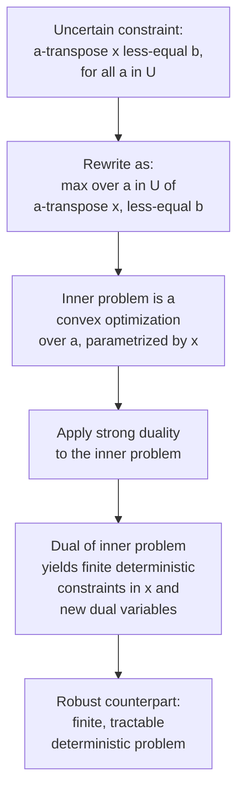
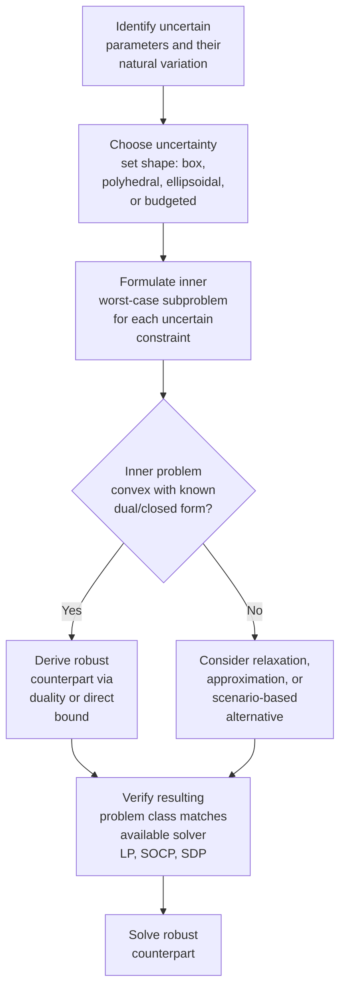

## Uncertainty Sets and Robust Counterparts

### Overview

The tractability and practical usefulness of any robust optimization formulation hinges entirely on two intertwined choices: how the **uncertainty set** $\mathcal{U}$ is defined, and how the resulting semi-infinite **robust counterpart** — the reformulated deterministic problem guaranteeing feasibility for all $u \in \mathcal{U}$ — can be derived in solvable form. This topic develops the formal derivation machinery connecting specific uncertainty set geometries to their corresponding tractable robust counterparts, extending the general concepts introduced previously with the underlying duality-based derivation technique and a systematic treatment of each major set family.

### The Robust Counterpart Derivation Problem

Given an uncertain linear constraint:

$$a^T x \leq b, \quad a \in \mathcal{U}$$

robust feasibility requires this to hold for every $a \in \mathcal{U}$, which is equivalent to requiring the **worst case** over $\mathcal{U}$ to satisfy the constraint:

$$\max_{a \in \mathcal{U}} \; a^T x \leq b$$

The left-hand side is itself an optimization problem (over $a$, with $x$ fixed as a parameter). The central derivation technique in robust optimization is to replace this inner maximization with its **dual problem**: since the inner maximization is over $a \in \mathcal{U}$ for fixed $x$, and $\mathcal{U}$ is typically a convex set describable by a finite or conic system of inequalities, strong duality (when it holds) converts the semi-infinite constraint "$a^Tx \leq b$ for all $a \in \mathcal{U}$" into a finite set of constraints involving the dual variables of the inner problem — this is precisely what makes the robust counterpart tractable rather than requiring infinitely many constraints to be enumerated directly.

### Box Uncertainty: Derivation via Direct Bound

For box uncertainty $\mathcal{U} = \{a : |a_j - \bar{a}_j| \leq \hat{a}_j, \; \forall j\}$, the inner maximization decomposes coordinate-wise (since the box is a product of independent intervals):

$$\max_{a \in \mathcal{U}} a^T x = \sum_j \max_{a_j \in [\bar{a}_j - \hat{a}_j, \, \bar{a}_j + \hat{a}_j]} a_j x_j = \sum_j \left( \bar{a}_j x_j + \hat{a}_j |x_j| \right)$$

since for fixed sign of $x_j$, the maximizing $a_j$ is always at the boundary of its interval closest to $+\infty \cdot \text{sign}(x_j)$. This gives the robust counterpart directly, without requiring dual variables at all — the decomposability of the box uncertainty set into independent per-coordinate intervals makes this the simplest case to derive, though it comes at the cost of being the most conservative set shape, as previously noted.

### Polyhedral Uncertainty: Derivation via LP Duality

For polyhedral uncertainty $\mathcal{U} = \{a : Da \leq d\}$ (a general system of linear inequalities on $a$), the inner problem is itself a linear program:

$$\max_{a} \; a^T x \quad \text{subject to} \quad Da \leq d$$

Taking the LP dual (with dual variable $y \geq 0$ associated with the constraint $Da \leq d$):

$$\min_{y \geq 0} \; d^T y \quad \text{subject to} \quad D^T y = x$$

By strong LP duality (which holds whenever the primal is feasible and bounded — conditions that should be checked when constructing $\mathcal{U}$), the optimal values of the primal and dual coincide, so the original semi-infinite constraint becomes:

$$\exists \, y \geq 0 \; : \; D^T y = x, \quad d^T y \leq b$$

This introduces new decision variables $y$ (one per row of $D$) but replaces the infinite family of constraints indexed by $a \in \mathcal{U}$ with a **finite** system, fully solvable by any LP solver alongside the original decision variables $x$. This LP-duality-based derivation generalizes the box uncertainty case above (a box is itself a special polyhedron) and is the standard technique for any uncertainty set describable by linear inequalities.

### Ellipsoidal Uncertainty: Derivation via Conic Duality

For ellipsoidal uncertainty $\mathcal{U} = \{a : a = \bar{a} + P\zeta, \; \|\zeta\|_2 \leq \Omega\}$ (where $P$ is a shape matrix and $\Omega$ controls the ellipsoid's size), the inner maximization is:

$$\max_{\|\zeta\|_2 \leq \Omega} \; (\bar{a} + P\zeta)^T x = \bar{a}^T x + \Omega \max_{\|\zeta\|_2 \leq 1} \; (P^T x)^T \zeta = \bar{a}^T x + \Omega \|P^T x\|_2$$

using the fact that the maximum of a linear functional over a unit ball equals the (Euclidean) norm of the functional's coefficient vector — a standard Cauchy-Schwarz-based result, not requiring a separate dual-variable introduction in the same way as the LP case. The robust counterpart becomes:

$$\bar{a}^T x + \Omega \, \|P^T x\|_2 \leq b$$

This is a **second-order cone constraint** (linear term plus a bounded Euclidean-norm term) rather than a linear one — the resulting robust counterpart requires a second-order cone programming (SOCP) solver rather than a plain LP solver, reflecting the added modeling richness of capturing correlated parameter deviations at the cost of a more demanding problem class.

<svg xmlns="http://www.w3.org/2000/svg" viewBox="0 0 640 400">
<text x="320" y="26" text-anchor="middle" font-size="17" font-weight="bold" fill="#1a1a1a">Derivation Path by Uncertainty Set Type (svg_diagram)</text>
<rect x="40" y="60" width="160" height="60" rx="6" fill="#fee2e2" stroke="#dc2626" stroke-width="1.5" />
<text x="55" y="85" font-size="12" fill="#7f1d1d" font-weight="bold">Box uncertainty</text>
<text x="55" y="102" font-size="10" fill="#7f1d1d">coordinate-wise max</text>
<rect x="240" y="60" width="160" height="60" rx="6" fill="#dbeafe" stroke="#2563eb" stroke-width="1.5" />
<text x="255" y="85" font-size="12" fill="#1e3a8a" font-weight="bold">Polyhedral uncertainty</text>
<text x="255" y="102" font-size="10" fill="#1e3a8a">LP strong duality</text>
<rect x="440" y="60" width="160" height="60" rx="6" fill="#dcfce7" stroke="#16a34a" stroke-width="1.5" />
<text x="455" y="85" font-size="12" fill="#14532d" font-weight="bold">Ellipsoidal uncertainty</text>
<text x="455" y="102" font-size="10" fill="#14532d">Cauchy-Schwarz / norm bound</text>
<line x1="120" y1="120" x2="120" y2="180" stroke="#333" stroke-width="1.5" />
<line x1="320" y1="120" x2="320" y2="180" stroke="#333" stroke-width="1.5" />
<line x1="520" y1="120" x2="520" y2="180" stroke="#333" stroke-width="1.5" />
<rect x="40" y="180" width="160" height="55" rx="6" fill="#fef9c3" stroke="#b45309" stroke-width="1.5" />
<text x="55" y="205" font-size="11" fill="#78350f">No dual vars needed</text>
<text x="55" y="220" font-size="11" fill="#78350f">Linear robust constraint</text>
<rect x="240" y="180" width="160" height="55" rx="6" fill="#fef9c3" stroke="#b45309" stroke-width="1.5" />
<text x="255" y="205" font-size="11" fill="#78350f">New dual vars y</text>
<text x="255" y="220" font-size="11" fill="#78350f">Linear (LP-representable)</text>
<rect x="440" y="180" width="160" height="55" rx="6" fill="#fef9c3" stroke="#b45309" stroke-width="1.5" />
<text x="455" y="205" font-size="11" fill="#78350f">No dual vars needed</text>
<text x="455" y="220" font-size="11" fill="#78350f">Second-order cone constraint</text>

<text x="60" y="280" font-size="12" fill="#555">Solver required:</text>

<text x="60" y="298" font-size="11" fill="#333">Box / Polyhedral → LP solver</text>

<text x="60" y="314" font-size="11" fill="#333">Ellipsoidal → SOCP solver</text>

</svg>

### Budgeted (Bertsimas-Sim) Uncertainty: Derivation Detail

Recall the budgeted uncertainty set from the general formulation: $a_j = \bar{a}_j + \hat{a}_j z_j$, $z_j \in [-1,1]$, $\sum_j |z_j| \leq \Gamma$. The inner maximization:

$$\max_{a \in \mathcal{U}(\Gamma)} a^T x = \bar{a}^T x + \max_{\|z\|_\infty \leq 1, \, \|z\|_1 \leq \Gamma} \sum_j \hat{a}_j x_j z_j$$

Because $\Gamma$ is generally not an integer and the inner problem mixes an $\ell_\infty$ box constraint with an $\ell_1$ budget constraint, the standard derivation (Bertsimas and Sim's original approach) solves this via combinatorial reasoning rather than a direct duality shortcut: the worst case allocates $z_j = \pm 1$ (full deviation) to the $\lfloor \Gamma \rfloor$ coordinates with the largest $|\hat{a}_j x_j|$ values, and a fractional deviation $(\Gamma - \lfloor \Gamma \rfloor)$ to the next-largest coordinate. This yields a robust counterpart expressible as a compact LP via an auxiliary reformulation (introducing per-constraint auxiliary variables representing the "protection function"), preserving LP tractability despite the more intricate uncertainty set structure. [Inference — the precise auxiliary-variable LP reformulation of the Bertsimas-Sim protection function involves several equivalent formulations in the literature; the description here captures the combinatorial worst-case structure without reproducing a specific published derivation verbatim.]

### Worked Example: Deriving a Robust Counterpart

**Example**

Consider the single robust constraint $a_1 x_1 + a_2 x_2 \leq 20$ under ellipsoidal uncertainty centered at $\bar{a} = (3, 4)$ with $P = I$ (identity, i.e., independent equal-scale deviations) and $\Omega = 2$:

$$\bar{a}^T x + \Omega \|P^T x\|_2 \leq 20 \implies 3x_1 + 4x_2 + 2\sqrt{x_1^2 + x_2^2} \leq 20$$

For a candidate solution $x = (2, 2)$: nominal term $= 3(2)+4(2) = 14$; norm term $= 2\sqrt{4+4} = 2\sqrt{8} \approx 5.657$; total $\approx 19.657 \leq 20$ — feasible, but only barely, illustrating how the extra norm penalty term consumes constraint budget that the nominal formulation alone would not have charged. Compare to the nominal-only check (ignoring uncertainty): $3(2)+4(2)=14 \leq 20$, which appears comfortably feasible under the nominal estimate alone but is nearly binding once the ellipsoidal protection term is included — a concrete illustration of the price of robustness manifesting directly within the constraint structure itself, not just in the objective.

### Comparison Table: Uncertainty Sets, Derivation Method, and Resulting Problem Class

| Uncertainty Set | Inner Problem Type | Derivation Technique | Robust Counterpart Class | Conservatism (relative) |
| --- | --- | --- | --- | --- |
| Box | Separable per-coordinate max | Direct bound (no duality needed) | Linear (LP) | Highest |
| Polyhedral | Linear program | LP strong duality | Linear (LP) | Tunable via $D, d$ design |
| Budgeted (Bertsimas-Sim) | Mixed $\ell_\infty$/$\ell_1$ combinatorial | Combinatorial worst-case + auxiliary LP reformulation | Linear (LP) | Tunable via $\Gamma$ |
| Ellipsoidal | Norm-ball optimization | Cauchy-Schwarz / conic duality | Second-order cone (SOCP) | Tunable via $\Omega$, accounts for correlation |

### General Principle: When Is a Robust Counterpart Tractable?

The unifying pattern across all these derivations is that **convex uncertainty sets describable by a tractable conic representation** (linear inequalities for LP-representable sets, second-order cone constraints for ellipsoids, semidefinite constraints for more general spectrahedral sets) yield robust counterparts within the **same or one level higher** conic complexity class as the original problem, via conic duality applied to the inner worst-case subproblem. This is why uncertainty set *design* is not merely a modeling preference but a decision with direct computational consequences: choosing an uncertainty set outside this well-behaved conic family (e.g., an arbitrary non-convex or combinatorially defined set without special structure) can render the robust counterpart intractable, requiring approximation, relaxation, or scenario-based methods instead of an exact reformulation.

### Practical Derivation Workflow

### Key Points

- The robust counterpart derivation converts a semi-infinite "for all $a \in \mathcal{U}$" constraint into a finite deterministic one, typically via **duality applied to the inner worst-case subproblem**.
- **Box uncertainty** requires no dual variables (direct coordinate-wise bound); **polyhedral uncertainty** uses standard LP strong duality; **ellipsoidal uncertainty** uses a Cauchy-Schwarz-based norm bound yielding a second-order cone constraint; **budgeted uncertainty** uses combinatorial worst-case reasoning with an auxiliary LP reformulation.
- The resulting robust counterpart's problem class (LP, SOCP, SDP) is determined by the uncertainty set's conic representability — well-behaved convex sets keep the counterpart in a tractable, solvable class.
- Ellipsoidal uncertainty captures correlated parameter deviations more realistically than box uncertainty but requires a more demanding solver (SOCP vs. LP).
- Uncertainty set design is simultaneously a **statistical/domain-knowledge decision** (how much and what kind of variation is genuinely plausible) and a **computational decision** (what problem class results).

### Related Topics

- Distributionally robust optimization and ambiguity sets over probability distributions
- Semidefinite-representable uncertainty sets and SDP-based robust counterparts
- Adjustable (two-stage) robust optimization with recourse variables
- Bertsimas-Sim budgeted uncertainty: full protection-function LP reformulation
- Robust counterpart derivation for nonlinear and conic (not just linear) nominal problems
- Comparing robust optimization solutions against stochastic programming and chance-constrained alternatives empirically