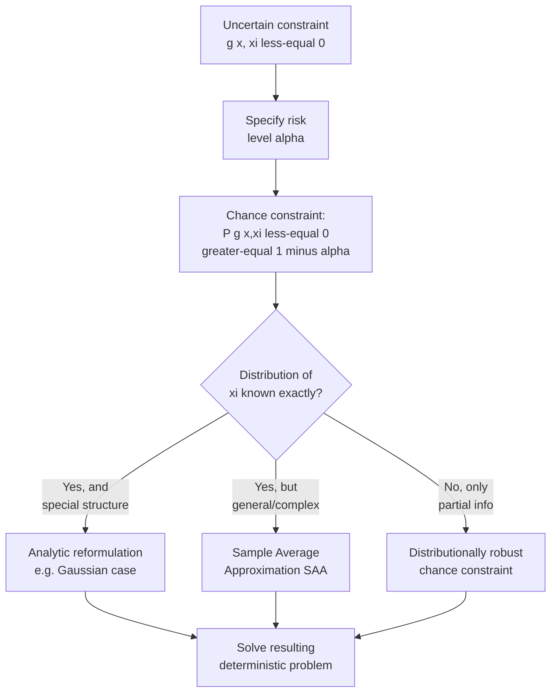

## Chance-Constrained Programming

### Overview

Chance-constrained programming (CCP) offers a probabilistic alternative to the deterministic worst-case protection of robust optimization: rather than requiring a constraint to hold for *every* realization within an uncertainty set, CCP requires the constraint to hold with at least a specified **probability** (confidence level), allowing controlled, quantified constraint violation in exchange for improved objective performance. This positions CCP as occupying a middle ground between the fully deterministic nominal problem (no protection at all) and fully deterministic robust optimization (protection against every possible realization), directly requiring a probability distribution over the uncertain parameters — a requirement robust optimization was specifically designed to avoid — making distributional knowledge or estimation the central prerequisite and practical challenge of the CCP approach.

### General Formulation

Given an uncertain constraint $g(x, \xi) \leq 0$ where $\xi$ is a random vector with a known (or estimated) probability distribution, the **chance constraint** requires:

$$\mathbb{P}\left[ g(x, \xi) \leq 0 \right] \geq 1 - \alpha$$

where $\alpha \in (0,1)$ is the **risk level** (allowed violation probability), so $1-\alpha$ is the **confidence level** — a common choice is $\alpha = 0.05$ (95% confidence). The full chance-constrained problem:

$$\min_{x \in \Omega} \; c(x) \quad \text{subject to} \quad \mathbb{P}\left[ g(x, \xi) \leq 0 \right] \geq 1-\alpha$$

The central technical difficulty of CCP is that the feasible region defined by a chance constraint is **generally non-convex**, even when $g$ is a simple linear function of $\xi$ and the underlying distribution is well-behaved — convexity of the chance-constrained feasible set is not automatic and must be established case by case (it does hold under specific conditions, discussed below), making CCP considerably more delicate to solve than either the nominal or robust formulations in the general case.

### Individual vs. Joint Chance Constraints

- **Individual (separate) chance constraints**: each uncertain constraint $g_i(x,\xi) \leq 0$ is required to hold with probability $1-\alpha_i$ **independently** of the others:

$$\mathbb{P}[g_i(x,\xi) \leq 0] \geq 1-\alpha_i, \quad i=1,\dots,m$$

This is generally easier to reformulate (often reducible to per-constraint analytic bounds, as in the Gaussian case below) but provides no guarantee on the probability that **all** constraints hold simultaneously.

- **Joint chance constraints**: all $m$ constraints must hold together with probability $1-\alpha$:

$$\mathbb{P}\left[ g_i(x,\xi) \leq 0, \; \forall i=1,\dots,m \right] \geq 1-\alpha$$

This more accurately captures overall system reliability but is substantially harder to reformulate directly, since the joint probability of an intersection of events generally has no simple closed form even when each individual event does. A standard fallback is the **Bonferroni approximation**, which allocates a per-constraint risk budget $\alpha_i$ (e.g., $\alpha_i = \alpha/m$, split equally) such that satisfying each individual chance constraint at level $\alpha_i$ guarantees the joint constraint holds at level $\alpha$ via the union bound — this is a conservative (sufficient but not necessary) approximation, since the union bound does not exploit any dependence structure between the constraints and can be loose when constraints are positively correlated. [Inference — the tightness of the Bonferroni approximation depends on the actual dependence structure among the $g_i$; it is a standard and widely used conservative bound rather than an exact reformulation.]

### Analytic Reformulation: The Gaussian Case

When $\xi$ is normally distributed and $g$ is linear in $\xi$, individual chance constraints admit an exact, tractable closed-form reformulation — this is the most important special case in practice, since it converts the probabilistic constraint directly into a deterministic second-order cone constraint.

Consider $\mathbb{P}[a^T x \leq b]$ where $a = \bar{a} + \Sigma^{1/2} \zeta$, $\zeta \sim \mathcal{N}(0, I)$ (i.e., $a \sim \mathcal{N}(\bar{a}, \Sigma)$ for covariance matrix $\Sigma$). Then $a^Tx \sim \mathcal{N}(\bar{a}^Tx, \, x^T\Sigma x)$, a univariate normal, and:

$$\mathbb{P}[a^Tx \leq b] \geq 1-\alpha \iff \bar{a}^Tx + \Phi^{-1}(1-\alpha) \sqrt{x^T \Sigma x} \leq b$$

where $\Phi^{-1}$ is the inverse standard normal CDF (quantile function). This is derived by standardizing: $\mathbb{P}\left[\zeta' \leq \frac{b - \bar{a}^Tx}{\sqrt{x^T\Sigma x}}\right] \geq 1-\alpha$ for a standard normal $\zeta'$, which holds exactly when the standardized threshold exceeds $\Phi^{-1}(1-\alpha)$.

**Direct connection to robust optimization**: this reformulated constraint is *structurally identical* to the ellipsoidal robust counterpart derived previously — $\bar{a}^Tx + \Omega\|\Sigma^{1/2}x\|_2 \leq b$ — with the ellipsoid size parameter playing the exact role of $\Omega = \Phi^{-1}(1-\alpha)$. This is not a coincidence: it demonstrates that ellipsoidal robust optimization can be interpreted as an *exact* individual chance-constraint reformulation under Gaussian uncertainty, with the ellipsoid radius directly calibrated to a specific confidence level — a valuable bridge connecting the two frameworks rather than treating them as entirely separate paradigms.

### Worked Example: Gaussian Chance Constraint

**Example**

Reusing the earlier capacity-constraint structure: minimize $x_1 + x_2$ subject to $a_1 x_1 + a_2 x_2 \geq 100$ holding with 95% probability, where $(a_1, a_2)$ are jointly Gaussian with mean $\bar{a} = (4, 5)$ and (for simplicity) independent variances $\sigma_1^2 = 0.25$, $\sigma_2^2 = 0.36$ (so standard deviations $0.5$ and $0.6$).

Rewriting as a $\leq$-form chance constraint: $\mathbb{P}[-a_1x_1 - a_2x_2 \leq -100] \geq 0.95$. With $\Sigma = \text{diag}(0.25, 0.36)$ and $\Phi^{-1}(0.95) \approx 1.645$:

$$-\bar{a}^Tx + 1.645\sqrt{x^T\Sigma x} \leq -100 \iff \bar{a}^Tx - 1.645\sqrt{0.25x_1^2 + 0.36x_2^2} \geq 100$$

$$4x_1 + 5x_2 - 1.645\sqrt{0.25x_1^2+0.36x_2^2} \geq 100$$

Testing $x_2 = 0$: $4x_1 - 1.645(0.5)x_1 \geq 100 \Rightarrow x_1(4-0.8225) \geq 100 \Rightarrow x_1 \geq 100/3.1775 \approx 31.5, total cost $\approx 31.5
 — notably less conservative than the fully worst-case box-uncertainty robust solution computed earlier ($\approx 33.3$), since the chance constraint only guards against the 95th percentile adverse realization rather than the absolute worst case within a bounded interval, directly illustrating the "controlled risk in exchange for improved objective" trade-off central to CCP.

### Sample Average Approximation (SAA)

When $\xi$'s distribution is known only through historical data or simulation (rather than an analytic form like Gaussian), or when $g$ is nonlinear in $\xi$ making an analytic reformulation unavailable, **Sample Average Approximation** replaces the exact probability with an empirical estimate from $N$ i.i.d. samples $\xi^{(1)}, \dots, \xi^{(N)}$:

$$\frac{1}{N} \sum_{s=1}^{N} \mathbb{1}\left[g(x,\xi^{(s)}) \leq 0\right] \geq 1-\alpha$$

This indicator-sum constraint is itself non-convex and computationally difficult (it is a mixed-integer-like structure due to the indicator function), so practical SAA implementations often introduce binary variables per scenario and solve as a mixed-integer program, or apply a convex approximation to the indicator (e.g., replacing $\mathbb{1}[\cdot]$ with a convex surrogate bound, discussed next). The number of samples $N$ required for the empirical estimate to reliably approximate the true probability with acceptable statistical error grows with problem complexity and desired accuracy, and this sample-complexity relationship is an active and problem-dependent area rather than governed by a single universal formula. [Inference — specific sample-size guarantee bounds for SAA-based chance constraints depend on the particular concentration inequality and convexity assumptions used in the analysis, and vary across the literature.]

### Convex Approximations of Chance Constraints

Because exact chance constraints are generally non-convex (outside special cases like the Gaussian individual-constraint result), several **convex, conservative approximations** are used to obtain tractable surrogate problems that guarantee the true chance constraint is satisfied (sufficient but not necessary conditions):

- **Bonferroni approximation** (for joint constraints): as described above, allocating risk budget across individual constraints via the union bound.
- **Chebyshev/Cantelli-based bounds**: using only the mean and variance of $g(x,\xi)$ (without requiring full distributional knowledge), the one-sided Chebyshev (Cantelli) inequality gives a conservative convex constraint of the form $\bar{g}(x) + \kappa(\alpha)\sigma_g(x) \leq 0$ for an appropriate constant $\kappa(\alpha)$ depending on $\alpha$ — structurally similar in form to the Gaussian reformulation but valid under much weaker distributional assumptions (distributionally robust in spirit), at the cost of requiring a larger $\kappa(\alpha)$ than the Gaussian-specific $\Phi^{-1}(1-\alpha)$ for the same risk level, since it must hold for the worst case over all distributions sharing the given mean and variance.
- **Convex conditional value-at-risk (CVaR) surrogate**: replacing the chance constraint with a constraint on the Conditional Value-at-Risk of $g(x,\xi)$, which is convex in $x$ whenever $g$ is convex in $x$, and provides a conservative approximation to the chance constraint (a CVaR-based bound at an adjusted confidence level implies the original chance constraint), widely used because it integrates naturally with convex optimization solvers and has favorable properties as a coherent risk measure.

<svg xmlns="http://www.w3.org/2000/svg" viewBox="0 0 640 400">
<text x="320" y="26" text-anchor="middle" font-size="17" font-weight="bold" fill="#1a1a1a">Chance Constraint Approximation Landscape (svg_diagram)</text>
<line x1="70" y1="350" x2="70" y2="60" stroke="#333" stroke-width="2" />
<line x1="70" y1="350" x2="580" y2="350" stroke="#333" stroke-width="2" />
<text x="200" y="375" font-size="12" fill="#333">Distributional knowledge required →</text>
<text x="20" y="70" font-size="12" fill="#333">Conservatism</text>
<circle cx="150" cy="300" r="8" fill="#2563eb" />
<text x="100" y="330" font-size="11" fill="#2563eb" font-weight="bold">Exact Gaussian</text>
<text x="95" y="345" font-size="10" fill="#555">reformulation (least conservative)</text>
<circle cx="300" cy="220" r="8" fill="#16a34a" />
<text x="250" y="200" font-size="11" fill="#16a34a" font-weight="bold">SAA</text>
<text x="210" y="215" font-size="10" fill="#555">(data-driven, sample-size dependent)</text>
<circle cx="420" cy="150" r="8" fill="#b45309" />
<text x="380" y="130" font-size="11" fill="#b45309" font-weight="bold">CVaR surrogate</text>
<circle cx="520" cy="90" r="8" fill="#dc2626" />
<text x="440" y="75" font-size="11" fill="#dc2626" font-weight="bold">Chebyshev/Cantelli</text>
<text x="420" y="105" font-size="10" fill="#555">(mean/variance only, most conservative)</text>
</svg>

### Comparison: Chance-Constrained vs. Robust Optimization vs. Nominal

| Property | Nominal | Robust Optimization | Chance-Constrained |
| --- | --- | --- | --- |
| Distributional assumption | None (point estimate used) | None (only a set $\mathcal{U}$) | Required (full, partial, or empirical) |
| Constraint guarantee | None under uncertainty | Deterministic, holds for all $u \in \mathcal{U}$ | Probabilistic, holds with probability $\geq 1-\alpha$ |
| Typical conservatism | None (most aggressive) | Highest (worst case) | Tunable via $\alpha$, generally less conservative than full robust protection |
| Convexity of feasible region | N/A (deterministic) | Generally convex under standard set choices | Generally non-convex; requires special structure or convex approximation |
| Computational structure | Direct solve | Tractable reformulation (LP/SOCP/SDP) | Case-dependent: analytic (Gaussian), SAA (mixed-integer), or convex surrogate |

### Practical Considerations in Formulation Choice

- **Distributional confidence**: if the underlying distribution of $\xi$ is well-estimated (e.g., large historical dataset, strong physical justification for normality), CCP with an analytic or SAA reformulation is well-justified; if distributional knowledge is weak or the consequences of the rare violation event are severe, robust optimization's distribution-free worst-case guarantee may be preferable despite its added conservatism.
- **Individual vs. joint reliability requirements**: system-level reliability requirements (e.g., "the overall plan succeeds with 95% probability") call for joint chance constraints (or the Bonferroni approximation thereof), while independent per-resource requirements are naturally individual chance constraints.
- **Risk level selection ($\alpha$)**: smaller $\alpha$ (higher confidence) pushes the CCP solution toward the fully robust solution as $\alpha \to 0$ under an unbounded-support distribution (since guaranteeing near-certain feasibility approaches guaranteeing feasibility for essentially all plausible realizations); larger $\alpha$ moves toward the nominal solution. This makes $\alpha$ a direct, interpretable dial analogous to the uncertainty set size or Bertsimas-Sim budget $\Gamma$ in robust optimization.
- **Convexity verification**: before committing to an exact CCP formulation, it is important to confirm whether the specific distributional and structural assumptions (e.g., Gaussian linear case, or log-concave distributions more generally, which also admit favorable convexity results for certain constraint forms) actually deliver a convex feasible region — absent such structure, a convex surrogate (Bonferroni, Chebyshev, CVaR) or a mixed-integer SAA formulation is generally required instead.

### Key Points

- Chance-constrained programming requires a constraint to hold with at least a specified probability $1-\alpha$, in contrast to robust optimization's deterministic all-realizations guarantee — this directly requires distributional knowledge about the uncertainty.
- **Individual** chance constraints are generally more tractable than **joint** ones; the Bonferroni (union bound) approximation is a standard conservative fallback for joint constraints.
- The **Gaussian linear case** admits an exact, tractable second-order-cone reformulation that is structurally identical to ellipsoidal robust optimization — with $\Phi^{-1}(1-\alpha)$ playing the role of the ellipsoid radius $\Omega$, directly bridging the two frameworks.
- When distributions are known only empirically, **Sample Average Approximation** provides a data-driven but generally non-convex (often mixed-integer) reformulation.
- Convex conservative surrogates (Bonferroni, Chebyshev/Cantelli, CVaR) trade some optimality for tractability when exact analytic reformulation is unavailable.

### Related Topics

- Conditional Value-at-Risk (CVaR) as both a risk measure and a convex chance-constraint surrogate
- Distributionally robust chance constraints (ambiguity sets combined with probabilistic guarantees)
- Log-concave distributions and their role in guaranteeing convexity of chance-constrained feasible regions
- Scenario reduction techniques for tractable Sample Average Approximation
- Two-stage and multi-stage stochastic programming with recourse
- Applications in reliability engineering, power system planning, and financial portfolio risk management