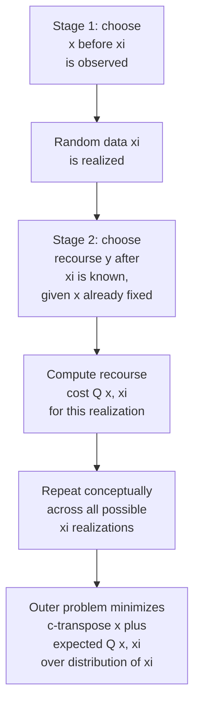
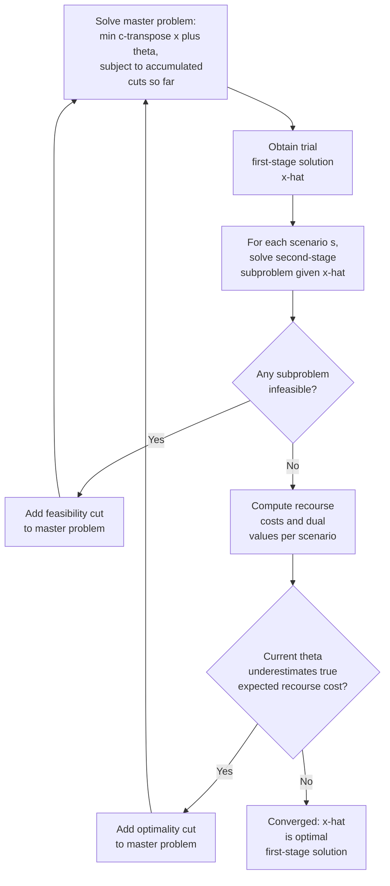

## Two-Stage Stochastic Programming

### Overview

Two-stage stochastic programming addresses a fundamentally different uncertainty structure from robust optimization or chance-constrained programming: decisions are split across **two temporal stages** relative to when uncertainty resolves. First-stage ("here-and-now") decisions must be committed to *before* the random data is observed; second-stage ("recourse" or "wait-and-see") decisions are then chosen *after* uncertainty is revealed, allowing the model to adapt and compensate for whatever realization actually occurred. This explicit two-stage timing — rather than a single static worst-case or probabilistic guarantee — is the defining structural feature of the framework, and it makes two-stage stochastic programming particularly well-suited to problems with a natural sequential decision structure: capacity planning followed by operational response, procurement followed by demand fulfillment, or infrastructure investment followed by disaster response.

### General Formulation

$$\min_{x \in X} \; c^T x + \mathbb{E}_{\xi}\left[ Q(x, \xi) \right]$$

where $x$ is the first-stage decision vector, $c^Tx$ is the first-stage (deterministic, known) cost, and $Q(x,\xi)$ is the **recourse function** — the optimal value of the second-stage problem given first-stage decision $x$ and realized random data $\xi$:

$$Q(x,\xi) = \min_{y \geq 0} \; q(\xi)^T y \quad \text{subject to} \quad W(\xi) y = h(\xi) - T(\xi) x$$

Here $y$ is the second-stage (recourse) decision, $W$ is the **recourse matrix**, $T$ is the **technology matrix** linking first-stage decisions to second-stage constraints, and $h$ is the right-hand side — all potentially dependent on the realized $\xi$. The outer problem minimizes first-stage cost plus the **expected** recourse cost across the distribution of $\xi$, making this fundamentally an expectation-optimizing framework, in contrast to robust optimization's worst-case framing and CCP's probability-threshold framing.

### Relatively Complete Recourse and Feasibility

A key structural property is **relatively complete recourse**: for every first-stage decision $x \in X$ and every possible realization $\xi$, the second-stage problem is feasible (some $y \geq 0$ satisfies the recourse constraints). Without this property, certain first-stage decisions could lead to second-stage infeasibility for some realizations, requiring either an explicit feasibility-guaranteeing reformulation (e.g., adding first-stage constraints that guarantee recourse feasibility for all $\xi$) or a **penalized (simple) recourse** formulation where infeasibility is instead modeled as an expensive but always-feasible penalty (e.g., emergency procurement at a high per-unit cost rather than a hard constraint violation). Relatively complete recourse is often assumed or engineered into the model structure precisely because verifying it can itself be nontrivial for complex constraint systems. [Inference — whether relatively complete recourse holds is problem-specific and generally must be verified or engineered rather than assumed automatically true.]

### The Extensive Form and Scenario-Based Reformulation

When $\xi$ has (or is approximated by) a **finite** number of possible realizations — **scenarios** $\xi^1, \dots, \xi^S$, each with probability $p^s$ — the expectation collapses into a finite weighted sum, and the entire two-stage problem can be written as a single large-scale deterministic optimization problem called the **extensive form** (or deterministic equivalent):

$$\min_{x, y^1, \dots, y^S} \; c^T x + \sum_{s=1}^{S} p^s \, q(\xi^s)^T y^s$$

$$\text{subject to:} \quad x \in X, \qquad W(\xi^s) y^s = h(\xi^s) - T(\xi^s) x, \quad y^s \geq 0, \quad s=1,\dots,S$$

Note that $x$ is shared across all scenarios (a single first-stage decision made once, before any scenario is known), while each $y^s$ is a distinct second-stage decision **specific to scenario $s$** — this is the precise mathematical encoding of the "here-and-now vs. wait-and-see" distinction, since $x$ must simultaneously satisfy the requirements implied by every scenario's eventual recourse, while each $y^s$ only needs to handle its own scenario.

<svg xmlns="http://www.w3.org/2000/svg" viewBox="0 0 640 420">
<text x="320" y="26" text-anchor="middle" font-size="17" font-weight="bold" fill="#1a1a1a">Two-Stage Scenario Tree Structure (svg_diagram)</text>
<circle cx="100" cy="200" r="14" fill="#2563eb" />
<text x="60" y="240" font-size="12" fill="#2563eb" font-weight="bold">Stage 1: x</text>
<text x="55" y="255" font-size="10" fill="#555">(single decision,</text>
<text x="55" y="268" font-size="10" fill="#555">before xi known)</text>
<line x1="114" y1="200" x2="280" y2="80" stroke="#666" stroke-width="1.5" />
<line x1="114" y1="200" x2="280" y2="160" stroke="#666" stroke-width="1.5" />
<line x1="114" y1="200" x2="280" y2="240" stroke="#666" stroke-width="1.5" />
<line x1="114" y1="200" x2="280" y2="320" stroke="#666" stroke-width="1.5" />
<circle cx="290" cy="80" r="10" fill="#16a34a" />
<circle cx="290" cy="160" r="10" fill="#16a34a" />
<circle cx="290" cy="240" r="10" fill="#16a34a" />
<circle cx="290" cy="320" r="10" fill="#16a34a" />

<text x="310" y="84" font-size="11" fill="`#16a34a`">ξ¹, p¹ → y¹</text>

<text x="310" y="164" font-size="11" fill="`#16a34a`">ξ², p² → y²</text>

<text x="310" y="244" font-size="11" fill="`#16a34a`">ξ³, p³ → y³</text>

<text x="310" y="324" font-size="11" fill="`#16a34a`">ξ⁴, p⁴ → y⁴</text>

<text x="440" y="200" font-size="12" fill="#333" font-weight="bold">Stage 2: recourse</text>

<text x="440" y="216" font-size="10" fill="#555">(one decision per</text>

<text x="440" y="230" font-size="10" fill="#555">scenario, after xi known)</text>

<text x="60" y="370" font-size="12" fill="#555">x is shared across all scenario branches;</text>

<text x="60" y="386" font-size="12" fill="#555">each y^s is optimized independently given its own realized ξ^s.</text>

</svg>

### Worked Example: Two-Stage Capacity Planning

**Example**

A planning office (in the spirit of municipal or organizational capacity investment) must decide first-stage server/processing capacity $x$ before observing next month's actual document-processing demand $\xi$, which takes one of two scenarios: high demand ($\xi = 150$, probability $0.4$) or low demand ($\xi = 80, probability $0.6
). Capacity costs $c=10$ per unit installed. If installed capacity falls short of realized demand, additional emergency capacity can be rented at $q=25$ per unit (second-stage recourse); excess installed capacity beyond demand incurs no direct penalty in this simplified example.

$$\min_{x \geq 0} \; 10x + 0.4 \cdot \max(0, 150-x) \cdot 25 + 0.6 \cdot \max(0, 80-x) \cdot 25$$

**Testing $x=80$**: first-stage cost $=800$; scenario 1 shortfall $=150-80=70$, recourse cost $=70 \times 25 \times 0.4 = 700$; scenario 2 shortfall $=0$ (exactly met), recourse cost $=0$. Total $=800+700=1500$.

**Testing $x=150$**: first-stage cost $=1500$; scenario 1 shortfall $=0$; scenario 2 shortfall $=0$ (over-covered, no penalty assumed for excess in this simplified example). Total $=1500$.

**Testing $x=100$**: first-stage cost $=1000$; scenario 1 shortfall $=50$, recourse $=50\times25\times0.4=500$; scenario 2 shortfall $=0$. Total $=1500$.

In this particular simplified linear-cost structure, several candidate first-stage capacities yield the same expected total cost — the flat region reflects the piecewise-linear nature of the recourse cost combined with the specific numeric coincidence chosen for this illustration; a more granular search (or a formal LP solve of the extensive form) would identify the exact optimal $x^*$ and confirm whether ties exist or the flat region is an artifact of these particular parameter choices. [Inference — the observed tie across tested capacity levels is a property of this specific illustrative example's numbers, not a general feature of two-stage recourse cost structures.]

### The Value of the Stochastic Solution (VSS) and Expected Value of Perfect Information (EVPI)

Two standard diagnostic quantities assess how much the stochastic (two-stage) framing actually matters relative to simpler alternatives:

- **Expected Value of Perfect Information (EVPI)**: the difference between the expected cost of the "wait-and-see" solution (solving the problem optimally for each scenario individually, as if $\xi$ were known in advance for each, then averaging) and the expected cost of the two-stage stochastic solution:

$$EVPI = \mathbb{E}_\xi[\min_x (c^Tx + Q(x,\xi))] \;-\; \min_x \mathbb{E}_\xi[c^Tx + Q(x,\xi)]$$

EVPI quantifies the maximum amount a decision-maker should be willing to pay for perfect advance knowledge of $\xi$ — a large EVPI indicates substantial value in information-gathering or forecasting improvements.

- **Value of the Stochastic Solution (VSS)**: the difference between the expected cost of using the **expected-value (mean-scenario) solution** — solving the problem once using $\bar\xi = \mathbb{E}[\xi]$ as if it were certain, then evaluating that fixed $x$'s expected recourse cost across the true distribution — and the expected cost of the true two-stage stochastic solution:

$$VSS = \mathbb{E}_\xi[c^Tx^{EV} + Q(x^{EV},\xi)] \;-\; \min_x \mathbb{E}_\xi[c^Tx + Q(x,\xi)]$$

where $x^{EV}$ is the first-stage decision obtained by solving the deterministic mean-value problem. VSS quantifies the cost of ignoring uncertainty altogether (naively planning around the average scenario) relative to properly accounting for the full distribution — a large VSS indicates that stochastic programming provides substantial value over a simpler deterministic mean-based approach, while a small VSS suggests the mean-value approximation may be an adequate simplification for that particular problem.

### Scenario Generation and Reduction

Because the extensive form's size grows directly with the number of scenarios $S$ (each scenario contributing its own full second-stage variable block $y^s$), scenario **generation** and **reduction** are critical practical concerns:

- **Scenario generation**: converting a continuous or complex underlying distribution into a finite, tractable scenario set — via Monte Carlo sampling, moment-matching methods (constructing scenarios that reproduce specified low-order moments of the true distribution), or structured discretization for problems with natural scenario interpretations (e.g., discrete demand levels).
- **Scenario reduction**: given an initially large scenario set (perhaps from historical data or a fine discretization), systematically selecting a smaller representative subset (with adjusted probabilities) that preserves key distributional properties, reducing the extensive form's size while controlling the resulting approximation error. Common approaches minimize a probability-metric distance (e.g., Wasserstein-type distance) between the original and reduced scenario distributions. [Inference — the specific reduction algorithm and distance metric used vary considerably across implementations and software packages; the general principle of distance-minimizing subset selection is standard, but exact methodology is not universal.]

### Decomposition: The L-Shaped Method (Benders Decomposition)

For large scenario sets, solving the extensive form directly as one monolithic LP/MIP becomes computationally prohibitive due to its size. The **L-shaped method** (an application of Benders decomposition to two-stage stochastic programs) exploits the extensive form's block-diagonal structure — the second-stage constraints for different scenarios share no variables except $x$ — by decomposing the problem into a **master problem** (over $x$ alone) and per-scenario **subproblems** (over each $y^s$, given a fixed trial $x$), iterating between them:

Each iteration adds a linear **cut** (feasibility cut if some scenario's subproblem was infeasible for the trial $x$, optimality cut if the master's estimate $\theta$ of expected recourse cost was too optimistic) to progressively tighten the master problem's approximation of the true expected recourse function, converging to the optimal extensive-form solution without ever needing to hold the full extensive form in memory simultaneously — this scalability advantage is the primary practical motivation for using L-shaped decomposition over direct extensive-form solution for large scenario counts.

### Comparison: Two-Stage Stochastic Programming vs. Robust Optimization vs. CCP

| Property | Robust Optimization | Chance-Constrained | Two-Stage Stochastic |
| --- | --- | --- | --- |
| Decision timing | Single stage, before uncertainty | Single stage, before uncertainty | Two stages: before and after |
| Objective structure | Worst-case (min-max) | Expected/deterministic cost, probabilistic constraint | Expected total cost across stages |
| Adaptivity to realized data | None (fixed decision regardless of outcome) | None (fixed decision regardless of outcome) | Full (recourse adapts to realized $\xi$) |
| Distributional requirement | None (only a set) | Required | Required |
| Typical size driver | Uncertainty set complexity | Constraint/joint structure | Number of scenarios (extensive form size) |
| Natural fit | Hard feasibility guarantees, no distribution trusted | Reliability targets with acceptable risk | Sequential decisions with genuine recourse opportunity |

### Extensions: Multi-Stage Stochastic Programming

The two-stage framework generalizes naturally to **multi-stage** stochastic programming, where decisions and uncertainty realizations alternate across more than two time periods, represented by a full **scenario tree** (branching at each stage rather than a single branch after stage 1). Multi-stage models capture genuinely sequential planning problems (e.g., multi-year infrastructure investment with periodic re-evaluation) more faithfully than a two-stage approximation, but the scenario tree's size grows multiplicatively with the number of stages and branches per stage, making multi-stage models substantially more computationally demanding and often requiring more aggressive scenario reduction or approximate dynamic programming techniques to remain tractable. [Inference — the specific tractability threshold for multi-stage models depends heavily on problem structure, branching factor, and available decomposition techniques; this is a general, widely acknowledged scalability concern rather than a precise universal bound.]

### Key Points

- Two-stage stochastic programming splits decisions into first-stage ("here-and-now," committed before uncertainty) and second-stage ("recourse," chosen after uncertainty resolves), minimizing first-stage cost plus **expected** recourse cost.
- The **extensive form** reformulates a finite-scenario problem as one large deterministic optimization, with a shared first-stage variable $x$ and scenario-specific recourse variables $y^s$.
- **VSS** and **EVPI** are standard diagnostics quantifying the value of properly modeling uncertainty (vs. a mean-value approximation) and the value of perfect information, respectively.
- The **L-shaped method** (Benders decomposition) exploits the extensive form's block structure to solve large-scenario problems without forming the full extensive form directly.
- Unlike robust optimization and CCP, two-stage stochastic programming's defining feature is genuine **adaptivity** — the recourse decision responds to the realized uncertainty, not merely a static guarantee computed in advance.

### Related Topics

- Multi-stage stochastic programming and scenario tree construction
- Progressive hedging algorithm as an alternative decomposition scheme
- Stochastic integer programming and recourse with discrete second-stage variables
- Sample Average Approximation for stochastic programs with continuous distributions
- Distributionally robust two-stage models bridging stochastic and robust paradigms
- Applications: capacity expansion planning, supply chain and inventory management under demand uncertainty, disaster response and humanitarian logistics planning