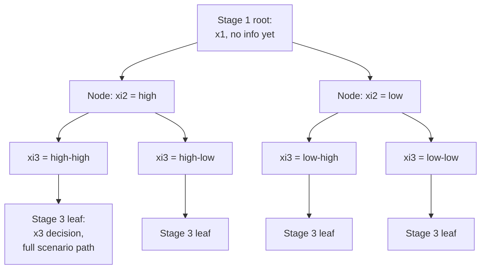
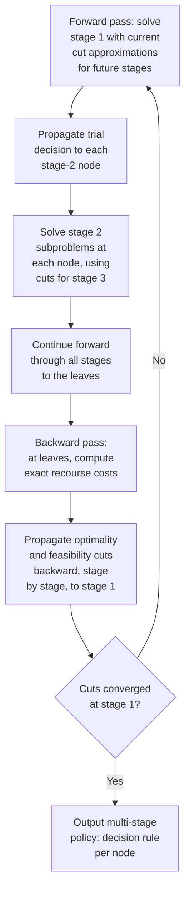

## Multi-Stage Stochastic Programming

### Overview

Multi-stage stochastic programming generalizes the two-stage recourse framework to problems where decisions and uncertainty realizations alternate across **more than two time periods** — a decision is made, new information arrives, another decision is made in light of that information, further information arrives, and so on, across $T$ stages. This structure directly models genuinely sequential planning problems where re-evaluation and adaptation happen repeatedly over time (multi-year capacity expansion, dynamic portfolio rebalancing, sequential resource allocation under evolving demand) rather than the single "decide once, adapt once" structure of the two-stage case. The added realism comes at substantial computational cost: the representation of uncertainty must now capture an entire **evolving stochastic process** rather than a single-period random vector, and the resulting decision structure must respect **non-anticipativity** — a strict requirement that decisions at any stage depend only on information available up to that point, not on future realizations.

### General Formulation

$$\min_{x_1} \; c_1^T x_1 + \mathbb{E}_{\xi_2}\left[ \min_{x_2(\xi_2)} c_2^T x_2 + \mathbb{E}_{\xi_3 \mid \xi_2}\left[ \min_{x_3(\xi_2,\xi_3)} c_3^T x_3 + \dots \right] \right]$$

subject to stage-wise feasibility constraints linking each $x_t$ to the preceding decisions and the currently revealed information. The nested expectation-and-minimization structure is the defining mathematical signature of multi-stage stochastic programming: each inner minimization is itself an optimization problem parametrized by the outer decisions and revealed information, recursively wrapped inside expectations over the yet-unrevealed future stages.

**Non-anticipativity** is the requirement that $x_t$ may only depend on the history of realized random data $(\xi_2, \dots, \xi_t)$ observed *up to and including* stage $t$ — not on $\xi_{t+1}, \dots, \xi_T$, which remain unrevealed at decision time $t$. This is written explicitly above via the notation $x_t(\xi_2,\dots,\xi_t)$, emphasizing that each stage's decision is a **function of the information available so far**, not a fixed vector — decisions become **policies** (mappings from information history to action) rather than single numeric choices, except at stage 1, where no information has yet been revealed and $x_1$ is a fixed first-stage vector exactly as in the two-stage case.

### Scenario Trees

The standard computational representation of the underlying stochastic process is a **scenario tree**: a branching structure where each node represents a specific history of realizations up to some stage, and branches from a node represent the possible next-stage outcomes conditional on that history.

Each **path from root to leaf** in the tree represents one complete scenario — a full realization sequence $(\xi_2, \dots, \xi_T)$ — with an associated probability equal to the product of conditional branch probabilities along that path. Non-anticipativity is encoded structurally by the tree itself: decisions at each node are shared across every scenario passing through that node (since those scenarios are indistinguishable given the information available at that point), and only diverge at branches where the scenarios' histories first differ.

<svg xmlns="http://www.w3.org/2000/svg" viewBox="0 0 640 420">
<text x="320" y="26" text-anchor="middle" font-size="17" font-weight="bold" fill="#1a1a1a">Non-Anticipativity via Shared Tree Nodes (svg_diagram)</text>
<circle cx="80" cy="200" r="12" fill="#2563eb" />
<text x="30" y="230" font-size="11" fill="#2563eb">x1 (root)</text>
<line x1="92" y1="200" x2="250" y2="120" stroke="#666" stroke-width="1.5" />
<line x1="92" y1="200" x2="250" y2="280" stroke="#666" stroke-width="1.5" />
<circle cx="260" cy="120" r="11" fill="#16a34a" />
<circle cx="260" cy="280" r="11" fill="#16a34a" />
<text x="270" y="115" font-size="11" fill="#16a34a">x2(high)</text>
<text x="270" y="285" font-size="11" fill="#16a34a">x2(low)</text>
<line x1="271" y1="120" x2="440" y2="70" stroke="#666" stroke-width="1.5" />
<line x1="271" y1="120" x2="440" y2="150" stroke="#666" stroke-width="1.5" />
<line x1="271" y1="280" x2="440" y2="250" stroke="#666" stroke-width="1.5" />
<line x1="271" y1="280" x2="440" y2="330" stroke="#666" stroke-width="1.5" />
<circle cx="450" cy="70" r="9" fill="#b45309" />
<circle cx="450" cy="150" r="9" fill="#b45309" />
<circle cx="450" cy="250" r="9" fill="#b45309" />
<circle cx="450" cy="330" r="9" fill="#b45309" />
<text x="465" y="74" font-size="10" fill="#b45309">x3(h,h)</text>
<text x="465" y="154" font-size="10" fill="#b45309">x3(h,l)</text>
<text x="465" y="254" font-size="10" fill="#b45309">x3(l,h)</text>
<text x="465" y="334" font-size="10" fill="#b45309">x3(l,l)</text>

<text x="60" y="370" font-size="12" fill="#555">Scenarios sharing a node (e.g. both x3(h,h) and x3(h,l) branches)</text>

<text x="60" y="386" font-size="12" fill="#555">must use the identical x2(high) — decisions cannot "see ahead."</text>

</svg>

### Deterministic Equivalent (Extensive Form)

As in the two-stage case, a finite scenario tree allows the entire multi-stage problem to be written as one large deterministic optimization — the **extensive form** — with a distinct decision variable block for each **node** of the tree (not each full scenario path), reflecting the shared-decision structure that non-anticipativity requires. For a tree with node set $\mathcal{N}$, each non-root node $n$ having parent $a(n)$, probability $p_n$, and local cost $c_n$:

$$\min_{\{x_n\}_{n \in \mathcal{N}}} \; \sum_{n \in \mathcal{N}} p_n \, c_n^T x_n \quad \text{subject to node-specific constraints linking } x_n \text{ to } x_{a(n)}$$

The number of variable blocks equals the number of tree nodes, which — for a tree with branching factor $b$ (number of child branches per node) and $T$ stages — grows as $O(b^{T-1})$: **exponentially in the number of stages**. This exponential growth in scenario tree size as $T$ increases is the central computational challenge distinguishing multi-stage from two-stage stochastic programming, and it is the primary reason multi-stage models require far more careful scenario tree construction, aggressive reduction, and often approximate solution techniques relative to their two-stage counterparts.

### Scenario Tree Construction Trade-offs

Because tree size grows exponentially with stages, practical multi-stage modeling requires deliberate trade-offs in how the tree is built:

- **Branching factor per stage**: fewer branches per stage keep the tree tractable but coarsen the representation of uncertainty at that stage; a common compromise uses a higher branching factor for near-term stages (where more granular information genuinely matters for the immediate decision) and a lower branching factor for distant future stages (where uncertainty is aggregated more coarsely since decisions that far out are less consequential relative to their approximation error).
- **Number of stages ($T$)**: coarser temporal discretization (fewer, longer stages) reduces tree size at the cost of a less faithful representation of when information genuinely becomes available and when decisions genuinely need to be re-evaluated.
- **Moment-matching and tree-fitting methods**: rather than exhaustively enumerating all plausible discretized paths, moment-matching approaches construct a tree with far fewer nodes than a naive discretization while still reproducing key statistical properties (mean, variance, and sometimes higher moments or correlations) of the true underlying stochastic process at each stage. [Inference — the specific number of moments matched and the resulting approximation quality trade-off varies across tree-generation methodologies and is not governed by one universal standard.]
- **Scenario tree reduction**, analogous to two-stage scenario reduction but applied to a full tree structure, selects a smaller tree that minimizes a probability-metric distance to a larger reference tree, similarly aiming to control approximation error while shrinking the extensive form's size.

### Nested Decomposition

The natural generalization of the two-stage L-shaped method to the multi-stage case is **nested decomposition** (also called the nested Benders or nested L-shaped method), which recursively applies Benders-style cuts stage by stage through the tree, rather than only between a single master problem and single-stage subproblems.

Each iteration alternates a **forward pass** (propagating trial decisions down through the tree given the current cut approximations of future cost) and a **backward pass** (propagating exact recourse-cost information back up through the tree as new cuts), progressively tightening the approximation at every stage simultaneously rather than only between two levels. This decomposition is essential for genuinely large multi-stage trees, since forming and solving the full extensive form directly becomes computationally prohibitive well before tree sizes reach realistic problem scales for more than a handful of stages and branches.

### Stochastic Dual Dynamic Programming (SDDP)

For problems where the scenario tree would be prohibitively large under exhaustive branching — common in long-horizon planning with many stages — **Stochastic Dual Dynamic Programming** provides a sampling-based alternative to full nested decomposition. Rather than building and solving cuts against every node of a complete tree, SDDP samples a **subset of scenario paths** in each forward pass, solves the resulting stage subproblems along only those sampled paths, and generates cuts that are valid across the entire (much larger, potentially continuous) underlying stochastic process rather than being tied to a fixed enumerated tree.

**Key structural requirement**: SDDP relies on **stagewise independence** (or a Markovian dependence structure with a manageable state variable) of the underlying random process — the recourse cost function's convexity properties, which the cut-based approximation exploits, depend on this structure holding, and violating it (arbitrary inter-stage dependence) generally requires augmenting the state space to restore a Markovian representation, increasing problem dimensionality. [Inference — the precise conditions under which SDDP convergence guarantees hold, and the exact computational overhead of restoring a Markovian representation for dependent processes, are technical details that vary by specific problem formulation and are documented in the specialized SDDP literature rather than restated here as a general rule.] SDDP has seen substantial practical application in long-horizon hydrothermal power system scheduling, where the multi-year, multi-stage structure with stagewise-independent (or near-independent) inflow uncertainty fits the method's structural assumptions particularly well.

### Worked Conceptual Example

**Example**

Consider a simplified three-stage capacity planning problem (extending the two-stage server-capacity example) spanning three review periods. At stage 1, base capacity $x_1$ is installed before any demand is observed. At stage 2, demand $\xi_2$ (high or low, each probability 0.5) is revealed, and additional capacity $x_2$ can be added — but $x_2$ must be the *same* decision for every eventual stage-3 outcome that shares the same stage-2 history (non-anticipativity: at the moment $x_2$ is chosen, stage-3 demand $\xi_3$ is not yet known). At stage 3, demand $\xi_3$ is revealed (again high or low, conditional probabilities possibly depending on $\xi_2$, reflecting demand correlation across periods), and a final capacity adjustment $x_3$ is made.

This produces a tree with $1 + 2 + 4 = 7$ non-root-inclusive decision nodes (root plus 2 stage-2 nodes plus 4 stage-3 nodes) under binary branching at each stage — small enough to enumerate directly here, but illustrating the $O(b^{T-1})$ growth pattern directly: extending to five stages with the same binary branching would produce $2^4=16$ leaf scenarios and a correspondingly larger extensive form, and realistic applications with finer-grained uncertainty discretization (more than two outcomes per stage) or more than a handful of stages grow far larger, motivating the decomposition and sampling techniques described above rather than direct extensive-form enumeration.

### Comparison: Two-Stage vs. Multi-Stage Stochastic Programming

| Property | Two-Stage | Multi-Stage |
| --- | --- | --- |
| Decision points | 2 (before and after one uncertainty reveal) | $T > 2$ (alternating decision/reveal across periods) |
| Uncertainty representation | Single random vector $\xi$ | Full stochastic process $(\xi_2,\dots,\xi_T)$, often as a scenario tree |
| Decision structure | Fixed $x_1$; scenario-indexed $y^s$ | Node-indexed decisions at every stage; decisions become **policies** |
| Extensive form size driver | Number of scenarios $S$ | Number of tree nodes, $O(b^{T-1})$ — exponential in $T$ |
| Standard decomposition | L-shaped method (Benders) | Nested decomposition (recursive Benders through the tree) |
| Sampling-based alternative | SAA (sample average approximation) | SDDP (stochastic dual dynamic programming), given stagewise independence or Markovian structure |
| Best-suited applications | Single planning decision followed by one operational response | Genuinely repeated, periodically re-evaluated sequential decisions |

### Practical Considerations in Formulation Choice

- **Genuine re-evaluation vs. approximation convenience**: if the real decision process only meaningfully re-evaluates once (or the problem can be reasonably approximated that way without materially distorting the recommended first-stage action), a two-stage model is far more tractable and should generally be preferred over an unnecessarily elaborate multi-stage formulation.
- **Horizon length vs. tree size**: longer planning horizons with fine-grained per-stage uncertainty discretization quickly become computationally prohibitive under direct extensive-form or even full nested-decomposition approaches, making SDDP-style sampling or coarser tree aggregation a practical necessity rather than an optional refinement.
- **Dependence structure of uncertainty across stages**: exploiting stagewise independence (where feasible, or via added state variables to restore a Markovian structure) is often what makes methods like SDDP tractable at all — arbitrary, richly correlated multi-stage uncertainty without such structure poses substantially greater computational difficulty.
- **Rolling-horizon reformulation as an approximation**: in some practical settings, a full multi-stage stochastic model is approximated by repeatedly re-solving a shorter-horizon (e.g., two-stage) model at each actual decision point as new information arrives, implicitly achieving some of the adaptivity benefit of the full multi-stage formulation without constructing the entire scenario tree upfront — though this rolling-horizon approach sacrifices the formal optimality guarantees of solving the true multi-stage problem directly. [Inference — the quality of a rolling-horizon approximation relative to the true multi-stage optimum is problem-dependent and is a heuristic simplification rather than a formally equivalent reformulation.]

### Key Points

- Multi-stage stochastic programming extends the two-stage recourse framework to $T>2$ alternating decision/information-reveal periods, with decisions at each stage restricted by **non-anticipativity** to depend only on information revealed so far.
- The standard computational representation is a **scenario tree**, whose extensive form has one decision block per **node** (not per full scenario path), with total size growing as $O(b^{T-1})$ — exponential in the number of stages.
- **Nested decomposition** generalizes the two-stage L-shaped method via alternating forward and backward passes through the tree; **SDDP** provides a sampling-based alternative for problems too large for full tree enumeration, relying on stagewise independence or Markovian structure.
- Practical tree construction requires deliberate trade-offs between branching factor, number of stages, and moment-matching/reduction techniques to keep the model computationally tractable.
- A rolling-horizon approximation (repeatedly re-solving a shorter-horizon model) is a common practical heuristic substitute for the full multi-stage formulation, at the cost of formal optimality guarantees.

### Related Topics

- Stochastic dual dynamic programming (SDDP) convergence theory and implementation details
- Moment-matching and scenario tree generation algorithms in depth
- Markov decision processes and approximate dynamic programming as related sequential-decision frameworks
- Rolling-horizon and model predictive control approaches as multi-stage approximations
- Risk-averse multi-stage stochastic programming (nested CVaR and time-consistent risk measures)
- Applications: hydrothermal power scheduling, multi-period portfolio optimization, long-horizon infrastructure investment planning