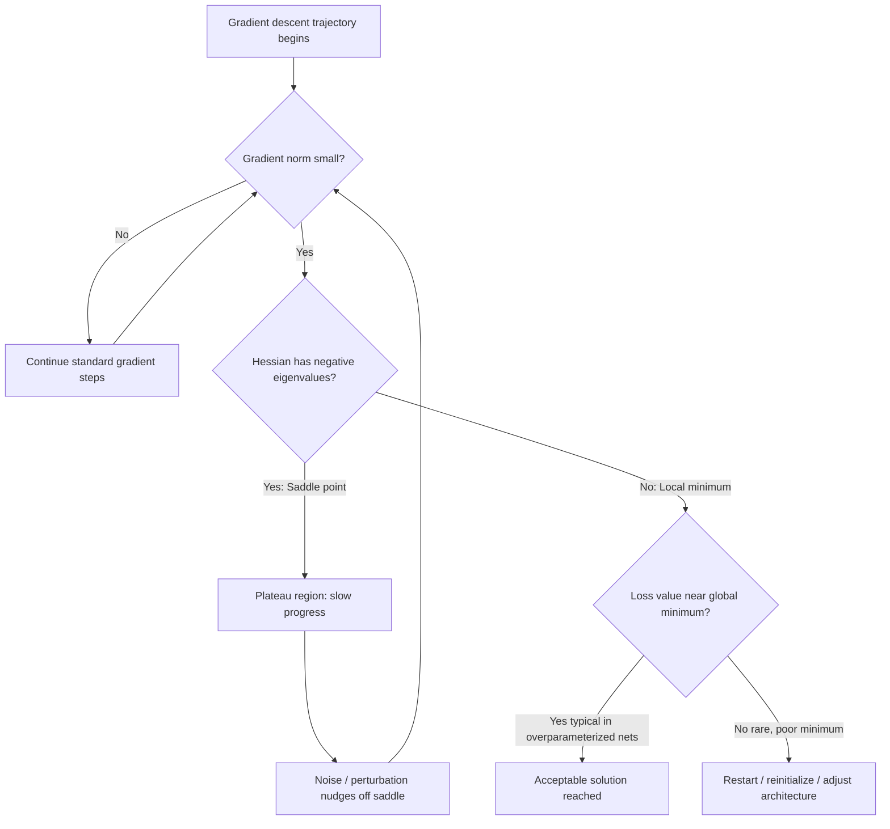

## Saddle Points and Local Minima in Deep Learning

### Overview

High-dimensional non-convex loss surfaces, as encountered when training deep neural networks, behave very differently from the low-dimensional intuitions most people carry over from calculus. The dominant obstacle to optimization in these landscapes is not local minima, as was long assumed, but saddle points. Understanding why requires examining the geometry of critical points as dimensionality grows.

### Critical Points in Non-Convex Landscapes

A critical point of a loss function $L(\theta)$ is any point where the gradient vanishes:

$$\nabla L(\theta) = 0$$

In a non-convex setting, a vanishing gradient is not enough to identify the nature of the point. The local curvature, captured by the Hessian matrix $H = \nabla^2 L(\theta)$, determines whether a critical point is a minimum, maximum, or saddle:

- **Local minimum**: $H$ is positive semi-definite (all eigenvalues $\geq 0$)
- **Local maximum**: $H$ is negative semi-definite (all eigenvalues $\leq 0$)
- **Saddle point**: $H$ has both positive and negative eigenvalues (indefinite)

At a saddle point, the loss decreases along some directions (negative eigenvalue directions) and increases along others (positive eigenvalue directions), so first-order gradient information alone cannot distinguish "I'm stuck at a good solution" from "I'm stuck at an unstable point with an escape route."

### Why Saddle Points Dominate in High Dimensions

**Key Points**

- The relative prevalence of minima versus saddle points is governed by the probability that a random symmetric matrix (an approximation of the Hessian at a critical point) has all-positive eigenvalues.
- For a Hessian with $n$ eigenvalues, if each eigenvalue's sign is treated as roughly independent and equally likely to be positive or negative, the probability that all $n$ are positive scales like $(1/2)^n$.
- As $n$ (the number of parameters) grows into the millions or billions, as in deep networks, this probability collapses toward zero. [Inference — this independence assumption is a simplifying model from random matrix theory used to explain the phenomenon; actual neural network Hessians have structured, correlated eigenvalues rather than fully independent random signs, though the qualitative conclusion is well supported empirically.]
- Consequently, the overwhelming majority of critical points encountered during training of large networks are saddle points, not local minima.
- This result draws on tools from random matrix theory, particularly properties of the spectrum of large random symmetric matrices, and was popularized in the deep learning context by Dauphin et al. (2014) and related work by Choromanska et al. on the loss surfaces of multilayer networks.

This reframes a classical worry. Early neural network research worried heavily about getting trapped in poor local minima. Modern high-dimensional theory suggests that true local minima, especially poor ones, are comparatively rare; the more common obstacle is a proliferation of saddle points, many of which are surrounded by extended, nearly flat regions called plateaus.

### The Saddle Point Problem for Gradient Descent

Saddle points are dangerous for optimization not because they are true stopping points, but because they can dramatically slow convergence:

- Near a saddle point, the gradient magnitude shrinks toward zero, so plain gradient descent takes very small steps.
- The negative eigenvalue directions do offer an escape route in principle, but if the corresponding eigenvalues are small in magnitude, the escape is slow.
- The result is a long plateau in the loss curve where training appears to stall, even though the point is not a genuine local minimum.

This behavior explains a common empirical observation: loss curves for deep networks often exhibit long flat stretches punctuated by sudden drops, rather than smooth monotone descent.

### Geometry: Minimum vs. Maximum vs. Saddle

<svg xmlns="http://www.w3.org/2000/svg" viewBox="0 0 900 320">
<text x="450" y="30" text-anchor="middle" font-size="18" font-weight="bold" fill="#1a1a1a">Critical Point Types on a Loss Surface (svg_diagram)</text>

<g transform="translate(60,60)">
<text x="110" y="15" text-anchor="middle" font-size="14" font-weight="bold" fill="#1a1a1a">Local Minimum</text>
<path d="M 10 200 Q 110 40 210 200" stroke="#2563eb" stroke-width="3" fill="none" />
<circle cx="110" cy="115" r="5" fill="#dc2626" />
<text x="110" y="240" text-anchor="middle" font-size="12" fill="#333">All eigenvalues &gt; 0</text>
<text x="110" y="258" text-anchor="middle" font-size="12" fill="#333">Bowl-shaped</text>
</g>

<g transform="translate(340,60)">
<text x="110" y="15" text-anchor="middle" font-size="14" font-weight="bold" fill="#1a1a1a">Saddle Point</text>
<path d="M 10 60 Q 110 180 210 60" stroke="#16a34a" stroke-width="3" fill="none" />
<path d="M 10 220 Q 110 100 210 220" stroke="#ea580c" stroke-width="3" fill="none" stroke-dasharray="6,4" />
<circle cx="110" cy="140" r="5" fill="#dc2626" />
<text x="110" y="255" text-anchor="middle" font-size="12" fill="#333">Mixed-sign eigenvalues</text>
<text x="110" y="273" text-anchor="middle" font-size="12" fill="#333">Rises one way, falls another</text>
</g>

<g transform="translate(620,60)">
<text x="110" y="15" text-anchor="middle" font-size="14" font-weight="bold" fill="#1a1a1a">Local Maximum</text>
<path d="M 10 40 Q 110 200 210 40" stroke="#7c3aed" stroke-width="3" fill="none" />
<circle cx="110" cy="145" r="5" fill="#dc2626" />
<text x="110" y="240" text-anchor="middle" font-size="12" fill="#333">All eigenvalues &lt; 0</text>
<text x="110" y="258" text-anchor="middle" font-size="12" fill="#333">Dome-shaped</text>
</g>
</svg>

### Distinguishing Saddle Points from Local Minima in Practice

**Key Points**

- **Gradient norm alone is insufficient.** Both true minima and saddle points produce $\|\nabla L(\theta)\| \approx 0$.
- **Hessian eigenvalue analysis** is the principled diagnostic: computing or estimating the eigenspectrum of $H$ reveals whether negative curvature directions exist. In practice this is expensive for large models, so approximations are used.
- **Practical proxies** used in research settings include:
  - Power iteration or Lanczos methods to estimate the smallest (most negative) Hessian eigenvalue without forming the full matrix.
  - Stochastic gradient noise itself, which can perturb parameters off an exact saddle and reveal escape directions empirically.
  - Perturbation tests: adding small random noise to parameters and observing whether the loss decreases (suggesting a saddle) or returns to the same value (suggesting a genuine flat minimum).

### Escaping Saddle Points

**Stochastic Gradient Noise**

Standard mini-batch SGD introduces gradient noise because each batch provides only a noisy estimate of the true gradient:

$$g_t = \nabla L_{B_t}(\theta_t) \approx \nabla L(\theta_t) + \epsilon_t$$

This noise perturbs the parameter trajectory off the exact saddle manifold, and once displaced even slightly along a negative-curvature direction, subsequent gradients push the iterate away from the saddle. [Inference — the degree to which SGD noise reliably and efficiently escapes saddle points depends on batch size, learning rate, and the specific curvature structure; this is an active area of theoretical study rather than a universally quantified guarantee.]

**Second-Order and Curvature-Aware Methods**

- **Saddle-Free Newton method**: modifies standard Newton's method, which is attracted to saddle points because it moves toward any critical point regardless of curvature sign, by taking the absolute value of Hessian eigenvalues before computing the update step. This converts attractive saddle directions into repulsive ones.
- **Cubic regularization**: adds a cubic penalty term to the local quadratic model used in trust-region-style methods, which provably guarantees escape from saddle points at a bounded rate under certain smoothness assumptions.
- **Perturbed gradient descent**: periodically injects explicit random noise into parameters, particularly when the gradient norm is small, as a controlled way to trigger saddle escape rather than relying solely on incidental SGD noise.

**Momentum-Based Methods**

Momentum and adaptive methods (discussed in earlier sections of this series, e.g., Adam, RMSProp) also aid in traversing plateaus around saddle points, since accumulated velocity carries the iterate through low-gradient regions rather than stalling immediately.

### Local Minima in Deep Learning: A Reassessment

**Key Points**

- Classical concern: gradient descent converges to a poor local minimum far worse than the global minimum, permanently limiting model quality.
- Modern empirical and theoretical view: for sufficiently large, overparameterized networks, most local minima found in practice have loss values close to the global minimum. [Inference — this "most local minima are good" finding is empirically supported across several architectures and datasets studied in the literature (e.g., Choromanska et al., 2015; Kawaguchi, 2016), but it is not a universal guarantee for every architecture, loss function, and dataset combination.]
- This shifts the practical concern away from "will I get trapped in a bad minimum" and toward "will I stall for a long time in a saddle-dominated plateau region."
- Overparameterization appears to play a structural role: as the number of parameters grows relative to the number of training examples, the loss landscape tends to contain fewer bad local minima and more benign saddle structure, though the precise theoretical conditions under which this holds are still being formalized.

### Loss Landscape Visualization

### Practical Implications for Training

**Example**

Consider training a deep network where the loss plateaus around epoch 40 with gradient norm near $10^{-4}$, then suddenly drops sharply around epoch 55. This pattern is consistent with the optimizer traversing a saddle-dominated region: the small gradient norm reflects proximity to a critical point, and the eventual drop reflects the trajectory finding and descending along a negative-curvature direction, aided by SGD noise or momentum. [Behavior may vary depending on architecture, batch size, learning rate schedule, and initialization; not every plateau-then-drop pattern is attributable to a saddle.]

**Key Points for Practitioners**

- A stalled loss curve does not necessarily indicate convergence to a poor solution; it may indicate a saddle plateau.
- Learning rate warmup and cyclical learning rate schedules can help provide the perturbation needed to cross saddle regions.
- Batch size affects gradient noise magnitude: very large batch sizes reduce noise and can, in some cases, increase the time spent near saddle points, since there is less stochastic perturbation to aid escape. [Inference — this relationship is observed in several empirical studies but the magnitude of the effect is architecture- and task-dependent.]
- Adaptive optimizers (Adam, RMSProp) and momentum-based methods (covered elsewhere in this series) are commonly used specifically because they help traverse saddle-dominated plateaus more efficiently than vanilla SGD.

### Conclusion

In high-dimensional deep learning loss landscapes, saddle points, not local minima, are the primary obstacle to efficient optimization. This follows from the geometry of critical points in high dimensions, where the probability of a critical point being a full local minimum shrinks rapidly as the parameter count grows. While saddle points can cause severe training slowdowns due to vanishing gradients and extended plateaus, they are not permanent traps: stochastic noise, momentum, and specialized curvature-aware methods (saddle-free Newton, cubic regularization, perturbed gradient descent) all provide mechanisms to escape them. Meanwhile, the classical fear of catastrophic local minima has been substantially tempered by evidence that most local minima in large, overparameterized networks are close in quality to the global minimum.

**Related Topics**

- Random matrix theory and the Hessian eigenspectrum of neural networks
- Overparameterization and the loss landscape (mode connectivity, wide vs. narrow minima)
- Sharp minima vs. flat minima and generalization
- Second-order optimization methods (Newton's method, quasi-Newton, natural gradient)
- Trust-region methods and cubic regularization
- Learning rate schedules and their interaction with landscape geometry
- Batch size, gradient noise, and implicit regularization in SGD
- Loss surface visualization techniques (filter normalization, mode connectivity paths)