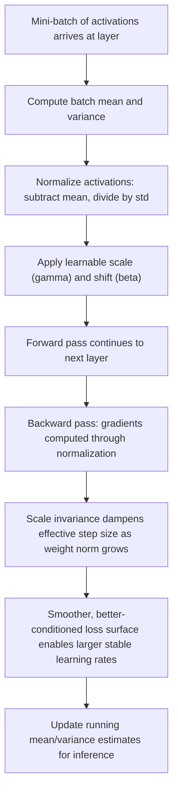

## Batch Normalization Effects on Optimization

### Overview

Batch normalization (BatchNorm) was introduced primarily as a technique to accelerate and stabilize the training of deep neural networks. While its original motivation centered on reducing "internal covariate shift," subsequent research has significantly revised the understanding of why it works, shifting the explanation toward its effects on the geometry of the loss landscape itself. This section covers both the mechanism and its optimization-theoretic consequences.

### The Mechanism

For a mini-batch $B$ of activations $x_1, \dots, x_m$ at a given layer, batch normalization transforms each activation as follows:

$$\hat{x}_i = \frac{x_i - \mu_B}{\sqrt{\sigma_B^2 + \epsilon}}$$

$$y_i = \gamma \hat{x}_i + \beta$$

where:

- $\mu_B = \frac{1}{m}\sum_{i=1}^m x_i$ is the batch mean
- $\sigma_B^2 = \frac{1}{m}\sum_{i=1}^m (x_i - \mu_B)^2$ is the batch variance
- $\epsilon$ is a small constant for numerical stability
- $\gamma$ and $\beta$ are learnable scale and shift parameters, allowing the network to undo the normalization if that is optimal

At inference time, running estimates of $\mu_B$ and $\sigma_B^2$ (accumulated during training via exponential moving averages) are used instead of batch statistics, since a single test example has no batch to compute statistics over.

### Original Motivation: Internal Covariate Shift

**Key Points**

- The original 2015 paper by Ioffe and Szegedy proposed that as parameters in earlier layers update during training, the distribution of inputs to later layers keeps shifting, forcing those later layers to continuously readapt.
- This phenomenon was termed "internal covariate shift," and BatchNorm was framed as a fix: by normalizing layer inputs, each layer sees a more stable input distribution over the course of training.
- This explanation was widely accepted for several years and is still commonly cited in introductory material. [Unverified as the primary causal mechanism — later empirical work directly challenged this explanation; see the next section.]

### The Revised Understanding: Loss Landscape Smoothing

**Key Points**

- Santurkar et al. (2018) empirically tested the internal covariate shift explanation by artificially injecting noise into activations after BatchNorm layers, deliberately reintroducing distributional instability, and found that BatchNorm still accelerated training despite this injected shift, casting doubt on covariate shift as the primary mechanism.
- Their proposed alternative explanation: BatchNorm makes the optimization landscape smoother, specifically by reducing the Lipschitz constant of both the loss function and its gradients with respect to the parameters.
- A smoother landscape means gradients are more predictive: taking a step in the direction of the current gradient is more likely to continue producing a similar gradient direction nearby, rather than the gradient direction changing erratically.
- This allows for the reliable use of larger learning rates without divergence, since the risk of "overshooting" into a region of very different curvature is reduced.

This reframing is significant for optimization theory specifically: BatchNorm's benefit is best understood as a change to the conditioning and smoothness of the loss surface, not merely a normalization of activation statistics for its own sake.

### Effect on the Loss Landscape

<svg xmlns="http://www.w3.org/2000/svg" viewBox="0 0 900 340">
<text x="450" y="30" text-anchor="middle" font-size="18" font-weight="bold" fill="#1a1a1a">Loss Landscape: Without vs. With BatchNorm (svg_diagram)</text>
<g transform="translate(50,60)">
<text x="180" y="15" text-anchor="middle" font-size="14" font-weight="bold" fill="#1a1a1a">Without BatchNorm</text>
<rect x="0" y="30" width="360" height="230" fill="none" stroke="#999" stroke-width="1" />
<path d="M 20 200 Q 60 60 100 190 Q 140 40 180 210 Q 220 50 260 195 Q 300 70 340 200" stroke="#dc2626" stroke-width="3" fill="none" />
<circle cx="20" cy="200" r="5" fill="#1a1a1a" />
<path d="M20,200 L28,150 L45,175 L60,90" stroke="#dc2626" stroke-width="2" fill="none" stroke-dasharray="4,3" />
<text x="180" y="290" text-anchor="middle" font-size="12" fill="#333">Jagged surface, erratic gradients</text>
<text x="180" y="308" text-anchor="middle" font-size="12" fill="#333">Requires small learning rates</text>
</g>
<g transform="translate(470,60)">
<text x="180" y="15" text-anchor="middle" font-size="14" font-weight="bold" fill="#1a1a1a">With BatchNorm</text>
<rect x="0" y="30" width="360" height="230" fill="none" stroke="#999" stroke-width="1" />
<path d="M 20 220 Q 100 90 180 130 Q 260 170 340 60" stroke="#16a34a" stroke-width="3" fill="none" />
<circle cx="20" cy="220" r="5" fill="#1a1a1a" />
<path d="M20,220 L70,150 L130,140 L190,125" stroke="#16a34a" stroke-width="2" fill="none" stroke-dasharray="4,3" />
<text x="180" y="290" text-anchor="middle" font-size="12" fill="#333">Smoother surface, predictive gradients</text>
<text x="180" y="308" text-anchor="middle" font-size="12" fill="#333">Tolerates larger learning rates</text>
</g>
</svg>

### Effects on Gradient Behavior

**Gradient Scale Invariance**

An important mathematical property of BatchNorm is that it makes the loss invariant to the scale of the weights feeding into a normalized layer. If a weight matrix $W$ is rescaled to $kW$ for some positive constant $k$, the normalization step cancels out the scaling:

$$\text{BN}(kWx) = \text{BN}(Wx)$$

This has direct optimization consequences:

- The gradient with respect to $W$ scales inversely with $k$: $\nabla_{W} L \propto \frac{1}{k} \nabla_{W} L$ at the unscaled point, which means that as weight norms grow, the effective step size taken relative to the weight's own scale automatically shrinks.
- This self-stabilizing property is sometimes described as an implicit learning rate decay mechanism, since it dampens the effect of weight growth over training without requiring an explicit schedule change. [Inference — this self-regulation effect is a well-documented mathematical consequence of scale invariance under BatchNorm, though its practical significance relative to explicit learning rate schedules can vary by architecture and training regime.]

**Reduced Sensitivity to Initialization**

Because BatchNorm normalizes activations regardless of the incoming weight scale, poor weight initialization is less likely to cause activations to explode or vanish early in training, which historically was a major obstacle to training very deep networks before normalization techniques became standard.

### Effect on Higher-Order Optimization Properties

**Key Points**

- **Reduces reliance on precise learning rate tuning**: because the landscape is smoother and self-stabilizing under scale invariance, a wider range of learning rates tend to produce stable training, reducing the sensitivity of final performance to this hyperparameter. [Behavior may vary by architecture, optimizer choice, and depth.]
- **Improves gradient flow in deep networks**: by keeping activation distributions in a consistent range at each layer, BatchNorm indirectly helps mitigate vanishing and exploding gradient problems, complementing techniques such as residual connections and careful initialization schemes covered elsewhere in this series.
- **Interacts with the Hessian conditioning**: empirical studies (Santurkar et al., 2018) measured that both the gradient predictiveness and the effective Lipschitzness of the loss and its gradients improve with BatchNorm, corresponding to a more favorable (better-conditioned) local curvature for gradient-based methods to exploit.

### Batch Size Sensitivity

**Key Points**

- BatchNorm's statistics ($\mu_B$, $\sigma_B^2$) are computed per mini-batch, so its behavior is inherently tied to batch size.
- Small batch sizes produce noisy estimates of the true population mean and variance, which can inject additional stochasticity into training. This noise interacts with the optimization process in two ways: it can act as a mild regularizer, but at very small batch sizes it can also destabilize training and degrade performance.
- This batch-size dependency motivated several alternative normalization schemes designed to reduce or remove this coupling, including Layer Normalization, Group Normalization, and Instance Normalization, each of which computes normalization statistics over different groupings of the data (per-example, per-channel-group, or per-channel, rather than per-batch).
- Consequently, choice of normalization scheme interacts directly with feasible batch size, which is itself often constrained by available accelerator memory.

### Interaction with Other Optimization Techniques

**Momentum and Adaptive Optimizers**

BatchNorm is commonly used alongside momentum-based and adaptive optimizers (SGD with momentum, Adam, RMSProp). The smoother, better-conditioned landscape produced by BatchNorm tends to complement these methods, since both aim to make more consistent progress per step; however, some research has noted subtleties in how adaptive per-parameter learning rates interact with BatchNorm's own implicit scale regulation. [Inference — the precise interaction effects between adaptive optimizers and BatchNorm's scale invariance are an active research area, and specific recommendations can be architecture-dependent.]

**Learning Rate Warmup**

Even with BatchNorm's smoothing effect, very large learning rates applied from initialization can still cause instability, particularly before running statistics have stabilized. Learning rate warmup schedules (discussed elsewhere in this series) are frequently used in conjunction with BatchNorm for this reason, especially in large-batch training regimes.

**Weight Decay**

Because of scale invariance, the interaction between weight decay and BatchNorm has a distinctive property: weight decay effectively controls the *effective learning rate* rather than only the weight magnitude directly, since shrinking weight norm changes the effective step size relative to that norm. This has led to specific research on how to tune weight decay in BatchNorm-normalized networks. [Inference — this reframing of weight decay's role under BatchNorm is supported by several papers analyzing scale-invariant training dynamics, but exact quantitative guidance depends on the optimizer and schedule used.]

### Practical Optimization Guidance

**Example**

Consider training a ResNet-50 on image classification. With BatchNorm layers after each convolution, practitioners can typically use learning rates on the order of 0.1 (with appropriate warmup and batch size scaling) rather than the substantially smaller rates often required without normalization. The training loss curve tends to descend more smoothly and predictably, with fewer sudden spikes caused by gradient explosion, compared to an equivalent unnormalized network. [Behavior may vary by exact architecture, dataset, batch size, and hardware; specific learning rate values are illustrative rather than universal recommendations.]

**Key Points for Practitioners**

- Favor BatchNorm when batch sizes are reasonably large (commonly cited as roughly 32 or more, though this is architecture- and task-dependent) and when training/inference statistics can be reliably tracked.
- Consider Layer Normalization or Group Normalization when batch sizes must be small (e.g., due to memory constraints, as in large sequence models or certain segmentation tasks) since BatchNorm's per-batch statistics become unreliable in that regime.
- Pair BatchNorm with learning rate warmup, particularly in large-batch or distributed training settings.
- Be aware of the train/inference discrepancy: since running statistics rather than batch statistics are used at inference, performance can differ if the training and inference data distributions diverge substantially.

### Optimization Flow with BatchNorm

### Conclusion

Batch normalization's primary effect on optimization is best explained not by its originally proposed reduction of internal covariate shift, but by its smoothing of the loss landscape and the resulting improvement in gradient predictiveness and Lipschitz conditioning. This smoothing effect, combined with the scale-invariance property that self-regulates effective step sizes, allows practitioners to use larger, more stable learning rates and reduces sensitivity to weight initialization. These benefits are counterbalanced by a dependency on batch size for reliable statistics, which has motivated alternative normalization schemes for small-batch or sequence-based training regimes.

**Related Topics**

- Layer Normalization, Group Normalization, and Instance Normalization
- Weight initialization schemes (Xavier/Glorot, He initialization) and their interaction with normalization
- Learning rate warmup and cyclical learning rate schedules
- Weight decay dynamics under scale-invariant architectures
- Residual connections and gradient flow in very deep networks
- Lipschitz continuity and smoothness in optimization theory
- Large-batch training and learning rate scaling rules
- Normalization-free architectures (e.g., NFNets, scaled weight standardization)