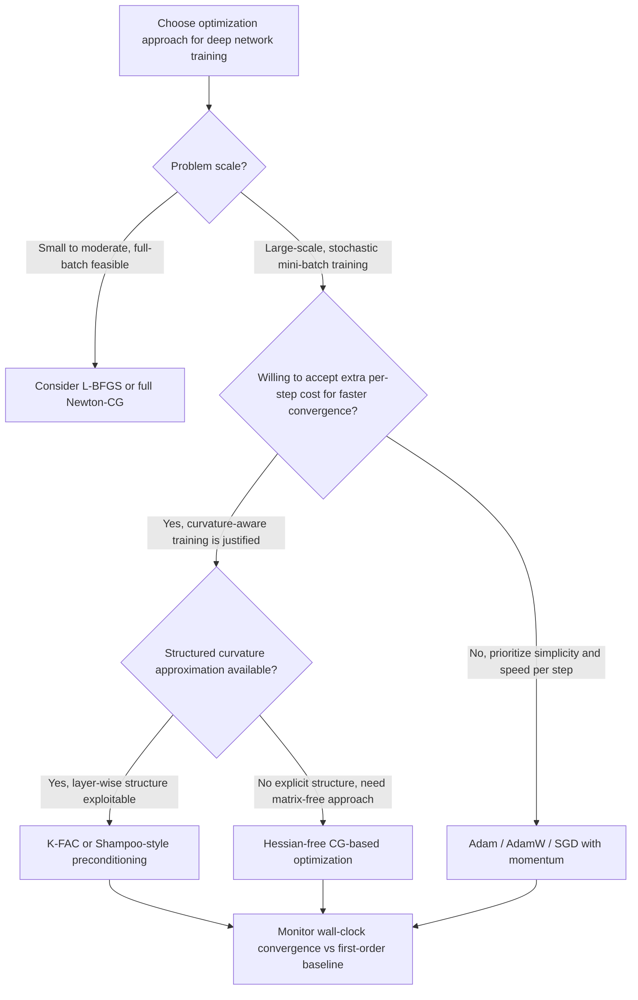

## Second-Order and Natural Gradient Methods in Deep Learning

### Overview

First-order methods (SGD, momentum, Adam) rely only on gradient information and treat parameter space as locally flat and Euclidean. Second-order and natural gradient methods incorporate curvature information to take more informed steps, potentially converging faster and more reliably. In deep learning, these methods face a fundamental tension: they are theoretically more powerful per iteration but computationally far more expensive per iteration, given that modern networks have millions to billions of parameters. This section surveys the major approaches, their approximations, and their practical role.

### Why First-Order Methods Are Curvature-Blind

Standard gradient descent updates parameters as:

$$\theta_{t+1} = \theta_t - \eta \nabla L(\theta_t)$$

This update treats every direction in parameter space identically, using the same step size $\eta$ regardless of how sharply or gently the loss curves in that direction. In a poorly conditioned landscape, this leads to characteristic problems:

- Slow progress along shallow (low-curvature) directions
- Oscillation or divergence along steep (high-curvature) directions
- Extreme sensitivity to the condition number of the local curvature

Second-order methods address this directly by incorporating curvature, encoded in the Hessian matrix, into the update rule.

### Newton's Method: The Foundational Second-Order Approach

Newton's method uses a local quadratic approximation of the loss and updates using the inverse Hessian:

$$\theta_{t+1} = \theta_t - H^{-1} \nabla L(\theta_t)$$

where $H = \nabla^2 L(\theta_t)$ is the Hessian matrix of second partial derivatives.

**Key Points**

- Newton's method rescales the gradient step differently in each eigendirection of the Hessian: it takes large steps in flat directions and small steps in sharply curved directions, which corrects the condition-number sensitivity of plain gradient descent.
- For a convex quadratic loss, Newton's method converges to the exact minimum in a single step, since the quadratic approximation is exact.
- **Computational cost is prohibitive at scale**: forming the full Hessian requires $O(n^2)$ memory and inverting it requires $O(n^3)$ time, where $n$ is the number of parameters. For a network with even a few million parameters, this is computationally infeasible with current hardware. [Unverified as a fixed threshold — exact feasibility limits shift with hardware advances, but the cubic scaling itself is a standard, well-established property of dense matrix inversion.]
- **Saddle point attraction**: as discussed in the earlier section on saddle points, unmodified Newton's method moves toward any critical point regardless of whether the curvature is a minimum, maximum, or saddle, since it seeks $\nabla L = 0$ without regard to eigenvalue sign. This makes plain Newton's method actively unsuitable for the highly non-convex, saddle-rich landscapes typical of deep networks.

Because of these limitations, Newton's method itself is rarely applied directly in deep learning; instead, it serves as the theoretical basis for a family of practical approximations.

### Quasi-Newton Methods

Quasi-Newton methods approximate the inverse Hessian using only gradient information gathered over the course of optimization, avoiding the need to compute or store the true Hessian explicitly.

**BFGS and L-BFGS**

- **BFGS** (Broyden–Fletcher–Goldfarb–Shanno) builds an approximate inverse Hessian iteratively from successive gradient differences, maintaining a dense $n \times n$ approximation matrix.
- **L-BFGS** (Limited-memory BFGS) addresses BFGS's memory cost by storing only a small number of recent gradient and parameter difference vectors (typically 5-20), reconstructing an implicit approximation of the inverse Hessian-vector product on demand rather than storing the full matrix.
- L-BFGS reduces memory cost from $O(n^2)$ to $O(mn)$, where $m$ is the small history size, making it tractable for moderately sized networks.
- **Practical limitation in deep learning**: L-BFGS was designed for deterministic (full-batch) optimization and assumes consistent curvature estimates across iterations. Under mini-batch stochasticity, the gradient differences used to build the curvature approximation become noisy and inconsistent, which degrades L-BFGS's reliability. [Inference — this stochastic-noise sensitivity is a well-documented practical limitation discussed in optimization literature, though specialized stochastic variants of L-BFGS have been proposed to partially address it.]
- As a result, L-BFGS sees more use in full-batch or large-batch settings, smaller-scale problems, or fine-tuning scenarios, rather than as a default choice for large-scale stochastic deep learning training.

### The Natural Gradient Method

Natural gradient descent, introduced by Amari, takes a different approach to incorporating curvature: rather than using the Hessian of the loss directly, it uses the Fisher Information Matrix (FIM) to define a Riemannian metric over the space of the model's probability distributions.

**Motivation**

Standard gradient descent measures distance in raw parameter space using the Euclidean metric, but this is often a poor proxy for how much the model's actual output distribution changes when parameters are perturbed. Two parameters might have very different sensitivities: a small change in one parameter might barely affect the output distribution, while an equally small change in another parameter might drastically alter it. The natural gradient corrects for this by measuring steps in terms of distributional change rather than raw parameter change.

**Formulation**

The natural gradient update is:

$$\theta_{t+1} = \theta_t - \eta F^{-1} \nabla L(\theta_t)$$

where $F$ is the Fisher Information Matrix:

$$F = \mathbb{E}\left[ \nabla \log p(y|x;\theta) \, \nabla \log p(y|x;\theta)^\top \right]$$

**Key Points**

- The Fisher Information Matrix is positive semi-definite by construction, which avoids the saddle-attraction problem that plain Newton's method suffers from, since it does not have the mixed-sign eigenvalue issue that causes Newton's method to be drawn toward saddle points.
- Under certain conditions (e.g., when the loss is a negative log-likelihood and the model is well-specified), the Fisher Information Matrix is closely related to, and in some formulations equivalent to, the Gauss-Newton approximation of the Hessian.
- Like the true Hessian, the FIM is an $n \times n$ matrix and is computationally expensive to form and invert directly for large networks, motivating a range of practical approximations.

### K-FAC: Kronecker-Factored Approximate Curvature

K-FAC is one of the most influential practical approximations to natural gradient descent for deep networks, developed by Martens and Grosse.

**Key Points**

- K-FAC exploits the layer-wise structure of neural networks: for a given layer, the Fisher Information Matrix block corresponding to that layer's weights can be approximated as a Kronecker product of two much smaller matrices, one capturing the statistics of the layer's input activations and one capturing the statistics of the gradients with respect to the layer's output (pre-activations).
- This Kronecker-factored structure dramatically reduces both the memory required to store the curvature approximation and the computational cost of inverting it, since inverting a Kronecker product reduces to inverting the two much smaller factor matrices separately.
- K-FAC has demonstrated meaningful wall-clock and per-iteration convergence improvements over first-order methods on certain large-scale training tasks in published benchmarks. [Inference — reported speedups are benchmark- and architecture-specific; K-FAC's practical benefit varies considerably depending on network architecture, batch size, and implementation efficiency, and it has not become a universal default over Adam/SGD in most production settings.]
- Extensions and refinements of K-FAC have been developed for convolutional layers, recurrent layers, and distributed training settings, since the original formulation was derived primarily for fully-connected layers.

### Gauss-Newton and Generalized Gauss-Newton Methods

**Key Points**

- The Gauss-Newton method approximates the Hessian of a loss composed of a nonlinear function and a convex loss (such as squared error or cross-entropy) by dropping second-order terms that involve the curvature of the network function itself, retaining only terms involving the first derivatives (the Jacobian) and the curvature of the outer loss.
- This approximation is guaranteed to be positive semi-definite when the outer loss is convex, which avoids the saddle-attraction problem in the same way that the Fisher Information Matrix does.
- The Generalized Gauss-Newton (GGN) matrix is closely related to the Fisher Information Matrix and, under specific conditions (the model's output distribution belongs to an exponential family and the loss is the corresponding negative log-likelihood), the two coincide exactly. [Inference — this equivalence holds under specific, well-defined conditions from the literature; outside those conditions GGN and Fisher are related but not identical approximations, and practitioners should not assume interchangeability without checking the loss/model setup.]

### Hessian-Free Optimization

**Key Points**

- Hessian-free optimization avoids ever forming the Hessian explicitly by exploiting the fact that Hessian-vector products $Hv$ can be computed efficiently using automatic differentiation (via the Pearlmutter trick), without materializing the full matrix.
- These Hessian-vector products are then used inside an inner conjugate gradient (CG) loop to approximately solve the Newton system $H \Delta\theta = -\nabla L$ without ever forming $H$ directly.
- This approach was notably applied to training deep and recurrent networks by Martens (2010), demonstrating that curvature-aware optimization could be made tractable for networks that were, at the time, difficult to train with first-order methods alone.
- The inner CG loop adds meaningful per-step computational overhead compared to a single first-order gradient step, which is a key tradeoff against its improved per-step progress.

### Comparison of Approaches

<svg xmlns="http://www.w3.org/2000/svg" viewBox="0 0 900 380">
<text x="450" y="30" text-anchor="middle" font-size="18" font-weight="bold" fill="#1a1a1a">Second-Order Method Landscape (svg_diagram)</text>
<rect x="40" y="60" width="820" height="40" fill="#1e3a8a" opacity="0.1" />
<text x="60" y="85" font-size="13" font-weight="bold" fill="#1a1a1a">Full Newton's Method — exact curvature, O(n^3) cost, saddle-attracted</text>
<rect x="40" y="115" width="820" height="40" fill="#7c2d12" opacity="0.1" />
<text x="60" y="140" font-size="13" font-weight="bold" fill="#1a1a1a">Quasi-Newton (BFGS / L-BFGS) — gradient-built approximation, O(mn) memory</text>
<rect x="40" y="170" width="820" height="40" fill="#14532d" opacity="0.1" />
<text x="60" y="195" font-size="13" font-weight="bold" fill="#1a1a1a">Natural Gradient (Fisher Information) — PSD, distribution-aware metric</text>
<rect x="40" y="225" width="820" height="40" fill="#581c87" opacity="0.1" />
<text x="60" y="250" font-size="13" font-weight="bold" fill="#1a1a1a">K-FAC — Kronecker-factored Fisher approx, layer-wise structure</text>
<rect x="40" y="280" width="820" height="40" fill="#78350f" opacity="0.1" />
<text x="60" y="305" font-size="13" font-weight="bold" fill="#1a1a1a">Gauss-Newton / GGN — PSD Hessian approx via Jacobian, convex outer loss</text>
<rect x="40" y="335" width="820" height="40" fill="#134e4a" opacity="0.1" />
<text x="60" y="360" font-size="13" font-weight="bold" fill="#1a1a1a">Hessian-Free (CG-based) — matrix-free Hv products, no explicit Hessian</text>
</svg>

### Diagonal and Structured Approximations

**Key Points**

- Because full-matrix curvature methods remain expensive even in their factored forms, a large family of practical optimizers use only diagonal or block-diagonal curvature approximations.
- **Adam and RMSProp**, covered elsewhere in this series as adaptive first-order methods, can be interpreted through this lens: they maintain a per-parameter running estimate of squared gradient magnitude, which functions as a crude diagonal approximation to curvature, adapting the effective step size per parameter without the cost of a full second-order method.
- **Shampoo** and related structured preconditioning methods maintain curvature approximations with more structure than a simple diagonal (e.g., per-layer or per-tensor-dimension statistics), aiming to capture more curvature information than Adam while remaining more tractable than full K-FAC or Hessian-free approaches.
- This spectrum, from purely diagonal (Adam) through Kronecker-factored (K-FAC) to full-matrix (Newton), represents a tradeoff between the fidelity of curvature information captured and the computational cost per step.

### Practical Role in Deep Learning Training

**Key Points**

- Despite decades of second-order method development, first-order adaptive methods (Adam, and variants such as AdamW) remain the dominant default for training most large-scale deep learning models, including large language models and vision transformers, as of current common practice. [Unverified as a permanent state of the field — optimizer choice for frontier-scale models is an active area of research and this balance has shifted before and could shift again.]
- Second-order and natural gradient methods see more targeted use in: settings where the per-iteration cost is justified by expensive data collection (e.g., some reinforcement learning applications, where natural gradient methods like TRPO and its descendants use Fisher-information-based trust regions), smaller-scale or full-batch training regimes, and research into faster large-scale training where the amortized cost of curvature estimation can be spread across many steps or approximated efficiently (e.g., ongoing work applying K-FAC-like methods to very large model pretraining).
- A recurring theme is that the "best" curvature approximation is the one that balances information gained per step against the wall-clock cost of computing it; the ideal balance point has shifted over time with changes in hardware capability (particularly parallel matrix computation on GPUs/TPUs), and continues to be an active area of optimization research.

### Optimization Method Selection Flow

### Conclusion

Second-order and natural gradient methods offer a theoretically principled way to incorporate curvature information into optimization, correcting the condition-number sensitivity and direction-blindness of first-order methods. Full Newton's method is intractable at deep learning scale and is additionally undermined by its attraction to saddle points in non-convex landscapes. This has driven development of a spectrum of practical approximations, quasi-Newton methods like L-BFGS, natural gradient methods based on the positive semi-definite Fisher Information Matrix, Kronecker-factored approximations like K-FAC, Gauss-Newton approximations, and matrix-free Hessian-free optimization, each trading off curvature fidelity against computational tractability. Despite this rich body of work, first-order adaptive methods remain the practical default for most large-scale deep learning as of current practice, with second-order methods occupying more specialized niches where their added per-step cost is justified.

**Related Topics**

- Fisher Information Matrix and its role in statistical estimation theory
- Trust region policy optimization (TRPO) and natural gradient methods in reinforcement learning
- Conjugate gradient method fundamentals
- Preconditioning techniques in numerical optimization
- Adam, RMSProp, and adaptive first-order methods (cross-reference)
- Shampoo and structured preconditioning optimizers
- Condition number and its role in convergence rate analysis
- Automatic differentiation and efficient Hessian-vector product computation