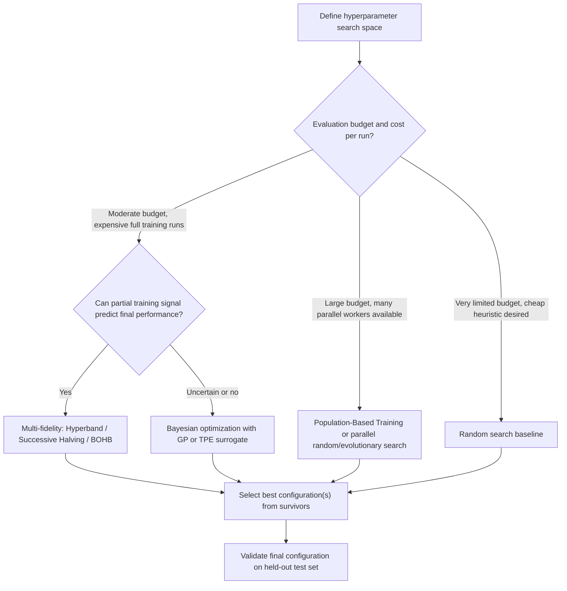

## Hyperparameter Optimization Techniques

### Overview

Hyperparameters, settings such as learning rate, batch size, network depth, regularization strength, and optimizer-specific coefficients, are configured before training begins and are not learned via gradient descent on the training objective itself. Hyperparameter optimization (HPO) is the process of searching over this configuration space to find settings that produce the best model performance, typically measured on a held-out validation set. Because each evaluation of a hyperparameter configuration requires training a model, often an expensive process, HPO is fundamentally an optimization problem under a severe evaluation-cost constraint, which shapes nearly every technique in this domain.

### The Hyperparameter Optimization Problem

Formally, HPO seeks to solve:

$$\lambda^* = \arg\min_{\lambda \in \Lambda} \; V\big(\theta^*(\lambda), \lambda\big)$$

where:

- $\lambda$ represents a hyperparameter configuration drawn from the search space $\Lambda$
- $\theta^*(\lambda) = \arg\min_\theta L(\theta, \lambda)$ is the model's trained parameters given that configuration (the result of an inner optimization loop)
- $V$ is the validation objective used to evaluate the configuration

**Key Points**

- This is a bilevel optimization problem: an outer loop searches over $\lambda$, and an inner loop (standard model training) solves for $\theta^*(\lambda)$ given each candidate $\lambda$.
- The outer objective $V$ is typically treated as a black box with respect to $\lambda$: it usually cannot be differentiated directly, since obtaining $V(\lambda)$ requires running a full (or partial) training procedure with noisy, non-smooth dependence on $\lambda$.
- This black-box, expensive-to-evaluate property is what distinguishes HPO from the gradient-based optimization techniques used to train model parameters themselves, and it is why HPO draws instead on black-box and derivative-free optimization methods.

### Manual Search and Grid Search

**Manual Search**

Manual search relies on practitioner intuition, prior experience, and iterative trial-and-error adjustment of hyperparameters based on observed training behavior. It remains common in practice, particularly for well-understood architectures, but does not scale well and depends heavily on individual expertise.

**Grid Search**

Grid search exhaustively evaluates every combination of hyperparameter values from a predefined discrete set for each hyperparameter.

**Key Points**

- Grid search is simple to implement and fully parallelizable, since every configuration can be evaluated independently.
- Its cost grows exponentially with the number of hyperparameters: for $k$ hyperparameters each with $m$ candidate values, grid search requires $m^k$ evaluations, which becomes computationally infeasible quickly as dimensionality grows. This is often referred to as the curse of dimensionality in the HPO context.
- Grid search wastes evaluation budget on unimportant hyperparameters: if only a subset of hyperparameters meaningfully affects performance, grid search still allocates equal resolution to every dimension, including unimportant ones.

### Random Search

Random search samples hyperparameter configurations independently at random from specified distributions over each hyperparameter, rather than exhaustively enumerating a grid.

**Key Points**

- Bergstra and Bengio (2012) demonstrated both theoretically and empirically that random search finds good configurations more efficiently than grid search for the same evaluation budget, when only a small number of hyperparameters actually matter for a given problem, a condition observed to hold frequently in practice.
- The core intuition: grid search allocates evaluations on a rigid lattice, so if one hyperparameter dimension is unimportant, many grid evaluations effectively duplicate each other along that unimportant axis. Random search instead explores each dimension's marginal distribution more effectively for the same total budget.
- Random search remains a strong, simple baseline and is still widely recommended as a starting point before adopting more sophisticated methods. [Inference — "strong baseline" is a widely echoed practical recommendation in the literature and community practice, though the degree to which it is outperformed depends on the specific search space and evaluation budget.]

### Bayesian Optimization

Bayesian optimization treats the validation objective $V(\lambda)$ as an unknown function to be modeled probabilistically, using past evaluations to guide the selection of future configurations to try.

**Core Components**

- **Surrogate model**: a probabilistic model, most commonly a Gaussian Process (GP), fit to the observed $(\lambda, V(\lambda))$ pairs collected so far. The GP provides both a predicted mean and an uncertainty estimate for any untried configuration.
- **Acquisition function**: a function computed from the surrogate model's predictions that scores candidate configurations by their expected value of being tried next, balancing exploitation (trying configurations predicted to perform well) against exploration (trying configurations with high uncertainty). Common acquisition functions include Expected Improvement (EI), Upper Confidence Bound (UCB), and Probability of Improvement (PI).

**Key Points**

- Bayesian optimization is designed specifically for settings where each function evaluation (each full model training run) is expensive, since the overhead of fitting the surrogate model and optimizing the acquisition function is comparatively small relative to the cost of training.
- Gaussian Process-based surrogate models scale poorly with the number of observations, typically $O(n^3)$ for $n$ observed configurations, due to the need to invert a covariance matrix, which limits standard GP-based Bayesian optimization to a few hundred to low thousands of evaluations in practice. [Unverified as a precise universal ceiling — scalable GP approximations and alternative surrogate models (e.g., sparse GPs, random forests as in SMAC, tree-structured Parzen estimators) extend this practical limit, and exact thresholds depend on implementation.]
- **Tree-structured Parzen Estimator (TPE)**, used in tools such as Hyperopt, is an alternative surrogate approach that models $P(\lambda \mid V)$ rather than $P(V \mid \lambda)$ directly, using density estimation, which tends to scale more favorably to higher-dimensional and conditional (tree-structured) hyperparameter spaces than standard GP-based methods.
- Bayesian optimization generally outperforms random search in sample efficiency, particularly in low-to-moderate dimensional search spaces, but its own sequential, model-fitting overhead can become a bottleneck at very high dimensionality or when massive parallelism is available and evaluation is comparatively cheap.

### Sequential Model-Based and Multi-Fidelity Methods

**Successive Halving and Hyperband**

A major class of methods exploits the observation that poor hyperparameter configurations can often be identified early in training, before full training completes, allowing computational budget to be reallocated away from unpromising configurations.

**Key Points**

- **Successive Halving** allocates a small initial budget (e.g., a few training epochs) to a large number of configurations, evaluates them, discards the worst-performing half (or another fixed fraction), and reallocates the freed budget to training the survivors further. This process repeats until a small number of configurations remain, trained to the full budget.
- **Hyperband**, developed by Li et al. (2018), addresses a key weakness of Successive Halving: the need to pre-specify the tradeoff between the number of configurations tried and the budget allocated per configuration. Hyperband runs multiple Successive Halving brackets with different tradeoff settings, providing a principled way to hedge against this uncertainty without requiring the practitioner to guess the right setting in advance.
- These multi-fidelity methods rely on an assumption: that a configuration's relative performance early in training is at least somewhat predictive of its relative performance at full training, an assumption that generally holds but is not universal, particularly for training dynamics with delayed benefits (e.g., some regularization or learning rate schedule effects that only manifest late in training). [Inference — this early-signal assumption is explicitly discussed as a limitation in the multi-fidelity HPO literature, and its validity is problem-dependent.]

**BOHB: Combining Bayesian Optimization and Hyperband**

BOHB (Bayesian Optimization and HyperBand), developed by Falkner et al. (2018), combines the sample-efficiency benefits of Bayesian optimization's model-guided search with Hyperband's efficient budget allocation across fidelities, aiming to capture the strengths of both approaches.

### Evolutionary and Population-Based Methods

**Key Points**

- **Evolutionary algorithms** for HPO maintain a population of hyperparameter configurations, iteratively applying selection (favoring better-performing configurations), mutation (small random perturbations), and sometimes crossover (combining traits from multiple configurations) to evolve the population toward better regions of the search space over generations.
- **Population-Based Training (PBT)**, introduced by Jaderberg et al. (2017), extends this idea by allowing hyperparameters to be adapted *during* training rather than being fixed at the start: periodically, poorly performing members of the population have their weights replaced with a copy of a better-performing member's weights ("exploit"), followed by a perturbation of their hyperparameters ("explore"), allowing schedules like learning rate to evolve dynamically rather than following a fixed pre-set schedule.
- PBT is particularly notable for producing effective hyperparameter *schedules* as a side effect of the search process, rather than a single static configuration, which can outperform static configurations found by other HPO methods for hyperparameters that ideally change over the course of training (e.g., learning rate, entropy regularization coefficients in reinforcement learning).

### Gradient-Based Hyperparameter Optimization

For a subset of hyperparameters, particularly continuous ones like learning rate or certain regularization coefficients, it is possible to compute or approximate gradients of the validation objective directly with respect to the hyperparameters, bypassing black-box search entirely.

**Key Points**

- **Hyperparameter gradients via unrolled differentiation**: by treating a truncated sequence of training steps as a differentiable computation graph, gradients of the validation loss can be backpropagated through the training procedure itself, all the way to the hyperparameters that influenced it.
- This approach requires differentiating through the optimization trajectory, which is memory-intensive (requiring storage of intermediate states across unrolled steps) and can suffer from exploding or vanishing gradients through the unrolled computation, analogous to the challenges seen in training deep recurrent networks.
- **Implicit differentiation** methods offer an alternative that avoids unrolling the full trajectory, instead using the implicit function theorem at a (locally) converged solution to compute hyperparameter gradients more efficiently, though this typically requires the inner optimization to have actually converged, or nearly so, for the approximation to be reliable.
- Gradient-based HPO methods are most practical for continuous hyperparameters and scale better to a larger number of hyperparameters than black-box methods in some settings, but they are generally not applicable to discrete or structural hyperparameters (e.g., number of layers, choice of activation function), where black-box or evolutionary methods remain necessary.

### Comparison of Approaches

<svg xmlns="http://www.w3.org/2000/svg" viewBox="0 0 900 400">
<text x="450" y="30" text-anchor="middle" font-size="18" font-weight="bold" fill="#1a1a1a">Hyperparameter Optimization Method Landscape (svg_diagram)</text>
<line x1="80" y1="350" x2="820" y2="350" stroke="#333" stroke-width="2" />
<line x1="80" y1="350" x2="80" y2="60" stroke="#333" stroke-width="2" />
<text x="450" y="385" text-anchor="middle" font-size="13" fill="#333">Sample Efficiency (evaluations needed) →</text>
<text x="30" y="210" text-anchor="middle" font-size="13" fill="#333" transform="rotate(-90,30,210)">Search Sophistication →</text>
<circle cx="150" cy="320" r="8" fill="#dc2626" />
<text x="150" y="340" text-anchor="middle" font-size="11" fill="#333">Grid Search</text>
<circle cx="230" cy="290" r="8" fill="#ea580c" />
<text x="230" y="310" text-anchor="middle" font-size="11" fill="#333">Random Search</text>
<circle cx="400" cy="200" r="8" fill="#16a34a" />
<text x="400" y="220" text-anchor="middle" font-size="11" fill="#333">Hyperband</text>
<circle cx="520" cy="150" r="8" fill="#2563eb" />
<text x="520" y="170" text-anchor="middle" font-size="11" fill="#333">BOHB</text>
<circle cx="600" cy="120" r="8" fill="#7c3aed" />
<text x="600" y="140" text-anchor="middle" font-size="11" fill="#333">Bayesian Optimization</text>
<circle cx="700" cy="180" r="8" fill="#c026d3" />
<text x="700" y="200" text-anchor="middle" font-size="11" fill="#333">Population-Based Training</text>
<circle cx="780" cy="100" r="8" fill="#0891b2" />
<text x="780" y="120" text-anchor="middle" font-size="11" fill="#333">Gradient-Based HPO</text>
</svg>

### Search Space Design

**Key Points**

- **Log-scale sampling** is standard practice for hyperparameters that plausibly vary across orders of magnitude, such as learning rate or weight decay coefficient, since uniform sampling in the raw scale would over-concentrate samples in the numerically larger portion of the range.
- **Conditional hyperparameters** (e.g., a hyperparameter that only exists or is meaningful when another hyperparameter takes a certain value, such as a dropout rate that is irrelevant if dropout is disabled) require search space representations that can express this structure; tree-structured search spaces, as used in TPE-based tools, handle this more naturally than flat GP-based approaches.
- Effective search space design, including choosing sensible ranges and priors based on domain knowledge, often has a larger practical impact on final HPO outcomes than the choice of search algorithm itself. [Inference — this is a common practitioner observation echoed in applied HPO literature, but it is not a strictly quantified or universal finding, and its relative importance can vary by problem.]

### Practical Considerations

**Key Points**

- **Multi-fidelity approaches** (Hyperband, BOHB, and successive halving-based methods) have become particularly important for deep learning HPO specifically, because individual training runs are expensive, making early-stopping-based budget reallocation especially valuable compared to domains with cheaper evaluations.
- **Parallelization**: random search and evolutionary/population-based methods parallelize naturally across many workers, while classical sequential Bayesian optimization is inherently more serial, though parallel and batch variants of Bayesian optimization have been developed to address this.
- **Tooling**: widely used HPO libraries and frameworks include Optuna, Ray Tune, Hyperopt, and Ax/BoTorch, each supporting different combinations of the algorithms described above and integrating with common deep learning frameworks. [Unverified — specific tool feature sets and popularity change over time; mentioned here as illustrative of common ecosystem options rather than as an exhaustive or current-as-of-today comparison.]
- **Interaction with the model optimizer**: HPO for deep learning frequently focuses heavily on optimizer-related hyperparameters (learning rate, learning rate schedule shape, momentum/beta coefficients, weight decay), since these tend to have an outsized effect on final performance relative to many architectural hyperparameters, though this varies by task and architecture.

### Hyperparameter Optimization Workflow

### Conclusion

Hyperparameter optimization is fundamentally a black-box, expensive-evaluation optimization problem layered on top of the standard gradient-based training of model parameters. Grid search and manual search remain simple but poorly scaling baselines; random search offers a stronger and still widely used baseline, particularly when only a few hyperparameters matter. Bayesian optimization improves sample efficiency by modeling the validation objective probabilistically, while multi-fidelity methods like Hyperband and BOHB exploit early training signal to reallocate budget efficiently, an especially valuable property in deep learning given the high cost of individual training runs. Population-based and evolutionary methods extend the search to dynamic, schedule-like hyperparameters, and gradient-based approaches offer an efficient alternative for continuous hyperparameters when differentiability through training can be exploited. In practice, method choice depends heavily on evaluation budget, parallelism availability, and the structure (continuous, discrete, conditional) of the search space itself.

**Related Topics**

- Learning rate schedules and warmup strategies (cross-reference)
- Neural architecture search (NAS) as a structural extension of HPO
- Cross-validation and validation set design for reliable HPO evaluation
- Gaussian Processes and surrogate modeling in black-box optimization
- AutoML systems and end-to-end pipeline optimization
- Transfer learning of hyperparameters across related tasks (warm-starting HPO)
- Regularization hyperparameters and their interaction with model capacity
- Early stopping as both a regularization technique and an HPO budget-saving mechanism