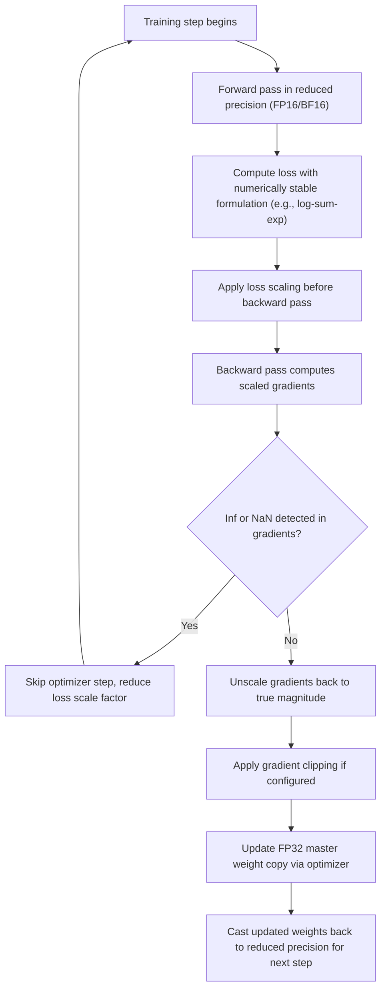

## Floating Point Arithmetic and Numerical Stability

### Overview

Optimization algorithms are typically derived and analyzed in exact real arithmetic, but implemented in finite-precision floating point arithmetic on actual hardware. This gap between the mathematical algorithm and its computational realization introduces a distinct source of error, numerical error, that is separate from statistical error (from finite data) or optimization error (from stopping before true convergence). Understanding floating point behavior is essential for diagnosing training instabilities such as NaN losses, exploding gradients, and silent accuracy degradation.

### Floating Point Representation

A floating point number is represented in a form analogous to scientific notation:

$$x = (-1)^s \times (1 + f) \times 2^{e - \text{bias}}$$

where $s$ is the sign bit, $f$ is the fractional mantissa, and $e$ is the biased exponent. Common formats used in deep learning include:

- **FP64 (double precision)**: 1 sign bit, 11 exponent bits, 52 mantissa bits
- **FP32 (single precision)**: 1 sign bit, 8 exponent bits, 23 mantissa bits
- **FP16 (half precision)**: 1 sign bit, 5 exponent bits, 10 mantissa bits
- **BF16 (bfloat16)**: 1 sign bit, 8 exponent bits, 7 mantissa bits

**Key Points**

- The number of mantissa bits determines precision (how finely nearby values can be distinguished), while the number of exponent bits determines dynamic range (the span between the smallest and largest representable magnitudes).
- BF16 was specifically designed to preserve FP32's exponent range (8 bits) while sacrificing mantissa precision (only 7 bits versus FP32's 23), making it more resistant to overflow and underflow than FP16 despite having fewer total bits, at the cost of coarser value resolution.
- FP16 has a much narrower dynamic range than FP32 or BF16 due to its 5-bit exponent, which makes it considerably more prone to overflow (producing infinity) and underflow (producing zero) during training, particularly for gradients.

### Machine Epsilon and Representable Precision

Machine epsilon, $\epsilon_{\text{mach}}$, is the smallest value such that $1 + \epsilon_{\text{mach}}$ is distinguishable from $1$ in a given floating point format. It characterizes the relative precision of the format:

$$\epsilon_{\text{mach}}^{\text{FP32}} \approx 1.19 \times 10^{-7}, \qquad \epsilon_{\text{mach}}^{\text{FP16}} \approx 9.77 \times 10^{-4}, \qquad \epsilon_{\text{mach}}^{\text{BF16}} \approx 7.81 \times 10^{-3}$$

**Key Points**

- Because floating point spacing is relative rather than absolute, precision degrades as magnitude grows: two numbers with a fixed absolute difference may be perfectly distinguishable near zero but indistinguishable once both are large. This is why gradient accumulation of many small values into a large running sum can silently lose precision.
- Any arithmetic operation whose true result differs from the nearest representable value by less than roughly half a unit in the last place (ULP) will be rounded, introducing a small per-operation error that can compound across the many operations in a training step.

### Catastrophic Cancellation

Catastrophic cancellation occurs when subtracting two nearly equal floating point numbers, which can amplify relative error dramatically even though each input was individually well-represented.

**Example**

Suppose two numbers $a$ and $b$ are each accurate to a relative error of $\epsilon_{\text{mach}}$, but $a \approx b$ so that $a - b$ is much smaller in magnitude than $a$ or $b$ individually. The absolute error in each of $a$ and $b$ is roughly $\epsilon_{\text{mach}} \cdot |a|$, but this absolute error does not shrink when computing $a - b$, so the *relative* error in the result $(a-b)$ is amplified by roughly the factor $|a| / |a - b|$. If $a$ and $b$ agree to many significant digits, this factor can be enormous, potentially leaving the result with little to no correct precision. [Behavior may vary by exact values involved; this describes the general mechanism rather than a fixed numeric example.]

This mechanism underlies several well-known numerical stability problems in machine learning:

- Computing variance naively as $\mathbb{E}[X^2] - (\mathbb{E}[X])^2$ can suffer catastrophic cancellation when the two terms are close in magnitude, which is why numerically stable one-pass algorithms (e.g., Welford's algorithm) are preferred in practice.
- Computing softmax probabilities or log-likelihoods directly from raw exponentials can involve subtracting large, nearly equal quantities, motivating the standard log-sum-exp stabilization trick discussed below.

### Overflow, Underflow, and NaN Propagation

**Key Points**

- **Overflow** occurs when a computed value exceeds the maximum representable magnitude for the format, producing $+\infty$ or $-\infty$ rather than a large finite number.
- **Underflow** occurs when a computed value is smaller in magnitude than the smallest representable positive value, typically rounding to zero (flush-to-zero) or, in formats supporting it, a denormalized number with reduced precision.
- **NaN (Not a Number)** arises from mathematically undefined operations such as $0/0, $\infty - \infty
  , or $\log(negative)$, or from operations involving an existing NaN or infinity, such as $\infty \times 0$.
- **NaN propagation** is a critical practical hazard: once a single NaN enters a computation graph, it propagates through essentially all subsequent operations that touch it, since almost any arithmetic operation involving NaN produces NaN. A single overflowed gradient value in one layer can therefore corrupt an entire parameter update, and in some architectures, the entire subsequent training run, once corrupted weights themselves become NaN.

### Common Sources of Numerical Instability in Deep Learning

**Key Points**

- **Exploding activations or gradients**: repeated multiplication through many layers (particularly deep or recurrent architectures without normalization or careful initialization) can cause activation or gradient magnitudes to grow or shrink exponentially with depth, discussed at length in the vanishing/exploding gradient sections elsewhere in this series; in finite precision, exponential growth reaches overflow far sooner than it would in exact arithmetic.
- **Division by near-zero denominators**: operations such as normalization (dividing by a standard deviation) or certain loss functions can produce very large or infinite values if the denominator is not bounded away from zero, which is why small epsilon terms (as seen in the BatchNorm formulation covered earlier in this series) are added inside square roots and denominators as a standard defensive practice.
- **Exponentials in loss functions**: softmax, cross-entropy, and related functions involve $e^x$ terms that can overflow for even moderately large $x$ (e.g., $e^{100}$ already exceeds FP32's representable range), making naive implementations numerically fragile.
- **Reduced-precision training (FP16/BF16)**: using lower-precision formats to speed up training and reduce memory (discussed further below) narrows the safety margin before over/underflow occurs, making models trained in these formats more susceptible to the instabilities above unless specific mitigations are used.

### The Log-Sum-Exp Stabilization Trick

A canonical numerical stability technique addresses the overflow risk in computing quantities like softmax or log-likelihood:

$$\log \sum_{i} e^{x_i} = m + \log \sum_i e^{x_i - m}, \qquad \text{where } m = \max_i x_i$$

**Key Points**

- By subtracting the maximum value $m$ before exponentiating, every exponent argument $x_i - m$ is guaranteed to be $\leq 0$, so every term $e^{x_i - m} \in (0, 1]$, which eliminates the overflow risk from exponentiating large positive values.
- This identity is mathematically exact, it produces the same result as the naive computation in infinite-precision arithmetic, but is dramatically more numerically stable in finite precision, since it avoids ever computing $e^x$ for large $x$.
- This trick underlies standard, numerically stable implementations of softmax and cross-entropy loss in essentially all major deep learning frameworks, and is a specific instance of a broader class of stabilization techniques that reformulate a mathematically equivalent expression to avoid intermediate extreme values.

### Numerical Stability Across the Landscape

<svg xmlns="http://www.w3.org/2000/svg" viewBox="0 0 900 340">
<text x="450" y="30" text-anchor="middle" font-size="18" font-weight="bold" fill="#1a1a1a">Naive vs. Stabilized Computation Path (svg_diagram)</text>
<g transform="translate(50,60)">
<text x="180" y="15" text-anchor="middle" font-size="14" font-weight="bold" fill="#1a1a1a">Naive Softmax</text>
<rect x="10" y="40" width="340" height="40" fill="#fee2e2" stroke="#dc2626" />
<text x="180" y="65" text-anchor="middle" font-size="12" fill="#1a1a1a">Compute e^x_i directly</text>
<rect x="10" y="100" width="340" height="40" fill="#fee2e2" stroke="#dc2626" />
<text x="180" y="125" text-anchor="middle" font-size="12" fill="#1a1a1a">Large x_i → overflow → inf</text>
<rect x="10" y="160" width="340" height="40" fill="#fee2e2" stroke="#dc2626" />
<text x="180" y="185" text-anchor="middle" font-size="12" fill="#1a1a1a">inf / inf → NaN</text>
<rect x="10" y="220" width="340" height="40" fill="#7f1d1d" stroke="#dc2626" />
<text x="180" y="245" text-anchor="middle" font-size="12" fill="#fff">NaN propagates through model</text>
</g>
<g transform="translate(470,60)">
<text x="180" y="15" text-anchor="middle" font-size="14" font-weight="bold" fill="#1a1a1a">Log-Sum-Exp Stabilized</text>
<rect x="10" y="40" width="340" height="40" fill="#dcfce7" stroke="#16a34a" />
<text x="180" y="65" text-anchor="middle" font-size="12" fill="#1a1a1a">Subtract max: x_i - m</text>
<rect x="10" y="100" width="340" height="40" fill="#dcfce7" stroke="#16a34a" />
<text x="180" y="125" text-anchor="middle" font-size="12" fill="#1a1a1a">Compute e^(x_i - m) ≤ 1</text>
<rect x="10" y="160" width="340" height="40" fill="#dcfce7" stroke="#16a34a" />
<text x="180" y="185" text-anchor="middle" font-size="12" fill="#1a1a1a">Sum stays bounded, finite</text>
<rect x="10" y="220" width="340" height="40" fill="#14532d" stroke="#16a34a" />
<text x="180" y="245" text-anchor="middle" font-size="12" fill="#fff">Stable, mathematically exact result</text>
</g>
</svg>

### Mixed Precision Training

Mixed precision training uses lower-precision formats (FP16 or BF16) for most computations, particularly the compute-heavy forward and backward passes, while retaining higher precision (FP32) for numerically sensitive operations, aiming to capture the speed and memory benefits of reduced precision while limiting its stability risks.

**Key Points**

- **Master weight copies**: a common practice is to maintain a master copy of model weights in FP32, updating this master copy with optimizer steps, while using a FP16/BF16 copy for the forward and backward pass computations, since small weight updates can otherwise underflow to zero when applied directly in low precision.
- **Loss scaling**: because gradients, especially in early or late training, can span a very wide dynamic range and many small gradient values can underflow to zero in FP16, loss scaling multiplies the loss by a scale factor before backpropagation (which proportionally scales all gradients up, shifting them into FP16's better-represented range), then divides the resulting parameter gradients by the same factor before the optimizer step.
- **Dynamic loss scaling** adapts the scale factor automatically during training: it increases the scale factor when training remains stable to make fuller use of FP16's range, and reduces it when an overflow (typically detected via an inf/NaN check) is observed, retrying the step with the reduced scale.
- BF16, due to its wider dynamic range matching FP32's exponent width, often requires less aggressive loss scaling than FP16, since underflow of small gradient values is comparatively less likely to occur. [Inference — this is a widely cited practical advantage of BF16 over FP16 in the mixed-precision literature, though specific loss-scaling requirements remain implementation- and model-dependent.]

### Gradient Clipping as a Stability Safeguard

**Key Points**

- Gradient clipping, capping the norm or per-element magnitude of gradients before the optimizer update, is a standard defensive technique against numerical instability caused by occasional very large gradient spikes, which are more likely to trigger overflow in reduced-precision training.
- **Global norm clipping** rescales the entire gradient vector if its overall norm exceeds a threshold, preserving the gradient's direction while bounding its magnitude: $g \leftarrow g \cdot \min\left(1, \frac{\tau}{\|g\|}\right)$ for threshold $\tau$.
- This technique is discussed further in the context of recurrent network training elsewhere in this series, where exploding gradients are a particularly well-known and longstanding problem, but it is broadly relevant to numerical stability in deep learning generally.

### Optimizer-Specific Numerical Considerations

**Key Points**

- Adaptive optimizers such as Adam maintain running estimates of squared gradients (the second moment), and computing $\sqrt{v_t} + \epsilon$ in the denominator of the update rule requires a carefully chosen $\epsilon$ term to avoid division by near-zero values, particularly early in training when $v_t$ estimates are still small and noisy.
- The specific value chosen for Adam's $\epsilon$ term (commonly $10^{-8}$ in FP32 implementations) may need adjustment in lower-precision training, since $10^{-8}$ can itself be poorly represented or interact unfavorably with FP16's limited precision; some mixed-precision implementations use a larger epsilon or compute this term in FP32 even when other computations are lower precision. [Inference — the specific need to adjust epsilon is a documented practical consideration in mixed-precision optimizer implementations, but the precise recommended values are implementation- and framework-dependent rather than fixed by theory alone.]
- Accumulating optimizer state (momentum buffers, second-moment estimates) in FP32 even when model weights and activations use lower precision is a common mitigation, since these accumulated statistics are more sensitive to precision loss over many update steps than a single forward/backward pass.

### Diagnosing Numerical Instability

**Key Points**

- Monitoring for NaN or Inf values in loss, gradients, and activations at each step is a standard diagnostic practice, since catching corruption early (rather than after it propagates through many subsequent steps) makes the root cause considerably easier to isolate.
- Gradient norm monitoring across training can reveal early warning signs (sudden spikes) preceding an eventual NaN, providing an opportunity for intervention (e.g., more aggressive clipping, learning rate reduction) before instability fully manifests.
- Reverting to a higher-precision format (e.g., temporarily disabling mixed precision, or running a suspect computation block in FP32) is a common debugging strategy to isolate whether an observed instability is precision-related or reflects a genuine issue in the model or data. [Behavior may vary by framework and hardware; specific debugging workflows differ across deep learning libraries.]

### Numerical Stability Workflow

### Conclusion

Floating point arithmetic introduces a distinct layer of error into deep learning optimization, arising from finite precision, limited dynamic range, and phenomena such as catastrophic cancellation, that exists independently of the statistical and optimization-theoretic properties of the training algorithm itself. Key practical consequences include the risk of NaN propagation from a single corrupted value, the necessity of stabilization tricks like log-sum-exp for exponential-heavy computations, and the specific accommodations, master weight copies, loss scaling, careful epsilon selection, required to train reliably in reduced-precision formats like FP16 and BF16. As mixed-precision and low-precision training have become standard practice for large-scale deep learning due to their speed and memory benefits, numerical stability considerations have become an increasingly central, rather than peripheral, aspect of practical optimization engineering.

**Related Topics**

- Vanishing and exploding gradients in deep and recurrent networks (cross-reference)
- Gradient clipping strategies and their interaction with optimizer dynamics
- Batch normalization's epsilon term and numerical stability (cross-reference)
- Quantization techniques for inference (INT8, INT4) and their distinct stability considerations
- Hardware-specific numerical behavior (GPU/TPU tensor core precision modes)
- Automatic mixed precision (AMP) implementation details across frameworks
- Condition number and numerical stability in linear algebra operations
- Stochastic rounding and its role in low-precision training