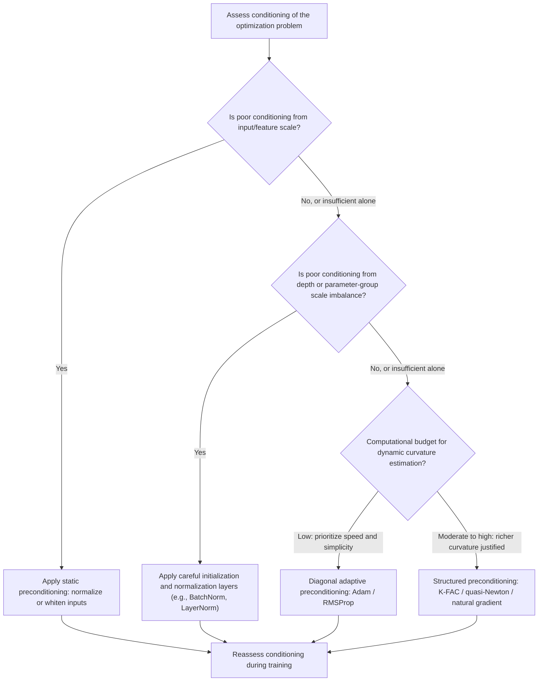

## Conditioning and Preconditioning Techniques

### Overview

The condition number of an optimization problem governs how difficult it is for gradient-based methods to converge efficiently. Poorly conditioned problems cause slow, zig-zagging convergence even when a correct descent direction is followed at every step. Preconditioning is the general strategy of transforming a problem to improve its conditioning before or during optimization, effectively reshaping the geometry so that standard methods behave as though they were solving an easier, better-behaved problem. This topic connects directly to the earlier discussion of second-order and natural gradient methods, since most preconditioners are themselves approximations to curvature.

### The Condition Number

For a convex quadratic objective with Hessian $H$, the condition number is defined as the ratio of the largest to smallest eigenvalue:

$$\kappa(H) = \frac{\lambda_{\max}(H)}{\lambda_{\min}(H)}$$

**Key Points**

- A condition number of $\kappa = 1$ corresponds to a perfectly isotropic (circular, in 2D) bowl-shaped loss surface, where gradient descent converges directly toward the minimum along the shortest path.
- As $\kappa$ grows, the loss surface becomes increasingly elongated (elliptical), and gradient descent's convergence rate degrades. For gradient descent with an optimally chosen fixed step size on a convex quadratic, the convergence rate is governed by $\left(\frac{\kappa - 1}{\kappa + 1}\right)$ per iteration, meaning the number of iterations needed to reach a given accuracy grows roughly linearly with $\kappa$.
- Poor conditioning manifests visibly as zig-zagging trajectories: gradient descent repeatedly overshoots along the high-curvature direction while making only slow progress along the low-curvature direction, since a single step size must serve both directions simultaneously.
- In deep learning, the relevant local curvature is not a fixed matrix, since the loss is non-convex and curvature varies across the parameter space, but conditioning remains a locally meaningful and practically important concept: the local Hessian (or an approximation to it) at any given point still governs how efficiently gradient-based methods can make progress from that point.

### Why Conditioning Degrades in Deep Networks

**Key Points**

- Depth compounds conditioning problems: as discussed in the vanishing/exploding gradient and initialization sections elsewhere in this series, the composition of many layers can produce Hessian eigenvalue spectra with very wide spread, since sensitivity to different parameters at different depths and scales can differ by orders of magnitude.
- Different parameter groups (e.g., weights in early layers versus late layers, weights versus biases, embedding parameters versus dense layer parameters) often have meaningfully different natural curvature scales, meaning a single global learning rate is rarely equally well-suited to all of them simultaneously.
- Highly imbalanced feature or input scales (e.g., unnormalized input data where one feature ranges in the thousands and another ranges between zero and one) directly translate into poor conditioning of the associated weight parameters, which is part of the motivation for input normalization as a preprocessing step.

### The Core Idea of Preconditioning

Preconditioning applies a transformation matrix $P$ to the gradient before taking a step:

$$\theta_{t+1} = \theta_t - \eta P^{-1} \nabla L(\theta_t)$$

**Key Points**

- The goal is to choose $P$ such that $P^{-1}H$ (where $H$ is the true local Hessian) has a condition number close to 1, ideally $P \approx H$, which would recover Newton's method exactly, or at least $P^{-1}H \approx I$ approximately.
- This reframes essentially all of the second-order and adaptive optimization methods discussed elsewhere in this series (Newton's method, quasi-Newton methods, natural gradient, K-FAC, Adam, RMSProp) as instances of a single unifying concept: preconditioned gradient descent, differing primarily in how $P$ is chosen, approximated, and updated over the course of training.
- A perfect preconditioner ($P = H$ exactly) is generally as expensive to compute as solving the original problem directly, so practical preconditioning always involves a tradeoff between how closely $P$ approximates the true curvature and how cheaply $P$ (and particularly $P^{-1}$, or products with it) can be computed and applied.

### Conditioning Before vs. During Optimization

**Static Preconditioning (Problem Reformulation)**

- **Input normalization and standardization**: rescaling input features to have zero mean and unit variance is one of the simplest and most widely used static preconditioning techniques, directly addressing the poor conditioning that arises from heterogeneous input feature scales.
- **Whitening transformations**: more aggressive than simple standardization, whitening (e.g., via PCA or ZCA) transforms input data so that its covariance matrix becomes the identity, removing correlations between features entirely and, in principle, producing an even better-conditioned problem for the layers immediately downstream of the transformed input.
- **Careful weight initialization schemes** (Xavier/Glorot, He initialization, covered elsewhere in this series) can be understood partly through a conditioning lens: they aim to keep the scale of activations and gradients consistent across layers at the start of training, which helps avoid a poorly conditioned starting point even before any adaptive curvature information has been gathered.

**Dynamic Preconditioning (During Optimization)**

- **Adaptive per-parameter methods** (Adam, RMSProp, Adagrad) construct a diagonal preconditioner on the fly from accumulated statistics of past gradients, adapting the effective step size for each parameter individually based on that parameter's observed gradient history.
- **Curvature-aware methods** (K-FAC, Hessian-free optimization, quasi-Newton methods) construct richer, non-diagonal preconditioners during training, as covered in depth in the second-order methods section of this series.
- **Batch normalization** (covered elsewhere in this series) can also be understood partly as a dynamic conditioning technique: by normalizing layer inputs during training itself, it modifies the effective local curvature seen by the optimizer at every layer, contributing to its landscape-smoothing effect.

### Diagonal Preconditioning: Adagrad, RMSProp, and Adam

Diagonal preconditioners are the most computationally practical class for large-scale deep learning, since they require only $O(n)$ storage and computation rather than the $O(n^2)$ or worse required by full-matrix approaches.

**Key Points**

- **Adagrad** accumulates the sum of squared gradients per parameter over all of training, using the (inverse square root of the) accumulated sum as a per-parameter preconditioner: $\theta_{t+1,i} = \theta_{t,i} - \frac{\eta}{\sqrt{G_{t,i}} + \epsilon} g_{t,i}$, where $G_{t,i} = \sum_{\tau \leq t} g_{\tau,i}^2$.
- This construction gives Adagrad a useful property for sparse features (parameters that receive infrequent but occasionally large gradients accumulate a smaller $G_{t,i}$ and thus retain a relatively larger effective learning rate), but it also causes the effective learning rate to shrink monotonically and eventually become very small over long training runs, since $G_{t,i}$ only ever grows.
- **RMSProp** addresses Adagrad's monotonic decay problem by replacing the full historical sum with an exponential moving average of squared gradients, allowing the preconditioner to adapt to more recent gradient behavior rather than being dominated by the entire training history.
- **Adam** combines RMSProp-style second-moment (squared gradient) preconditioning with first-moment momentum, and is, from the preconditioning perspective covered here, best understood as applying a diagonal, exponentially-adapted approximation to curvature alongside a momentum-based descent direction.
- Diagonal preconditioners, by construction, cannot capture correlations between parameters (off-diagonal curvature), which is precisely the information that richer methods like K-FAC attempt to recover at additional computational cost.

### Visualizing the Effect of Preconditioning

<svg xmlns="http://www.w3.org/2000/svg" viewBox="0 0 900 340">
<text x="450" y="30" text-anchor="middle" font-size="18" font-weight="bold" fill="#1a1a1a">Optimization Trajectory: Poorly Conditioned vs. Preconditioned (svg_diagram)</text>
<g transform="translate(50,60)">
<text x="180" y="15" text-anchor="middle" font-size="14" font-weight="bold" fill="#1a1a1a">Poorly Conditioned (kappa large)</text>
<ellipse cx="180" cy="150" rx="160" ry="60" fill="none" stroke="#999" stroke-width="1" />
<ellipse cx="180" cy="150" rx="110" ry="40" fill="none" stroke="#999" stroke-width="1" />
<ellipse cx="180" cy="150" rx="60" ry="20" fill="none" stroke="#999" stroke-width="1" />
<circle cx="180" cy="150" r="4" fill="#16a34a" />
<path d="M 40 90 L 100 195 L 60 105 L 120 190 L 100 120 L 150 165 L 175 148" stroke="#dc2626" stroke-width="2" fill="none" />
<circle cx="40" cy="90" r="4" fill="#1a1a1a" />
<text x="180" y="240" text-anchor="middle" font-size="12" fill="#333">Zig-zag path across narrow valley</text>
<text x="180" y="258" text-anchor="middle" font-size="12" fill="#333">Slow convergence</text>
</g>
<g transform="translate(470,60)">
<text x="180" y="15" text-anchor="middle" font-size="14" font-weight="bold" fill="#1a1a1a">Preconditioned (kappa near 1)</text>
<circle cx="180" cy="150" r="140" fill="none" stroke="#999" stroke-width="1" />
<circle cx="180" cy="150" r="95" fill="none" stroke="#999" stroke-width="1" />
<circle cx="180" cy="150" r="50" fill="none" stroke="#999" stroke-width="1" />
<circle cx="180" cy="150" r="4" fill="#16a34a" />
<path d="M 40 40 L 180 150" stroke="#dc2626" stroke-width="2" fill="none" />
<circle cx="40" cy="40" r="4" fill="#1a1a1a" />
<text x="180" y="240" text-anchor="middle" font-size="12" fill="#333">Near-direct path to minimum</text>
<text x="180" y="258" text-anchor="middle" font-size="12" fill="#333">Fast convergence</text>
</g>
</svg>

### Preconditioning in the Context of Second-Order Methods

**Key Points**

- Full Newton's method uses the exact inverse Hessian, $P = H$, as its preconditioner, which is optimal in terms of per-step progress on a quadratic problem but generally intractable at deep learning scale, as covered in the second-order methods section.
- Quasi-Newton methods (BFGS, L-BFGS) build an approximate preconditioner incrementally from observed gradient differences, without ever forming the true Hessian.
- Natural gradient methods use the Fisher Information Matrix as the preconditioner, chosen for its distributional interpretation and guaranteed positive semi-definiteness, and K-FAC provides a computationally tractable, structured approximation to this preconditioner.
- Viewed together, the entire spectrum of second-order and adaptive methods can be organized along a single axis: how much curvature information the preconditioner captures (diagonal-only, block-structured, or full-matrix), trading off approximation fidelity against computational cost, exactly as discussed in the earlier second-order methods section.

### Preconditioning and Learning Rate Selection

**Key Points**

- A well-chosen preconditioner reduces the practical burden of learning rate tuning, since much of what a global learning rate must otherwise compensate for (different natural scales across parameters or directions) is instead handled directly by the preconditioner itself.
- This is part of the practical explanation for why adaptive optimizers like Adam are often described as more forgiving of learning rate choice than plain SGD: the diagonal preconditioning built into Adam already normalizes for much of the per-parameter scale variation that would otherwise require careful manual tuning of a single global rate. [Inference — "more forgiving" is a widely echoed practical characterization in the literature and community practice, but the degree of forgiveness is architecture- and task-dependent, and Adam still requires reasonable learning rate selection in practice.]
- Conversely, a poor or stale preconditioner (e.g., curvature statistics that no longer reflect the current local landscape, particularly after a large change in the loss surface) can misdirect updates, which is one reason exponential moving averages (as in RMSProp and Adam) are generally preferred over methods that accumulate curvature statistics over the entire training history without decay.

### Practical Preconditioning Techniques Summary

**Key Points**

- **Input and feature normalization**: static preconditioning applied once, before training, addressing input-scale-driven conditioning problems.
- **Weight initialization schemes**: static preconditioning of the starting point, addressing depth-driven scale imbalance at initialization.
- **Batch normalization and related normalization layers**: dynamic, learned preconditioning-like effects applied throughout training at intermediate layers.
- **Diagonal adaptive optimizers (Adagrad, RMSProp, Adam)**: cheap, per-parameter dynamic preconditioning based on gradient history.
- **Structured/full-matrix curvature methods (K-FAC, quasi-Newton, Hessian-free, natural gradient)**: richer dynamic preconditioning that captures parameter correlations, at higher computational cost.
- **Learning rate schedules and warmup**: while not preconditioners in the strict matrix sense, they interact closely with conditioning, since an appropriately scaled learning rate is what allows a given preconditioner (or the identity, in plain SGD) to be used stably.

### Preconditioning Selection Workflow

### Conclusion

Conditioning determines how efficiently gradient-based optimization can navigate the loss landscape, with poorly conditioned problems producing slow, zig-zagging convergence regardless of how correct the descent direction is at each step. Preconditioning, applied statically through input normalization and initialization, or dynamically through adaptive optimizers, batch normalization, and curvature-aware methods, is the general strategy for improving this conditioning. Framing the wide range of optimization techniques covered elsewhere in this series (Adam, RMSProp, K-FAC, natural gradient, quasi-Newton methods) as different instances of preconditioned gradient descent reveals a unifying structure: each method represents a different tradeoff between how much curvature information is captured and how cheaply that information can be obtained and applied during large-scale deep learning training.

**Related Topics**

- Second-order and natural gradient methods (cross-reference)
- Batch normalization effects on optimization (cross-reference)
- Weight initialization schemes and their conditioning implications
- Input normalization and whitening transformations
- Learning rate schedules and their interaction with preconditioning
- Adagrad, RMSProp, and Adam as diagonal preconditioning methods
- Eigenvalue spectra of neural network Hessians
- Sharpness-aware minimization and its relationship to curvature