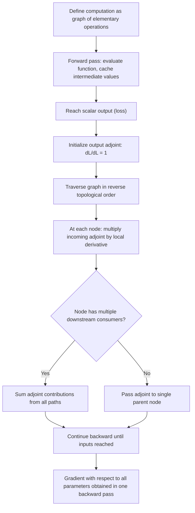

## Automatic Differentiation Principles

### Overview

Automatic differentiation (autodiff) is the computational technique underlying gradient-based optimization in modern deep learning frameworks. It computes exact derivatives of programs, not approximations, by systematically applying the chain rule across the sequence of elementary operations that make up a computation. Understanding autodiff's mechanics clarifies why backpropagation is efficient, what its actual computational costs are, and where numerical or structural pitfalls can arise in practice.

### Distinguishing Autodiff from Alternatives

**Key Points**

- **Numerical differentiation** approximates derivatives using finite differences, e.g., $\frac{\partial L}{\partial \theta_i} \approx \frac{L(\theta + \epsilon e_i) - L(\theta)}{\epsilon}$. This is simple to implement but suffers from a fundamental accuracy-versus-stability tradeoff: too large an $\epsilon$ introduces truncation error, while too small an $\epsilon$ introduces catastrophic cancellation and floating point rounding error, as discussed in the numerical stability section of this series. It also requires a separate forward evaluation per parameter, making it computationally infeasible for the millions of parameters in a deep network.
- **Symbolic differentiation** manipulates mathematical expressions directly (as a computer algebra system would) to produce an exact closed-form derivative expression. This is exact but can suffer from expression swell, where the symbolic derivative of a composed function becomes exponentially larger and more redundant than the original function, particularly for expressions with significant shared substructure.
- **Automatic differentiation** avoids both pitfalls: it computes exact numerical derivative values (not symbolic expressions, and not approximations) by decomposing a computation into a sequence of elementary operations with known derivatives, then systematically composing those elementary derivatives via the chain rule. It shares symbolic differentiation's exactness while avoiding expression swell by reusing intermediate computations, and it shares numerical differentiation's direct numerical output while avoiding truncation and cancellation error.

### The Computational Graph

Any differentiable program can be represented as a computational graph, a directed acyclic graph (DAG) in which nodes represent variables (inputs, intermediate values, and outputs) and edges represent elementary operations connecting them.

**Key Points**

- Every node in the graph corresponds to a value computed from an elementary operation (addition, multiplication, exponentiation, standard nonlinearities, etc.) whose local derivative is known in closed form.
- The full computation, however complex, is expressed as a composition of these elementary operations, which is what allows the chain rule to be applied mechanically and systematically across the entire graph rather than requiring a hand-derived global derivative expression.
- Modern deep learning frameworks construct this graph either statically ahead of time (define-and-run, as in earlier TensorFlow graph mode) or dynamically as operations execute (define-by-run, as in PyTorch's eager mode and modern TensorFlow), a distinction that affects flexibility and debugging but not the underlying mathematical mechanism of autodiff itself.

### Forward Mode Automatic Differentiation

Forward mode autodiff computes derivatives by propagating derivative information alongside values, in the same direction as the original computation (from inputs to outputs).

**Key Points**

- Each intermediate variable $v_i$ is augmented with a derivative value $\dot{v}_i = \frac{\partial v_i}{\partial x_j}$ with respect to a chosen input $x_j$, and both the value and its derivative are propagated together through the graph via the chain rule at each elementary operation.
- A single forward pass computes the derivative of every output with respect to *one* chosen input variable (or one input direction, more precisely). To obtain the full gradient with respect to all $n$ input parameters, forward mode requires $n$ separate forward passes, one per input dimension.
- This makes forward mode efficient when the number of inputs is small relative to the number of outputs, but highly inefficient for deep learning, where the loss is a single scalar output but the number of input parameters can reach into the billions.

### Reverse Mode Automatic Differentiation

Reverse mode autodiff, which backpropagation is a specific application of, computes derivatives by first performing a forward pass to compute and store all intermediate values, then propagating derivative information backward from the output to the inputs.

**Key Points**

- The forward pass proceeds exactly as normal computation, evaluating the function and recording (caching) the intermediate values needed later.
- The backward pass then computes, for each node, the derivative of the final scalar output with respect to that node's value, this quantity is often called the "adjoint" or, in deep learning terminology, simply "the gradient" flowing through that node, propagating from the output back toward the inputs using the chain rule at each step in reverse.
- Critically, a single backward pass computes the derivative of the (single, scalar) output with respect to *all* input parameters simultaneously, regardless of how many parameters there are.
- This is precisely why reverse mode is the standard choice for deep learning: the loss is a single scalar, and the number of parameters is enormous, exactly the regime (few outputs, many inputs) where reverse mode's single-pass-for-all-inputs property is maximally advantageous, and forward mode's single-pass-for-all-outputs property is not useful.

### The Chain Rule Mechanics of Reverse Mode

For a composed function, if $y = f(u)$ and $u = g(x)$, the chain rule states:

$$\frac{\partial y}{\partial x} = \frac{\partial y}{\partial u} \cdot \frac{\partial u}{\partial x}$$

**Key Points**

- Reverse mode applies this rule systematically at every node in the computational graph, starting from the output where $\frac{\partial L}{\partial L} = 1$ trivially, and working backward.
- At each node, the incoming adjoint (the accumulated derivative of the loss with respect to that node's output) is multiplied by the node's local derivative (with respect to each of its inputs) and passed further backward to that node's input nodes.
- When a node's output feeds into multiple downstream operations (i.e., the node has multiple children in the graph, referred to as a variable being "reused"), the adjoints arriving from each downstream path are summed at that node, reflecting the multivariate chain rule's requirement to sum contributions across all paths by which a variable influences the final output.
- This summation-at-reuse behavior is precisely why, for example, a weight matrix shared across multiple layers (as in weight-tied architectures) or a residual connection (where a value contributes to the output both directly and through further transformation) correctly accumulates gradient contributions from every path.

### Forward vs. Reverse Mode

<svg xmlns="http://www.w3.org/2000/svg" viewBox="0 0 900 340">
<text x="450" y="30" text-anchor="middle" font-size="18" font-weight="bold" fill="#1a1a1a">Forward Mode vs. Reverse Mode Autodiff (svg_diagram)</text>
<g transform="translate(50,60)">
<text x="180" y="15" text-anchor="middle" font-size="14" font-weight="bold" fill="#1a1a1a">Forward Mode</text>
<rect x="20" y="50" width="60" height="30" fill="#dbeafe" stroke="#2563eb" />
<text x="50" y="70" text-anchor="middle" font-size="11">x1</text>
<rect x="20" y="100" width="60" height="30" fill="#dbeafe" stroke="#2563eb" />
<text x="50" y="120" text-anchor="middle" font-size="11">x2</text>
<rect x="160" y="75" width="60" height="30" fill="#bfdbfe" stroke="#2563eb" />
<text x="190" y="95" text-anchor="middle" font-size="11">v1</text>
<rect x="300" y="75" width="60" height="30" fill="#93c5fd" stroke="#2563eb" />
<text x="330" y="95" text-anchor="middle" font-size="11">y</text>
<path d="M80,65 L160,85" stroke="#2563eb" stroke-width="2" marker-end="url(#arrow1)" />
<path d="M80,115 L160,95" stroke="#2563eb" stroke-width="2" marker-end="url(#arrow1)" />
<path d="M220,90 L300,90" stroke="#2563eb" stroke-width="2" marker-end="url(#arrow1)" />
<text x="180" y="180" text-anchor="middle" font-size="12" fill="#333">Value + derivative propagate together</text>
<text x="180" y="198" text-anchor="middle" font-size="12" fill="#333">One pass per input (n passes for n inputs)</text>
<text x="180" y="220" text-anchor="middle" font-size="12" fill="#333">Efficient: few inputs, many outputs</text>
</g>
<g transform="translate(470,60)">
<text x="180" y="15" text-anchor="middle" font-size="14" font-weight="bold" fill="#1a1a1a">Reverse Mode (Backprop)</text>
<rect x="20" y="50" width="60" height="30" fill="#dcfce7" stroke="#16a34a" />
<text x="50" y="70" text-anchor="middle" font-size="11">x1</text>
<rect x="20" y="100" width="60" height="30" fill="#dcfce7" stroke="#16a34a" />
<text x="50" y="120" text-anchor="middle" font-size="11">x2</text>
<rect x="160" y="75" width="60" height="30" fill="#bbf7d0" stroke="#16a34a" />
<text x="190" y="95" text-anchor="middle" font-size="11">v1</text>
<rect x="300" y="75" width="60" height="30" fill="#86efac" stroke="#16a34a" />
<text x="330" y="95" text-anchor="middle" font-size="11">L</text>
<path d="M160,90 L80,68" stroke="#dc2626" stroke-width="2" marker-end="url(#arrow2)" />
<path d="M160,95 L80,118" stroke="#dc2626" stroke-width="2" marker-end="url(#arrow2)" />
<path d="M300,90 L220,90" stroke="#dc2626" stroke-width="2" marker-end="url(#arrow2)" />
<text x="180" y="180" text-anchor="middle" font-size="12" fill="#333">Forward pass caches values, then backward</text>
<text x="180" y="198" text-anchor="middle" font-size="12" fill="#333">One pass for all inputs (given scalar output)</text>
<text x="180" y="220" text-anchor="middle" font-size="12" fill="#333">Efficient: many inputs, few outputs</text>
</g>
</svg>

### Computational Cost Analysis

**Key Points**

- For a function with $n$ inputs and $m$ outputs, forward mode requires $O(n)$ passes (one per input direction) while reverse mode requires $O(m)$ passes (one per output direction), each individual pass having a cost roughly proportional to the cost of the original function evaluation.
- In deep learning, $m = 1$ (a single scalar loss) and $n$ can be in the millions to billions, so reverse mode's single-pass cost, roughly a small constant multiple (typically cited as 2-5x, depending on the operations involved) of a single forward pass's cost, is dramatically cheaper than the $O(n)$ passes forward mode would require.
- This asymmetry, not any difference in the accuracy or generality of the two approaches, is the entire reason reverse mode (backpropagation) rather than forward mode dominates practical deep learning, since both modes are equally exact.
- The primary cost of reverse mode is memory rather than compute: because the backward pass needs the intermediate values computed during the forward pass, those values must be cached, leading to memory usage that scales with the depth and intermediate activation sizes of the network, a cost that motivates techniques such as gradient checkpointing.

### Gradient Checkpointing (Activation Recomputation)

**Key Points**

- Gradient checkpointing trades additional compute for reduced memory by deliberately discarding some intermediate activations during the forward pass rather than caching all of them, and recomputing the discarded values on demand during the backward pass when they are needed.
- This allows training of deeper or larger models than would otherwise fit in available accelerator memory, at the cost of extra forward computation, since some portions of the forward pass are effectively run twice.
- The specific choice of which activations to checkpoint versus recompute represents a memory-compute tradeoff that can be tuned; common strategies include checkpointing at regular intervals (e.g., every $k$-th layer) so that the recomputation cost for any given backward step remains bounded.

### Higher-Order Derivatives

**Key Points**

- Autodiff can be applied recursively to compute higher-order derivatives (e.g., Hessians or Hessian-vector products), by differentiating the computational graph of a first derivative computation itself, since the derivative computation is, in principle, just another differentiable program.
- **Forward-over-reverse** and **reverse-over-reverse** are common strategies for combining the two modes to compute second-order quantities efficiently; for instance, Hessian-vector products, used in Hessian-free optimization as discussed in the second-order methods section of this series, can be computed efficiently via a forward-mode pass composed with a reverse-mode pass, avoiding the need to ever materialize the full Hessian matrix.
- This recursive applicability is precisely what makes techniques like the Pearlmutter trick (referenced in the earlier Hessian-free optimization discussion) practical: it is a specific, efficient composition of forward and reverse mode autodiff rather than a fundamentally separate technique.

### Practical Considerations and Pitfalls

**Key Points**

- **Non-differentiable operations**: operations such as $\max$, $\text{ReLU}$, absolute value, or indexing/rounding operations are not differentiable everywhere (they have kinks or discontinuities). Frameworks handle this by defining a subgradient or a convention at the non-differentiable point (e.g., ReLU's derivative is conventionally defined as 0 at exactly $x=0$, an arbitrary but standard choice among the valid subgradients), which is mathematically a convention rather than a true derivative at that isolated point, but works correctly in practice because such exact points are measure-zero and rarely landed on precisely in floating point arithmetic.
- **In-place operations**: modifying a tensor in place after it has been used in the forward computation graph can corrupt the cached values needed for the backward pass, since autodiff relies on those cached intermediate values remaining unchanged until the backward pass consumes them; most frameworks include specific error-checking to detect and flag this hazard.
- **Detaching from the graph**: deliberately stopping gradient flow at a certain point (commonly via a "stop gradient" or "detach" operation) is a standard and often necessary technique, used for purposes such as preventing gradients from flowing into a target network in certain reinforcement learning setups, or implementing straight-through estimators for otherwise non-differentiable operations.
- **Custom gradients**: frameworks generally allow manually specifying the backward-pass behavior for an operation, overriding the default autodiff-derived computation, which is necessary for operations without a well-defined or numerically stable default derivative, or for implementing specialized techniques like the straight-through estimator mentioned above.

### Autodiff and the Optimization Methods Covered in This Series

**Key Points**

- Every gradient-based optimizer discussed elsewhere in this series (SGD, momentum, Adam, RMSProp) relies on reverse-mode autodiff to obtain the $\nabla L(\theta)$ term used in their respective update rules; autodiff is the mechanism that supplies the raw gradient, while the optimizer determines how that gradient is subsequently used.
- Second-order and natural gradient methods, covered in an earlier section, depend on autodiff's extensibility to higher-order derivatives (Hessian-vector products) discussed above, which is what makes Hessian-free optimization and similar approaches computationally tractable without ever forming an explicit Hessian matrix.
- Numerical stability considerations discussed elsewhere in this series (catastrophic cancellation, overflow/underflow) apply directly to the values computed and cached during autodiff's forward and backward passes, since these are ordinary floating point computations subject to the same finite-precision behavior as any other arithmetic in the training pipeline.

### Reverse Mode Autodiff Workflow

### Conclusion

Automatic differentiation is the computational foundation that makes gradient-based optimization of large-scale models feasible: it computes exact derivatives by systematically applying the chain rule across a computational graph of elementary operations, avoiding the accuracy limitations of numerical differentiation and the expression swell of symbolic differentiation. Reverse mode, the mathematical basis of backpropagation, is favored in deep learning specifically because it computes gradients with respect to arbitrarily many parameters in a single backward pass, exactly matching the many-inputs, one-output structure of a typical training loss. This efficiency comes with a memory cost tied to caching intermediate values, which techniques like gradient checkpointing address by trading additional recomputation for reduced memory footprint, and autodiff's recursive applicability extends naturally to the higher-order derivative computations required by the second-order optimization methods covered earlier in this series.

**Related Topics**

- Backpropagation algorithm details and layer-wise gradient derivation
- Gradient checkpointing and memory-compute tradeoffs in large model training
- Second-order and natural gradient methods (cross-reference)
- Vanishing and exploding gradients through deep computational graphs
- Floating point arithmetic and numerical stability (cross-reference)
- Straight-through estimators and gradient approximation for non-differentiable operations
- Just-in-time compilation and graph optimization in deep learning frameworks
- Jacobian-vector products and vector-Jacobian products in modern autodiff libraries