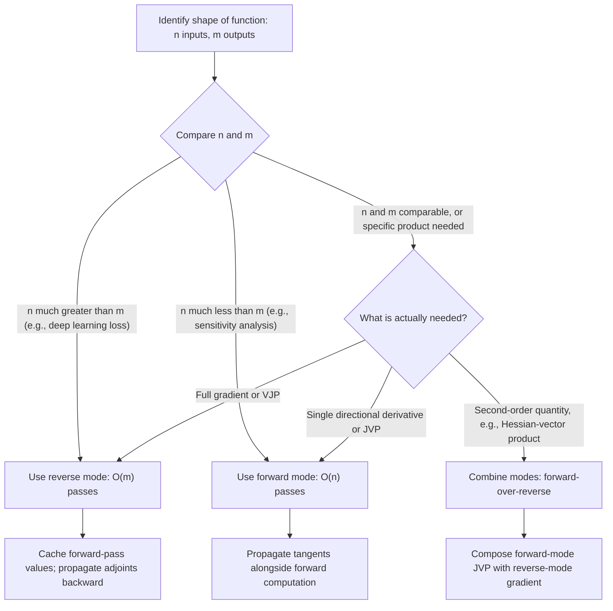

## Forward Mode Versus Reverse Mode Differentiation

### Overview

Forward mode and reverse mode are the two fundamental strategies for automatic differentiation, differing in the direction they traverse a computational graph and in how they apply the chain rule to accumulate derivatives. Both compute mathematically exact derivatives, so the choice between them is entirely a question of computational efficiency, which depends on the relative number of inputs and outputs of the function being differentiated. This topic builds directly on the general autodiff principles covered earlier in this series, focusing specifically on the structural and computational contrast between the two modes.

### The Shared Foundation: The Chain Rule

Both modes rely on the same underlying mathematical fact, the multivariate chain rule, applied to a composed function represented as a computational graph. For a chain of operations $x \to v_1 \to v_2 \to \cdots \to y$, the total derivative is:

$$\frac{\partial y}{\partial x} = \frac{\partial y}{\partial v_{k}} \cdot \frac{\partial v_k}{\partial v_{k-1}} \cdots \frac{\partial v_2}{\partial v_1} \cdot \frac{\partial v_1}{\partial x}$$

**Key Points**

- The two modes differ only in the *order* in which this product of local derivatives (often called Jacobians, at each step) is evaluated and accumulated: left-to-right or right-to-left.
- Because matrix multiplication is associative, both orderings produce the same final mathematical result; the difference lies entirely in the intermediate computational cost of evaluating the chain of products in each order.
- This associativity is the crux of why choosing the right mode is a computational, not mathematical, decision. The optimal parenthesization of a chain of matrix products is itself a classical problem in computational complexity (the matrix chain multiplication problem), and forward versus reverse mode can be understood as two specific, fixed parenthesization strategies for this chain.

### Forward Mode: Propagating Derivatives Alongside Values

Forward mode computes derivatives in the same direction as the original (primal) computation, from inputs toward outputs.

**Key Points**

- Each variable $v_i$ in the computation is paired with a "tangent" value $\dot v_i = \frac{\partial v_i}{\partial x_j}$, representing its derivative with respect to one selected input $x_j$ (or, more generally, with respect to a chosen input direction).
- At each elementary operation, the tangent is propagated using the local chain rule: if $v_k = f(v_i, v_j)$, then $\dot v_k = \frac{\partial f}{\partial v_i}\dot v_i + \frac{\partial f}{\partial v_j}\dot v_j$, computed at the same time as the primal value $v_k$ itself.
- A single forward-mode pass, seeded with $\dot x_j = 1$ for one chosen input and $\dot x_i = 0$ for all others, yields the derivative of *every* output with respect to that *one* input.
- To obtain the full Jacobian (derivatives of all outputs with respect to all inputs), forward mode requires one pass per input dimension, giving a total cost of $O(n)$ passes for $n$ inputs, largely independent of the number of outputs $m$.
- Because forward mode computes tangents alongside primal values in a single unified traversal, it does not require storing (caching) intermediate values for a separate later pass, giving it a favorable, low, roughly constant memory overhead relative to a plain forward evaluation of the function.

### Reverse Mode: Propagating Derivatives Backward

Reverse mode computes derivatives in the opposite direction from the original computation: it first executes a full forward pass (caching intermediate values), then propagates derivative information backward from outputs toward inputs.

**Key Points**

- Each variable $v_i$ is paired with an "adjoint" $\bar v_i = \frac{\partial y_k}{\partial v_i}$, representing the derivative of one selected output $y_k$ with respect to that intermediate variable, seeded at the output with $\bar y_k = 1$.
- At each elementary operation, adjoints are propagated backward: if $v_k$ feeds into $v_m$, the contribution $\bar v_k \mathrel{+}= \bar v_m \cdot \frac{\partial v_m}{\partial v_k}$ is accumulated, summing contributions from every downstream path that $v_k$ influences, as discussed in the general autodiff principles section.
- A single backward pass, seeded from one chosen output, yields the derivative of that *one* output with respect to *every* input simultaneously.
- To obtain the full Jacobian, reverse mode requires one pass per output dimension, giving a total cost of $O(m)$ passes for $m$ outputs, largely independent of the number of inputs $n$.
- Reverse mode requires caching intermediate values from the forward pass for use during the backward pass, giving it memory overhead that scales with the depth and size of the computation, in contrast to forward mode's low memory overhead. This is the source of the memory cost discussed in the general autodiff section and the motivation for gradient checkpointing.

### Side-by-Side Comparison

| Property | Forward Mode | Reverse Mode |
| --- | --- | --- |
| Traversal direction | Same as primal computation | Opposite of primal computation |
| Quantity propagated | Tangent ($\partial v_i / \partial x_j$) | Adjoint ($\partial y_k / \partial v_i$) |
| Passes needed for full Jacobian | $O(n)$, one per input | $O(m)$, one per output |
| Best suited for | Few inputs, many outputs ($n \ll m$) | Many inputs, few outputs ($n \gg m$) |
| Memory overhead | Low; no need to cache intermediates | Higher; must cache forward-pass values |
| Typical deep learning use | Rare; used for specific Jacobian-vector products | Standard; basis of backpropagation |

### Why Reverse Mode Dominates Deep Learning

**Key Points**

- A typical deep learning training loss is a single scalar ($m = 1$), while the number of trainable parameters ($n$) routinely reaches into the millions or billions.
- This places deep learning training squarely in the regime where reverse mode's $O(m) = O(1)$ pass requirement is dramatically cheaper than forward mode's $O(n)$ requirement, which is precisely why reverse mode, under the name backpropagation, is the standard mechanism in essentially all deep learning frameworks, as established in the general autodiff principles section of this series.
- The relevant asymmetry is specifically the *ratio* of outputs to inputs, not an intrinsic superiority of reverse mode; the conclusion reverses in problems where $n \ll m$, discussed next.

### Visual Comparison

<svg xmlns="http://www.w3.org/2000/svg" viewBox="0 0 900 380">
<text x="450" y="30" text-anchor="middle" font-size="18" font-weight="bold" fill="#1a1a1a">Cost Scaling: Forward vs. Reverse Mode (svg_diagram)</text>
<g transform="translate(60,60)">
<text x="180" y="15" text-anchor="middle" font-size="14" font-weight="bold" fill="#1a1a1a">Few Inputs, Many Outputs (n=2, m=100)</text>
<rect x="20" y="50" width="50" height="180" fill="#dbeafe" stroke="#2563eb" />
<text x="45" y="145" text-anchor="middle" font-size="11" fill="#1a1a1a" transform="rotate(-90,45,145)">2 inputs</text>
<rect x="290" y="50" width="50" height="180" fill="#bfdbfe" stroke="#2563eb" />
<text x="315" y="145" text-anchor="middle" font-size="10" fill="#1a1a1a" transform="rotate(-90,315,145)">100 outputs</text>
<text x="180" y="260" text-anchor="middle" font-size="12" fill="#16a34a" font-weight="bold">Forward mode wins: 2 passes</text>
<text x="180" y="278" text-anchor="middle" font-size="12" fill="#dc2626">Reverse mode: 100 passes</text>
</g>
<g transform="translate(490,60)">
<text x="180" y="15" text-anchor="middle" font-size="14" font-weight="bold" fill="#1a1a1a">Many Inputs, One Output (n=1M, m=1)</text>
<rect x="20" y="50" width="50" height="180" fill="#dcfce7" stroke="#16a34a" />
<text x="45" y="145" text-anchor="middle" font-size="9" fill="#1a1a1a" transform="rotate(-90,45,145)">1M params</text>
<rect x="290" y="50" width="50" height="180" fill="#bbf7d0" stroke="#16a34a" />
<text x="315" y="145" text-anchor="middle" font-size="11" fill="#1a1a1a" transform="rotate(-90,315,145)">1 loss</text>
<text x="180" y="260" text-anchor="middle" font-size="12" fill="#16a34a" font-weight="bold">Reverse mode wins: 1 pass</text>
<text x="180" y="278" text-anchor="middle" font-size="12" fill="#dc2626">Forward mode: 1M passes</text>
</g>
</svg>

### When Forward Mode Is Preferred

**Key Points**

- **Jacobian-vector products (JVPs)**: forward mode directly and efficiently computes the product $Jv$ of the full Jacobian with a given vector $v$, without ever forming the full Jacobian matrix, useful whenever only a specific directional derivative is needed rather than the full gradient.
- **Functions with few inputs and many outputs**: this includes, notably, sensitivity analysis problems where a small number of physical parameters affect a large simulated output field, a setting common in scientific computing and engineering optimization outside the typical deep learning training context.
- **Computing full Jacobians for low-dimensional input**: when $n$ is small (a handful of inputs) regardless of $m$, forward mode's $O(n)$ pass cost is cheap in absolute terms, and its lower memory overhead can make it preferable even in settings where reverse mode would also be tractable.
- **As a component of second-order computations**: as discussed in the general autodiff principles section, efficient Hessian-vector products are often computed via a *combination* of forward and reverse mode (forward-over-reverse), exploiting forward mode's efficient JVP computation composed with a reverse-mode gradient computation, rather than using either mode in isolation.

### When Reverse Mode Is Preferred

**Key Points**

- **Standard deep learning training**: the many-inputs, one-output structure of a training loss is the canonical case favoring reverse mode, as established above.
- **Vector-Jacobian products (VJPs)**: reverse mode directly and efficiently computes the product $v^\top J$ of a vector with the full Jacobian, without forming the full Jacobian matrix, which is precisely the operation backpropagation performs at each layer when propagating an upstream gradient signal backward.
- **Any setting with few outputs relative to inputs**: this generalizes beyond deep learning to other many-parameter, few-objective optimization problems, such as fitting a model with many parameters to minimize a small number of aggregate loss or constraint terms.

### Mixed and Hybrid Strategies

**Key Points**

- Neither mode is strictly superior in general; the optimal strategy depends on the specific shape ($n$ versus $m$) of the function being differentiated, and some computational graphs benefit from applying different modes to different portions of the graph.
- **Checkpointing combined with mode selection**: in very deep or wide computational graphs, practical autodiff systems may combine reverse mode's overall structure (dictated by the many-inputs-one-output shape of deep learning) with forward-mode sub-computations for specific efficient JVP calculations needed internally, such as within certain second-order optimization routines discussed in the second-order methods section of this series.
- **Edge pushing and cross-country elimination**: more advanced autodiff research considers the general problem of finding the cheapest way to accumulate the chain rule across an arbitrary computational graph, of which pure forward mode and pure reverse mode are just two specific, easily implementable strategies among a larger space of possible accumulation orders. [Unverified as a widely deployed production technique — cross-country elimination and related optimal Jacobian accumulation strategies remain a more specialized and actively researched area compared to the two standard modes, and are not commonly exposed as user-facing options in mainstream deep learning frameworks.]

### Framework Implementation Notes

**Key Points**

- Mainstream deep learning frameworks (PyTorch, TensorFlow, JAX) implement reverse mode as their primary, default differentiation mechanism, since it is the mode required for efficient gradient-based training of large models.
- Several modern frameworks, notably JAX, additionally expose forward mode as an explicit, first-class user-facing capability (e.g., via JVP-based transformations), reflecting the value of forward mode for the specific use cases described above, such as computing Hessian-vector products or handling functions with few inputs. [Behavior may vary by framework and version; specific API names and availability are implementation details outside the scope of the general principles covered here.]
- The internal engineering distinction between "eager" (define-by-run) and "graph-based" (define-and-run) execution, discussed briefly in the general autodiff principles section, is orthogonal to the forward-versus-reverse mode distinction: both modes can, in principle, be implemented under either execution paradigm.

### Selecting a Differentiation Mode

### Conclusion

Forward mode and reverse mode differentiation are mathematically equivalent, exact strategies for applying the chain rule across a computational graph, differing only in traversal direction and the resulting computational cost profile. Forward mode propagates tangents alongside the primal computation and scales with the number of inputs, making it efficient for functions with few inputs and many outputs, while reverse mode propagates adjoints backward after a cached forward pass and scales with the number of outputs, making it efficient for the many-inputs, single-output structure characteristic of deep learning training losses. This asymmetry, rather than any difference in accuracy, is why reverse mode (backpropagation) is the dominant mechanism in deep learning, while forward mode retains an important, specialized role in efficient Jacobian-vector product computation and as a component of hybrid strategies for second-order derivative computation.

**Related Topics**

- Automatic differentiation principles (cross-reference)
- Jacobian-vector products and vector-Jacobian products in modern autodiff libraries
- Hessian-vector products and forward-over-reverse differentiation
- Gradient checkpointing and memory-compute tradeoffs
- Second-order and natural gradient methods (cross-reference)
- Computational graph construction: define-and-run versus define-by-run paradigms
- Matrix chain multiplication and optimal Jacobian accumulation strategies
- JAX-style function transformations (grad, jvp, vjp) as a case study in mode selection