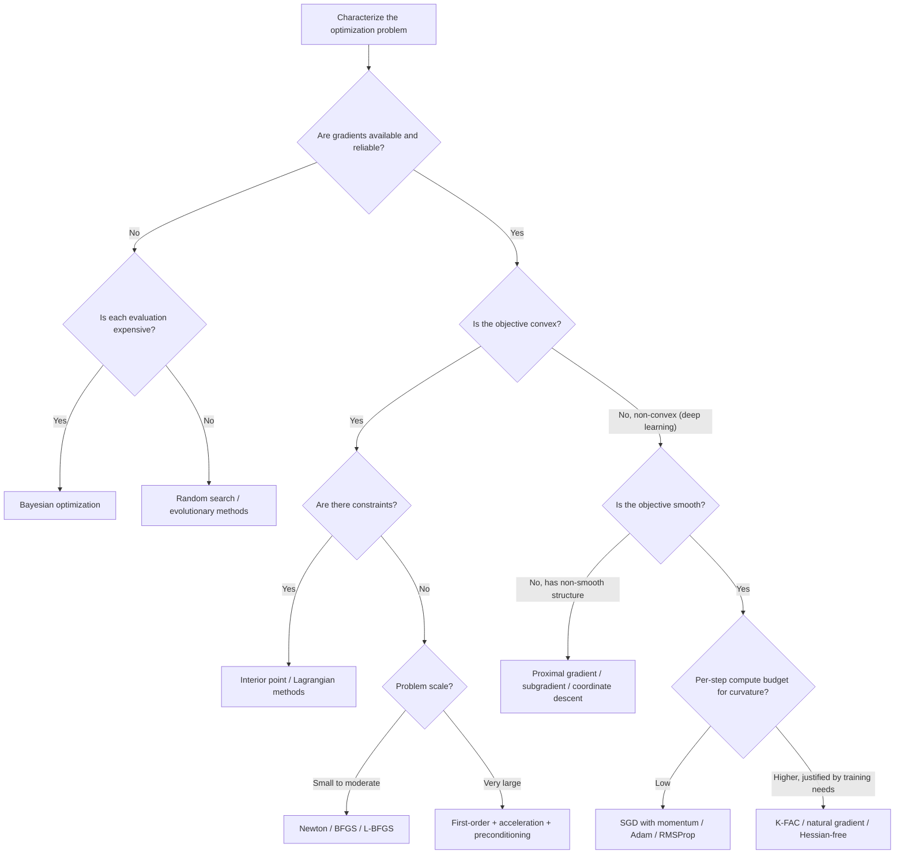

## Solver Selection Criteria for Different Problem Classes

### Overview

No single optimization algorithm performs best across all problem types; solver selection is itself a structured decision that depends on the mathematical properties of the objective function and constraints, the scale of the problem, and practical resource constraints. This section synthesizes the algorithmic families covered throughout this series, first-order methods, second-order and natural gradient methods, adaptive/preconditioned methods, and connects them to the problem characteristics that should drive the choice between them.

### Key Problem Characteristics That Drive Solver Choice

**Key Points**

- **Convexity**: whether the objective has a single global minimum with no other stationary points (convex) or exhibits multiple local minima, saddle points, and plateaus (non-convex), discussed at length in the earlier section on saddle points and local minima in deep learning.
- **Smoothness and differentiability**: whether the objective and constraints are continuously differentiable, since many solver families (gradient descent, Newton-type methods) require gradient or Hessian information and behave poorly or are inapplicable when this information is unavailable or unreliable.
- **Problem dimensionality**: the number of decision variables, which directly determines the feasibility of full-matrix curvature methods (as discussed in the second-order methods section) versus diagonal or matrix-free approximations.
- **Presence and type of constraints**: unconstrained problems, versus problems with equality constraints, inequality constraints, or bound constraints, each of which favors different solver families (e.g., projected gradient methods, interior point methods, Lagrangian-based approaches).
- **Evaluation cost**: how expensive a single objective/gradient evaluation is, which governs the tradeoff between methods that evaluate many cheap candidates (as in random search, discussed in the hyperparameter optimization section) versus methods that carefully select few expensive evaluations (as in Bayesian optimization).
- **Stochasticity**: whether the objective or its gradient can only be observed with noise (as in mini-batch training) versus exactly, which determines whether stochastic methods (SGD and variants) or deterministic full-batch methods (L-BFGS, standard Newton) are appropriate, as discussed in the second-order methods section.
- **Availability of derivative information**: whether gradients (first-order information), Hessians (second-order information), or only function values (zeroth-order/black-box) can be computed, which fundamentally partitions the solver landscape.

### Problem Class 1: Smooth Convex Optimization

**Key Points**

- For convex problems with smooth (differentiable) objectives, gradient-based methods are guaranteed to converge to the global minimum, since any local minimum of a convex function is also global.
- **Well-conditioned, small-to-moderate scale**: full Newton's method or quasi-Newton methods (BFGS, L-BFGS, as discussed in the second-order methods section) are typically preferred, since their fast convergence (quadratic for Newton, superlinear for BFGS) can be fully exploited without the saddle-point-attraction concerns relevant to non-convex problems.
- **Poorly conditioned problems**: preconditioning techniques (covered in the conditioning and preconditioning section of this series) become especially valuable, since plain gradient descent's convergence rate degrades directly with the condition number $\kappa$.
- **Very large scale**: first-order methods (gradient descent, accelerated variants such as Nesterov momentum) remain preferred over second-order methods purely on computational cost grounds, even though convexity would otherwise make second-order methods attractive.
- **Constrained convex problems** (e.g., linear programming, quadratic programming, or more general convex programs with convex constraints): specialized solver families such as interior point methods or active set methods are typically used rather than general unconstrained techniques, since they are specifically designed to handle constraint boundaries efficiently.

### Problem Class 2: Smooth Non-Convex Optimization (Deep Learning)

**Key Points**

- This is the dominant problem class addressed throughout this series' deep learning-focused sections: the objective is smooth (differentiable almost everywhere, modulo minor exceptions such as ReLU kinks, discussed in the autodiff principles section) but non-convex, with the saddle-point-dominated geometry discussed in the earlier saddle points section.
- **Plain Newton's method is actively unsuitable** here, since it is attracted to any critical point regardless of curvature sign, as established in the second-order methods section; this rules out naive application of the fastest convex-optimization tools to this problem class.
- **Stochastic first-order methods with momentum and adaptive preconditioning** (SGD with momentum, Adam, RMSProp) are the practical default, since they combine tractable per-step cost, natural compatibility with mini-batch stochasticity, and reasonable (if not optimal) handling of saddle-dominated landscapes via the escape mechanisms discussed in the saddle points section.
- **Curvature-aware methods with guaranteed positive semi-definiteness** (natural gradient, K-FAC, Gauss-Newton approximations, all discussed in the second-order methods section) are appropriate when the added per-step cost is justified by the training budget, since their PSD structure avoids the saddle-attraction problem that plain Newton's method suffers from.
- **Landscape-smoothing techniques** (batch normalization, covered earlier in this series) function as a complementary strategy at this problem class: rather than changing the solver, they reshape the objective itself to be more favorable for whichever solver is used.

### Problem Class 3: Non-Smooth or Non-Differentiable Optimization

**Key Points**

- Problems involving non-differentiable objectives (e.g., $L_1$ regularization producing a kink at zero, or genuinely non-differentiable structural elements) cannot rely on standard gradient-based methods without modification.
- **Subgradient methods** generalize gradient descent by using any valid subgradient (a member of the subdifferential set) at points of non-differentiability, analogous to the ReLU-at-zero convention discussed in the autodiff principles section, but applied more broadly and deliberately.
- **Proximal gradient methods** (e.g., ISTA, FISTA) explicitly separate a smooth differentiable component from a non-smooth but structured component (such as an $L_1$ penalty), applying a standard gradient step to the smooth part and a specialized "proximal operator" step to the non-smooth part, which can be computed efficiently in closed form for many common non-smooth penalties.
- **Coordinate descent** methods, which optimize one variable (or a small block of variables) at a time while holding others fixed, are particularly well suited to certain non-smooth, separable-structure problems, such as Lasso regression, where each per-coordinate subproblem has an efficient closed-form or easily computed solution.

### Problem Class 4: Black-Box / Zeroth-Order Optimization

**Key Points**

- When no gradient information is available at all, either because the objective is not differentiable in any usable sense, or because it can only be evaluated as an opaque function (e.g., the outcome of a physical experiment, or, as discussed extensively in the hyperparameter optimization section, the validation performance resulting from a full model training run), gradient-based methods cannot be applied directly.
- **Grid search and random search** (covered in depth in the hyperparameter optimization section) represent the simplest black-box strategies, appropriate when evaluations are cheap and dimensionality is low to moderate.
- **Bayesian optimization**, using a probabilistic surrogate model as discussed in the hyperparameter optimization section, is preferred when evaluations are expensive and the search space is low-to-moderate dimensional, since it uses past evaluations efficiently to guide future ones.
- **Evolutionary and population-based methods** (also discussed in the hyperparameter optimization section) are appropriate for higher-dimensional black-box problems, or when the objective landscape is expected to be highly irregular or multi-modal, since they do not rely on any local smoothness assumption at all.
- **Zeroth-order gradient estimation methods** (e.g., finite-difference or random-perturbation gradient estimates used within an otherwise standard gradient-descent-style update) offer a middle ground, approximating a usable gradient signal from function evaluations alone, at the cost of the numerical stability concerns discussed in the floating point arithmetic section of this series, particularly the accuracy-versus-stability tradeoff inherent to finite-difference approximation.

### Problem Class 5: Constrained Optimization

**Key Points**

- **Bound-constrained problems** (simple upper/lower limits on individual variables) are often handled with only minor modification to standard unconstrained methods, such as projected gradient descent, which applies a standard gradient step followed by clipping the result back into the feasible bounds.
- **Equality-constrained problems** are classically addressed via Lagrangian methods, which introduce auxiliary variables (Lagrange multipliers) to convert the constrained problem into a related unconstrained (or more tractable) one, characterized by the Karush-Kuhn-Tucker (KKT) conditions at optimality.
- **General inequality-constrained problems**, common in classical convex optimization (e.g., support vector machine training, linear and quadratic programming), are frequently solved via interior point methods, which handle inequality constraints by incorporating a barrier term that keeps iterates strictly inside the feasible region, gradually relaxing this barrier as the solver converges.
- **Penalty and augmented Lagrangian methods** offer an alternative that converts constrained problems into a sequence of unconstrained (or simpler constrained) subproblems by adding a penalty term to the objective for constraint violation, allowing standard unconstrained solvers to be reused as a subroutine.
- In deep learning specifically, constraints are relatively uncommon in the core training objective itself, but arise in specific contexts such as adversarial robustness (constrained perturbation budgets) or certain fairness-constrained or safety-constrained training formulations.

### Solver Selection Decision Landscape

<svg xmlns="http://www.w3.org/2000/svg" viewBox="0 0 900 420">
<text x="450" y="30" text-anchor="middle" font-size="18" font-weight="bold" fill="#1a1a1a">Solver Family by Problem Class (svg_diagram)</text>
<rect x="40" y="60" width="380" height="150" fill="#dbeafe" stroke="#2563eb" stroke-width="1" />
<text x="230" y="85" text-anchor="middle" font-size="13" font-weight="bold" fill="#1a1a1a">Smooth Convex</text>
<text x="230" y="110" text-anchor="middle" font-size="12" fill="#1a1a1a">Newton / BFGS / L-BFGS</text>
<text x="230" y="130" text-anchor="middle" font-size="12" fill="#1a1a1a">Accelerated gradient methods</text>
<text x="230" y="150" text-anchor="middle" font-size="12" fill="#1a1a1a">Interior point (if constrained)</text>
<text x="230" y="180" text-anchor="middle" font-size="11" fill="#1e3a8a">Global minimum guaranteed</text>
<rect x="480" y="60" width="380" height="150" fill="#dcfce7" stroke="#16a34a" stroke-width="1" />
<text x="670" y="85" text-anchor="middle" font-size="13" font-weight="bold" fill="#1a1a1a">Smooth Non-Convex (Deep Learning)</text>
<text x="670" y="110" text-anchor="middle" font-size="12" fill="#1a1a1a">SGD + momentum, Adam, RMSProp</text>
<text x="670" y="130" text-anchor="middle" font-size="12" fill="#1a1a1a">K-FAC, natural gradient (PSD-safe)</text>
<text x="670" y="150" text-anchor="middle" font-size="12" fill="#1a1a1a">BatchNorm landscape smoothing</text>
<text x="670" y="180" text-anchor="middle" font-size="11" fill="#14532d">Saddle-aware, stochastic-tolerant</text>
<rect x="40" y="230" width="380" height="150" fill="#fef3c7" stroke="#d97706" stroke-width="1" />
<text x="230" y="255" text-anchor="middle" font-size="13" font-weight="bold" fill="#1a1a1a">Non-Smooth / Constrained</text>
<text x="230" y="280" text-anchor="middle" font-size="12" fill="#1a1a1a">Proximal gradient, subgradient</text>
<text x="230" y="300" text-anchor="middle" font-size="12" fill="#1a1a1a">Coordinate descent</text>
<text x="230" y="320" text-anchor="middle" font-size="12" fill="#1a1a1a">Lagrangian / augmented Lagrangian</text>
<text x="230" y="350" text-anchor="middle" font-size="11" fill="#78350f">Structure-exploiting</text>
<rect x="480" y="230" width="380" height="150" fill="#f3e8ff" stroke="#7c3aed" stroke-width="1" />
<text x="670" y="255" text-anchor="middle" font-size="13" font-weight="bold" fill="#1a1a1a">Black-Box / Zeroth-Order</text>
<text x="670" y="280" text-anchor="middle" font-size="12" fill="#1a1a1a">Random search, Bayesian optimization</text>
<text x="670" y="300" text-anchor="middle" font-size="12" fill="#1a1a1a">Evolutionary / population-based</text>
<text x="670" y="320" text-anchor="middle" font-size="12" fill="#1a1a1a">Zeroth-order gradient estimation</text>
<text x="670" y="350" text-anchor="middle" font-size="11" fill="#581c87">No gradient access required</text>
</svg>

### Practical Decision Framework

**Key Points**

- **Start by identifying whether gradients are available and reliable.** If yes, the choice narrows to first- or second-order methods; if no, black-box methods (hyperparameter optimization section) are necessary.
- **Assess convexity, or accept non-convexity as the default in deep learning.** Convexity unlocks stronger convergence guarantees and makes classical second-order methods more directly attractive; its absence, the typical deep learning case, shifts weight toward stochastic first-order and PSD-safe curvature-aware methods.
- **Estimate problem scale relative to available compute.** Full-matrix second-order methods remain infeasible at deep-learning parameter counts regardless of other considerations, which is why the practical default for large models remains first-order and diagonally preconditioned methods, as discussed in the preconditioning section.
- **Check for constraints and non-smooth structure explicitly**, since these require dedicated solver families (proximal methods, interior point methods, Lagrangian approaches) rather than direct application of standard unconstrained smooth solvers.
- **Consider evaluation cost when gradients are unavailable.** Cheap evaluations favor high-volume search (random search, evolutionary methods); expensive evaluations favor sample-efficient, model-guided search (Bayesian optimization), as detailed in the hyperparameter optimization section.
- **Revisit the choice as problem understanding evolves.** A problem initially treated as black-box (e.g., early architecture search) may later admit gradient-based relaxations (e.g., differentiable architecture search techniques), shifting the appropriate solver family over the course of a research or engineering effort. [Inference — this evolution from black-box to gradient-based framing is a documented pattern in specific subfields such as neural architecture search, but is not a general property of all optimization problems.]

### Solver Selection Workflow

### Conclusion

Solver selection is fundamentally a mapping exercise: identifying the mathematical structure of a given optimization problem, convexity, smoothness, scale, constraint type, gradient availability, and evaluation cost, and matching it to the algorithmic family best suited to exploit that structure. Deep learning training sits in a specific and demanding corner of this landscape (large-scale, smooth, non-convex, stochastic), which explains why the field has converged on stochastic first-order and diagonally preconditioned methods as defaults, while reserving second-order, black-box, and constrained-optimization techniques for the specific sub-problems and contexts, hyperparameter search, constrained fine-tuning, small-scale precise optimization, where their particular strengths are most valuable. The broader set of tools covered throughout this series is best understood not as competing alternatives but as a structured toolkit, each entry suited to a specific combination of problem characteristics.

**Related Topics**

- Second-order and natural gradient methods (cross-reference)
- Conditioning and preconditioning techniques (cross-reference)
- Hyperparameter optimization techniques (cross-reference)
- Saddle points and local minima in deep learning (cross-reference)
- Convex optimization theory and KKT conditions
- Proximal gradient methods and structured sparsity (Lasso, group Lasso)
- Interior point methods for constrained convex optimization
- Neural architecture search as a bridge between black-box and gradient-based optimization