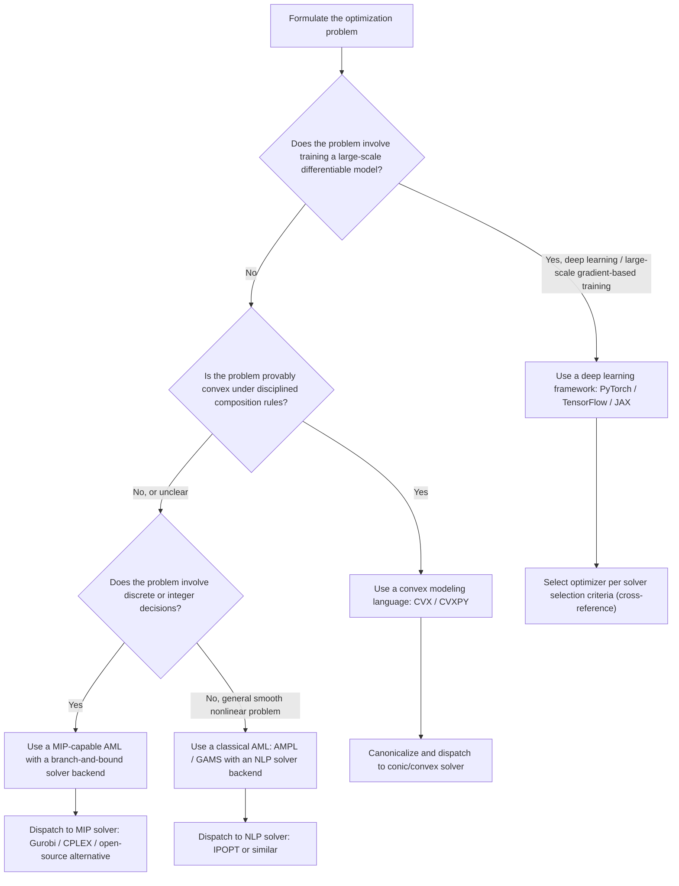

## Modeling Languages for Optimization

### Overview

Modeling languages provide a layer of abstraction between how an optimization problem is naturally described mathematically and how a solver actually consumes it. Rather than manually deriving derivatives, constraint Jacobians, or solver-specific data structures, practitioners express objectives and constraints in a high-level, near-mathematical syntax, and the modeling language handles translation to whatever backend solver is invoked. This topic connects the algorithmic solver families surveyed in the previous section to the practical tooling layer that sits between a problem formulation and a solver call.

### The Role of a Modeling Language

**Key Points**

- A modeling language separates problem *formulation* (what the objective and constraints are, expressed declaratively) from problem *solution* (how a solver algorithm finds an optimal point), allowing the same model to be solved by multiple different solver backends without rewriting the problem.
- Most modeling languages provide automatic differentiation or symbolic differentiation internally (connecting to the autodiff principles covered earlier in this series) so that users do not need to manually supply gradient or Jacobian expressions, even when using gradient-based or second-order solvers.
- Modeling languages typically also perform automatic problem-structure detection, identifying whether a formulated problem is linear, quadratic, convex, or falls into some other recognized class, which determines which solver backends are applicable and can be selected automatically or by user specification.
- This abstraction layer is particularly valuable for constrained optimization problems (as discussed in the solver selection section), since correctly formulating constraint Jacobians and Lagrangian structure by hand is tedious and error-prone at any meaningful problem scale.

### Algebraic Modeling Languages

Algebraic modeling languages (AMLs) allow optimization problems to be written in a syntax that closely mirrors standard mathematical notation, separating the abstract model (variables, objective, constraints) from concrete numerical data.

**Key Points**

- **AMPL** (A Mathematical Programming Language) is a longstanding, widely used AML supporting linear, nonlinear, and mixed-integer optimization, notable for cleanly separating model structure from problem-specific data, allowing the same model template to be reused across different data instances.
- **GAMS** (General Algebraic Modeling System) serves a similar role, historically prominent in operations research, economics, and large-scale industrial planning applications, supporting a wide range of problem classes and solver backends.
- These classical AMLs are typically solver-agnostic at the interface level: the same model can be dispatched to different underlying solvers (e.g., different linear programming or nonlinear programming solvers) depending on the problem class detected and the user's preference, without needing to rewrite the model itself.
- AMLs of this type are most associated with classical mathematical programming domains, linear programming, mixed-integer programming, nonlinear programming, rather than the large-scale stochastic gradient-based training characteristic of deep learning, though the underlying convex and constrained optimization problem classes they target overlap with the constrained optimization problem class discussed in the solver selection section.

### Convex Optimization Modeling Languages

A more specialized category of modeling languages targets convex optimization problems specifically, exploiting the strong theoretical guarantees and structural properties unique to convexity.

**Key Points**

- **CVX** and **CVXPY** allow users to specify convex optimization problems using a syntax that closely resembles standard mathematical notation for objectives and constraints, while automatically verifying that the specified problem actually satisfies the rules of convex composition required for the guarantees to hold.
- This verification relies on a rule set often called **Disciplined Convex Programming (DCP)**: a set of composition rules (e.g., a convex function of an affine argument remains convex; the sum of convex functions is convex; specific sign and curvature rules govern valid compositions) that the modeling language checks automatically, rejecting expressions that cannot be verified as convex under the ruleset, even if the underlying expression might be convex in principle but not expressible within the disciplined rule system.
- Once a problem passes DCP verification, these languages automatically transform (via a process often called "canonicalization") the high-level problem description into a standard form (such as a cone program) suitable for dispatch to a specialized convex solver backend (e.g., interior point solvers for conic programming, as referenced in the constrained optimization discussion of the solver selection section).
- This specialization to convex problems allows these tools to offer strong correctness guarantees, if the DCP check passes, the problem is provably convex and the solver's global optimality guarantee genuinely applies, at the cost of not supporting general non-convex problem formulations, which fall outside their intended scope entirely.

### Deep Learning Frameworks as Modeling Languages

**Key Points**

- Modern deep learning frameworks (PyTorch, TensorFlow, JAX) function as a distinct but related category of modeling language: rather than the declarative, near-mathematical syntax of classical AMLs, they use an imperative or functional programming interface in which the model, and by extension its loss surface, is defined as an executable program, with automatic differentiation (as discussed in the autodiff principles section) supplying the necessary gradient information for whatever solver (optimizer) is subsequently applied.
- This programmatic style trades some of the formal structure-detection capabilities of classical AMLs and convex modeling languages (there is generally no automatic convexity verification comparable to DCP) for substantially greater flexibility in expressing the highly composed, non-convex functions, deep neural networks, that are the primary object of interest in this series' deep learning-focused sections.
- The optimizer APIs in these frameworks (implementing SGD, Adam, RMSProp, and the other methods discussed throughout this series) function as the "solver backend" in this analogy, decoupled from the model definition itself in a manner conceptually similar to how classical AMLs decouple model formulation from solver choice, even though the underlying interface style differs substantially.
- **JAX** in particular exposes explicit function transformations (including the forward-mode and reverse-mode differentiation operations discussed in the previous section of this series) as first-class, composable primitives, offering a middle ground between the flexibility of an imperative deep learning framework and some of the more explicit, mathematically transparent structure associated with classical modeling languages.

### Mixed-Integer and Combinatorial Modeling

**Key Points**

- Many practical optimization problems, particularly in operations research and scheduling, involve discrete or integer-valued decision variables, a structurally distinct problem class from the continuous optimization problems that dominate this series' deep learning focus.
- **Mixed-Integer Programming (MIP)** modeling support, present in AMLs like AMPL and GAMS as well as dedicated interfaces to solvers such as Gurobi and CPLEX, allows constraints and objectives involving both continuous and integer/binary decision variables to be expressed and solved, typically via branch-and-bound or branch-and-cut algorithmic strategies rather than the gradient-based methods that dominate elsewhere in this series.
- This problem class connects only loosely to the smooth, continuous, gradient-based optimization that constitutes the bulk of standard deep learning training, but does intersect with certain deep learning-adjacent problems such as neural architecture search (referenced in the solver selection section) or discrete hyperparameter selection (as discussed in the hyperparameter optimization section), where combinatorial modeling perspectives are sometimes applied.

### Comparing Modeling Language Categories

<svg xmlns="http://www.w3.org/2000/svg" viewBox="0 0 900 380">
<text x="450" y="30" text-anchor="middle" font-size="18" font-weight="bold" fill="#1a1a1a">Modeling Language Landscape (svg_diagram)</text>
<rect x="40" y="60" width="380" height="130" fill="#dbeafe" stroke="#2563eb" />
<text x="230" y="85" text-anchor="middle" font-size="13" font-weight="bold" fill="#1a1a1a">Classical AMLs (AMPL, GAMS)</text>
<text x="230" y="110" text-anchor="middle" font-size="12" fill="#1a1a1a">Declarative, solver-agnostic</text>
<text x="230" y="130" text-anchor="middle" font-size="12" fill="#1a1a1a">LP / MIP / general NLP</text>
<text x="230" y="150" text-anchor="middle" font-size="12" fill="#1a1a1a">Operations research focus</text>
<rect x="480" y="60" width="380" height="130" fill="#dcfce7" stroke="#16a34a" />
<text x="670" y="85" text-anchor="middle" font-size="13" font-weight="bold" fill="#1a1a1a">Convex Modeling (CVX, CVXPY)</text>
<text x="670" y="110" text-anchor="middle" font-size="12" fill="#1a1a1a">DCP-verified convexity</text>
<text x="670" y="130" text-anchor="middle" font-size="12" fill="#1a1a1a">Automatic canonicalization</text>
<text x="670" y="150" text-anchor="middle" font-size="12" fill="#1a1a1a">Global optimality guarantees</text>
<rect x="40" y="220" width="380" height="130" fill="#fef3c7" stroke="#d97706" />
<text x="230" y="245" text-anchor="middle" font-size="13" font-weight="bold" fill="#1a1a1a">Deep Learning Frameworks</text>
<text x="230" y="270" text-anchor="middle" font-size="12" fill="#1a1a1a">Imperative / functional style</text>
<text x="230" y="290" text-anchor="middle" font-size="12" fill="#1a1a1a">Autodiff-driven, non-convex</text>
<text x="230" y="310" text-anchor="middle" font-size="12" fill="#1a1a1a">No automatic convexity check</text>
<rect x="480" y="220" width="380" height="130" fill="#f3e8ff" stroke="#7c3aed" />
<text x="670" y="245" text-anchor="middle" font-size="13" font-weight="bold" fill="#1a1a1a">MIP / Combinatorial Modeling</text>
<text x="670" y="270" text-anchor="middle" font-size="12" fill="#1a1a1a">Discrete + continuous variables</text>
<text x="670" y="290" text-anchor="middle" font-size="12" fill="#1a1a1a">Branch-and-bound / branch-and-cut</text>
<text x="670" y="310" text-anchor="middle" font-size="12" fill="#1a1a1a">Scheduling, combinatorial problems</text>
</svg>

### Solver Backend Interfaces

**Key Points**

- Modeling languages typically communicate with solver backends through standardized interfaces, allowing the same formulated model to be tested against multiple solvers without reformulation, an important practical benefit given that different solvers can vary substantially in performance for structurally similar problems.
- Commercial solvers commonly interfaced with via modeling languages include **Gurobi** and **CPLEX** for linear and mixed-integer programming, and specialized nonlinear programming solvers such as **IPOPT** (Interior Point OPTimizer) for general smooth nonlinear constrained problems, connecting back to the interior point method family discussed in the constrained optimization portion of the solver selection section. [Unverified as an exhaustive or current list — the solver ecosystem changes over time, with new solvers and licensing arrangements emerging; mentioned here as illustrative of common category-representative tools rather than a definitive current inventory.]
- Open-source solver options exist across problem classes as well (e.g., open-source linear programming and mixed-integer solvers, and open-source conic solvers commonly used as CVXPY backends), offering an alternative to commercial licensing for many standard problem classes.

### Practical Considerations for Choosing a Modeling Approach

**Key Points**

- **Problem class fit**: a problem that is genuinely convex and can be expressed within a disciplined convex programming ruleset benefits substantially from tools like CVXPY, gaining correctness guarantees that are simply unavailable when using a general-purpose deep learning framework for the same problem.
- **Scale and gradient-based training needs**: problems requiring stochastic mini-batch training of models with millions or billions of parameters, the dominant scenario throughout the deep learning-focused sections of this series, are effectively only tractable using deep learning framework-style tooling (PyTorch, TensorFlow, JAX), since classical AMLs and convex modeling languages are not designed for this stochastic, large-scale, non-convex regime.
- **Need for discrete/combinatorial structure**: problems with genuinely discrete decisions (scheduling, assignment, routing) require MIP-capable modeling tools regardless of any continuous optimization components that might also be present.
- **Verification and guarantee requirements**: settings where a formal guarantee of global optimality is operationally important (e.g., certain safety-critical or regulatory contexts) favor the more restrictive but guarantee-providing convex modeling languages over the flexible but guarantee-free deep learning framework style, when the underlying problem's structure permits this choice at all.
- **Interoperability with existing solver ecosystems**: organizations already invested in specific commercial solvers (Gurobi, CPLEX) may weight modeling language choice partly by which languages offer mature, well-supported interfaces to those existing solver investments.

### Modeling Language Selection Workflow

### Conclusion

Modeling languages provide the crucial abstraction layer between how an optimization problem is conceived mathematically and how it is ultimately solved, spanning a spectrum from classical algebraic modeling languages built for general mathematical programming, through specialized convex modeling tools offering formal correctness guarantees via disciplined convex programming, to the imperative, autodiff-driven deep learning frameworks that dominate the large-scale non-convex training problems central to much of this series. Choosing among these categories depends on the same underlying problem characteristics surveyed in the solver selection section, convexity, scale, presence of discrete structure, and the practical need for formal guarantees, since each modeling language category is built around a specific, well-defined subset of the overall optimization problem landscape rather than serving as a universal tool.

**Related Topics**

- Solver selection criteria for different problem classes (cross-reference)
- Automatic differentiation principles (cross-reference)
- Disciplined convex programming and convexity verification rules
- Interior point methods for nonlinear and conic programming
- Mixed-integer programming and branch-and-bound algorithms
- Deep learning frameworks as computational graph systems (cross-reference to autodiff)
- Commercial versus open-source solver ecosystems
- Duality theory and its role in convex modeling and solver design