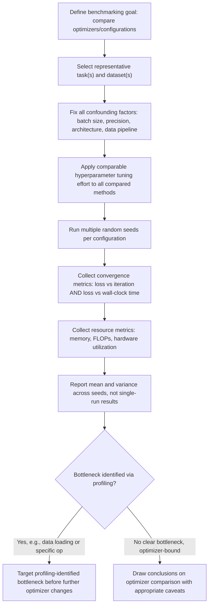

## Benchmarking and Performance Profiling of Algorithms

### Overview

Benchmarking and profiling provide the empirical foundation for evaluating and comparing optimization algorithms in practice, complementing the theoretical convergence analysis that underlies method design. Because real optimization problems, particularly deep learning training, deviate from the clean mathematical assumptions (convexity, exact gradients, bounded curvature) under which many convergence guarantees are proven, empirical benchmarking is often the deciding factor in solver and hyperparameter selection. This topic connects the algorithmic families surveyed throughout this series to the methodology used to compare them rigorously.

### Why Benchmarking Is Necessary

**Key Points**

- Theoretical convergence rates (e.g., the linear convergence rate for gradient descent on convex quadratics discussed in the conditioning and preconditioning section) typically rely on idealized assumptions, exact gradients, known Lipschitz constants, convexity, that rarely hold exactly in deep learning practice, where the landscape is non-convex and gradients are stochastic.
- Two optimizers with similar theoretical guarantees can behave very differently in practice due to constant factors hidden in big-O convergence analysis, implementation-specific overhead, and interaction effects with other training components (batch normalization, learning rate schedules, precision format) discussed elsewhere in this series.
- Benchmarking provides the empirical evidence needed to make practical decisions, such as the solver selection criteria discussed in the earlier section of this series, when theory alone is insufficient to distinguish between viable candidates for a specific problem instance.

### Key Metrics for Optimizer Benchmarking

**Convergence-Based Metrics**

- **Loss or objective value versus iteration/epoch count**: the most direct measure of optimization progress per unit of algorithmic work, independent of wall-clock considerations, useful for isolating the raw statistical/algorithmic efficiency of a method.
- **Loss or objective value versus wall-clock time**: incorporates the actual computational cost per step, which can differ substantially between methods, a second-order method might converge in fewer iterations but take longer in wall-clock terms if each iteration is significantly more expensive, as discussed in the second-order methods section's cost analysis.
- **Convergence to a target threshold**: measuring the number of iterations, epochs, or wall-clock time required to reach a predefined target loss or accuracy value, providing a more directly comparable single-number summary than a full convergence curve.
- **Final converged performance**: the asymptotic quality reached given a fixed, generous computational budget, useful for distinguishing whether an optimizer's advantage is primarily about speed of convergence or about reaching a genuinely better final solution.

**Computational Resource Metrics**

- **Memory usage**: peak and average memory consumption, particularly relevant when comparing methods with different memory profiles, such as the low forward-mode overhead versus higher reverse-mode caching cost discussed in the forward/reverse mode differentiation section, or the memory cost of maintaining optimizer state (e.g., Adam's first and second moment buffers) compared to plain SGD.
- **FLOPs (floating point operations) per step**: a hardware-independent measure of computational cost per iteration, useful for comparing the intrinsic cost of an algorithmic step independent of the specific hardware it happens to run on.
- **Wall-clock time per step or per epoch**: a hardware-dependent but practically important measure, since it reflects the actual time cost experienced when running the algorithm on specific available hardware.
- **Communication cost** (in distributed settings): the volume and frequency of data exchanged between distributed workers, which can dominate total training time for certain distributed optimization strategies regardless of the underlying single-node algorithmic efficiency.

### Statistical Rigor in Benchmarking

**Key Points**

- **Multiple random seeds**: because deep learning training involves substantial stochasticity, from weight initialization, from mini-batch sampling order, from any stochastic regularization such as dropout, a single training run provides an unreliable estimate of an optimizer's true performance; reporting results across multiple independent seeds (with mean and variance, or a suitable interval) is standard practice for credible comparison.
- **Fair hyperparameter tuning across compared methods**: a common pitfall in optimizer benchmarking is thoroughly tuning the hyperparameters (learning rate, schedule, etc.) of a proposed new method while using default or lightly tuned hyperparameters for baseline comparison methods, which can produce a misleadingly favorable comparison; the hyperparameter optimization techniques discussed earlier in this series should, in principle, be applied with comparable rigor to all methods under comparison.
- **Controlling for confounding factors**: differences in batch size, data augmentation, precision format (as discussed in the floating point arithmetic section), or hardware between compared runs can each independently affect results, so credible benchmarks hold these factors fixed across the methods being compared unless the factor itself is the subject of the comparison.
- **Reporting variance, not just means**: given the run-to-run variance inherent in stochastic training, reporting only a single best or average result without variance information makes it difficult to assess whether an observed difference between methods is a genuine, reliable effect or within the range of ordinary run-to-run noise. [Inference — the general statistical principle that variance reporting is necessary for credible comparison is well established in empirical methodology broadly; the specific degree of variance observed in any given deep learning benchmark is problem- and setup-dependent.]

### Standard Optimization Benchmark Suites

**Key Points**

- **Classical numerical optimization test functions** (e.g., the Rosenbrock function, Rastrigin function, and other functions with known challenging properties such as narrow curved valleys or many local minima) serve as controlled, well-understood testbeds for evaluating an optimizer's basic behavior on landscapes with specific, deliberately engineered pathologies, independent of the complexity of real machine learning models.
- **Standardized deep learning benchmark tasks** (e.g., image classification on well-known datasets, standard language modeling benchmarks) provide realistic, widely used, comparable settings for evaluating optimizers on genuine deep learning workloads, allowing new methods to be positioned against a substantial body of prior published results using the same or similar tasks.
- **MLPerf** and similar industry benchmark suites specifically target end-to-end training and inference performance across standardized tasks and hardware configurations, emphasizing wall-clock time to a fixed target accuracy under realistic large-scale conditions, extending pure algorithmic comparison to include hardware and systems-level factors. [Unverified as a complete or current description — specific benchmark suite composition, included tasks, and methodology evolve over time; mentioned as illustrative of the category of large-scale, standardized, industry-oriented benchmarking rather than as an exhaustive or current specification.]
- Dedicated optimizer benchmarking studies (comparing SGD, Adam, and variants across multiple tasks and architectures) have specifically highlighted that no single optimizer dominates across all tasks, reinforcing the problem-class-dependent solver selection perspective discussed in the earlier solver selection section of this series. [Inference — "no single optimizer dominates universally" is a widely replicated finding across multiple independent empirical optimizer comparison studies, though the specific ranking of methods on any given task remains study- and setup-dependent.]

### Profiling Techniques

Profiling focuses on understanding *where* computational time and resources are spent within a single training run or algorithm execution, complementing benchmarking's focus on comparing overall outcomes across methods.

**Key Points**

- **Operation-level timing**: breaking down the total time of a training step into its constituent operations (forward pass, loss computation, backward pass, optimizer step, data loading), which can reveal whether the optimizer step itself is a significant bottleneck or a negligible fraction of total step time, information relevant when deciding whether adopting a more sophisticated (and typically more expensive) optimizer such as K-FAC (discussed in the second-order methods section) is likely to be worthwhile for a given model.
- **Memory profiling**: tracking memory allocation over the course of a training step, useful for diagnosing whether memory pressure stems primarily from activations (relevant to the gradient checkpointing tradeoff discussed in the autodiff principles section), from optimizer state (relevant when comparing memory-heavy optimizers like Adam against memory-light alternatives like plain SGD), or from model parameters themselves.
- **Hardware utilization profiling**: measuring metrics such as GPU/accelerator utilization percentage, memory bandwidth utilization, and identifying whether a training step is compute-bound (limited by the accelerator's raw arithmetic throughput) or memory-bandwidth-bound (limited by the speed of moving data to and from memory), which has direct implications for whether reduced-precision training (discussed in the floating point arithmetic section) is likely to yield meaningful speedups for a given workload.
- **Data loading and I/O profiling**: identifying whether the data pipeline (loading, augmentation, preprocessing) is a bottleneck relative to the actual compute of the forward/backward pass, since a training pipeline that is data-pipeline-bound will not benefit from optimizer-level improvements until the data bottleneck itself is addressed.

### Profiling and Benchmarking Workflow

<svg xmlns="http://www.w3.org/2000/svg" viewBox="0 0 900 340">
<text x="450" y="30" text-anchor="middle" font-size="18" font-weight="bold" fill="#1a1a1a">Where Profiling Time Typically Goes (svg_diagram)</text>
<g transform="translate(80,60)">
<rect x="0" y="0" width="740" height="60" fill="#dbeafe" stroke="#2563eb" />
<text x="370" y="35" text-anchor="middle" font-size="13" fill="#1a1a1a">Data Loading / Augmentation / I/O</text>



```
<rect x="0" y="80" width="300" height="60" fill="#dcfce7" stroke="#16a34a" />
<text x="150" y="115" text-anchor="middle" font-size="13" fill="#1a1a1a">Forward Pass</text>

<rect x="320" y="80" width="300" height="60" fill="#fef3c7" stroke="#d97706" />
<text x="470" y="115" text-anchor="middle" font-size="13" fill="#1a1a1a">Backward Pass (Autodiff)</text>

<rect x="640" y="80" width="100" height="60" fill="#f3e8ff" stroke="#7c3aed" />
<text x="690" y="115" text-anchor="middle" font-size="11" fill="#1a1a1a">Optimizer Step</text>

<text x="370" y="175" text-anchor="middle" font-size="12" fill="#333">Total wall-clock time per training step</text>
<text x="370" y="195" text-anchor="middle" font-size="12" fill="#333">Bottleneck location determines where optimization effort is worthwhile</text>
```

</g>
</svg>

### Common Benchmarking Pitfalls

**Key Points**

- **Overfitting to a single benchmark task**: an optimizer or hyperparameter configuration tuned extensively on one specific benchmark task may not generalize its advantage to other tasks, architectures, or datasets, which is why credible optimizer comparisons typically evaluate across multiple, sufficiently different tasks rather than a single setting.
- **Ignoring wall-clock time in favor of iteration count alone**: as noted above, a method that appears superior when measured in iterations or epochs can be inferior in practical wall-clock terms if its per-step cost is substantially higher, an especially relevant pitfall when comparing first-order methods against the second-order and curvature-aware methods discussed in the second-order methods section.
- **Insufficient hyperparameter search budget for baselines**: as discussed above under statistical rigor, asymmetric tuning effort between a proposed method and its baselines is one of the most commonly cited sources of misleading benchmark results in the optimization literature. [Inference — this is a widely discussed methodological concern in the machine learning research community, reflected in various reproducibility-focused studies and commentary, though the prevalence of this specific issue across all published work is not something that can be precisely quantified here.]
- **Neglecting variance and reproducibility**: results reported from a single run, without seed variation or confidence intervals, are more susceptible to being an outlier rather than a representative outcome, undermining the reliability of any conclusions drawn from the comparison.
- **Benchmark-hardware mismatch**: reporting wall-clock results from specialized or unusual hardware configurations without clearly specifying that hardware can make published benchmark comparisons difficult or impossible to reproduce or generalize to a practitioner's own, potentially quite different, hardware setup.

### Practical Benchmarking Workflow



### Conclusion

Benchmarking and profiling provide the empirical complement to the theoretical convergence analysis that underlies the optimization methods surveyed throughout this series, essential precisely because deep learning training routinely violates the idealized assumptions behind clean theoretical guarantees. Rigorous benchmarking requires measuring both convergence-based metrics (loss versus iteration and versus wall-clock time) and computational resource metrics (memory, FLOPs, hardware utilization), applying comparable hyperparameter tuning effort across all compared methods, and reporting results across multiple seeds with appropriate variance information rather than single-run outcomes. Profiling complements this by localizing where computational time and resources are actually spent within a training step, information that directly informs whether adopting a more sophisticated but expensive method, such as the second-order or curvature-aware approaches discussed earlier in this series, is likely to be worthwhile for a given workload, or whether the true bottleneck lies elsewhere in the training pipeline entirely.

**Related Topics**

- Solver selection criteria for different problem classes (cross-reference)
- Second-order and natural gradient methods (cross-reference)
- Floating point arithmetic and numerical stability (cross-reference)
- Hyperparameter optimization techniques (cross-reference)
- Reproducibility challenges in machine learning research
- Distributed and parallel training performance considerations
- Hardware-aware algorithm design (GPU/TPU-specific optimization considerations)
- Statistical significance testing for machine learning experiment comparison