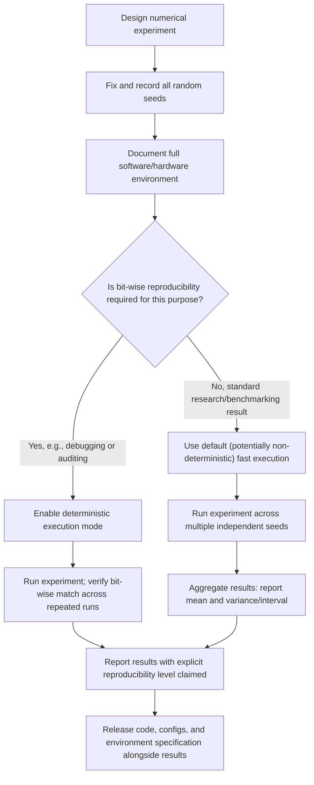

## Reproducibility and Numerical Experiment Design

### Overview

Reproducibility, the property that an experiment's reported results can be obtained again, either exactly or within an acceptable tolerance, by the same or a different party, is a foundational concern for any empirical claim about optimization algorithm performance. This topic extends the benchmarking and profiling methodology of the previous section into the deeper question of experiment design: what must be controlled, recorded, and reported for an optimization result to be trustworthy and independently verifiable, and where genuine, irreducible sources of non-determinism arise in numerical computing.

### Levels of Reproducibility

**Key Points**

- **Exact (bit-wise) reproducibility**: rerunning an experiment produces numerically identical results down to the last floating point bit. This is the strictest standard and, as discussed below, is often difficult or impossible to achieve in practice on modern parallel hardware without specific accommodations.
- **Numerical reproducibility**: rerunning an experiment produces results that agree within a small, expected numerical tolerance, acknowledging that minor floating point rounding differences (as discussed in the floating point arithmetic section of this series) are an accepted, non-substantive source of variation.
- **Statistical reproducibility**: rerunning an experiment (potentially with different random seeds) produces results that are statistically consistent with the original, e.g., falling within a reported confidence interval or variance range, rather than being identical or near-identical in raw value. This is the practically relevant standard for most deep learning optimization claims, given the substantial run-to-run stochasticity discussed in the benchmarking section.
- **Conceptual/methodological reproducibility**: an independent party, given only the paper's or report's description of the method (without access to the original code), can implement the described approach and obtain qualitatively consistent conclusions, the weakest but most fundamental standard, since it validates that the method itself, not merely a specific software artifact, produces the claimed effect.

### Sources of Non-Determinism in Numerical Experiments

**Key Points**

- **Random seed dependence**: weight initialization, data shuffling order, dropout masks, and other explicitly randomized components of training are seeded by pseudo-random number generators; fixing these seeds is necessary (though not always sufficient, as discussed below) for exact reproducibility.
- **Floating point non-associativity**: as discussed in the floating point arithmetic section, floating point addition and multiplication are not exactly associative, $(a+b)+c$ can differ in its last bit from $a+(b+c)$, due to intermediate rounding. This becomes a reproducibility concern specifically when the *order* of operations is not fixed across runs.
- **Parallel and distributed reduction order**: on GPUs and in distributed training, operations such as summing gradients across many parallel threads or across multiple workers can be executed in a non-deterministic order from run to run, depending on low-level hardware scheduling, thread completion order, or network arrival order in distributed settings. Combined with floating point non-associativity, this means the *same* random seed can still produce *different* numerical results across runs on parallel hardware, unless specific deterministic-mode accommodations are used.
- **Non-deterministic hardware kernels**: certain highly optimized GPU operations (particularly some convolution algorithms and certain highly parallel reduction operations) may, by default, use non-deterministic execution paths chosen for speed, trading bit-wise reproducibility for performance; most major frameworks provide an explicit "deterministic mode" flag that disables these fast-but-non-deterministic kernel choices in favor of slower but reproducible alternatives. [Behavior may vary by framework, hardware, and version; specific deterministic-mode availability and performance cost are implementation details that change over time.]
- **Hardware and software environment differences**: different GPU models, driver versions, and even different versions of underlying numerical libraries (e.g., different BLAS or cuDNN versions) can produce subtly different numerical results for mathematically identical operations, since low-level implementation details of these libraries are not standardized to bit-wise identical behavior across versions or vendors.

### Why Exact Reproducibility Is Often Not the Right Goal

**Key Points**

- Given the sources of non-determinism above, particularly on GPU hardware, insisting on exact bit-wise reproducibility can impose a substantial performance cost, since deterministic kernel modes are frequently slower than their non-deterministic, more highly optimized counterparts. [Inference — the general existence of a speed cost for deterministic modes is a documented tradeoff across major frameworks, though the specific magnitude of the cost is hardware-, operation-, and version-dependent.]
- For most deep learning optimization claims, what genuinely matters is statistical reproducibility: that the reported effect (e.g., "optimizer A converges faster than optimizer B on this task") holds reliably across the natural run-to-run variation, not that any single run can be replicated bit-for-bit.
- This reframes the practical reproducibility goal, established in the benchmarking section's discussion of multiple random seeds, as the primary tool: reporting results (mean, variance, or interval) across several independently seeded runs demonstrates that an observed effect is robust to the natural non-determinism present in the system, rather than attempting to eliminate that non-determinism entirely.
- Exact reproducibility remains valuable and sometimes necessary in specific contexts, such as debugging (isolating whether a code change, rather than incidental randomness, caused an observed behavior difference) or regulatory/auditing contexts where bit-exact replication may be a formal requirement.

### Elements of a Well-Documented Numerical Experiment

**Key Points**

- **Random seeds used**, and ideally, results reported across multiple distinct seeds rather than a single seed, consistent with the statistical rigor discussed in the benchmarking section.
- **Software environment specification**: exact versions of the deep learning framework, key numerical libraries, and, where relevant, the specific hardware (GPU/TPU model) used, since, as noted above, these can each independently affect numerical results.
- **Complete hyperparameter specification**: not just the headline hyperparameters (learning rate, batch size) but the full configuration, including any hyperparameters left at framework defaults, since default values can silently differ across framework versions.
- **Data preprocessing and splitting procedure**: the exact steps used to prepare, augment, and split data into training/validation/test sets, since subtle differences in preprocessing can produce results that appear to reflect an algorithmic difference but actually stem from a data-handling discrepancy.
- **Precision and numerical format used**: whether training was conducted in FP32, mixed precision (FP16/BF16), or another format, as discussed in the floating point arithmetic section, since this can materially affect both final results and the specific numerical instability risks encountered.
- **Explicit statement of what was and was not held fixed across compared conditions**: directly connecting to the "controlling for confounding factors" principle discussed in the benchmarking section, a reproducible experiment report makes explicit which factors were deliberately varied (the subject of the comparison) and which were deliberately held constant (controls).

### Reproducibility Across the Experiment Lifecycle

<svg xmlns="http://www.w3.org/2000/svg" viewBox="0 0 900 320">
<text x="450" y="30" text-anchor="middle" font-size="18" font-weight="bold" fill="#1a1a1a">Sources of Variation Across an Experiment Pipeline (svg_diagram)</text>
<g transform="translate(50,60)">
<rect x="0" y="0" width="180" height="60" fill="#dbeafe" stroke="#2563eb" />
<text x="90" y="35" text-anchor="middle" font-size="12" fill="#1a1a1a">Initialization &amp; Seeding</text>



```
<rect x="210" y="0" width="180" height="60" fill="#dcfce7" stroke="#16a34a" />
<text x="300" y="35" text-anchor="middle" font-size="12" fill="#1a1a1a">Data Loading &amp; Shuffling</text>

<rect x="420" y="0" width="180" height="60" fill="#fef3c7" stroke="#d97706" />
<text x="510" y="35" text-anchor="middle" font-size="12" fill="#1a1a1a">Forward/Backward Compute</text>

<rect x="630" y="0" width="180" height="60" fill="#f3e8ff" stroke="#7c3aed" />
<text x="720" y="35" text-anchor="middle" font-size="12" fill="#1a1a1a">Parallel/Distributed Reduction</text>

<path d="M180,30 L210,30" stroke="#333" stroke-width="2" marker-end="url(#arrow3)" />
<path d="M390,30 L420,30" stroke="#333" stroke-width="2" marker-end="url(#arrow3)" />
<path d="M600,30 L630,30" stroke="#333" stroke-width="2" marker-end="url(#arrow3)" />
<text x="90" y="90" text-anchor="middle" font-size="11" fill="#333">RNG seed</text>
<text x="300" y="90" text-anchor="middle" font-size="11" fill="#333">Shuffle order</text>
<text x="510" y="90" text-anchor="middle" font-size="11" fill="#333">Kernel choice, FP order</text>
<text x="720" y="90" text-anchor="middle" font-size="11" fill="#333">Thread/worker arrival order</text>

<rect x="0" y="150" width="810" height="60" fill="#fee2e2" stroke="#dc2626" />
<text x="405" y="185" text-anchor="middle" font-size="13" fill="#1a1a1a">Each stage is a potential source of run-to-run numerical variation</text>
```

</g>
</svg>

### Reproducibility Challenges Specific to Optimization Research

**Key Points**

- **Sensitivity of optimization trajectories to small perturbations**: because the loss landscapes discussed throughout this series, particularly the saddle-point-dominated non-convex landscapes covered in the saddle points and local minima section, can be highly sensitive to small perturbations near critical points, tiny numerical differences early in training can, in principle, compound into meaningfully different training trajectories over time, an instance of sensitive dependence on initial and intermediate conditions. [Inference — this sensitivity is a plausible and occasionally discussed consequence of the non-convex, saddle-rich landscape structure established earlier in this series, but the practical extent to which it undermines statistical reproducibility, as opposed to merely bit-wise reproducibility, of aggregate published results is not uniformly quantified across the literature.]
- **Optimizer implementation variation across frameworks**: nominally identical optimizers (e.g., "Adam") can have subtly different default hyperparameters, numerical stability accommodations (such as the epsilon-placement considerations discussed in the floating point arithmetic section), or bias-correction details across different framework implementations, making cross-framework reproducibility of optimizer comparisons a distinct and sometimes underappreciated concern.
- **Reporting of negative or null results**: publication and reporting practices that selectively emphasize favorable comparisons for a proposed method, while providing less detail on settings where the method underperformed, can undermine the broader reproducibility and reliability of the aggregate published record, independent of whether any individual result is itself technically reproducible.

### Practical Recommendations for Reproducible Numerical Experiments

**Key Points**

- **Report results across multiple seeds with variance or confidence intervals**, as established in the benchmarking section, rather than relying on a single run, treating this as the primary defense against the non-determinism sources cataloged above.
- **Explicitly document the software and hardware environment**, including framework and library versions and hardware type, recognizing that these are genuine, non-trivial sources of numerical variation rather than incidental details.
- **Use deterministic execution modes for debugging and verification purposes**, even if not used for the final reported large-scale results, since bit-wise reproducibility is valuable for isolating whether an observed change in behavior stems from a genuine code or algorithmic change versus incidental non-determinism.
- **Release code, configuration files, and, where feasible, trained model checkpoints** alongside published results, supporting the conceptual/methodological reproducibility standard even in cases where exact numerical reproducibility across different hardware is impractical.
- **Distinguish, in reporting, between the level of reproducibility being claimed**, explicitly noting whether a result is claimed to be bit-wise reproducible, numerically reproducible within a stated tolerance, or statistically reproducible across seeds, rather than leaving this ambiguous.

### Experiment Design Workflow for Reproducibility



### Conclusion

Reproducibility in numerical optimization experiments spans a spectrum from strict bit-wise identity to looser statistical and conceptual consistency, and recognizing which level is actually necessary for a given purpose is central to sound experiment design. Genuine sources of non-determinism, random seeding, floating point non-associativity, parallel and distributed reduction order, and non-deterministic hardware kernels, mean that exact reproducibility is often neither achievable by default nor, for most research and benchmarking purposes, actually the right goal; statistical reproducibility across multiple seeds, as emphasized in the benchmarking and profiling section, is typically the more practically relevant and attainable standard. Rigorous experiment design accordingly emphasizes thorough documentation of seeds, software and hardware environment, and hyperparameters, combined with explicit, honest reporting of which reproducibility standard a given result actually satisfies, over pursuit of an often costly and not always meaningful bit-wise exactness.

**Related Topics**

- Benchmarking and performance profiling of algorithms (cross-reference)
- Floating point arithmetic and numerical stability (cross-reference)
- Distributed and parallel training determinism considerations
- Random number generation and pseudo-random seeding in machine learning frameworks
- Publication bias and reporting practices in empirical machine learning research
- Deterministic versus non-deterministic GPU kernel execution
- Version control and environment management for research code (containerization, dependency pinning)
- Sensitivity analysis and trajectory divergence in non-convex optimization