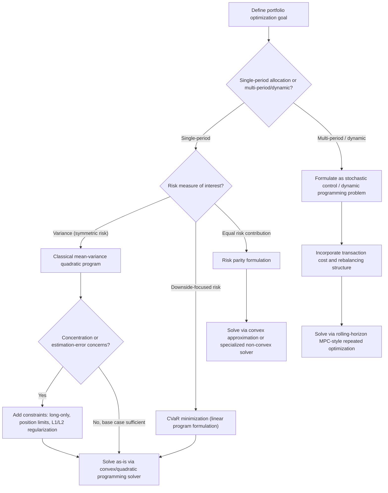

## Portfolio Optimization Formulations

### Overview

Portfolio optimization is the problem of allocating capital across a set of assets to achieve a desired balance between expected return and risk, subject to practical constraints such as budget limits, position limits, and regulatory requirements. Unlike the deep learning-focused sections earlier in this series, portfolio optimization problems are typically low-to-moderate dimensional (tens to a few thousand assets, rather than millions of parameters) and are frequently convex or can be formulated to be convex, placing them squarely within the smooth convex optimization problem class discussed in the solver selection section, and making them a natural fit for the convex modeling languages discussed in the modeling languages section.

### The Foundational Mean-Variance Formulation

Introduced by Markowitz, the classical mean-variance formulation frames portfolio construction as a tradeoff between expected return and variance (used as a proxy for risk).

**Key Points**

- Given $n$ assets with expected return vector $\mu \in \mathbb{R}^n$ and covariance matrix $\Sigma \in \mathbb{R}^{n \times n}$, and a portfolio weight vector $w \in \mathbb{R}^n$ (the fraction of capital allocated to each asset), the portfolio's expected return is $\mu^\top w$ and its variance (risk) is $w^\top \Sigma w$.
- The **risk-minimization formulation** fixes a target expected return $r_{\text{target}}$ and minimizes variance subject to achieving at least that return:

$$\min_{w} \; w^\top \Sigma w \quad \text{subject to} \quad \mu^\top w \geq r_{\text{target}}, \quad \mathbf{1}^\top w = 1$$

- The **risk-aversion (utility) formulation** instead combines return and risk into a single scalar objective using a risk-aversion parameter $\gamma > 0$:

$$\max_{w} \; \mu^\top w - \gamma \, w^\top \Sigma w \quad \text{subject to} \quad \mathbf{1}^\top w = 1$$

- Both formulations trace out the same underlying **efficient frontier**, the set of portfolios offering the maximum expected return for each level of risk (or, equivalently, minimum risk for each level of return), as $r_{\text{target}}$ or $\gamma$ is varied across its feasible range.
- Because $\Sigma$ is a covariance matrix, it is positive semi-definite by construction, which makes $w^\top \Sigma w$ a convex quadratic function of $w$; combined with the linear constraints shown above, both formulations are convex quadratic programs, guaranteeing (per the smooth convex optimization discussion in the solver selection section) that any local minimum found is also the global minimum.

### Convexity and Solver Implications

**Key Points**

- The convex quadratic structure of the basic mean-variance formulation means it is directly and efficiently solvable by the quadratic programming solver backends discussed in the modeling languages section, and is a canonical example of the kind of problem for which disciplined convex programming tools like CVXPY (also discussed in the modeling languages section) are particularly well suited.
- This tractability is a major reason for the mean-variance framework's enduring practical popularity despite well-documented limitations (discussed below): the problem can be solved reliably, quickly, and with a global optimality guarantee, in sharp contrast to the saddle-point-dominated, non-convex landscapes that are the primary subject of the deep learning-focused sections of this series.
- As the number of assets $n$ grows into the thousands, forming and factorizing the full covariance matrix $\Sigma$ (an $n \times n$ matrix) becomes the primary computational bottleneck, motivating factor-model-based covariance approximations (discussed below) that reduce this cost, echoing the general theme of structured curvature/covariance approximation seen in the K-FAC and preconditioning discussions elsewhere in this series.

### The Efficient Frontier

<svg xmlns="http://www.w3.org/2000/svg" viewBox="0 0 900 380">
<text x="450" y="30" text-anchor="middle" font-size="18" font-weight="bold" fill="#1a1a1a">Mean-Variance Efficient Frontier (svg_diagram)</text>
<line x1="100" y1="320" x2="800" y2="320" stroke="#333" stroke-width="2" />
<line x1="100" y1="320" x2="100" y2="60" stroke="#333" stroke-width="2" />
<text x="450" y="355" text-anchor="middle" font-size="13" fill="#333">Risk (standard deviation) →</text>
<text x="40" y="190" text-anchor="middle" font-size="13" fill="#333" transform="rotate(-90,40,190)">Expected Return →</text>
<path d="M 180 300 Q 300 100 750 90" stroke="#2563eb" stroke-width="3" fill="none" />
<path d="M 180 300 Q 250 220 300 200" stroke="#999" stroke-width="2" fill="none" stroke-dasharray="4,3" />
<circle cx="180" cy="300" r="6" fill="#16a34a" />
<text x="180" y="285" text-anchor="middle" font-size="11" fill="#333">Min-variance portfolio</text>
<circle cx="420" cy="150" r="6" fill="#dc2626" />
<text x="420" y="135" text-anchor="middle" font-size="11" fill="#333">Efficient portfolio</text>
<circle cx="300" cy="200" r="6" fill="#999" />
<text x="300" y="245" text-anchor="middle" font-size="11" fill="#666">Inefficient (dominated)</text>

<text x="700" y="75" text-anchor="middle" font-size="11" fill="#333">Frontier: max return per risk level</text>

</svg>

### Limitations of the Classical Formulation

**Key Points**

- **Estimation error sensitivity**: the mean-variance formulation is notoriously sensitive to estimation error in $\mu$, the expected return vector, since expected returns are inherently difficult to estimate accurately from historical data and small changes in estimated $\mu$ can produce disproportionately large changes in the resulting optimal weights $w$. This is a well-documented practical critique of the naive formulation. [Inference — the general sensitivity phenomenon is extensively documented in the quantitative finance literature; the specific magnitude of this sensitivity varies with the asset universe, estimation window, and estimation methodology used.]
- **Concentrated, extreme allocations**: unconstrained mean-variance optimization frequently produces solutions with large long and short positions concentrated in a small number of assets, which may be undesirable from a practical risk-management or regulatory standpoint even when mathematically optimal with respect to the stated objective.
- **Variance as an imperfect risk proxy**: variance penalizes upside and downside deviations from the mean symmetrically, whereas many practitioners and institutions are specifically concerned with downside risk (the possibility of loss) rather than dispersion in general, motivating the downside-risk-focused formulations discussed below.
- **Single-period, static assumption**: the classical formulation is inherently single-period (it optimizes an allocation for one investment horizon based on point estimates of $\mu$ and $\Sigma$), whereas real portfolio management is a repeated, dynamic decision process, motivating the multi-period and dynamic extensions discussed later in this section.

### Regularization and Constraint-Based Extensions

Analogous to the regularization techniques used to control model complexity elsewhere in machine learning, portfolio formulations frequently add explicit constraints or penalty terms to counteract the estimation-sensitivity and concentration problems noted above.

**Key Points**

- **Long-only constraints** ($w_i \geq 0$ for all $i$) prohibit short-selling, which is both a common real-world regulatory or mandate restriction and a practical mechanism for reducing the extreme, concentrated allocations that unconstrained optimization can produce.
- **Position limits** ($w_i \leq w_{\max}$ for all $i$) cap the maximum allocation to any single asset, directly addressing the concentration problem and improving diversification independent of the raw optimization result.
- **$L_1$ (sparsity-inducing) regularization** added to the objective, analogous to the Lasso-style regularization discussed in the solver selection section's non-smooth optimization discussion, encourages solutions with few active (non-zero) positions, which can improve robustness to estimation error and reduce transaction costs associated with holding and rebalancing many small positions.
- **$L_2$ (shrinkage) regularization** or, equivalently, shrinking the estimated covariance matrix $\Sigma$ toward a more structured target (such as a scaled identity matrix or a factor-model-implied covariance, discussed below) is a standard technique for improving the numerical conditioning and estimation robustness of $\Sigma$, directly connecting to the conditioning and preconditioning themes discussed earlier in this series, since a poorly conditioned or poorly estimated $\Sigma$ can produce unreliable optimization results even when the optimization algorithm itself performs correctly.

### Alternative Risk Measures

**Key Points**

- **Value at Risk (VaR)** and **Conditional Value at Risk (CVaR)**, also known as Expected Shortfall, are downside-focused risk measures that address the "variance penalizes upside too" critique noted above, by focusing specifically on the magnitude and/or probability of losses beyond a certain threshold.
- CVaR-based portfolio optimization, notably formulated by Rockafellar and Uryasev, has a particularly favorable property: despite CVaR itself being defined in terms of a potentially complex loss distribution, the CVaR-minimization portfolio problem can be reformulated as a linear program (under a linear return assumption and a scenario-based or historical-simulation representation of the return distribution), making it computationally tractable using the same convex/linear programming solver backends discussed in the modeling languages section.
- **Semi-variance** (variance computed using only below-target deviations) offers a simpler, more direct downside-focused alternative to full variance, at some cost in analytical and computational tractability compared to the elegant quadratic structure of the classical Markowitz formulation.
- **Risk parity** formulations depart from mean-variance optimization's return-risk tradeoff framing entirely, instead seeking portfolio weights such that each asset (or risk factor) contributes equally to total portfolio risk, a formulation that is generally non-convex in its direct form but can often be reformulated or approximated to remain computationally tractable.

### Factor Models and Covariance Structure

**Key Points**

- **Factor models** (e.g., the single-index model, or multi-factor models such as those in the Fama-French tradition) approximate the full $n \times n$ covariance matrix $\Sigma$ as arising from a smaller number of common underlying risk factors plus asset-specific (idiosyncratic) risk, dramatically reducing the number of parameters that must be estimated compared to the full, unstructured covariance matrix.
- This factor-structured approximation to $\Sigma$ is conceptually analogous to the structured curvature approximations (such as the Kronecker-factored approximation used in K-FAC, discussed in the second-order methods section) seen elsewhere in this series: both trade some fidelity in representing the full matrix for substantially improved estimation reliability and computational tractability.
- Factor models also improve the numerical conditioning of $\Sigma$ relative to a naively estimated full sample covariance matrix, particularly important when the number of assets $n$ is large relative to the amount of historical data available for estimation, a regime in which the sample covariance matrix is known to be a poor (high-variance, poorly conditioned) estimator. [Inference — this poor-conditioning-under-limited-data property of the sample covariance estimator is a well-established result in the statistics and quantitative finance literature (related to Random Matrix Theory results on sample covariance eigenvalue spectra), though the practical severity depends on the specific ratio of assets to data points available.]

### Multi-Period and Dynamic Portfolio Optimization

**Key Points**

- **Multi-period formulations** extend the single-period mean-variance framework to a sequence of rebalancing decisions over time, explicitly modeling how the portfolio should evolve as new information arrives and as the investment horizon shortens, typically formulated as a stochastic control or dynamic programming problem rather than a single static quadratic program.
- **Transaction cost modeling**: multi-period formulations frequently incorporate explicit transaction cost terms (proportional, fixed, or market-impact-based costs incurred when rebalancing from one period's weights to the next), which couples consecutive periods' decisions together and moves the problem beyond a simple sequence of independent single-period optimizations.
- **Model Predictive Control (MPC)** style approaches, borrowing formulations from control theory, solve a multi-period optimization problem at each rebalancing point using currently available information and a forecast over a rolling horizon, executing only the first period's decision before re-solving at the next rebalancing point, a strategy that manages the complexity of true dynamic stochastic optimization by repeatedly solving simpler, tractable subproblems.
- These multi-period and dynamic extensions generally sacrifice some of the clean convexity and closed-form tractability of the single-period mean-variance formulation, often requiring the broader solver selection considerations (stochastic control, dynamic programming, or repeated convex subproblem solving) discussed at a general level in the solver selection section of this series.

### Portfolio Formulation Landscape

### Conclusion

Portfolio optimization formulations exemplify a problem domain where the classical convex optimization theory discussed throughout this series, quadratic programming, linear programming, convex modeling languages, applies particularly cleanly, in contrast to the non-convex, high-dimensional deep learning landscape that is this series' primary focus. The foundational Markowitz mean-variance formulation is an elegant convex quadratic program, but its practical limitations, sensitivity to return estimation error, tendency toward concentrated allocations, and symmetric treatment of risk, have motivated a substantial body of extensions: constrained and regularized variants, alternative downside-focused risk measures such as CVaR, factor-model-based covariance structuring, and multi-period dynamic formulations. Across these extensions, the recurring themes established elsewhere in this series, convexity as a source of tractability and guarantees, structured approximation as a remedy for high-dimensional estimation and conditioning problems, and the tradeoff between formulation fidelity and computational tractability, reappear in a distinctly different applied domain.

**Related Topics**

- Solver selection criteria for different problem classes (cross-reference)
- Modeling languages for optimization (cross-reference)
- Conditioning and preconditioning techniques (cross-reference)
- Convex quadratic programming and interior point solvers
- Random matrix theory and covariance matrix estimation
- Stochastic control and dynamic programming formulations
- Risk measures in quantitative finance (VaR, CVaR, semi-variance)
- Robust optimization under parameter uncertainty