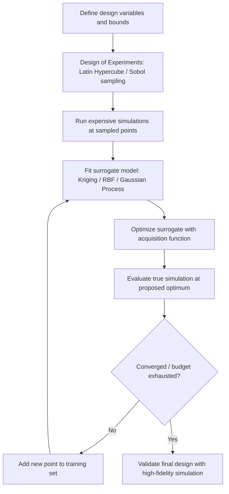

## Engineering Design Optimization

### Overview and Scope

Engineering design optimization applies mathematical optimization methods to the selection of design variables — dimensions, material properties, topology, control parameters — such that a performance objective is improved while satisfying physical, safety, and manufacturing constraints. It sits at the intersection of numerical optimization theory and domain-specific simulation (structural mechanics, fluid dynamics, thermal analysis, electromagnetics), and is used across aerospace, automotive, civil, mechanical, and electrical engineering.

The general form of an engineering design optimization problem is:

$$\min_{\mathbf{x} \in \mathbb{R}^n} f(\mathbf{x}) \quad \text{subject to} \quad g_i(\mathbf{x}) \leq 0,\ i = 1,\dots,m, \quad h_j(\mathbf{x}) = 0,\ j = 1,\dots,p, \quad \mathbf{x}^L \leq \mathbf{x} \leq \mathbf{x}^U$$

where $\mathbf{x}$ is the vector of design variables, $f(\mathbf{x})$ is the objective (e.g., mass, cost, drag, compliance), $g_i$ are inequality constraints (e.g., stress limits, deflection limits), $h_j$ are equality constraints (e.g., volume fraction targets), and $\mathbf{x}^L, \mathbf{x}^U$ are side bounds.

### Problem Classes in Engineering Design

**Sizing optimization**: design variables are dimensional parameters of a fixed topology and shape — e.g., beam cross-section thickness, plate gauge, spring wire diameter. This is the simplest class since the design space is typically continuous, low-to-moderate dimensional, and the geometry parameterization is direct.

**Shape optimization**: the boundary or geometric contour of a component is varied while the underlying topology (connectivity, number of holes/members) stays fixed. Design variables are often control points of a spline or CAD parametrization (e.g., NURBS control points), and shape changes are typically propagated to the finite element or CFD mesh via mesh morphing.

**Topology optimization**: the material layout itself is treated as a design variable, typically via a density field $\rho(\mathbf{x}) \in [0,1]$ over a fixed design domain, where $\rho = 1$ indicates solid material and $\rho = 0$ indicates void. This is the most general and computationally demanding class, since the number of design variables scales with the number of finite elements in the domain (often $10^4–$10^7
).

**Multidisciplinary design optimization (MDO)**: couples multiple analysis disciplines (e.g., structures, aerodynamics, thermal, controls) that interact through shared state variables, requiring architectures that manage the coupling explicitly rather than optimizing each discipline in isolation.

### Key Points

- The choice of design variable parameterization (sizing vs. shape vs. topology) determines both the achievable design space and the computational cost per evaluation.
- Objective and constraint function evaluations typically require a full physics simulation (finite element analysis, computational fluid dynamics), making each function call expensive — often seconds to hours.
- Gradient information, when available via adjoint methods, is essential for tractable optimization of high-dimensional problems like topology optimization.
- Constraints in engineering design are rarely optional; they encode safety factors, regulatory limits, and manufacturability, so constraint-handling method (penalty, barrier, Lagrangian, or trust-region SQP) matters as much as the optimizer's search strategy.
- Real design problems are frequently multimodal, so the choice between local (gradient-based) and global (metaheuristic, surrogate-based) methods should be justified by the trust in gradient accuracy and the required diversity of exploration.

### Design Variables, Objectives, and Constraints

**Design variables** are commonly:

- Continuous (thickness, radius, angle)
- Discrete (number of stiffeners, choice of standard fastener size, material selection from a catalog)
- Mixed-integer, when both types appear simultaneously — common in structural sizing where cross-sections must be chosen from a discrete catalog

**Common objectives**:

- Minimize mass or material cost
- Minimize compliance (maximize stiffness) under a volume constraint — the canonical topology optimization objective
- Minimize drag or maximize lift-to-drag ratio (aerodynamic shape optimization)
- Minimize peak stress or maximize fatigue life
- Minimize manufacturing cost or cycle time
- Multi-objective combinations (e.g., mass vs. stiffness vs. cost), typically handled via weighted-sum scalarization or Pareto-front methods

**Common constraints**:

- Stress constraints: $\sigma_{\max}(\mathbf{x}) \leq \sigma_{\text{allow}}$, often applied element-wise or via aggregation (p-norm, Kreisselmeier–Steinhauser function) to avoid an intractable number of local constraints
- Displacement/deflection limits
- Natural frequency separation (to avoid resonance with operating frequencies)
- Buckling load factors
- Volume or mass fraction limits (especially in topology optimization)
- Manufacturing constraints: minimum feature size, draft angles for casting, symmetry requirements, extrusion/milling directions

### Gradient-Based Methods in Design Optimization

For problems with smooth, differentiable objectives and constraints, gradient-based methods are the default choice because they scale far better than gradient-free methods as dimensionality grows.

**Sequential Quadratic Programming (SQP)** solves a sequence of quadratic approximations to the Lagrangian subject to linearized constraints. It is widely used in sizing and shape optimization with tens to a few hundred design variables, and handles nonlinear constraints natively.

**Method of Moving Asymptotes (MMA)**: developed specifically for structural and topology optimization, MMA constructs a sequence of convex, separable subproblems using moving asymptotes that adapt based on the iteration history. It is the de facto standard optimizer for density-based topology optimization because it handles the large number of design variables and (typically few) aggregated constraints efficiently, and tends to produce monotonic, oscillation-free convergence.

**Interior-point methods** are used when constraints are numerous and it is beneficial to stay within the feasible region throughout the iteration, common in large-scale structural optimization with many local stress constraints.

**Adjoint sensitivity analysis** is the enabling technique that makes gradient-based topology and shape optimization tractable. Rather than computing $\partial f/\partial x_i$ for each of the $n$ design variables via finite differences (cost scales as $O(n)$ simulations), the adjoint method computes the full gradient with one additional "adjoint" solve regardless of $n$, at the cost of one additional linear system solve per objective/constraint. For a discretized equilibrium equation $\mathbf{K}(\mathbf{x})\mathbf{u} = \mathbf{f}$, the adjoint approach avoids explicitly forming $\partial \mathbf{u}/\partial x_i$ for every variable, which is what makes optimization with $10^5$+ design variables (as in topology optimization) computationally feasible.

### Topology Optimization Methods

**SIMP (Solid Isotropic Material with Penalization)**: the most widely used density-based method. Each element's stiffness is scaled as $E(\rho_e) = \rho_e^p E_0$, where $p > 1$ (typically $p = 3$) penalizes intermediate densities to push the solution toward a discrete 0/1 (void/solid) design. Combined with a volume constraint and MMA or optimality-criteria updates, SIMP is the standard workhorse for compliance minimization.

**Level-set methods**: represent the material boundary implicitly as the zero level of a scalar function $\phi(\mathbf{x})$, evolved via a Hamilton–Jacobi-type update. This naturally produces crisp, well-defined boundaries without the intermediate-density "gray" regions that SIMP requires penalization to suppress.

**BESO (Bi-directional Evolutionary Structural Optimization)**: iteratively adds and removes elements based on sensitivity ranking, producing discrete 0/1 designs directly without density penalization.

**Common post-processing challenge**: density-based topology optimization output typically requires geometry reconstruction (smoothing, CAD reconstruction) before it can be manufactured or re-analyzed with a clean mesh — this is a nontrivial and often manual step in practice. [Inference: the degree of manual effort varies significantly by software toolchain and part complexity, so this should be treated as a general practical caveat rather than a fixed quantity.]

### Gradient-Free and Global Methods

When simulations are noisy, non-differentiable (e.g., involve contact, plasticity with path-dependence, or discrete design choices), or when the design space is suspected to be strongly multimodal, gradient-free methods are preferred despite their weaker scaling:

- **Genetic algorithms and evolutionary strategies**: effective for mixed-integer and combinatorial design choices (e.g., component selection, discrete topology choices), and naturally support multi-objective Pareto-front generation via methods like NSGA-II.
- **Particle swarm optimization**: used in aerodynamic shape and antenna design where objective landscapes are rugged.
- **Simulated annealing**: applied to combinatorial layout problems (e.g., component placement).
- **Surrogate-assisted / Bayesian optimization**: builds a cheap-to-evaluate surrogate model (Gaussian process, radial basis function, Kriging) of the expensive simulation and optimizes the surrogate, refining it adaptively. This is the standard approach when each simulation costs minutes to hours, since it minimizes the number of expensive true evaluations needed.

### Multidisciplinary Design Optimization (MDO) Architectures

When multiple coupled disciplines are involved (e.g., aircraft wing design coupling aerodynamics, structures, and controls), the architecture chosen to manage the coupling has a large effect on convergence robustness and computational cost:

- **Multidisciplinary Feasible (MDF)**: enforces full interdisciplinary consistency at every optimization iteration via a coupled multidisciplinary analysis (MDA) solve; conceptually simplest but each iteration is expensive.
- **Individual Discipline Feasible (IDF)**: introduces coupling variables as additional design variables with consistency constraints, avoiding a full MDA at every iteration at the cost of a larger optimization problem.
- **Collaborative Optimization (CO)** and **Analytical Target Cascading (ATC)**: distributed architectures that decompose the problem into subsystem-level optimizations coordinated by a system-level problem, useful when different disciplines are owned by different teams or use different tools.

Architecture choice is itself a design decision balancing computational cost, organizational structure, and convergence guarantees. [Inference: which architecture is "best" is problem- and team-dependent; there is no universal ranking, only tradeoffs documented in the MDO literature.]

### Example

A cantilever beam topology optimization problem: minimize compliance (maximize stiffness) subject to a volume constraint of 40% of the design domain, with a fixed support on one end and a point load at the free end.

$$\min_{\rho} \ c(\rho) = \mathbf{f}^T\mathbf{u} \quad \text{s.t.} \quad \mathbf{K}(\rho)\mathbf{u} = \mathbf{f}, \quad \sum_{e=1}^{N} \rho_e v_e \leq V^*, \quad 0 \leq \rho_e \leq 1$$

Using SIMP with $p=3$, MMA updates, and a density filter to prevent checkerboarding, the optimizer converges over roughly 50–100 iterations to a branching truss-like structure — a design outcome that is well known in the topology optimization literature and is not something an engineer would typically arrive at through manual sizing alone.

<svg xmlns="http://www.w3.org/2000/svg" viewBox="0 0 700 300">
\<style\>
.lbl { font-family: sans-serif; font-size: 13px; fill: #333; }
.title { font-family: sans-serif; font-size: 15px; fill: #111; font-weight: 600; }
.dim { font-family: sans-serif; font-size: 11px; fill: #555; }
\</style\>
<text x="20" y="25" class="title">Cantilever Beam Topology Optimization (svg_diagram)</text>

<text x="60" y="55" class="lbl">Initial design domain</text>

<rect x="60" y="70" width="220" height="90" fill="`#dbe9f6`" stroke="`#2b6ca3`" stroke-width="1.5" />

<line x1="60" y1="70" x2="60" y2="160" stroke="#333" stroke-width="4" />

<polygon points="60,72 45,80 45,68" fill="#333" />

<text x="10" y="120" class="dim">fixed</text>

<line x1="280" y1="115" x2="320" y2="115" stroke="`#c0392b`" stroke-width="2" marker-end="url(#arrow)" />

<text x="290" y="135" class="dim">load P</text>

<line x1="330" y1="115" x2="390" y2="115" stroke="#555" stroke-width="1.5" marker-end="url(#arrow2)" />
<text x="335" y="105" class="dim">SIMP + MMA</text>

<text x="440" y="55" class="lbl">Optimized (40% volume)</text>

<rect x="410" y="70" width="230" height="90" fill="none" stroke="#ccc" stroke-width="1" stroke-dasharray="4,3" />

<line x1="410" y1="70" x2="410" y2="160" stroke="#333" stroke-width="4" />

<polygon points="410,72 395,80 395,68" fill="#333" />

<polygon points="410,75 410,90 640,113 640,105" fill="#2b6ca3" />
<polygon points="410,140 410,155 640,120 640,113" fill="#2b6ca3" />
<polygon points="410,90 425,140 435,138 415,88" fill="#2b6ca3" />
<polygon points="410,150 500,120 498,113 410,143" fill="#2b6ca3" />
<line x1="640" y1="113" x2="675" y2="113" stroke="#c0392b" stroke-width="2" marker-end="url(#arrow)" />
<text x="645" y="133" class="dim">load P</text>

<text x="60" y="200" class="dim">Domain: rectangular design space, left edge fixed, point load at bottom-right of free end</text>

<text x="60" y="220" class="dim">Result: material redistributed into load-carrying branches; ~60% removed as void</text>

</svg>

### Surrogate-Based Optimization Workflow

For expensive black-box simulations (CFD, crash simulation, coupled multiphysics), the practical workflow follows a design-of-experiments → surrogate → optimize → validate loop:

This loop is the standard structure behind Bayesian optimization and Efficient Global Optimization (EGO) as applied to engineering design, where each true simulation may cost hours and the number of affordable evaluations is often only in the tens to low hundreds.

### Constraint Handling Techniques

- **Penalty methods**: add a penalty term proportional to constraint violation to the objective; simple but sensitive to penalty weight selection and can distort the true optimization landscape if weights are poorly tuned.
- **Augmented Lagrangian methods**: combine penalty terms with explicit Lagrange multiplier estimates, improving convergence robustness relative to plain penalty methods.
- **Constraint aggregation** (p-norm, KS-function): converts thousands of local stress constraints into one or a few smooth aggregate constraints, which is standard practice in stress-constrained topology optimization since evaluating and differentiating thousands of individual constraints per iteration is computationally prohibitive.
- **Feasible-direction and active-set methods**: used within SQP and interior-point solvers to manage which constraints are active at a given iterate.

### Practical Considerations

- **Mesh dependency**: topology optimization results can depend on finite element mesh resolution unless regularized via filtering (density or sensitivity filters) or perimeter/gradient penalization; this is a well-documented numerical pathology rather than a physical effect.
- **Checkerboarding**: alternating solid/void element patterns that arise as a numerical artifact of low-order finite elements in density-based topology optimization; addressed via density filtering or higher-order elements.
- **Local vs. global optima**: gradient-based methods converge to local optima that depend on starting point; a common practice is to run multiple starting points or combine a global search phase with local refinement.
- **Manufacturing integration**: additive manufacturing constraints (overhang angle, minimum wall thickness), casting constraints (draft angle, uniform wall thickness for cooling), and machining constraints (tool accessibility) are increasingly built directly into the optimization formulation as explicit constraints rather than handled as post-processing. [Inference: the degree to which manufacturing constraints are embedded natively versus handled in post-processing varies by industry maturity and specific software; both approaches remain common in practice.]
- **Verification**: because the optimizer will exploit any inaccuracy or blind spot in the simulation model, optimized designs generally warrant an independent high-fidelity re-analysis before acceptance — the optimization is only as trustworthy as the simulation it drives, and behavior on the true physical system may vary from simulated predictions.

### Conclusion

Engineering design optimization reframes design as a mathematical search problem, using sizing, shape, or topology parameterizations matched to the design freedom needed, gradient-based methods (SQP, MMA with adjoint sensitivities) when the physics is smooth and differentiable, and gradient-free or surrogate-based methods when it is not. Constraint handling — via aggregation, penalty, or augmented Lagrangian approaches — is as central to a successful formulation as the choice of optimizer itself, and in coupled multidisciplinary settings the optimization architecture (MDF, IDF, CO, ATC) governs how efficiently and robustly the discipline coupling is resolved.

**Related Topics**

- Adjoint sensitivity analysis and automatic differentiation for simulation-based optimization
- Multi-objective optimization and Pareto front methods (NSGA-II, weighted sum, epsilon-constraint)
- Robust design optimization and optimization under uncertainty
- Reliability-based design optimization (RBDO)
- Additive manufacturing-aware topology optimization
- Surrogate modeling techniques: Kriging, radial basis functions, polynomial chaos expansion
- Structural reliability and probabilistic constraint formulations
- Aerodynamic shape optimization and adjoint-based CFD optimization