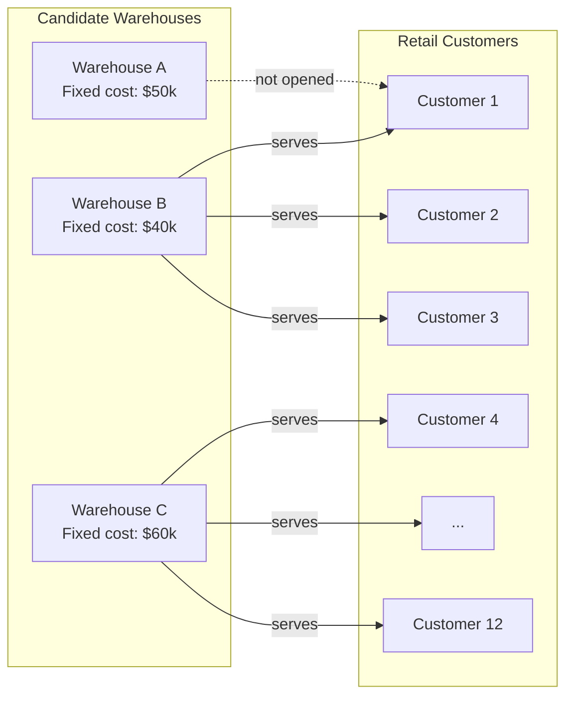
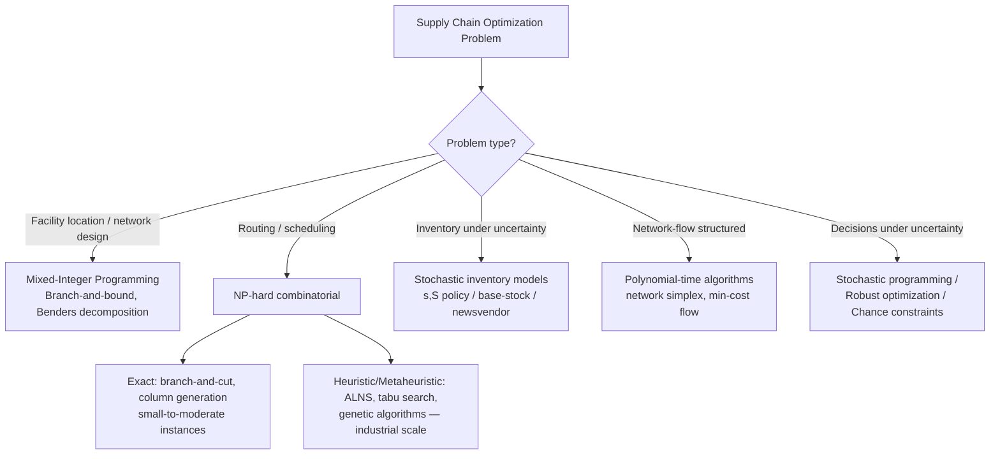

## Supply Chain and Logistics Optimization

### Overview and Scope

Supply chain and logistics optimization applies mathematical programming, stochastic optimization, and heuristic search to decisions spanning network design, inventory policy, transportation routing, and production-distribution planning. Unlike a single-discipline engineering problem, supply chain optimization typically involves decisions at multiple time scales — strategic (years), tactical (months), and operational (days/hours) — and under uncertainty in demand, lead times, and supply availability. The field draws on linear and mixed-integer programming, stochastic programming, queueing theory, and combinatorial optimization (particularly for routing and scheduling).

### Problem Hierarchy: Strategic, Tactical, Operational

**Strategic (network design)**: facility location, plant/warehouse capacity, and supplier selection decisions with planning horizons of multiple years. These are typically formulated as mixed-integer linear programs (MILPs) since facility "open/close" decisions are inherently binary.

**Tactical (planning)**: production planning, inventory positioning, and distribution planning over a rolling horizon of weeks to months — e.g., sales and operations planning (S&OP), safety stock allocation across a multi-echelon network.

**Operational (execution)**: vehicle routing, workforce scheduling, and order picking, with planning horizons of hours to days, where combinatorial complexity is high but the decisions are more localized.

This hierarchy matters because a decision made at one level constrains what is feasible at another (e.g., a strategic warehouse location decision fixes the transportation network that tactical and operational models must then work within), and formulations rarely attempt to solve all three levels simultaneously except in specialized integrated models.

### Key Points

- Facility location and network design problems are almost universally formulated as mixed-integer programs, because opening/closing a facility is a discrete decision that interacts nonlinearly with continuous flow variables.
- The Vehicle Routing Problem (VRP) and its variants are NP-hard, so exact solution is only tractable for small-to-moderate instances; industrial-scale routing relies on heuristics, metaheuristics, or column generation with limited exact guarantees.
- Inventory optimization under uncertainty requires explicit modeling of demand distributions, and the appropriate policy (e.g., $(s,S)$, base-stock) depends on cost structure (holding, ordering, stockout) and replenishment lead time.
- Multi-echelon inventory systems require coordinating safety stock across tiers (supplier → warehouse → retailer), since stock held at one echelon changes the required stock at another — treating echelons independently generally overstates total system inventory.
- Real-world supply chain models increasingly incorporate uncertainty explicitly (stochastic programming, robust optimization) rather than optimizing against a single deterministic forecast, because deterministic solutions can be fragile to forecast error.

### Facility Location and Network Design

The classical **uncapacitated facility location problem (UFLP)** decides which facilities to open and which customers each open facility serves, minimizing fixed opening costs plus transportation costs:

$$\min \sum_{j} f_j y_j + \sum_{i,j} c_{ij} x_{ij} \quad \text{s.t.} \quad \sum_j x_{ij} = 1 \ \forall i, \quad x_{ij} \leq y_j \ \forall i,j, \quad y_j \in \{0,1\}, \ x_{ij} \geq 0$$

where $y_j$ indicates whether facility $j$ is opened, $x_{ij}$ is the fraction of customer $i$'s demand served by facility $j$, $f_j$ is the fixed cost of opening facility $j$, and $c_{ij}$ is the transportation cost.

**Capacitated variants** add a constraint $\sum_i d_i x_{ij} \leq \text{Cap}_j \cdot y_j$, which typically makes the LP relaxation weaker and the problem harder to solve to optimality at scale.

**Multi-echelon network design** extends this to simultaneously decide plant locations, warehouse locations, and the flow assignments between echelons — a hierarchical MILP where the number of binary variables grows with the number of candidate sites at each echelon.

**Common solution approaches**: branch-and-bound with commercial MILP solvers (CPLEX, Gurobi) for moderate-scale instances; Lagrangian relaxation (relaxing the coupling constraints and solving the resulting decomposed subproblems) for larger instances where the relaxation gap is acceptable; and Benders decomposition, which exploits the structure where fixing the facility-opening (binary) variables leaves a much easier linear subproblem in the flow variables.

### Vehicle Routing and Transportation

The **Vehicle Routing Problem (VRP)** generalizes the Traveling Salesman Problem: given a depot, a fleet of vehicles with capacity limits, and a set of customers with demands, find routes minimizing total distance (or cost) such that every customer is visited exactly once and no vehicle exceeds capacity.

$$\min \sum_{k} \sum_{(i,j)} c_{ij} x_{ijk} \quad \text{s.t.} \quad \sum_k \sum_j x_{ijk} = 1 \ \forall i, \quad \sum_i d_i \left(\sum_j x_{ijk}\right) \leq Q \ \forall k$$

plus subtour elimination constraints, which are the main source of combinatorial difficulty since their number grows exponentially with the number of customers.

**Common VRP variants**:

- **CVRP** (Capacitated VRP): vehicle capacity limits only
- **VRPTW** (VRP with Time Windows): customers must be visited within specified time intervals
- **MDVRP** (Multi-Depot VRP): multiple depots serve the customer set
- **PDVRP** (Pickup and Delivery VRP): paired pickup/delivery locations, common in ride-sharing and reverse logistics
- **Stochastic VRP**: demands or travel times are random variables rather than known constants

**Solution methods**:

- **Exact methods**: branch-and-cut and branch-and-price (column generation) can solve VRP instances exactly, but practical instance sizes that remain tractable are generally limited to at most a few hundred customers, and often far fewer for tightly constrained variants. [Inference: the exact size limit depends heavily on instance structure, constraint tightness, and solver/hardware, so this should be read as an order-of-magnitude generalization rather than a fixed threshold.]
- **Construction heuristics**: nearest-neighbor, savings algorithm (Clarke-Wright), sweep algorithm — fast, produce a reasonable initial feasible solution.
- **Metaheuristics**: tabu search, simulated annealing, genetic algorithms, and large neighborhood search (LNS) are the dominant approach for industrial-scale routing (thousands of stops), since they scale far better than exact methods while still producing high-quality (though not certified-optimal) solutions.
- **Adaptive Large Neighborhood Search (ALNS)**: iteratively destroys and repairs parts of a solution using a portfolio of operators, adaptively weighting operators by past performance — widely used in modern commercial routing engines due to its flexibility across VRP variants.

### Example

A regional distribution network with 3 candidate warehouse sites and 12 retail customers. The UFLP formulation decides which warehouses to open and how customer demand is assigned, trading fixed warehouse costs against transportation costs.

Solving the MILP determines that opening Warehouses B and C (and leaving A closed) minimizes total fixed-plus-transportation cost given the customer demand pattern — a result that is not obvious from inspection alone once transportation cost tradeoffs across 12 customers are considered.

### Inventory Optimization

**Economic Order Quantity (EOQ)** is the foundational deterministic model, minimizing the sum of ordering and holding costs:

$$Q^* = \sqrt{\frac{2DK}{h}}$$

where $D$ is annual demand, $K$ is fixed cost per order, and $h$ is holding cost per unit per year. This assumes deterministic, constant demand and is rarely used unmodified in practice, but underlies more complex models.

**$(s, S)$ policy**: when inventory position drops to reorder point $s$, order up to level $S$. Optimal under general conditions for periodic-review systems with fixed ordering costs and stochastic demand.

**Base-stock (order-up-to) policy**: order enough each period to bring inventory position up to a target level $S$; optimal for continuous-review systems without fixed ordering costs.

**Newsvendor model**: for single-period, perishable/seasonal inventory decisions, the optimal order quantity balances underage cost $c_u$ (lost sales) against overage cost $c_o$ (excess inventory):

$$Q^* = F^{-1}\left(\frac{c_u}{c_u + c_o}\right)$$

where $F^{-1}$ is the inverse cumulative distribution function of demand — this critical ratio $\frac{c_u}{c_u+c_o}$ is a standard result in stochastic inventory theory.

**Safety stock** under demand uncertainty during lead time is commonly set as:

$$SS = z \cdot \sigma_L$$

where $z$ is the standard normal quantile corresponding to the target service level and $\sigma_L$ is the standard deviation of demand over the lead time — this normal-approximation formula is standard practice but its accuracy depends on how well demand is actually approximated by a normal distribution. [Inference: for demand patterns with significant skew or intermittency (e.g., spare parts), this approximation can be materially inaccurate, and alternative distributions such as gamma or Poisson-based models are often preferred in practice.]

### Multi-Echelon Inventory Optimization (MEIO)

MEIO coordinates stock positioning across supply chain tiers rather than optimizing each location independently. Key concepts:

- **Risk pooling**: consolidating inventory (or demand variability) at a central point reduces total safety stock needed, since aggregated demand variance grows sub-linearly relative to the sum of individual-location variances (formally, $\sigma_{\text{pooled}} \leq \sum \sigma_i$ under typical correlation structures).
- **Guaranteed-service models**: assume each stage guarantees a bounded replenishment time to its downstream stage, converting a stochastic problem into a deterministic optimization over service time allocations — a tractable approach popularized by Graves and Willems' work on supply chain safety stock placement.
- **Stochastic-service models**: model actual stochastic stockout and backorder dynamics between echelons directly, generally more accurate but computationally heavier.

### Production Planning and Scheduling

**Aggregate production planning**: determines production, inventory, and workforce levels over a rolling horizon (e.g., 12 months), typically formulated as an LP or MILP with the objective of minimizing production, holding, overtime, and hiring/firing costs subject to capacity and demand-satisfaction constraints.

**Material Requirements Planning (MRP)**: not itself an optimization method but a deterministic requirements-explosion calculation (translating end-item demand into component and raw-material requirements via the bill of materials) that provides input data many production optimization models build on.

**Job-shop and flow-shop scheduling**: sequencing jobs on machines to minimize makespan, tardiness, or other objectives; NP-hard in general, solved via branch-and-bound for small instances and dispatching rules or metaheuristics (genetic algorithms, tabu search) at industrial scale.

**Lot-sizing problems**: determine production batch sizes and timing to minimize setup and holding costs subject to capacity — the Wagner-Whitin algorithm solves the uncapacitated dynamic lot-sizing problem to optimality via dynamic programming in polynomial time, while the capacitated version is NP-hard.

### Optimization Under Uncertainty

Because demand, lead times, and supply are rarely known with certainty, several formal frameworks extend deterministic models:

- **Stochastic programming**: models uncertainty via scenarios with associated probabilities, optimizing expected cost (or a risk measure) across scenarios. Two-stage stochastic programs are common — "here-and-now" decisions (e.g., facility locations) made before uncertainty resolves, "wait-and-see" decisions (e.g., flows) made after.
- **Robust optimization**: optimizes against a worst-case realization within an uncertainty set, avoiding the need for full probability distributions but potentially yielding more conservative solutions than stochastic programming.
- **Chance-constrained programming**: requires constraints to hold with at least a specified probability (e.g., service level $\geq 95\%$) rather than deterministically, directly linking to service-level targets used in inventory management.
- **Scenario reduction**: since stochastic programs' computational cost scales with the number of scenarios, techniques to reduce a large scenario set to a smaller representative subset (while preserving key statistical properties) are often necessary for tractability at scale.

### Network Flow and Transportation Formulations

Many tactical logistics problems reduce to network flow structures with well-understood polynomial-time algorithms when integrality/capacity structure is favorable:

- **Transportation problem**: minimum-cost flow from a set of supply nodes to demand nodes, solvable via specialized simplex variants or network simplex, exploiting the fact that the constraint matrix is totally unimodular (guaranteeing integer solutions from LP relaxation when supplies/demands are integer).
- **Minimum-cost flow**: generalizes the transportation problem to arbitrary network topologies, solvable in polynomial time via algorithms such as the network simplex method or cost-scaling algorithms.
- **Multi-commodity flow**: when multiple distinct products/commodities share the same network capacity, the totally unimodular structure is generally lost, and the problem becomes substantially harder (though still an LP, its structure does not guarantee integer solutions).

### Solution Approaches Summary

### Practical Considerations

- **Data quality dependency**: optimization output quality is bounded by input data quality (demand forecasts, cost parameters, lead time distributions); a mathematically optimal solution to a poorly estimated model may perform worse in practice than a robust heuristic solution to a well-estimated one.
- **Rolling horizon replanning**: because real conditions deviate from plan, most tactical/operational models are re-solved on a rolling basis (e.g., weekly) rather than solved once, which affects how much solution stability (avoiding large plan changes between re-solves) matters as a secondary objective.
- **Computational tractability at scale**: exact optimization of large combined network-design-plus-routing problems is generally intractable jointly; practice typically decomposes into a hierarchy (solve network design first, then routing within the resulting network), which is optimal for neither subproblem jointly but is tractable and widely used.
- **Behavioral and organizational factors**: model-recommended solutions (e.g., closing a warehouse, changing supplier allocation) often interact with contractual, labor, and organizational constraints not captured in the mathematical model, so real-world adoption typically requires validating model output against these unmodeled constraints. [Inference: the extent of this gap is organization-specific and cannot be generalized numerically.]

### Conclusion

Supply chain and logistics optimization spans a hierarchy of decisions — strategic network design (MILP-based facility location), tactical planning (production and inventory optimization under uncertainty), and operational execution (NP-hard routing and scheduling solved via metaheuristics at scale). The dominant mathematical tools are mixed-integer programming for discrete facility and network decisions, stochastic/robust optimization for demand and supply uncertainty, and combinatorial heuristics for routing and scheduling problems where exact solution is computationally intractable at industrial scale. Because these problem levels interact but are rarely solved jointly, a recurring practical theme is a hierarchical decomposition — strategic decisions constraining tactical ones, tactical decisions constraining operational ones — traded off against the computational tractability of solving everything simultaneously.

**Related Topics**

- Vehicle routing problem variants and metaheuristic solution methods in depth
- Multi-echelon inventory optimization and safety stock placement (Graves-Willems methodology)
- Stochastic programming formulations for supply chain design under demand uncertainty
- Facility location problem variants: p-median, p-center, and covering models
- Bullwhip effect and its mitigation through information sharing and coordinated ordering policies
- Revenue management and dynamic pricing optimization
- Last-mile delivery optimization and same-day delivery routing
- Supply chain resilience and disruption-aware network design