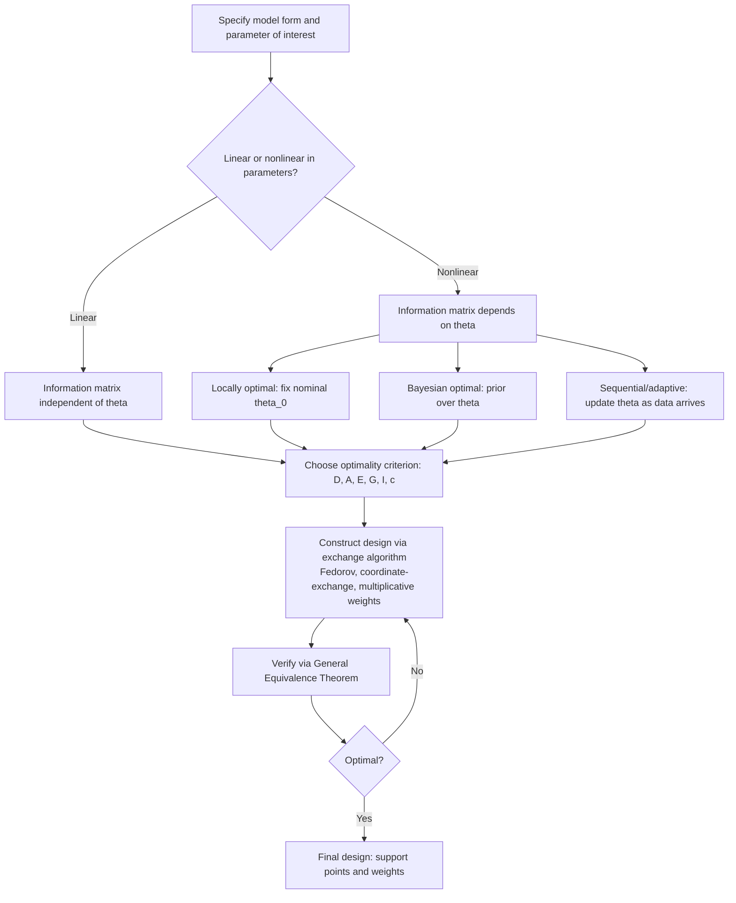

## Optimal Experiment Design

### Overview and Scope

Optimal experiment design (OED) is the branch of optimization concerned with choosing where and how to collect data — which design points, sample sizes, or input conditions to use — so that a resulting statistical model (typically a regression or parameter-estimation model) achieves maximal precision, minimal bias, or maximal information gain, subject to a budget on the number of experimental runs. It connects statistical estimation theory (Fisher information, the Cramér-Rao bound) with optimization over the space of possible designs, and applies across industrial experimentation (DOE), clinical trials, sensor placement, system identification, and machine learning (active learning, Bayesian experimental design).

### Foundational Concepts

**Design space and design measure**: an experiment is characterized by a set of candidate input conditions $\mathcal{X}$ (the design space), and a design $\xi$ specifies which points in $\mathcal{X}$ to sample and with what proportions/replication.

**Fisher information matrix**: for a parametric model with unknown parameters $\theta$, the Fisher information matrix $M(\xi, \theta)$ quantifies how much information the design $\xi$ provides about $\theta$. For a linear regression model $y = \mathbf{x}^T\theta + \epsilon$ with independent, homoscedastic noise of variance $\sigma^2$, the information matrix is:

$$M(\xi) = \frac{1}{\sigma^2}\sum_{i} w_i \, \mathbf{x}_i \mathbf{x}_i^T$$

where $w_i$ is the weight (proportion of runs) allocated to design point $\mathbf{x}_i$.

**Cramér-Rao bound**: the covariance of any unbiased estimator of $\theta$ is bounded below by $M(\xi)^{-1}$ — this is a standard result in estimation theory, meaning that maximizing information (in an appropriate sense) is equivalent to minimizing the achievable estimation covariance.

**Optimal design problem**: choose $\xi$ to optimize some scalar function $\Phi$ of $M(\xi)^{-1}$ (equivalently, of the estimator covariance), subject to $\sum_i w_i = 1$, $w_i \geq 0$, and often an integer constraint if $w_i$ must correspond to whole numbers of replicated runs.

### Key Points

- Different optimality criteria (A, D, E, G, etc.) correspond to different scalar summaries of the covariance/information matrix and generally produce different optimal designs for the same model — there is no single universally "best" criterion independent of the estimation goal.
- D-optimality (minimizing the determinant of the covariance matrix, equivalently maximizing the determinant of the information matrix) is the most widely used criterion because it is invariant to linear reparameterization of $\theta$ and has an intuitive geometric interpretation (minimizing the volume of the confidence ellipsoid).
- The Equivalence Theorem (Kiefer-Wolfowitz) provides a computationally useful certificate: for D-optimality, a design is optimal if and only if the maximum prediction variance over the design space equals a specific bound related to the number of parameters — this underlies efficient design-construction algorithms.
- For nonlinear models, the Fisher information depends on the unknown parameter values themselves, creating a circularity that motivates locally optimal designs (assuming a nominal parameter guess), Bayesian optimal designs (averaging over a prior), or sequential/adaptive designs.
- Classical factorial and response-surface designs (full factorial, fractional factorial, central composite) are special cases that are often close to optimal for polynomial models over a symmetric design region, but algorithmically constructed optimal designs generally outperform them when the design region is irregular, constrained, or resources are limited.

### Alphabetic Optimality Criteria

Given the (per-observation) information matrix $M(\xi)$, common criteria are:

- **D-optimality**: maximize $\det M(\xi)$ (minimize the volume of the joint confidence region for $\theta$). Most common general-purpose criterion.
- **A-optimality**: minimize $\text{tr}(M(\xi)^{-1})$ (minimize the average variance of the parameter estimates). Sensitive to the scale of individual parameters.
- **E-optimality**: maximize the minimum eigenvalue of $M(\xi)$ (minimize the variance of the worst-estimated linear combination of parameters). Focuses on the worst-case direction in parameter space.
- **G-optimality**: minimize the maximum prediction variance over the design space $\max_{x \in \mathcal{X}} \text{Var}[\hat{y}(x)]$. Focused on prediction quality rather than parameter precision directly.
- **I-optimality (or Q-optimality)**: minimize the average prediction variance over the design space, rather than the worst case — often preferred over G-optimality when overall predictive performance matters more than the single worst point.
- **c-optimality**: minimize the variance of a specific linear combination $c^T\theta$ of the parameters, used when the estimation goal is a specific derived quantity (e.g., $LD_{50}$ in dose-response) rather than all parameters equally.

$$\xi_D^* = \arg\max_{\xi} \det M(\xi), \qquad \xi_A^* = \arg\min_{\xi} \text{tr}\left(M(\xi)^{-1}\right)$$

### Example

Consider fitting a simple linear regression $y = \theta_0 + \theta_1 x + \epsilon$ over $x \in [-1, 1]$ with homoscedastic noise. The D-optimal design places all experimental weight at the two extreme points:

$$\xi_D^* : \quad x = -1 \text{ with weight } 0.5, \qquad x = +1 \text{ with weight } 0.5$$

This is a standard, well-known result for first-order polynomial models: maximizing the spread of the design points maximizes the determinant of the information matrix, since the variance of the slope estimate decreases as the design points are pushed to the boundary of the design region. Adding a center point (common in practice for detecting lack-of-fit) is a deliberate deviation from strict D-optimality traded off against a practical diagnostic need.

<svg xmlns="http://www.w3.org/2000/svg" viewBox="0 0 650 260">
\<style\>
.lbl { font-family: sans-serif; font-size: 13px; fill: #333; }
.title { font-family: sans-serif; font-size: 15px; fill: #111; font-weight: 600; }
.ax { stroke: #888; stroke-width: 1; }
\</style\>
<text x="20" y="25" class="title">D-Optimal Design for Linear Regression (svg_diagram)</text>

<line x1="80" y1="200" x2="580" y2="200" class="ax" />
<line x1="330" y1="60" x2="330" y2="200" class="ax" />
<text x="580" y="220" class="lbl">x</text>
<text x="335" y="60" class="lbl">y</text>

<text x="70" y="220" class="lbl">-1</text>

<text x="325" y="220" class="lbl">0</text>

<text x="565" y="220" class="lbl">+1</text>

<circle cx="300" cy="150" r="6" fill="#bbb" />
<circle cx="315" cy="140" r="6" fill="#bbb" />
<circle cx="345" cy="130" r="6" fill="#bbb" />
<circle cx="360" cy="120" r="6" fill="#bbb" />
<text x="290" y="245" class="lbl" fill="#999">Poor design: clustered near center (high slope variance)</text>

<circle cx="80" cy="170" r="9" fill="#2b6ca3" />
<circle cx="580" cy="90" r="9" fill="#2b6ca3" />
<line x1="80" y1="170" x2="580" y2="90" stroke="#2b6ca3" stroke-width="1.5" stroke-dasharray="5,3" />
<text x="20" y="100" class="lbl" fill="#2b6ca3">weight 0.5</text>
<text x="540" y="80" class="lbl" fill="#2b6ca3">weight 0.5</text>
</svg>

### Design for Nonlinear Models

For a nonlinear model $y = f(x, \theta) + \epsilon$, the Fisher information matrix depends on $\theta$ through the Jacobian $\partial f/\partial \theta$ evaluated at the (unknown) true parameter, creating the core difficulty of nonlinear OED:

- **Locally optimal design**: optimize assuming a best-guess nominal value $\theta_0$; the resulting design is only guaranteed optimal if $\theta_0$ is close to the true value, so sensitivity to the nominal guess is a standard practical concern.
- **Bayesian optimal design**: place a prior distribution $p(\theta)$ over the unknown parameters and optimize the expected criterion, e.g. $\mathbb{E}_\theta[\log \det M(\xi, \theta)]$ for Bayesian D-optimality (often called "pseudo-Bayesian" D-optimality in the literature). This hedges against parameter uncertainty at the cost of higher computational expense (the expectation typically requires numerical integration or Monte Carlo approximation).
- **Sequential/adaptive design**: run a small initial design, update the parameter estimate, then choose the next design point(s) based on the updated estimate — iterating design and estimation. This is standard in settings like dose-finding clinical trials (e.g., continual reassessment method) where between-run adaptation is feasible.
- **Minimax/robust design**: optimize the worst-case criterion value over a plausible range of parameter values rather than a single nominal value or full prior, trading average-case efficiency for protection against being badly wrong about $\theta_0$.

### Algorithmic Construction of Optimal Designs

Because the optimal design problem is a convex optimization problem over the space of design measures (for fixed, given candidate points and a concave/convex criterion), it admits efficient algorithms distinct from general nonlinear programming:

- **Fedorov / Wynn-Fedorov exchange algorithms**: iteratively add the design point with highest marginal information gain and remove (or downweight) the point with lowest, converging to the optimal design measure. These algorithms exploit the convexity of the D-optimality problem to guarantee convergence to a global optimum.
- **Multiplicative weight algorithms**: update design weights $w_i$ multiplicatively based on their contribution to the criterion, guaranteed to converge for several standard criteria (D, A) due to the underlying convex structure.
- **Coordinate-exchange algorithms**: used particularly for constructing discrete, exact (integer-run) designs by iteratively optimizing one design point's coordinates at a time, holding others fixed — practical when candidate points are continuous rather than from a finite candidate set.
- **Point-exchange (candidate-set) algorithms**: select the best subset from a large discretized candidate set of possible design points, common in software implementations (e.g., JMP, Design-Expert) because it converts the continuous problem into a tractable discrete search.

The **general equivalence theorem** provides the standard convergence/optimality check across these methods: a design is D-optimal if and only if the prediction variance $d(x, \xi) = \mathbf{f}(x)^T M(\xi)^{-1} \mathbf{f}(x)$ satisfies $d(x,\xi) \leq p$ for all $x \in \mathcal{X}$ (where $p$ is the number of parameters), with equality at the support points of $\xi^*$ — this gives a checkable certificate of global optimality that is unusual to have in a general optimization setting.

### Classical Design-of-Experiments (DOE) Connections

Classical DOE designs, developed largely before modern computational optimal design algorithms, remain widely used and are often close to optimal for their intended model class over a symmetric, unconstrained design region:

- **Full factorial designs**: test all combinations of factor levels; D-optimal for estimating all main effects and interactions in a first-order-with-interactions model over a symmetric hypercube region.
- **Fractional factorial designs**: test a carefully chosen fraction of the full factorial, sacrificing some interaction estimability (via deliberate confounding/aliasing) to reduce run count — the choice of which effects to alias with which is itself a combinatorial design problem (resolution theory).
- **Central composite and Box-Behnken designs**: augment factorial designs with axial and center points to support estimation of quadratic (response-surface) models, used heavily in response surface methodology (RSM).
- **Plackett-Burman designs**: highly efficient screening designs for estimating main effects with a minimal number of runs when interactions are assumed negligible, at the cost of heavy aliasing if that assumption is wrong.

Algorithmically constructed optimal designs (D-optimal, I-optimal) generally outperform these classical designs specifically when: the design region is irregular or constrained (e.g., mixture constraints, restricted factor combinations), the run budget doesn't match a classical design's required run count, or the model includes a non-standard combination of terms — in the regular, well-resourced, standard-polynomial case the two approaches often coincide or nearly coincide. [Inference: "generally outperform" and "often coincide" are qualitative characterizations from the DOE literature; the precise efficiency gap is problem-specific and would require case-by-case computation to state numerically.]

### Bayesian Experimental Design and Information-Theoretic Criteria

A distinct but related framework, particularly prominent in machine learning and Bayesian statistics, frames experiment selection as maximizing expected information gain:

$$\text{EIG}(\xi) = \mathbb{E}_{y \sim p(y|\xi)}\left[ D_{KL}\big(p(\theta | y, \xi) \,\|\, p(\theta)\big) \right]$$

i.e., the expected reduction in posterior uncertainty about $\theta$ (measured via Kullback-Leibler divergence) after observing data from design $\xi$. Under a linear-Gaussian model, maximizing expected information gain is equivalent to Bayesian D-optimality, connecting the classical and Bayesian frameworks. For general nonlinear/non-Gaussian models, EIG generally has no closed form and requires Monte Carlo or variational approximation, which is an active area of methodological development. [Inference: characterizing this as "active" reflects the current state of the optimal-design and Bayesian-computation literature rather than a single citable fact, and specific methods' relative performance is not settled/universal.]

**Active learning** in machine learning is a closely related concept: iteratively selecting which unlabeled data point to query/label next to maximize model improvement, using criteria such as uncertainty sampling, expected model change, or (in its more principled form) exactly the expected-information-gain criterion above — active learning can be viewed as sequential, adaptive Bayesian experimental design applied to a predictive/classification model rather than a physical experiment.

### Design Under Constraints

Practical experiment design frequently involves constraints beyond the basic weight-sum-to-one condition:

- **Cost-constrained design**: different design points may have different costs (e.g., higher-dose treatments requiring more monitoring), requiring a cost-weighted optimality criterion or an explicit budget constraint rather than a simple run-count limit.
- **Mixture constraints**: when design variables are proportions summing to 1 (e.g., formulation/blend experiments), the design space is a simplex rather than a hypercube, requiring specialized mixture-design methodology (Scheffé models, mixture-specific optimal design algorithms).
- **Blocking and restricted randomization**: when experimental runs must be grouped into blocks (e.g., by day, batch, or operator) due to practical constraints, the optimal design must account for block effects, typically via a generalized least squares formulation of the information matrix.
- **Multi-response optimal design**: when multiple response variables are measured simultaneously and may have correlated errors, the information matrix generalizes to account for the full multivariate covariance structure, and criteria must be adapted (e.g., compound criteria combining per-response objectives).

### Practical Considerations

- **Model misspecification risk**: optimal designs are optimal *for the assumed model*; if the true underlying relationship differs from the assumed model form (e.g., true response is cubic but a quadratic model was assumed), a design optimized for parameter precision under the wrong model can perform poorly at detecting the misspecification itself — this motivates including some diagnostic capability (e.g., center points, replicated points) even at a nominal efficiency cost.
- **Replication for pure error estimation**: purely D-optimal designs for polynomial models often place no replicated points, which provides no direct estimate of pure experimental error separate from lack-of-fit; practitioners commonly add replicates deliberately, trading strict optimality for diagnostic capability.
- **Sample size vs. design efficiency**: optimal design theory addresses *where* to sample, which is a distinct question from *how many* total samples are needed for adequate power — the two are often combined in practice (e.g., power analysis to set total $n$, then optimal design to allocate those $n$ runs across candidate points).
- **Software and computational availability**: algorithmic optimal design construction is implemented in specialized software (e.g., JMP, Design-Expert, R packages such as `AlgDesign` and `OptimalDesign`) and is generally more computationally demanding to set up correctly than selecting a standard catalog design, which is part of why classical catalog designs remain heavily used in routine industrial DOE despite the theoretical advantages of algorithmic optimal design in irregular cases.

### Conclusion

Optimal experiment design turns the question of "how should I collect data" into a formal optimization problem over the space of possible sampling designs, using the Fisher information matrix as the bridge between the design and the resulting estimator precision. The choice of scalar optimality criterion (D, A, E, G, I, c) encodes what aspect of estimation quality matters most, exchange-type algorithms exploit the convexity of the resulting design problem to construct provably optimal designs (verified via the general equivalence theorem), and nonlinear models require additional handling — locally optimal, Bayesian, or sequential/adaptive approaches — because the information matrix itself depends on the unknown parameters being estimated. Classical factorial and response-surface DOE designs remain the practical default in many regular settings, with algorithmic optimal design providing the more general and often more efficient tool when the design region or resource constraints are irregular.

**Related Topics**

- Response surface methodology and sequential experimentation strategies
- Bayesian adaptive clinical trial design (continual reassessment, dose-finding)
- Active learning strategies in machine learning (uncertainty sampling, query-by-committee, expected model change)
- Mixture experiment design and Scheffé polynomial models
- Sensor placement and optimal design for spatial/environmental monitoring
- System identification and optimal input design for dynamic systems
- Compressed sensing and optimal sampling in signal processing
- A/B testing and sequential hypothesis testing as a special case of adaptive experimental design