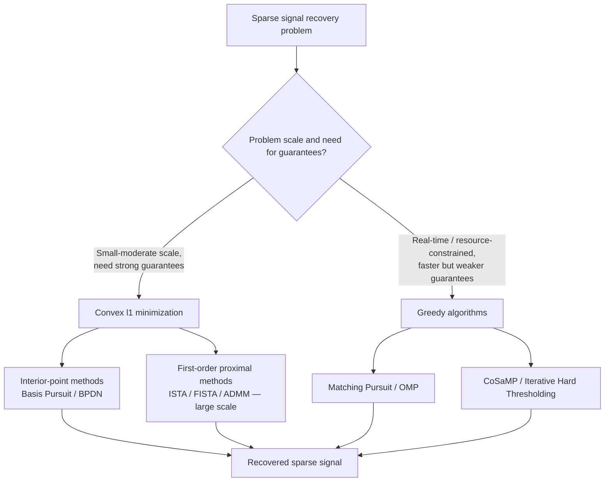

## Signal Processing and Compressed Sensing Applications

### Overview and Scope

Signal processing applications of optimization span classical filter design (convex/linear programming formulations), estimation and denoising (least squares and regularized variants), and, most distinctively, compressed sensing — the theory that sparse or compressible signals can be recovered from far fewer measurements than classical Nyquist-Shannon sampling would require, provided recovery is posed as a sparsity-promoting optimization problem. This connects convex optimization ($\ell_1$ minimization), combinatorial optimization ($\ell_0$ minimization), and randomized linear algebra (measurement matrix design) into a coherent applied optimization framework.

### Key Points

- Compressed sensing recovery hinges on solving an underdetermined linear system by exploiting a sparsity prior, replacing the intractable combinatorial $\ell_0$ problem with a tractable convex $\ell_1$ relaxation under specific conditions.
- Exact or stable recovery guarantees depend on properties of the measurement matrix — Restricted Isometry Property (RIP) or incoherence — not on the optimization algorithm alone; a poorly designed measurement matrix makes accurate recovery impossible regardless of solver quality.
- Filter design problems (FIR filter synthesis with magnitude/phase specifications) are frequently posed as linear or second-order cone programs, allowing global optimality guarantees that heuristic filter design methods cannot offer.
- Total variation (TV) regularization and wavelet-sparsity regularization are the two dominant sparsity-inducing priors in image and signal denoising/reconstruction, each suited to different classes of signal structure (piecewise-constant vs. smooth-with-detail).
- Greedy algorithms (matching pursuit family) trade recovery guarantees for substantially lower computational cost relative to convex $\ell_1$ solvers, making them preferred in real-time or resource-constrained settings.

### Compressed Sensing: Problem Formulation

The core compressed sensing problem: recover a signal $\mathbf{x} \in \mathbb{R}^n$ that is $k$-sparse (or compressible, i.e., well-approximated by a $k$-sparse vector in some basis) from $m \ll n$ linear measurements:

$$\mathbf{y} = \mathbf{\Phi}\mathbf{x} + \mathbf{e}$$

where $\mathbf{\Phi} \in \mathbb{R}^{m \times n}$ is the measurement matrix and $\mathbf{e}$ is measurement noise. Since $m < n$, this system is underdetermined and has infinitely many solutions without an additional prior; sparsity is the prior that makes recovery well-posed.

The ideal recovery problem minimizes the number of nonzero entries:

$$\min_{\mathbf{x}} \|\mathbf{x}\|_0 \quad \text{s.t.} \quad \|\mathbf{y} - \mathbf{\Phi}\mathbf{x}\|_2 \leq \epsilon$$

This $\ell_0$ problem is combinatorial (NP-hard in general, requiring a search over which subset of coordinates is nonzero) and therefore intractable for realistic problem sizes. The foundational compressed sensing insight is that under suitable conditions on $\mathbf{\Phi}$, this can be replaced by its convex relaxation:

$$\min_{\mathbf{x}} \|\mathbf{x}\|_1 \quad \text{s.t.} \quad \|\mathbf{y} - \mathbf{\Phi}\mathbf{x}\|_2 \leq \epsilon$$

which is a convex (second-order cone) program solvable in polynomial time, and — under the conditions discussed below — provably recovers the same solution as the $\ell_0$ problem.

### Recovery Guarantees: RIP and Incoherence

**Restricted Isometry Property (RIP)**: a matrix $\mathbf{\Phi}$ satisfies RIP of order $k$ with constant $\delta_k$ if

$$(1-\delta_k)\|\mathbf{x}\|_2^2 \leq \|\mathbf{\Phi}\mathbf{x}\|_2^2 \leq (1+\delta_k)\|\mathbf{x}\|_2^2$$

for all $k$-sparse $\mathbf{x}$. Intuitively, RIP requires $\mathbf{\Phi}$ to approximately preserve the geometry (lengths) of sparse vectors, which prevents two different sparse signals from producing nearly identical measurements. This is a well-established sufficient condition in the compressed sensing literature: if $\delta_{2k}$ is sufficiently small (specific thresholds vary by proof technique in the literature), $\ell_1$ minimization recovers the true $k$-sparse signal exactly in the noiseless case, and stably (bounded error) in the noisy case.

**Random matrices and RIP**: a key practical result is that certain random matrices — i.i.d. Gaussian, Bernoulli, or randomly subsampled Fourier/DCT matrices — satisfy RIP with high probability when $m = O(k \log(n/k))$, which is the theoretical basis for compressed sensing's headline claim that the required number of measurements scales with signal sparsity $k$ (times a log factor) rather than signal dimension $n$.

**Coherence**: a more easily computed (though generally weaker) alternative condition, the mutual coherence $\mu(\mathbf{\Phi}) = \max_{i \neq j} |\langle \phi_i, \phi_j \rangle|$ measures the maximum correlation between measurement matrix columns; low coherence is associated with more reliable sparse recovery, and coherence-based guarantees are more straightforward to verify for a specific given matrix than RIP, which is generally NP-hard to verify directly.

### Recovery Algorithms

**Convex optimization approaches**:

- **Basis Pursuit**: the $\ell_1$-minimization problem above, solvable via linear programming (in the noiseless case) or second-order cone programming (noisy case), using interior-point methods or specialized first-order solvers.
- **LASSO (Least Absolute Shrinkage and Selection Operator)**: the Lagrangian/penalized form, $\min_{\mathbf{x}} \frac{1}{2}\|\mathbf{y} - \mathbf{\Phi}\mathbf{x}\|_2^2 + \lambda \|\mathbf{x}\|_1$, connecting compressed sensing directly to sparse regression in statistics; the regularization parameter $\lambda$ controls the sparsity-fidelity tradeoff and is typically chosen via cross-validation or theoretical scaling rules.
- **Basis Pursuit Denoising (BPDN)**: the constrained form shown above, equivalent to LASSO for an appropriate correspondence between $\epsilon$ and $\lambda$.

**Greedy algorithms**:

- **Matching Pursuit (MP)**: iteratively selects the measurement-matrix column most correlated with the current residual and updates the signal estimate along that column, without ever revisiting earlier choices.
- **Orthogonal Matching Pursuit (OMP)**: extends MP by re-solving a least-squares problem over all previously selected columns at each iteration, improving accuracy over plain MP at moderately higher computational cost per iteration.
- **Compressive Sampling Matching Pursuit (CoSaMP)** and **Iterative Hard Thresholding (IHT)**: select/retain multiple coordinates per iteration and include a pruning step back to the target sparsity level, offering recovery guarantees comparable to convex methods under RIP-type conditions while typically running faster in practice — this practical speed advantage is the primary reason they are used in real-time or large-scale settings. [Inference: "typically running faster" and specific real-time suitability depend on implementation and hardware; the qualitative tradeoff (greedy = faster but generally weaker worst-case guarantees than $\ell_1$ methods) is the well-established point, not a specific universal speed multiplier.]

**Proximal and first-order methods** for large-scale $\ell_1$ problems (where interior-point methods become impractical due to Hessian-related costs):

- **ISTA (Iterative Shrinkage-Thresholding Algorithm)**: a proximal gradient method combining a gradient step on the smooth data-fidelity term with a soft-thresholding step (the proximal operator of $\|\cdot\|_1$).
- **FISTA (Fast ISTA)**: adds Nesterov-style momentum/acceleration to ISTA, improving the convergence rate from $O(1/k)$ to $O(1/k^2)$ in objective value — a standard and well-documented acceleration result in convex optimization.
- **ADMM (Alternating Direction Method of Multipliers)**: splits the objective into data-fidelity and sparsity-penalty parts solved alternately, well suited to problems where the proximal operator of each part individually is easy to compute even when the combined problem is not.

### Example

Consider recovering a signal with $n = 1000$ samples known to be $k = 20$-sparse in the frequency domain, using $m = 200$ random Gaussian measurements — well below the $n=1000$ Nyquist-rate sample count.

$$m = 200 \approx O(k \log(n/k)) = O(20 \cdot \log(50)) \approx O(78)$$

up to the constant factor that theory leaves unspecified; in this regime with a Gaussian measurement matrix (which satisfies RIP with high probability for appropriately chosen constants), $\ell_1$ minimization via Basis Pursuit Denoising, solved with FISTA, would be expected to recover the frequency-domain support and coefficient values with high accuracy in the noiseless or low-noise case. [Inference: the specific constant in the $O(k \log(n/k))$ scaling and the exact accuracy achieved depend on the noise level, the precise RIP constant achieved by the realized random matrix, and the recovery algorithm's stopping tolerance — this example illustrates the scaling relationship qualitatively, not a guaranteed numerical outcome.]

<svg xmlns="http://www.w3.org/2000/svg" viewBox="0 0 680 300">
\<style\>
.lbl { font-family: sans-serif; font-size: 12px; fill: #333; }
.title { font-family: sans-serif; font-size: 15px; fill: #111; font-weight: 600; }
.ax { stroke: #888; stroke-width: 1; }
\</style\>
<text x="20" y="25" class="title">Sparse Signal Recovery via l1 Minimization (svg_diagram)</text>

<text x="30" y="55" class="lbl">True sparse signal (k=20 nonzero of n=1000)</text>

<line x1="30" y1="100" x2="630" y2="100" class="ax" />

<line x1="80" y1="100" x2="80" y2="70" stroke="`#2b6ca3`" stroke-width="2" />

<line x1="150" y1="100" x2="150" y2="85" stroke="`#2b6ca3`" stroke-width="2" />

<line x1="260" y1="100" x2="260" y2="60" stroke="`#2b6ca3`" stroke-width="2" />

<line x1="340" y1="100" x2="340" y2="90" stroke="`#2b6ca3`" stroke-width="2" />

<line x1="420" y1="100" x2="420" y2="75" stroke="`#2b6ca3`" stroke-width="2" />

<line x1="510" y1="100" x2="510" y2="65" stroke="`#2b6ca3`" stroke-width="2" />

<line x1="580" y1="100" x2="580" y2="80" stroke="`#2b6ca3`" stroke-width="2" />

<text x="30" y="120" class="lbl" fill="#888">(remaining ~993 coefficients are zero)</text>

<text x="30" y="160" class="lbl">Random measurements: y = Phi x, m=200 rows (compressed)</text>

<rect x="30" y="170" width="120" height="30" fill="`#dbe9f6`" stroke="`#2b6ca3`" />

<text x="55" y="190" class="lbl">m=200</text>

<text x="170" y="190" class="lbl">measurements y</text>

<text x="30" y="230" class="lbl">Recovered signal via l1 minimization (Basis Pursuit)</text>

<line x1="30" y1="270" x2="630" y2="270" class="ax" />

<line x1="80" y1="270" x2="80" y2="242" stroke="`#c0392b`" stroke-width="2" />

<line x1="150" y1="270" x2="150" y2="256" stroke="`#c0392b`" stroke-width="2" />

<line x1="260" y1="270" x2="260" y2="232" stroke="`#c0392b`" stroke-width="2" />

<line x1="340" y1="270" x2="340" y2="261" stroke="`#c0392b`" stroke-width="2" />

<line x1="420" y1="270" x2="420" y2="247" stroke="`#c0392b`" stroke-width="2" />

<line x1="510" y1="270" x2="510" y2="237" stroke="`#c0392b`" stroke-width="2" />

<line x1="580" y1="270" x2="580" y2="252" stroke="`#c0392b`" stroke-width="2" />

<text x="30" y="290" class="lbl" fill="`#c0392b`">Recovered support and amplitudes closely match true signal</text>

</svg>

### Filter Design as Convex Optimization

FIR (Finite Impulse Response) filter design with magnitude constraints on frequency response can be formulated as a linear or second-order cone program, offering global optimality guarantees unavailable to classical windowing or Parks-McClellan-style methods in certain generalized constraint settings:

$$\text{find } \mathbf{h} \quad \text{s.t.} \quad L(\omega) \leq |H(e^{j\omega})| \leq U(\omega), \ \omega \in [0,\pi]$$

where $H(e^{j\omega}) = \sum_k h_k e^{-j\omega k}$ is the frequency response and $L, U$ are lower/upper magnitude bounds at each frequency. When the phase is unconstrained, and via a spectral-factorization argument for magnitude-only specifications, this can often be cast as a convex problem in the autocorrelation coefficients — a well-established technique in convex filter design (used, for example, in Chebyshev/minimax FIR design formulated as an LP).

**Minimax (Chebyshev) filter design**: minimizing the maximum deviation from a desired frequency response, $\min_{\mathbf{h}} \max_\omega |H(e^{j\omega}) - H_d(e^{j\omega})|$, is naturally a linear program after discretizing frequency, and the classical Parks-McClellan algorithm is understood as an efficient specialized solver for this particular LP structure (via the Remez exchange algorithm) predating general-purpose LP software.

**IIR filter design** is generally non-convex directly (due to the rational transfer function structure and stability constraints), but specific reformulations (e.g., constraining poles via a convex parameterization, or use of semidefinite programming relaxations for particular structured problems) allow convex or convex-relaxed approaches in restricted cases.

### Regularization-Based Signal and Image Reconstruction

Beyond compressed sensing's underdetermined-system setting, regularized optimization is the standard framework for denoising, deblurring, and inverse problems in signal and image processing generally:

**Tikhonov (ridge) regularization**: $\min_{\mathbf{x}} \|\mathbf{y} - \mathbf{A}\mathbf{x}\|_2^2 + \lambda\|\mathbf{x}\|_2^2$, appropriate when the signal is expected to be smooth/small in norm but not necessarily sparse; has a closed-form solution via normal equations, making it computationally cheap relative to sparsity-promoting alternatives.

**Total Variation (TV) regularization**: $\min_{\mathbf{x}} \|\mathbf{y} - \mathbf{A}\mathbf{x}\|_2^2 + \lambda\|\nabla \mathbf{x}\|_1$, penalizing the $\ell_1$ norm of the signal's gradient rather than the signal itself, which promotes piecewise-constant reconstructions with sharp edges — this is the standard regularizer for image denoising/deblurring where edge preservation matters, and is the basis of the widely used Rudin-Osher-Fatemi (ROF) model.

**Wavelet-domain sparsity**: $\min_{\mathbf{x}} \|\mathbf{y} - \mathbf{A}\mathbf{x}\|_2^2 + \lambda\|\mathbf{W}\mathbf{x}\|_1$, where $\mathbf{W}$ is a wavelet transform, exploits the well-established empirical fact that natural images and many signals are approximately sparse in a wavelet basis even when not sparse in the original (pixel/time) domain — this is the regularizer underlying much of compressed sensing MRI and related medical imaging applications.

**Elastic net**: $\lambda_1\|\mathbf{x}\|_1 + \lambda_2\|\mathbf{x}\|_2^2$, combining $\ell_1$ sparsity with $\ell_2$ stability, used when the measurement/design matrix has highly correlated columns (where pure $\ell_1$/LASSO solutions can be unstable in which correlated variable gets selected).

### Applications

- **Compressed sensing MRI**: dramatically reduces MRI scan time by acquiring far fewer k-space (frequency-domain) samples than Nyquist would require, reconstructing via wavelet-sparsity or TV-regularized $\ell_1$ minimization — one of the most impactful real-world deployments of compressed sensing theory, since scan time reduction directly benefits patient throughput and reduces motion-artifact risk. [Inference: "one of the most impactful" is a qualitative characterization of prominence in the literature and clinical adoption, not a precise ranked claim.]
- **Single-pixel cameras**: reconstruct 2D images from a sequence of scalar measurements taken through randomized spatial light modulator patterns, directly implementing the compressed sensing measurement model in optical hardware.
- **Radar and sonar**: sparse target detection in range-Doppler space, where compressed sensing enables sub-Nyquist sampling rates for wideband signals under a sparsity-of-targets assumption.
- **Spectrum sensing (cognitive radio)**: detecting occupied frequency bands across a wide spectrum using sub-Nyquist sampling, exploiting the sparsity of active transmissions across the full monitored band.
- **Speech and audio coding**: sparse representation in time-frequency dictionaries (e.g., via matching pursuit variants) for compression and denoising.
- **Seismic data reconstruction**: recovering densely sampled seismic wavefields from sparse/irregular field acquisition, where full-density acquisition is prohibitively expensive.

### Dictionary Learning

A related and important extension: rather than assuming sparsity in a fixed known basis (Fourier, wavelet), **dictionary learning** jointly optimizes a dictionary $\mathbf{D}$ and sparse codes $\{\mathbf{a}_i\}$ to best represent a set of training signals:

$$\min_{\mathbf{D}, \{\mathbf{a}_i\}} \sum_i \|\mathbf{y}_i - \mathbf{D}\mathbf{a}_i\|_2^2 + \lambda \|\mathbf{a}_i\|_1 \quad \text{s.t.} \quad \|\mathbf{d}_j\|_2 \leq 1 \ \forall j$$

This is jointly non-convex in $(\mathbf{D}, \{\mathbf{a}_i\})$ but is generally convex (or has a tractable structure) in each block separately, motivating alternating-minimization algorithms such as K-SVD and Method of Optimal Directions (MOD), which alternate between sparse coding (fixing $\mathbf{D}$, solving for $\mathbf{a}_i$) and dictionary update (fixing $\{\mathbf{a}_i\}$, updating $\mathbf{D}$).

### Practical Considerations

- **Measurement matrix realizability**: fully random Gaussian matrices give the strongest theoretical guarantees but are often impractical to physically implement; structured random matrices (randomly subsampled Fourier/Hadamard, which correspond to physically realizable sampling schemes in MRI and other imaging modalities) sacrifice some theoretical guarantee strength for physical implementability.
- **Choice of sparsifying basis**: recovery quality depends critically on how well the assumed sparsity basis matches the true signal's actual structure; a mismatched basis (e.g., assuming wavelet sparsity for a genuinely non-sparse-in-wavelets signal) can degrade recovery substantially regardless of algorithm choice.
- **Noise and regularization parameter selection**: in practice, $\lambda$ (or the noise tolerance $\epsilon$) is rarely known exactly and must be selected via cross-validation, the discrepancy principle, or theoretically motivated scaling rules — poor selection can cause either over-smoothing (missing genuine signal detail) or under-regularization (fitting noise).
- **Computational cost at scale**: for very large-scale problems (e.g., high-resolution 3D medical imaging), even first-order methods like FISTA or ADMM may require substantial computation per reconstruction; GPU acceleration and problem-specific structure exploitation (e.g., fast Fourier/wavelet transforms rather than dense matrix multiplication) are standard practical necessities rather than optional optimizations.
- **Phase transition behavior**: empirically and theoretically, sparse recovery exhibits a sharp "phase transition" in the $(m/n, k/m)$ plane — recovery succeeds with high probability above a threshold and fails with high probability below it, rather than degrading gradually — a well-documented phenomenon (Donoho-Tanner phase transition) useful for practical measurement-budget planning.

### Conclusion

Optimization is the algorithmic engine of both classical and modern signal processing: filter design reduces to linear or second-order cone programs with global optimality guarantees, and compressed sensing recovers sparse signals from underdetermined measurements by relaxing an intractable $\ell_0$ combinatorial problem to a tractable convex $\ell_1$ problem — a relaxation that is provably tight under RIP or incoherence conditions on the measurement matrix. The resulting recovery problem is solved via convex solvers (interior-point, or first-order proximal methods like FISTA and ADMM for scale) or greedy algorithms (OMP, CoSaMP) that trade recovery guarantees for speed, with the specific choice of sparsity-inducing regularizer (wavelet, TV, learned dictionary) tailored to the structural assumptions appropriate to the signal class — natural images, piecewise-constant signals, or domain-specific sparse representations.

**Related Topics**

- Convex relaxation theory and when $\ell_1$/$\ell_0$ equivalence holds
- Deep learning-based compressed sensing reconstruction (learned priors, unrolled optimization networks)
- Semidefinite programming relaxations in signal processing (phase retrieval, matrix completion)
- Matrix completion and low-rank recovery as a matrix-analog of compressed sensing
- Distributed and online compressed sensing for streaming signal acquisition
- Compressed sensing radar and sub-Nyquist sampling architectures
- Robust PCA and sparse-plus-low-rank decomposition
- Wavelet and dictionary design for domain-specific sparsity