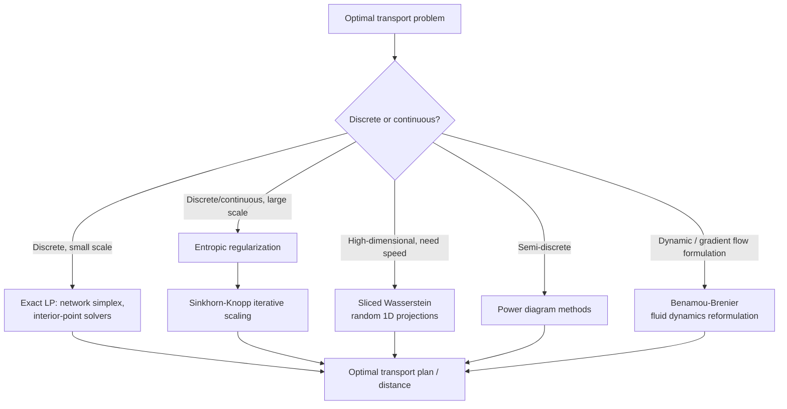

## Optimal Transport Theory

### Overview and Scope

Optimal transport (OT) is the study of the most efficient way to move or transform one probability distribution into another, given a cost function that measures the "expense" of moving mass from one location to another. Originating with Monge's 18th-century problem of moving piles of earth with minimal work, and given a modern relaxed formulation by Kantorovich in 1942, OT has become a central tool across pure mathematics (analysis, geometry, PDE), statistics (distributional distance and comparison), machine learning (generative modeling, domain adaptation), economics (matching markets), and computer graphics/vision (shape interpolation, color transfer).

### Foundational Formulations

**Monge's problem**: given source and target probability distributions $\mu$ and $\nu$ on spaces $\mathcal{X}$ and $\mathcal{Y}$, find a transport map $T: \mathcal{X} \to \mathcal{Y}$ that pushes $\mu$ forward to $\nu$ (written $T_\# \mu = \nu$) while minimizing total transport cost:

$$\min_{T: T_\#\mu = \nu} \int_{\mathcal{X}} c(x, T(x)) \, d\mu(x)$$

where $c(x,y)$ is the cost of moving a unit of mass from $x$ to $y$. This formulation is notoriously difficult to work with directly: the constraint set is non-convex (since $T$ must be a deterministic map, not allowing mass at a single source point to split across multiple destinations), and a feasible map may not even exist for some distribution pairs (e.g., moving a Dirac mass to a non-Dirac distribution has no valid deterministic map).

**Kantorovich relaxation**: replaces deterministic maps with transport plans (couplings) $\pi$ — joint distributions on $\mathcal{X} \times \mathcal{Y}$ with prescribed marginals $\mu$ and $\nu$ — allowing mass to be split across multiple destinations:

$$\min_{\pi \in \Pi(\mu,\nu)} \int_{\mathcal{X}\times\mathcal{Y}} c(x,y) \, d\pi(x,y), \qquad \Pi(\mu,\nu) = \{\pi : \pi(A \times \mathcal{Y}) = \mu(A), \ \pi(\mathcal{X} \times B) = \nu(B)\}$$

This is a linear program in $\pi$ (the objective and constraints are linear in the coupling), which is the key structural simplification that makes Kantorovich's formulation tractable where Monge's is not — every Monge solution corresponds to a Kantorovich plan, but not vice versa, so the Kantorovich problem's optimal value is always a valid lower bound on Monge's (when a Monge solution exists at all, the two coincide).

**Discrete case**: when $\mu = \sum_i a_i \delta_{x_i}$ and $\nu = \sum_j b_j \delta_{y_j}$ are discrete distributions, the Kantorovich problem reduces to a finite-dimensional linear program — the classical transportation problem from operations research:

$$\min_{\pi \geq 0} \sum_{i,j} c_{ij}\pi_{ij} \quad \text{s.t.} \quad \sum_j \pi_{ij} = a_i, \quad \sum_i \pi_{ij} = b_j$$

### Key Points

- The Kantorovich relaxation converts a non-convex Monge problem into a linear program, which is the single most important structural fact enabling both theoretical analysis and computational algorithms for optimal transport.
- The Wasserstein distance, built from the optimal transport cost with $c(x,y) = \|x-y\|^p$, is a genuine metric on the space of probability distributions (unlike KL divergence, which is not symmetric and does not satisfy the triangle inequality), and this metric structure is central to why OT is preferred over other distributional distances in many applications.
- Direct linear programming solution of the Kantorovich problem scales poorly (cubic or worse in the number of support points for standard LP solvers), which motivated entropic regularization (Sinkhorn's algorithm) as the dominant practical computational approach in modern applications.
- Under regularity conditions (e.g., $\mu$ absolutely continuous, $c(x,y) = \|x-y\|^2$), Brenier's theorem guarantees the optimal Kantorovich plan is actually induced by a deterministic map, so the relaxation and original Monge problem coincide — a significant theoretical bridge between the two formulations.
- Sliced and entropic-regularized variants of Wasserstein distance trade exact OT geometry for dramatically improved computational tractability, and the choice between exact and approximate OT is one of the central practical decisions in applying the theory.

### The Wasserstein Distance

For $p \geq 1$, the **$p$-Wasserstein distance** between distributions $\mu, \nu$ on a metric space $(\mathcal{X}, d)$ is defined using the optimal transport cost with $c(x,y) = d(x,y)^p$:

$$W_p(\mu, \nu) = \left( \min_{\pi \in \Pi(\mu,\nu)} \int d(x,y)^p \, d\pi(x,y) \right)^{1/p}$$

$W_1$ (also called the **Earth Mover's Distance** in computer vision and machine learning) has a well-known dual formulation via the **Kantorovich-Rubinstein duality**:

$$W_1(\mu,\nu) = \sup_{\|f\|_{\text{Lip}} \leq 1} \left( \int f \, d\mu - \int f \, d\nu \right)$$

i.e., the maximum difference in expectation over all 1-Lipschitz functions $f$ — this dual form is the basis for the Wasserstein GAN's discriminator/critic, since a neural network with a Lipschitz constraint can be trained to approximate this supremum directly.

**Why Wasserstein distance over other distances**: unlike Kullback-Leibler divergence or total variation distance, $W_p$ remains meaningful (and provides useful gradient information) even when $\mu$ and $\nu$ have disjoint or non-overlapping support — a common situation in generative modeling where a model distribution and data distribution may not overlap early in training. KL divergence is undefined or infinite in that regime, while $W_p$ degrades smoothly with the physical distance between the distributions' supports.

### Computational Optimal Transport

**Linear programming**: the discrete Kantorovich problem can be solved exactly via network simplex or interior-point LP solvers, exploiting the transportation problem's totally unimodular constraint structure (guaranteeing integer/vertex solutions correspond to sparse, structured optimal couplings) — but standard LP solvers scale poorly, with practical cubic-or-worse complexity in the number of support points, making them impractical for the large point clouds common in modern machine learning applications. [Inference: exact complexity scaling depends on the specific solver and problem structure; "cubic or worse" reflects commonly cited complexity for general-purpose transportation LP solvers rather than a single universal bound.]

**Entropic regularization and Sinkhorn's algorithm**: adds an entropy penalty to the Kantorovich objective,

$$\min_{\pi \in \Pi(\mu,\nu)} \sum_{i,j} c_{ij}\pi_{ij} - \varepsilon H(\pi), \qquad H(\pi) = -\sum_{i,j}\pi_{ij}\log\pi_{ij}$$

This regularized problem has a unique solution of the form $\pi_{ij}^* = u_i K_{ij} v_j$ where $K_{ij} = e^{-c_{ij}/\varepsilon}$, and $u, v$ are found via **Sinkhorn-Knopp iterative matrix scaling** — alternately rescaling rows and columns of $K$ to match the target marginals. This iteration converges linearly (geometrically) and each iteration is a simple matrix-vector product, making Sinkhorn's algorithm dramatically faster than exact LP solvers and the dominant practical method for computational optimal transport at scale, at the cost of the solution being an approximation to the true (unregularized) OT plan that becomes exact only as $\varepsilon \to 0$ (where numerical conditioning correspondingly worsens).

**Semi-discrete and continuous OT**: when one distribution is continuous and the other discrete (or both continuous), specialized methods include:

- **Semi-discrete OT via power diagrams**: exploits the fact that the optimal transport map (under quadratic cost) partitions the continuous source domain into cells (a generalized/power Voronoi diagram) each mapped to one discrete target point, reducing the problem to optimizing the power diagram's weight parameters.
- **Benamou-Brenier dynamic formulation**: reformulates $W_2$ as a fluid-dynamics-like problem, minimizing kinetic energy over a continuous interpolating path of densities satisfying the continuity equation — this dynamic viewpoint is both a computational method and the basis for defining Wasserstein gradient flows.

**Sliced Wasserstein distance**: projects high-dimensional distributions onto random 1D directions (where OT has a closed-form solution via sorting) and averages the resulting 1D Wasserstein distances over many random projections — this sidesteps the computational cost of high-dimensional OT entirely, at the cost of only approximating the true (non-sliced) Wasserstein geometry.

### Example

Two discrete distributions represent pixel-intensity histograms of two grayscale images being compared: $\mu$ with mass at intensities $\{20, 80, 150\}$ with weights $\{0.5, 0.3, 0.2\}$, and $\nu$ with mass at $\{40, 100, 200\}$ with weights $\{0.4, 0.4, 0.2\}$. Using cost $c(x,y) = |x-y|$, the discrete Kantorovich LP finds the coupling $\pi_{ij}$ minimizing total transport cost, and $W_1(\mu,\nu)$ gives a single scalar summarizing how different the two intensity histograms are — smoothly reflecting both how much mass differs and how far it must move, unlike a bin-wise comparison (e.g., chi-squared histogram distance) that ignores the relationship between nearby bins.

<svg xmlns="http://www.w3.org/2000/svg" viewBox="0 0 650 280">
\<style\>
.lbl { font-family: sans-serif; font-size: 12px; fill: #333; }
.title { font-family: sans-serif; font-size: 15px; fill: #111; font-weight: 600; }
.ax { stroke: #888; stroke-width: 1; }
\</style\>
<text x="20" y="25" class="title">Optimal Transport Between Two Discrete Distributions (svg_diagram)</text>
<line x1="60" y1="220" x2="600" y2="220" class="ax" />
<text x="300" y="245" class="lbl">intensity value</text>

<circle cx="120" cy="100" r="25" fill="#2b6ca3" opacity="0.85" />
<text x="105" y="105" class="lbl" fill="white">0.5</text>
<text x="90" y="145" class="lbl">mu: x=20</text>
<circle cx="280" cy="130" r="19" fill="#2b6ca3" opacity="0.85" />
<text x="268" y="135" class="lbl" fill="white">0.3</text>
<text x="250" y="165" class="lbl">mu: x=80</text>
<circle cx="420" cy="150" r="15" fill="#2b6ca3" opacity="0.85" />
<text x="408" y="155" class="lbl" fill="white">0.2</text>
<text x="390" y="180" class="lbl">mu: x=150</text>

<circle cx="200" cy="60" r="22" fill="#c0392b" opacity="0.85" />
<text x="188" y="65" class="lbl" fill="white">0.4</text>
<text x="180" y="35" class="lbl">nu: y=40</text>
<circle cx="350" cy="60" r="22" fill="#c0392b" opacity="0.85" />
<text x="338" y="65" class="lbl" fill="white">0.4</text>
<text x="330" y="35" class="lbl">nu: y=100</text>
<circle cx="540" cy="90" r="15" fill="#c0392b" opacity="0.85" />
<text x="528" y="95" class="lbl" fill="white">0.2</text>
<text x="510" y="65" class="lbl">nu: y=200</text>

<line x1="130" y1="80" x2="185" y2="65" stroke="#555" stroke-width="1.5" stroke-dasharray="4,2" />
<line x1="140" y1="110" x2="335" y2="65" stroke="#555" stroke-width="1.5" stroke-dasharray="4,2" />
<line x1="290" y1="115" x2="345" y2="70" stroke="#555" stroke-width="1.5" stroke-dasharray="4,2" />
<line x1="430" y1="140" x2="530" y2="98" stroke="#555" stroke-width="1.5" stroke-dasharray="4,2" />

<text x="60" y="270" class="lbl">Dashed lines: illustrative mass transport; W_1(mu,nu) = total cost of optimal coupling</text>

</svg>

### Theoretical Structure

**Duality**: the Kantorovich problem has a dual formulation in terms of two potential functions $f, g$ (Kantorovich potentials):

$$\max_{f(x) + g(y) \leq c(x,y)} \int f \, d\mu + \int g \, d\nu$$

Strong duality holds under mild conditions (e.g., lower semicontinuous cost on Polish spaces), meaning the primal (transport plan) and dual (potential functions) optimal values coincide — this duality is both of theoretical importance (connecting OT to convex analysis and $c$-transforms) and practical importance (dual-based algorithms, including Sinkhorn's algorithm, are often more efficient than primal-based ones).

**Brenier's theorem**: for quadratic cost $c(x,y) = \|x-y\|^2$ and $\mu$ absolutely continuous with respect to Lebesgue measure, the optimal transport map exists, is unique, and is given by the gradient of a convex function: $T = \nabla \varphi$ for some convex $\varphi$. This is a foundational structural result — it both guarantees Monge and Kantorovich formulations coincide in this setting and connects optimal transport to the Monge-Ampère PDE (since $\nabla\varphi$ pushing $\mu$ to $\nu$ implies $\varphi$ satisfies a Monge-Ampère equation relating the two densities).

**Wasserstein barycenters**: given multiple distributions $\nu_1, \dots, \nu_K$, the Wasserstein barycenter is the distribution minimizing the weighted sum of squared $W_2$ distances to each:

$$\bar\nu = \arg\min_{\nu} \sum_k \lambda_k W_2(\nu, \nu_k)^2$$

This generalizes the notion of an "average" to the space of probability distributions in a way that respects their geometric/mass-transport structure rather than simply averaging densities pointwise — pointwise averaging of, say, two similar but spatially shifted bumps produces a bimodal blur, while the Wasserstein barycenter produces a single bump at the interpolated location, which is generally the qualitatively more natural notion of "average shape."

### Applications in Machine Learning

**Wasserstein GAN (WGAN)**: replaces the Jensen-Shannon divergence implicitly minimized by standard GANs with the (dual form of the) $W_1$ distance between real and generated data distributions, using a Lipschitz-constrained critic network to approximate the Kantorovich-Rubinstein dual supremum. This was motivated by the theoretical property that $W_1$ provides meaningful gradients even when the generator and data distributions have disjoint support (a common early-training situation where JS divergence provides vanishing or uninformative gradients).

**Domain adaptation**: OT is used to find a transport map or coupling between a source domain's feature distribution and a target domain's, aligning them so a model trained on the source generalizes to the target — this frames domain adaptation as a distributional alignment problem solvable via computational OT rather than requiring labeled target-domain data.

**Distributionally robust optimization**: defines an "ambiguity set" of distributions within a Wasserstein ball around an empirical distribution, and optimizes for the worst case within that ball — a widely used framework connecting OT geometry directly to robust decision-making under distributional uncertainty.

**Optimal transport for generative modeling beyond GANs**: score-based/diffusion models and flow-matching methods have connections to the dynamic (Benamou-Brenier) OT formulation, since both involve constructing a continuous-time path between a simple reference distribution and a complex target distribution. [Inference: the degree to which specific diffusion/flow-matching architectures are formally equivalent to, versus merely inspired by or loosely connected to, Benamou-Brenier OT varies by specific method and is an active area of theoretical work rather than a settled one-to-one correspondence.]

### Applications in Other Fields

**Economics and matching markets**: OT theory has deep historical and continuing ties to assignment problems and stable matching (e.g., the assignment game), where the dual Kantorovich potentials have direct economic interpretation as equilibrium prices/utilities in a matching market.

**Computer graphics and vision**: shape interpolation (morphing one 3D shape into another via the optimal transport map, producing more physically natural intermediate shapes than naive vertex interpolation), color transfer between images (matching the color histogram of one image to another via OT), and texture synthesis.

**Cosmology and physics**: the Benamou-Brenier dynamic formulation and Monge-Ampère connection have been applied to reconstructing the early universe's mass distribution from its current state, treating cosmic structure formation as an optimal transport problem under a gravity-derived cost.

**Statistics**: Wasserstein distance is used for goodness-of-fit testing, two-sample testing, and as a loss function in statistical estimation (minimum Wasserstein distance estimators), valued particularly for its metric properties and interpretability relative to distributions with different or partially overlapping support.

### Practical Considerations

- **Choice of regularization strength ($\varepsilon$) in Sinkhorn**: smaller $\varepsilon$ gives a closer approximation to true OT but causes numerical conditioning to worsen (the kernel matrix $K_{ij}=e^{-c_{ij}/\varepsilon}$ becomes increasingly ill-conditioned), requiring stabilization techniques (log-domain computation) for small $\varepsilon$ in practice — this is a standard and well-documented tradeoff in the computational OT literature.
- **Cost function choice**: the transport cost $c(x,y)$ is a modeling choice, not a given; squared Euclidean distance is common for its connection to Brenier's theorem and its computational convenience with Sinkhorn, but domain-specific costs (e.g., perceptual distance metrics for images) are often more meaningful and change the resulting optimal coupling substantially.
- **Sample complexity in high dimensions**: empirical Wasserstein distance (computed from finite samples) converges to the true distributional distance at a rate that degrades with dimension (the curse of dimensionality applies), which is part of the practical motivation for sliced and regularized variants when working with high-dimensional data such as images or embeddings. [Inference: the precise convergence rate is a well-studied but technical statistical result that varies with the specific setting (distribution smoothness, metric, dimension); "degrades with dimension" is the qualitative, well-established characterization.]
- **Unbalanced optimal transport**: standard OT requires $\mu$ and $\nu$ to have equal total mass (both are probability distributions); when comparing distributions with different total mass (e.g., point clouds of different sizes, or where some mass creation/destruction is physically meaningful), unbalanced OT formulations relax the exact marginal constraints via penalty terms, which is necessary in a number of practical applications (e.g., certain biological or physical systems where mass is not strictly conserved between the compared states).

### Conclusion

Optimal transport theory reformulates the intuitive question of "cheapest way to morph one distribution into another" first as Monge's intractable deterministic-map problem, then as Kantorovich's linear-programming relaxation over transport plans — a reformulation whose convexity is the central fact enabling both theoretical analysis (duality, Brenier's theorem) and practical computation. The resulting Wasserstein distance is a genuine metric with favorable properties (meaningful gradients under disjoint support, geometrically natural barycenters) that other divergences lack, but exact computation via linear programming scales poorly, which has made entropic regularization and Sinkhorn's algorithm the dominant practical tool, alongside sliced and semi-discrete variants for specific structural settings. This combination of rigorous theoretical structure and increasingly practical computation has driven OT's adoption across generative modeling, domain adaptation, robust optimization, and a range of applied fields well beyond its origins in transportation logistics.

**Related Topics**

- Sinkhorn algorithm convergence analysis and numerical stabilization techniques
- Wasserstein gradient flows and connections to PDE theory
- Gromov-Wasserstein distance for comparing distributions on different metric spaces
- Optimal transport in generative modeling: diffusion models and flow matching
- Distributionally robust optimization with Wasserstein ambiguity sets
- Unbalanced and partial optimal transport formulations
- Multi-marginal optimal transport and its connections to density functional theory
- Computational geometry approaches to semi-discrete optimal transport