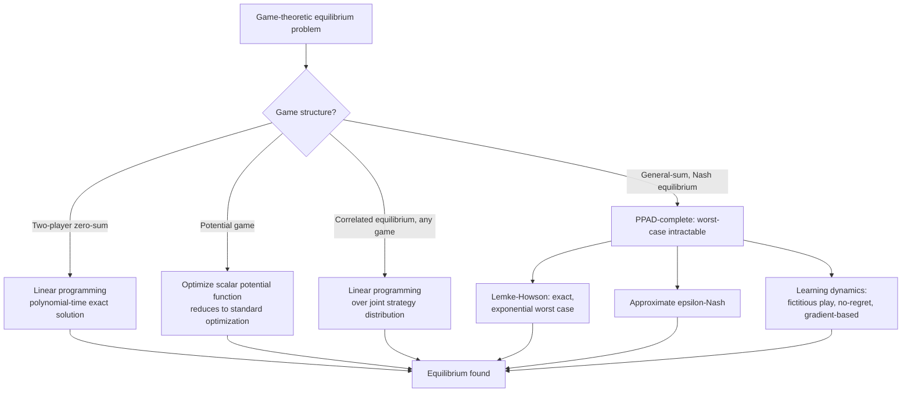

## Game-Theoretic Optimization and Equilibrium Computation

### Overview and Scope

Game-theoretic optimization studies decision-making settings with multiple self-interested agents whose objectives interact, where no single agent unilaterally controls the outcome. Unlike classical single-agent optimization (find the $\mathbf{x}$ minimizing $f(\mathbf{x})$), game theory asks what stable outcome — an equilibrium — arises when each agent optimizes its own objective given the others' choices. Equilibrium computation is the algorithmic problem of finding such outcomes, connecting fixed-point theory, convex optimization (via variational inequalities), linear/mixed-integer programming, and, increasingly, learning-based methods. Applications span economics and auction design, multi-agent reinforcement learning, network routing, security (adversarial and Stackelberg games), and robust optimization.

### Foundational Concepts

**Normal-form game**: defined by a set of players $N = \{1,\dots,n\}$, strategy sets $S_i$ for each player, and payoff functions $u_i: S_1 \times \cdots \times S_n \to \mathbb{R}$. A player's **best response** to opponents' strategies $s_{-i}$ is $BR_i(s_{-i}) = \arg\max_{s_i \in S_i} u_i(s_i, s_{-i})$.

**Nash equilibrium**: a strategy profile $s^* = (s_1^*, \dots, s_n^*)$ such that no player can improve their payoff by unilaterally deviating: $u_i(s_i^*, s_{-i}^*) \geq u_i(s_i, s_{-i}^*)$ for all $s_i \in S_i$ and all $i$. Equivalently, every player is simultaneously playing a best response to everyone else.

**Existence**: Nash's theorem guarantees that every finite game (finite players, finite pure strategies) has at least one equilibrium in **mixed strategies** (probability distributions over pure strategies), via Kakutani's fixed-point theorem applied to the best-response correspondence — this existence guarantee does not extend to guaranteeing a *pure*-strategy equilibrium, which may not exist (e.g., matching pennies).

**Mixed-strategy Nash equilibrium**: a profile of probability distributions $\sigma_i$ over each player's strategy set such that each $\sigma_i$ is a best response to $\sigma_{-i}$ in expectation:

$$\sigma_i^* \in \arg\max_{\sigma_i} \mathbb{E}_{s_i \sim \sigma_i, s_{-i}\sim\sigma_{-i}^*}[u_i(s_i, s_{-i})] \quad \forall i$$

### Key Points

- Nash equilibrium existence is guaranteed for finite games, but computing one is generally hard: the problem is complete for the complexity class PPAD (Polynomial Parity Argument on Directed graphs), believed to be intractable in the worst case even for two-player games — a fundamentally different tractability picture than single-agent convex optimization.
- Two-player zero-sum games are the major tractable special case: computing a Nash equilibrium reduces to solving a linear program (via LP duality and the minimax theorem), making this class polynomial-time solvable in sharp contrast to general-sum games.
- Correlated equilibrium relaxes Nash equilibrium by allowing a shared correlation device (a public or private signal players can condition their strategy on); the set of correlated equilibria is always a convex polytope and can be computed via a single linear program, in contrast to Nash equilibria which generally cannot.
- Potential games — a structured class where a single scalar "potential function" captures each player's incentive to deviate — reduce Nash equilibrium computation to ordinary (single-objective) optimization of the potential function, making them the primary tractable general-sum special case besides zero-sum games.
- Learning dynamics (best-response dynamics, fictitious play, no-regret learning, gradient-based multi-agent methods) provide practical algorithms that often converge to equilibrium (or equilibrium-like) behavior in specific game classes, even where direct equilibrium computation is intractable in general.

### Two-Player Zero-Sum Games and Linear Programming

In a two-player zero-sum game, $u_1(s_1,s_2) = -u_2(s_1,s_2)$ — one player's gain is exactly the other's loss. The **minimax theorem** (von Neumann) guarantees:

$$\max_{\sigma_1} \min_{\sigma_2} \mathbb{E}[u_1(s_1,s_2)] = \min_{\sigma_2} \max_{\sigma_1} \mathbb{E}[u_1(s_1,s_2)]$$

i.e., it does not matter whether the maximizing player commits first or the minimizing player does — the equilibrium value is the same either way. This equality is what makes zero-sum games tractable: computing player 1's optimal mixed strategy reduces to a linear program,

$$\max_{v, \sigma_1} v \quad \text{s.t.} \quad \sum_{s_1} \sigma_1(s_1) A_{s_1, s_2} \geq v \ \ \forall s_2, \quad \sum_{s_1}\sigma_1(s_1) = 1, \ \sigma_1 \geq 0$$

where $A$ is the payoff matrix. This LP is solvable in polynomial time via standard methods (simplex, interior-point), which is the primary reason two-player zero-sum games occupy a privileged, tractable position relative to general-sum games.

### Computational Complexity of Nash Equilibrium

For general finite games, **Lemke-Howson algorithm** is the classical combinatorial method for finding one Nash equilibrium in two-player general-sum games, via a complementary pivoting procedure on the players' best-response polytopes — it is guaranteed to terminate at a Nash equilibrium but, in the worst case, can require a number of pivots exponential in the game size, and does not extend cleanly to games with three or more players.

**PPAD-completeness**: finding a Nash equilibrium of a general (even two-player) game is complete for PPAD, a complexity class believed (though not proven, consistent with the broader P vs NP landscape) to be strictly harder than P. This is a foundational hardness result in algorithmic game theory (Daskalakis, Goldberg, Papadimitriou and related work) establishing that, absent a breakthrough in complexity theory, no polynomial-time algorithm is expected to compute exact Nash equilibria for general games.

**Practical implications**: because of this hardness, real applications either (a) restrict to tractable game classes (zero-sum, potential games), (b) accept approximate equilibria ($\epsilon$-Nash, where no player can gain more than $\epsilon$ by deviating), or (c) use learning dynamics that converge to equilibrium behavior for specific structured settings even without a general worst-case polynomial guarantee.

### Example

A two-player zero-sum game: rock-paper-scissors, with payoff matrix (row player's payoff) $A = \begin{pmatrix} 0 & -1 & 1 \\ 1 & 0 & -1 \\ -1 & 1 & 0 \end{pmatrix}$ over strategies {Rock, Paper, Scissors}.

By symmetry (and confirmable by solving the LP above), the unique Nash equilibrium is the uniform mixed strategy $\sigma^* = (1/3, 1/3, 1/3)$ for both players, with equilibrium value $v^* = 0$ — this is a standard, well-known result: any deviation from uniform play (e.g., over-playing Rock) can be exploited by an opponent who observes and best-responds to that bias, while the uniform strategy itself cannot be exploited by any pure or mixed counter-strategy.

<svg xmlns="http://www.w3.org/2000/svg" viewBox="0 0 620 300">
\<style\>
.lbl { font-family: sans-serif; font-size: 13px; fill: #333; }
.title { font-family: sans-serif; font-size: 15px; fill: #111; font-weight: 600; }
.cell { font-family: sans-serif; font-size: 13px; fill: #222; text-anchor: middle; }
\</style\>
<text x="20" y="25" class="title">Rock-Paper-Scissors Payoff Matrix and Equilibrium (svg_diagram)</text>

<text x="180" y="55" class="lbl">Row player's payoff</text>

<g font-family="sans-serif" font-size="13">

<text x="130" y="80" class="cell">Rock</text>

<text x="230" y="80" class="cell">Paper</text>

<text x="330" y="80" class="cell">Scissors</text>

<text x="60" y="110" class="lbl">Rock</text>

<text x="60" y="140" class="lbl">Paper</text>

<text x="60" y="170" class="lbl">Scissors</text>

</g>

<rect x="90" y="90" width="290" height="100" fill="none" stroke="#888" />

<line x1="90" y1="120" x2="380" y2="120" stroke="#ccc" />

<line x1="90" y1="150" x2="380" y2="150" stroke="#ccc" />

<line x1="180" y1="90" x2="180" y2="190" stroke="#ccc" />

<line x1="280" y1="90" x2="280" y2="190" stroke="#ccc" />

<text x="135" y="110" class="cell">0</text>

<text x="230" y="110" class="cell">-1</text>

<text x="330" y="110" class="cell">+1</text>

<text x="135" y="140" class="cell">+1</text>

<text x="230" y="140" class="cell">0</text>

<text x="330" y="140" class="cell">-1</text>

<text x="135" y="170" class="cell">-1</text>

<text x="230" y="170" class="cell">+1</text>

<text x="330" y="170" class="cell">0</text>

<text x="430" y="55" class="lbl">Nash equilibrium strategy (both players)</text>

<line x1="430" y1="180" x2="580" y2="180" stroke="#888" />

<rect x="440" y="120" width="30" height="60" fill="`#2b6ca3`" />

<rect x="490" y="120" width="30" height="60" fill="`#2b6ca3`" />

<rect x="540" y="120" width="30" height="60" fill="`#2b6ca3`" />

<text x="440" y="200" class="lbl">1/3</text>

<text x="490" y="200" class="lbl">1/3</text>

<text x="540" y="200" class="lbl">1/3</text>

<text x="430" y="230" class="lbl">Equilibrium value v* = 0</text>

</svg>

### Correlated Equilibrium

A **correlated equilibrium** generalizes Nash equilibrium by introducing a correlation device: a (possibly external, possibly private) random signal $\omega$ drawn from a known joint distribution, with each player observing a signal component and choosing a strategy as a function of it, such that following the recommendation is a best response in expectation given the joint distribution.

$$\mathbb{E}_{\omega}\left[u_i(f_i(\omega), f_{-i}(\omega)) \mid f_i(\omega) = s_i\right] \geq \mathbb{E}_{\omega}\left[u_i(s_i', f_{-i}(\omega)) \mid f_i(\omega) = s_i\right] \quad \forall s_i, s_i'$$

Crucially, the set of correlated equilibria (as a set of joint probability distributions over the joint strategy space satisfying the above linear incentive constraints) is a **convex polytope**, and any point in it can be found via linear programming — this convexity is the key structural advantage correlated equilibrium has over Nash equilibrium, where the corresponding solution set is generally not convex (a convex combination of two Nash equilibria need not itself be a Nash equilibrium).

**No-regret learning connection**: a standard and important result is that if all players use a no-regret learning algorithm (one whose time-averaged regret vanishes), the empirical distribution of joint play converges to the set of correlated equilibria — this gives a decentralized, computationally simple (each player runs their own no-regret algorithm, e.g., multiplicative weights, without needing to solve the joint LP) route to a correlated equilibrium, unlike Nash equilibrium which generally has no comparably simple decentralized convergence guarantee for general games.

### Potential Games

A game is a **potential game** if there exists a single scalar function $\Phi: S_1\times\cdots\times S_n \to \mathbb{R}$ such that a unilateral deviation by any player changes that player's payoff by exactly the same amount as it changes $\Phi$:

$$u_i(s_i', s_{-i}) - u_i(s_i, s_{-i}) = \Phi(s_i', s_{-i}) - \Phi(s_i, s_{-i}) \quad \forall i, s_i, s_i', s_{-i}$$

This structural property has a major computational consequence: **any local maximizer of $\Phi$ is a pure-strategy Nash equilibrium**, so finding a Nash equilibrium reduces to a standard (single-objective, potentially non-convex but at least single-function) optimization problem over $\Phi$ rather than requiring fixed-point or LP machinery. Congestion games (where players choose paths/resources and costs depend on how many players share each resource) are a canonical and practically important example of potential games, with direct applications to network routing and traffic assignment.

**Best-response dynamics convergence**: in potential games, sequential best-response updates (each player, in turn, switches to their best response given others' current strategies) monotonically increase $\Phi$ and are therefore guaranteed to converge to a pure Nash equilibrium in finite games — a convergence guarantee that does not hold for best-response dynamics in general games (where cycling without convergence is possible).

### Stackelberg (Leader-Follower) Games

In a **Stackelberg game**, one player (the leader) commits to a strategy first, and the other (the follower) observes this commitment and best-responds. The leader's optimization problem becomes a **bilevel optimization** problem:

$$\max_{s_1} u_1(s_1, BR_2(s_1)) \quad \text{where} \quad BR_2(s_1) = \arg\max_{s_2} u_2(s_1, s_2)$$

This nested structure is generally harder to solve than a simultaneous-move Nash equilibrium (bilevel optimization is NP-hard in general, even when both levels are individually convex), but has an important guarantee: the leader's Stackelberg equilibrium payoff is always at least as good as their best Nash equilibrium payoff in the corresponding simultaneous game — commitment (moving first and being observed) is never disadvantageous to the leader.

**Security games**: a major applied use of Stackelberg models, where a defender (leader) commits to a randomized resource-allocation strategy (e.g., patrol patterns) and an attacker (follower) observes this distribution and best-responds by choosing where to attack. Algorithms for computing optimal (strong) Stackelberg equilibria in security games — such as the DOBSS/ERASER mixed-integer programming formulations — have seen real deployment in airport security, wildlife anti-poaching patrol scheduling, and coast guard patrol optimization. [Inference: "real deployment" reflects documented case studies in the security-games literature; the specific operational scope and current status of any particular deployed system is not something this response can verify without checking current sources.]

### Variational Inequality Formulation

Many equilibrium concepts, particularly in games with continuous strategy spaces (e.g., Cournot competition, network routing with continuous flows), are naturally expressed as a **variational inequality (VI)**: find $x^* \in \mathcal{K}$ such that

$$\langle F(x^*), x - x^* \rangle \geq 0 \quad \forall x \in \mathcal{K}$$

where $F$ collects the players' gradient/best-response operators and $\mathcal{K}$ is the joint feasible strategy set. When $F$ is **monotone** ($\langle F(x)-F(y), x-y\rangle \geq 0$), this VI framework connects directly to convex optimization: monotone VIs can be solved via extensions of gradient-based methods (extragradient, mirror-prox) with convergence guarantees analogous to convex optimization, giving a tractable path to equilibrium computation in continuous games with this structure — in contrast to the PPAD-hardness that applies to general finite discrete games. **Wardrop equilibrium** in traffic/network routing (where flow is split so that all used paths between an origin-destination pair have equal, minimal cost) is a canonical VI-formulated equilibrium concept with major applications in transportation network optimization.

### Learning Dynamics and Approximate Equilibrium Computation

Given the worst-case hardness of exact Nash computation, a substantial and active body of methods instead study what equilibrium-like behavior emerges from repeated play or gradient-based learning:

- **Fictitious play**: each player best-responds to the empirical (historical average) distribution of opponents' past play; converges to Nash equilibrium in specific game classes (zero-sum, potential games, and a few others) but is known to fail to converge in some general games.
- **No-regret / online learning algorithms** (multiplicative weights, online gradient descent): guarantee vanishing time-averaged regret for each player individually, with the previously noted consequence that joint empirical play converges to correlated equilibrium in general games, and to Nash equilibrium specifically in two-player zero-sum games.
- **Multi-agent reinforcement learning**: extends single-agent RL (value iteration, policy gradient) to game settings; self-play (as used in AlphaGo/AlphaZero-style systems) and population-based training are practical large-scale approaches, though they generally provide empirical rather than worst-case theoretical convergence guarantees to any specific equilibrium concept in general-sum settings. [Inference: the precise theoretical guarantees (or lack thereof) vary substantially by specific algorithm and game class, and are an active research area rather than a single settled result across all multi-agent RL methods.]
- **Regret matching and counterfactual regret minimization (CFR)**: the primary practical framework for large-scale extensive-form (sequential, imperfect-information) game solving, notably used in achieving superhuman performance in poker; CFR-family algorithms converge to Nash equilibrium in two-player zero-sum extensive-form games with a polynomial (in game size and inverse approximation error) convergence rate.

### Practical Considerations

- **Which equilibrium concept to target**: Nash equilibrium is the most restrictive/natural concept but is often the hardest to compute; when a decentralized, computationally simple, and generally-applicable target is acceptable, correlated equilibrium (achievable via no-regret learning without solving an LP explicitly) is often the more practical choice for large or unstructured games.
- **Exploiting game structure**: identifying whether a real-world strategic interaction is (exactly or approximately) zero-sum, a potential game, or has a Stackelberg (commitment) structure changes the computational approach from "generally intractable" to "polynomial-time solvable," so structural identification is often the single highest-leverage step before choosing an algorithm.
- **Approximation and equilibrium selection**: even where Nash equilibria exist, a game may have multiple equilibria with different payoffs for different players, and standard existence/computation theory says nothing about which one arises in practice — equilibrium selection is a separate, often behaviorally or institutionally resolved question not answered by the mathematics alone.
- **Scale**: extensive-form games with large state/action spaces (e.g., poker, real-time strategy games) require abstraction techniques (grouping similar states/actions) combined with CFR-family or deep multi-agent RL methods, since direct equilibrium computation over the full unabstracted game tree is generally computationally infeasible at real-world scale.

### Conclusion

Game-theoretic optimization replaces the single-objective search of classical optimization with the search for a stable, mutually-best-responding outcome among multiple agents, and the central computational fact governing the field is that this search is tractable only for specific structural classes: two-player zero-sum games (via LP duality and the minimax theorem), potential games (via reduction to scalar function optimization), and correlated equilibria (via a convex polytope LP) — while general Nash equilibrium computation is PPAD-complete and believed intractable in the worst case. This tractability landscape shapes practice directly: real applications either restrict to or approximate one of the tractable structures, or rely on learning dynamics (no-regret algorithms, fictitious play, counterfactual regret minimization, multi-agent RL) that provide empirical or structure-specific convergence to equilibrium-like behavior even where a general worst-case guarantee is unavailable.

**Related Topics**

- Mechanism design and auction theory as inverse game-theoretic optimization
- Counterfactual regret minimization and large-scale extensive-form game solving
- Mean-field games as a continuum approximation for large populations of agents
- Multi-agent reinforcement learning algorithms and convergence theory
- Bilevel and Stackelberg optimization beyond security games
- Cooperative game theory and coalition formation (Shapley value, core)
- Network routing and Wardrop equilibrium in transportation systems
- Adversarial robustness and minimax formulations in machine learning