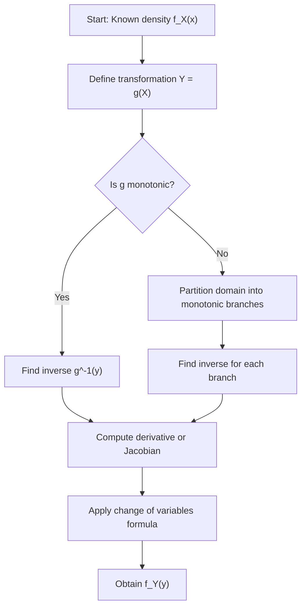

## Change of Variables Formula (svg_diagram)

### Overview

The change of variables formula describes how the probability density function (PDF) of a random variable transforms when that variable undergoes a function transformation. If $X$ is a random variable with a known distribution and $Y = g(X)$ for some function $g$, the change of variables formula allows computation of the density of $Y$ directly from the density of $X$, without deriving the CDF from scratch each time.

This technique is foundational in machine learning contexts including normalizing flows, variational inference, generative modeling, and reparameterization tricks used in stochastic optimization.

### Univariate Case — Monotonic Transformations

**Key Points**

- Let $X$ be a continuous random variable with PDF $f_X(x)$.
- Let $Y = g(X)$, where $g$ is a strictly monotonic (either increasing or decreasing) and differentiable function.
- Let $g^{-1}$ denote the inverse function, so $x = g^{-1}(y)$.

The PDF of $Y$ is given by:

$$f_Y(y) = f_X\left(g^{-1}(y)\right) \left| \frac{d}{dy} g^{-1}(y) \right|$$

The absolute value of the derivative term is called the **Jacobian** (in the univariate case, a scalar derivative). It accounts for how the transformation stretches or compresses probability mass locally.

**Derivation Sketch**

Starting from the CDF relationship for an increasing $g$:

$$F_Y(y) = P(Y \le y) = P(g(X) \le y) = P(X \le g^{-1}(y)) = F_X(g^{-1}(y))$$

Differentiating both sides with respect to $y$ using the chain rule yields the density formula above. For a decreasing $g$, the inequality flips during substitution, which is why the absolute value is required to keep the final density non-negative regardless of monotonic direction. [Inference] This sign-handling detail is a standard part of the derivation across probability textbooks, though the exact presentation varies by source.

### Example

Let $X \sim \text{Uniform}(0, 1)$, so $f_X(x) = 1$ for $x \in (0,1)$.

Define $Y = -\ln(X)$.

**Step 1: Find the inverse.**

$$y = -\ln(x) \implies x = g^{-1}(y) = e^{-y}$$

**Step 2: Compute the derivative.**

$$\frac{d}{dy} g^{-1}(y) = -e^{-y}, \quad \left| \frac{d}{dy} g^{-1}(y) \right| = e^{-y}$$

**Step 3: Apply the formula.**

$$f_Y(y) = f_X(e^{-y}) \cdot e^{-y} = 1 \cdot e^{-y} = e^{-y}, \quad y > 0$$

This is the PDF of an $\text{Exponential}(1)$ distribution. This result — that $-\ln(X)$ for $X \sim \text{Uniform}(0,1)$ yields an exponential distribution — is a standard textbook result and is commonly used in the **inverse transform sampling** method.

### Non-Monotonic Transformations

**Key Points**

- When $g$ is not monotonic over the support of $X$ (e.g., $Y = X^2$ where $X$ can be negative or positive), the inverse function is not unique.
- The domain must be partitioned into regions where $g$ is monotonic, and contributions from each region are summed.

General form for $k$ invertible branches $g_1^{-1}, g_2^{-1}, \dots, g_k^{-1}$:

$$f_Y(y) = \sum_{i=1}^{k} f_X\left(g_i^{-1}(y)\right) \left| \frac{d}{dy} g_i^{-1}(y) \right|$$

**Example**

Let $X \sim \mathcal{N}(0, 1)$ and $Y = X^2$. There are two branches: $x = \sqrt{y}$ and $x = -\sqrt{y}$.

$$f_Y(y) = f_X(\sqrt{y}) \left| \frac{1}{2\sqrt{y}} \right| + f_X(-\sqrt{y}) \left| \frac{-1}{2\sqrt{y}} \right|$$

Since the standard normal density is symmetric, $f_X(\sqrt{y}) = f_X(-\sqrt{y})$, giving:

$$f_Y(y) = \frac{1}{\sqrt{2\pi y}} e^{-y/2}, \quad y > 0$$

This is the density of a **Chi-squared distribution with 1 degree of freedom**, a well-established result in probability theory.

### Multivariate Case — Jacobian Determinant

**Key Points**

- For a vector-valued transformation $\mathbf{Y} = g(\mathbf{X})$ where $g: \mathbb{R}^n \to \mathbb{R}^n$ is a bijective, differentiable mapping, the formula generalizes using the **Jacobian matrix**.
- Let $J$ be the matrix of partial derivatives of $g^{-1}$ with respect to $\mathbf{y}$:

$$J_{ij} = \frac{\partial g_i^{-1}(\mathbf{y})}{\partial y_j}$$

The multivariate change of variables formula is:

$$f_{\mathbf{Y}}(\mathbf{y}) = f_{\mathbf{X}}\left(g^{-1}(\mathbf{y})\right) \left| \det(J) \right|$$

Here $\left|\det(J)\right|$ is the absolute value of the Jacobian determinant, which measures the local volume-scaling factor of the transformation.

### Relevance to Machine Learning

**Key Points**

- **Normalizing flows**: These generative models construct complex distributions by applying a sequence of invertible transformations to a simple base distribution (e.g., standard Gaussian). The change of variables formula is applied at each layer to track the evolving density, and the log-determinant of the Jacobian is typically added to the log-likelihood objective. [Unverified] Specific architectural implementations (e.g., RealNVP, Glow) use variants of this formula, but exact formulations should be checked against the original papers rather than assumed from general principles.
- **Reparameterization trick**: In variational autoencoders, sampling $z = \mu + \sigma \odot \epsilon$ where $\epsilon \sim \mathcal{N}(0, I)$ is a change of variables that allows gradients to flow through stochastic nodes. [Inference] This connection is widely described in VAE literature, though this response has not cross-checked the phrasing against a specific paper.
- **Computational cost**: For high-dimensional transformations, computing the determinant of the Jacobian can be expensive ($O(n^3)$ in general). Architectures are often designed so that the Jacobian is triangular, making the determinant efficient to compute as the product of diagonal entries. [Inference] This design motivation is commonly cited in the normalizing flows literature, but the specific complexity claims depend on the transformation's structure and are not universal guarantees.

**Behavioral Disclaimer**

Claims regarding the behavior of specific ML libraries or frameworks implementing these transformations (e.g., automatic differentiation of Jacobians in PyTorch or TensorFlow) are [Unverified] in this response. Library behavior may vary by version and configuration, and no specific version-behavior claim is made here.

### Diagram — Transformation Mapping

<svg xmlns="http://www.w3.org/2000/svg" viewBox="0 0 700 320">
  <text x="350" y="25" font-size="16" font-weight="bold" text-anchor="middle" fill="#1a1a1a">Change of Variables: X to Y Mapping (svg_diagram)</text>

  
  <rect x="40" y="70" width="180" height="180" fill="#eaf2ff" stroke="#3b6fb6" stroke-width="1.5" />
  <text x="130" y="95" font-size="13" text-anchor="middle" fill="#1a1a1a">Domain of X</text>
  <text x="130" y="160" font-size="12" text-anchor="middle" fill="#333">f_X(x)</text>
  <path d="M 60 220 Q 130 130 200 220" fill="none" stroke="#3b6fb6" stroke-width="2" />

  
  <line x1="230" y1="160" x2="330" y2="160" stroke="#555" stroke-width="2" marker-end="url(#arrowhead)" />
  <text x="280" y="145" font-size="12" text-anchor="middle" fill="#333">g(x)</text>

  
  <rect x="340" y="70" width="180" height="180" fill="#fff0e6" stroke="#c9701f" stroke-width="1.5" />
  <text x="430" y="95" font-size="13" text-anchor="middle" fill="#1a1a1a">Range of Y</text>
  <text x="430" y="160" font-size="12" text-anchor="middle" fill="#333">f_Y(y)</text>
  <path d="M 360 230 Q 430 110 500 230" fill="none" stroke="#c9701f" stroke-width="2" />

  
  <rect x="540" y="120" width="140" height="80" fill="#f2f2f2" stroke="#888" stroke-width="1" />
  <text x="610" y="145" font-size="12" text-anchor="middle" fill="#1a1a1a">Jacobian</text>
  <text x="610" y="165" font-size="12" text-anchor="middle" fill="#333">|dg⁻¹/dy|</text>
  <text x="610" y="185" font-size="11" text-anchor="middle" fill="#666">scales density</text>

  <line x1="520" y1="160" x2="540" y2="160" stroke="#888" stroke-width="1.5" stroke-dasharray="4,3" />

  <text x="350" y="290" font-size="11" text-anchor="middle" fill="#555">f_Y(y) = f_X(g⁻¹(y)) · |Jacobian|</text>

  </svg>

### Process Flow

### Common Pitfalls

**Key Points**

- Forgetting the absolute value of the Jacobian, which can produce a negative "density" — an invalid result.
- Applying the univariate formula to non-monotonic functions without partitioning the domain, leading to incorrect (often under-counted) density values.
- In the multivariate case, confusing the Jacobian of $g$ with the Jacobian of $g^{-1}$; the formula requires the Jacobian of the inverse transformation evaluated at $y$ (equivalently, the reciprocal of $\det(J_g)$ evaluated at $x = g^{-1}(y)$, by the inverse function theorem). [Inference] This equivalence follows from standard multivariable calculus identities, though readers should verify against a calculus reference for their specific transformation.

### Conclusion

The change of variables formula provides a systematic way to derive the distribution of a transformed random variable, whether in one dimension (using the absolute derivative) or multiple dimensions (using the absolute Jacobian determinant). It underlies key generative modeling techniques in machine learning, though this response does not verify implementation-specific details of any particular library or framework — such details should be confirmed against official documentation.

**Related Topics**

- Random Variables — Probability Integral Transform and Inverse Transform Sampling
- Random Variables — Moment Generating Functions
- Multivariate Distributions — Joint, Marginal, and Conditional Densities
- Normalizing Flows — Architecture and Log-Likelihood Computation
- Reparameterization Trick in Variational Autoencoders
- Jacobian and Hessian Matrices in Optimization