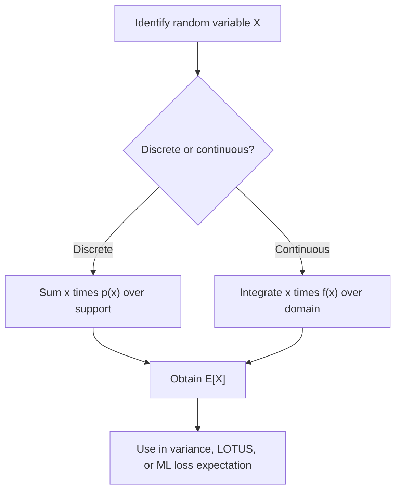

## Expected Value (svg_diagram)

### Definition

The expected value of a random variable is a single summary number representing the long-run average outcome of that variable, weighted by probability. It is also referred to as the mean or expectation of the random variable, commonly denoted $E[X]$ or $\mu$.

### Discrete Random Variables

**Key Points**

- For a discrete random variable $X$ with probability mass function (PMF) $p(x)$, the expected value is defined as:

$$E[X] = \sum_{x} x \cdot p(x)$$

- The sum is taken over all possible values $x$ in the support of $X$.
- This is a standard mathematical definition found consistently across probability textbooks.

**Example**

Let $X$ represent the outcome of a fair six-sided die roll, so $X \in \{1, 2, 3, 4, 5, 6\}$ with $p(x) = \frac{1}{6}$ for each value.

$$E[X] = \sum_{x=1}^{6} x \cdot \frac{1}{6} = \frac{1+2+3+4+5+6}{6} = \frac{21}{6} = 3.5$$

Note that $3.5$ is not a possible outcome of a single roll — expected value represents an average over many repeated trials, not a predicted single outcome.

### Continuous Random Variables

**Key Points**

- For a continuous random variable $X$ with probability density function (PDF) $f(x)$, the expected value is defined as:

$$E[X] = \int_{-\infty}^{\infty} x \cdot f(x) \, dx$$

- This integral must converge (i.e., the corresponding sum or integral of absolute values must be finite) for the expected value to exist. [Inference] This convergence requirement is a standard condition discussed in probability theory texts, though this response has not cited a specific source for this statement.

**Example**

Let $X \sim \text{Uniform}(a, b)$, with $f(x) = \frac{1}{b-a}$ for $x \in [a, b]$.

$$E[X] = \int_{a}^{b} x \cdot \frac{1}{b-a} \, dx = \frac{1}{b-a} \left[ \frac{x^2}{2} \right]_a^b = \frac{a+b}{2}$$

This confirms the intuitive result that the expected value of a uniform distribution is the midpoint of its interval.

### General Definition via Lebesgue Integration

**Key Points**

- A more general, measure-theoretic definition expresses expected value as an integral with respect to the underlying probability measure $P$:

$$E[X] = \int_{\Omega} X(\omega) \, dP(\omega)$$

- This formulation unifies the discrete and continuous cases and extends to random variables that are neither purely discrete nor purely continuous (mixed distributions). [Unverified] This response cannot confirm the specific textbook or course context in which this formulation is presented to the reader, so its framing here is general and not tied to a specific source.

### Expected Value of a Function of a Random Variable

**Key Points**

- For a function $g(X)$ of a random variable $X$, the expected value is computed using the **law of the unconscious statistician (LOTUS)**, without needing to derive the distribution of $g(X)$ first:

Discrete case:

$$E[g(X)] = \sum_{x} g(x) \cdot p(x)$$

Continuous case:

$$E[g(X)] = \int_{-\infty}^{\infty} g(x) \cdot f(x) \, dx$$

**Example**

Let $X \sim \text{Uniform}(0, 1)$ and $g(X) = X^2$.

$$E[X^2] = \int_0^1 x^2 \cdot 1 \, dx = \left[ \frac{x^3}{3} \right]_0^1 = \frac{1}{3}$$

This quantity, $E[X^2]$, is used directly in computing variance.

### Key Properties

**Key Points**

- **Linearity of expectation**: For random variables $X, Y$ and constants $a, b$:

$$E[aX + bY] = aE[X] + bE[Y]$$

This property holds regardless of whether $X$ and $Y$ are independent. This is a standard, well-established result in probability theory.

- **Constant rule**: $E[c] = c$ for any constant $c$.
- **Non-multiplicativity in general**: $E[XY] \neq E[X]E[Y]$ in general; equality holds specifically when $X$ and $Y$ are independent. [Inference] This equivalence condition (independence implying multiplicativity) is a standard textbook result, though the precise conditions can vary slightly depending on formal definitions used in a given course, so readers should confirm against their own reference material.

### Relevance to Machine Learning

**Key Points**

- Expected value underlies the definition of **loss functions** in expectation, such as expected risk minimization, where a model's parameters are chosen to minimize $E[L(\theta, X)]$ over the data distribution.
- It forms the basis of variance, covariance, and higher moments used in describing distributions of weights, gradients, and predictions.
- In Bayesian machine learning, the **posterior expected value** of a parameter is often used as a point estimate.
- [Unverified] Specific claims about how any particular ML framework (e.g., PyTorch, TensorFlow) computes or approximates expected values internally (such as via Monte Carlo estimation) are not confirmed in this response and should be checked against official documentation. Behavior may vary by version and is not guaranteed to remain consistent across releases.

### Diagram — Expected Value as a Balance Point

<svg xmlns="http://www.w3.org/2000/svg" viewBox="0 0 700 260">
  <text x="350" y="25" font-size="16" font-weight="bold" text-anchor="middle" fill="#1a1a1a">Expected Value as Center of Mass (svg_diagram)</text>

  
  <line x1="60" y1="150" x2="640" y2="150" stroke="#333" stroke-width="2" />

  
  <line x1="100" y1="145" x2="100" y2="155" stroke="#333" stroke-width="1.5" />
  <line x1="220" y1="145" x2="220" y2="155" stroke="#333" stroke-width="1.5" />
  <line x1="340" y1="145" x2="340" y2="155" stroke="#333" stroke-width="1.5" />
  <line x1="460" y1="145" x2="460" y2="155" stroke="#333" stroke-width="1.5" />
  <line x1="580" y1="145" x2="580" y2="155" stroke="#333" stroke-width="1.5" />

  <text x="100" y="175" font-size="12" text-anchor="middle" fill="#333">1</text>
  <text x="220" y="175" font-size="12" text-anchor="middle" fill="#333">2</text>
  <text x="340" y="175" font-size="12" text-anchor="middle" fill="#333">3</text>
  <text x="460" y="175" font-size="12" text-anchor="middle" fill="#333">4</text>
  <text x="580" y="175" font-size="12" text-anchor="middle" fill="#333">5</text>

  
  <circle cx="100" cy="120" r="10" fill="#3b6fb6" />
  <circle cx="220" cy="120" r="16" fill="#3b6fb6" />
  <circle cx="340" cy="120" r="20" fill="#3b6fb6" />
  <circle cx="460" cy="120" r="14" fill="#3b6fb6" />
  <circle cx="580" cy="120" r="8" fill="#3b6fb6" />

  
  <polygon points="330,150 350,150 340,175" fill="#c9701f" />
  <text x="340" y="200" font-size="12" text-anchor="middle" fill="#c9701f">E[X] (balance point)</text>
</svg>

### Process Flow

### Common Pitfalls

**Key Points**

- Assuming $E[X]$ must be a value the random variable can actually take — it is a weighted average, not a guaranteed outcome.
- Confusing $E[X^2]$ with $(E[X])^2$; these are generally not equal, and their difference is used to define variance: $\text{Var}(X) = E[X^2] - (E[X])^2$.
- Assuming $E[XY] = E[X]E[Y]$ without confirming independence between $X$ and $Y$.

### Conclusion

Expected value provides the foundational summary statistic for random variables, defined via sums for discrete cases and integrals for continuous cases, and unified through measure-theoretic integration in the general case. It underlies variance, covariance, and expected-risk formulations central to machine learning theory. This response does not confirm framework-specific implementation details, and such claims should be verified against official documentation, as behavior may vary and is not guaranteed.

**Related Topics**

- Variance and Standard Deviation of Random Variables
- Law of the Unconscious Statistician (LOTUS) — Extended Applications
- Linearity of Expectation — Proofs and Applications
- Conditional Expectation and the Law of Total Expectation
- Moment Generating Functions
- Expected Risk Minimization in Machine Learning