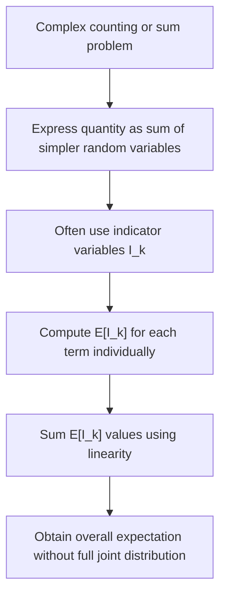

## Linearity of Expectation (svg_diagram)

### Definition

Linearity of expectation states that the expected value of a sum of random variables equals the sum of their individual expected values, regardless of whether those variables are independent or dependent. For random variables $X_1, X_2, \dots, X_n$ and constants $a_1, a_2, \dots, a_n$:

$$E\left[\sum_{i=1}^{n} a_i X_i\right] = \sum_{i=1}^{n} a_i E[X_i]$$

This is a standard, well-established result in probability theory, provable directly from the definition of expected value.

### Simple Two-Variable Case

**Key Points**

- For two random variables $X$ and $Y$ and constants $a, b$:

$$E[aX + bY] = aE[X] + bE[Y]$$

- This holds whether $X$ and $Y$ are independent, dependent, discrete, continuous, or mixed. The property does not require any assumption about the joint distribution of $X$ and $Y$.

### Proof Sketch (Discrete Case)

**Key Points**

Let $X$ and $Y$ be discrete random variables with joint PMF $p(x, y)$.

$$E[X + Y] = \sum_{x} \sum_{y} (x+y) \, p(x,y)$$

$$= \sum_{x} \sum_{y} x \, p(x,y) + \sum_{x} \sum_{y} y \, p(x,y)$$

$$= \sum_{x} x \sum_{y} p(x,y) + \sum_{y} y \sum_{x} p(x,y)$$

$$= \sum_{x} x \, p_X(x) + \sum_{y} y \, p_Y(y) = E[X] + E[Y]$$

The key step is splitting the double sum and recognizing $\sum_y p(x,y) = p_X(x)$ (the marginal PMF). This proof does not require independence at any point — the marginalization step holds for any joint distribution.

### Example — Sum of Dice Rolls

**Key Points**

Let $X_1$ and $X_2$ be outcomes of two fair six-sided die rolls. From the earlier expected value calculation, $E[X_1] = E[X_2] = 3.5$.

$$E[X_1 + X_2] = E[X_1] + E[X_2] = 3.5 + 3.5 = 7$$

This holds even though the sum $X_1 + X_2$ has a more complex triangular distribution over $\{2, 3, \dots, 12\}$ — linearity avoids the need to derive that full distribution just to find its mean.

### Example — Dependent Random Variables

**Key Points**

Linearity holds even when variables are strongly dependent. Consider drawing a card from a standard deck and defining:

- $X = 1$ if the card is red, $0$ otherwise
- $Y = 1$ if the card is a heart, $0$ otherwise

$X$ and $Y$ are dependent (all hearts are red), yet:

$$E[X] = \frac{26}{52} = 0.5, \quad E[Y] = \frac{13}{52} = 0.25$$

$$E[X+Y] = 0.5 + 0.25 = 0.75$$

This sum is computed directly without needing the joint distribution of $X$ and $Y$, illustrating the core advantage of linearity.

### Classic Application — Expected Value via Indicator Variables

**Key Points**

- A common technique combines linearity of expectation with **indicator random variables** (variables taking value 1 if an event occurs, 0 otherwise) to compute expectations of complex counting problems without deriving a full distribution.

**Example — Expected Number of Fixed Points in a Random Permutation**

Let $X$ be the number of fixed points in a random permutation of $n$ elements (positions where the element stays in its original place). Define indicator variables $I_k = 1$ if position $k$ is a fixed point, $0$ otherwise, so $X = \sum_{k=1}^n I_k$.

Each $P(I_k = 1) = \frac{1}{n}$, so $E[I_k] = \frac{1}{n}$.

$$E[X] = \sum_{k=1}^{n} E[I_k] = n \cdot \frac{1}{n} = 1$$

This result — that a random permutation has exactly 1 expected fixed point regardless of $n$ — is a well-known combinatorial result derivable directly from linearity, without needing the distribution of $X$ itself.

### What Linearity Does Not Require

**Key Points**

- Independence of the random variables involved.
- Identical distributions among the variables.
- The variables being discrete or continuous specifically — linearity holds across mixed types, subject to each $E[X_i]$ existing (i.e., being finite).
- [Inference] The requirement that each individual expectation must exist (be finite) for the sum rule to apply cleanly is a standard condition mentioned in probability theory treatments, though this response has not cited a specific textbook for this exact phrasing, so it should be treated as a reasoned interpretation of the definition of expected value rather than a directly confirmed quotation.

### Relevance to Machine Learning

**Key Points**

- Linearity of expectation is used to derive the **expected loss** over a dataset or distribution as a sum or average of per-example losses, without requiring independence assumptions between examples for this specific derivation step.
- It underlies derivations of **bias in estimators**, where $E[\hat{\theta}] - \theta$ is decomposed using linearity across sample terms.
- It is used in deriving the expected value of sums of gradients in stochastic gradient descent settings, such as expected mini-batch gradients approximating the full-batch gradient. [Inference] This specific application is a reasoned extension of the linearity property to gradient-based optimization contexts; this response has not verified this exact framing against a specific paper or course source, so it should be treated as an inference rather than a directly confirmed claim.
- [Unverified] Any claims about how specific ML libraries or frameworks (e.g., PyTorch, TensorFlow) implement expectation calculations, batch averaging, or related internal mechanics are not confirmed in this response. I cannot verify framework-specific implementation behavior, and such behavior is not guaranteed to remain consistent across versions.

### Diagram — Linearity Across Dependent Variables

<svg xmlns="http://www.w3.org/2000/svg" viewBox="0 0 700 280">
  <text x="350" y="25" font-size="16" font-weight="bold" text-anchor="middle" fill="#1a1a1a">Linearity of Expectation (svg_diagram)</text>

  <rect x="60" y="60" width="160" height="90" fill="#eaf2ff" stroke="#3b6fb6" stroke-width="1.5" />
  <text x="140" y="90" font-size="13" text-anchor="middle" fill="#1a1a1a">X</text>
  <text x="140" y="115" font-size="12" text-anchor="middle" fill="#333">E[X]</text>

  <rect x="270" y="60" width="160" height="90" fill="#eaf2ff" stroke="#3b6fb6" stroke-width="1.5" />
  <text x="350" y="90" font-size="13" text-anchor="middle" fill="#1a1a1a">Y</text>
  <text x="350" y="115" font-size="12" text-anchor="middle" fill="#333">E[Y]</text>

  <text x="245" y="112" font-size="18" text-anchor="middle" fill="#555">+</text>

  <line x1="140" y1="150" x2="140" y2="190" stroke="#888" stroke-width="1.5" />
  <line x1="350" y1="150" x2="350" y2="190" stroke="#888" stroke-width="1.5" />
  <line x1="140" y1="190" x2="350" y2="190" stroke="#888" stroke-width="1.5" />
  <line x1="245" y1="190" x2="245" y2="215" stroke="#888" stroke-width="1.5" marker-end="url(#arrow2)" />

  <rect x="165" y="220" width="160" height="50" fill="#fff0e6" stroke="#c9701f" stroke-width="1.5" />
  <text x="245" y="250" font-size="13" text-anchor="middle" fill="#1a1a1a">E[X+Y] = E[X] + E[Y]</text>

  <text x="560" y="105" font-size="12" fill="#555">No independence</text>
  <text x="560" y="122" font-size="12" fill="#555">assumption needed</text>

  </svg>

### Process Flow — Applying Linearity to a Complex Problem

### Common Pitfalls

**Key Points**

- Assuming linearity requires independence — it does not; independence is required for $E[XY] = E[X]E[Y]$ (a different property), not for $E[X+Y] = E[X]+E[Y]$.
- Attempting to derive the full distribution of a sum when only the expectation is needed — linearity often makes this unnecessary.
- Applying linearity to products or other nonlinear combinations (e.g., assuming $E[XY] = E[X] + E[Y]$) — linearity applies strictly to sums and scalar multiples, not products or other functions.

### Conclusion

Linearity of expectation is one of the most broadly applicable tools in probability, holding without any independence or identical-distribution assumptions, and enabling expectation calculations for complex sums via decomposition into simpler terms such as indicator variables. I cannot verify how any specific machine learning framework implements related expectation or gradient-averaging computations internally, and such behavior is not guaranteed to remain consistent across versions; readers should consult official documentation for framework-specific claims.

**Related Topics**

- Indicator Random Variables and Their Applications
- Variance of Sums — Covariance and Independence Effects
- Conditional Expectation and the Law of Total Expectation
- Linearity of Expectation in Randomized Algorithm Analysis
- Bias-Variance Decomposition in Estimators
- Expected Gradient in Stochastic Optimization