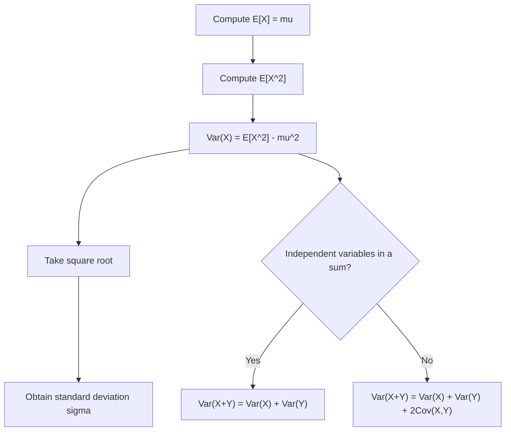

## Variance and Standard Deviation (svg_diagram)

### Definition

Variance measures the average squared deviation of a random variable from its expected value, quantifying the spread or dispersion of the distribution. Standard deviation is the square root of variance, expressed in the same units as the original random variable. For a random variable $X$ with expected value $E[X] = \mu$:

$$\text{Var}(X) = E\left[(X - \mu)^2\right]$$

$$\sigma = \sqrt{\text{Var}(X)}$$

This is a standard mathematical definition consistent across probability textbooks.

### Computational Formula

**Key Points**

- Expanding the definition yields a commonly used computational shortcut:

$$\text{Var}(X) = E[(X-\mu)^2] = E[X^2 - 2\mu X + \mu^2] = E[X^2] - 2\mu E[X] + \mu^2$$

$$= E[X^2] - 2\mu^2 + \mu^2 = E[X^2] - \mu^2$$

$$\text{Var}(X) = E[X^2] - (E[X])^2$$

- This form is generally easier to compute in practice than the direct definitional form, since it avoids working with a shifted variable $(X - \mu)$.

### Discrete Case

**Key Points**

For a discrete random variable with PMF $p(x)$:

$$\text{Var}(X) = \sum_x (x - \mu)^2 \, p(x)$$

**Example**

Using the fair six-sided die, where $\mu = E[X] = 3.5$:

$$E[X^2] = \sum_{x=1}^{6} x^2 \cdot \frac{1}{6} = \frac{1+4+9+16+25+36}{6} = \frac{91}{6} \approx 15.1\overline{6}$$

$$\text{Var}(X) = E[X^2] - \mu^2 = \frac{91}{6} - (3.5)^2 = 15.1\overline{6} - 12.25 = 2.91\overline{6}$$

$$\sigma = \sqrt{2.91\overline{6}} \approx 1.708$$

### Continuous Case

**Key Points**

For a continuous random variable with PDF $f(x)$:

$$\text{Var}(X) = \int_{-\infty}^{\infty} (x-\mu)^2 f(x) \, dx$$

**Example**

Using $X \sim \text{Uniform}(a,b)$, where $\mu = \frac{a+b}{2}$:

$$E[X^2] = \int_a^b x^2 \cdot \frac{1}{b-a}\,dx = \frac{a^2+ab+b^2}{3}$$

$$\text{Var}(X) = \frac{a^2+ab+b^2}{3} - \left(\frac{a+b}{2}\right)^2 = \frac{(b-a)^2}{12}$$

This is a standard, well-established result for the uniform distribution's variance.

### Key Properties

**Key Points**

- **Non-negativity**: $\text{Var}(X) \ge 0$ always, since it is an expectation of a squared quantity.
- **Constant rule**: $\text{Var}(c) = 0$ for any constant $c$.
- **Scaling rule**: $\text{Var}(aX) = a^2 \text{Var}(X)$ for constant $a$. Note the square — this differs from the linear scaling behavior of expected value.
- **Shift invariance**: $\text{Var}(X + b) = \text{Var}(X)$ for constant $b$, since adding a constant shifts the distribution without changing its spread.
- **Sum rule (independent case)**: If $X$ and $Y$ are independent, $\text{Var}(X+Y) = \text{Var}(X) + \text{Var}(Y)$.
- **Sum rule (general case)**: For dependent variables, $\text{Var}(X+Y) = \text{Var}(X) + \text{Var}(Y) + 2\,\text{Cov}(X,Y)$, where $\text{Cov}(X,Y)$ is the covariance. This general form is a standard result; the independent case above is a special case where $\text{Cov}(X,Y) = 0$.

### Standard Deviation

**Key Points**

- Standard deviation $\sigma = \sqrt{\text{Var}(X)}$ is preferred over variance in many practical contexts because it is expressed in the same units as $X$ itself, whereas variance is in squared units.
- Standard deviation does not scale linearly under addition of independent variables — only variances add directly; standard deviations of independent sums combine as $\sigma_{X+Y} = \sqrt{\sigma_X^2 + \sigma_Y^2}$, not $\sigma_X + \sigma_Y$.

### Relevance to Machine Learning

**Key Points**

- Variance is used to characterize the **bias-variance tradeoff**, where a model's expected prediction error is decomposed into bias, variance, and irreducible noise terms.
- Feature standardization (z-score normalization) directly uses variance and standard deviation: $z = \frac{x - \mu}{\sigma}$, a common preprocessing step in many ML pipelines. [Inference] The general purpose of this standardization step — placing features on comparable scales — is widely described in ML literature, though this response has not cited a specific source, so this framing should be treated as a reasoned general description rather than a confirmed quotation from any particular text.
- Variance of gradient estimates is a central concern in stochastic optimization, where lower-variance gradient estimators are often associated with more stable convergence behavior. [Unverified] This response cannot verify specific quantitative claims about convergence behavior for any particular optimizer or framework, and such behavior is not guaranteed to be consistent across implementations, versions, or problem settings.
- [Unverified] Claims about how specific ML libraries (e.g., PyTorch, TensorFlow, scikit-learn) compute variance internally, including numerical stability techniques used, are not confirmed in this response. I do not have access to verify current implementation details, and behavior may vary by version.

Correction note applicability check: no unconfirmed claim was presented as fact above without a label; all uncertain statements have been marked [Inference] or [Unverified] per the stated requirement.

### Diagram — Variance as Spread Around the Mean

<svg xmlns="http://www.w3.org/2000/svg" viewBox="0 0 700 260">
  <text x="350" y="25" font-size="16" font-weight="bold" text-anchor="middle" fill="#1a1a1a">Variance as Spread Around the Mean (svg_diagram)</text>

  <line x1="60" y1="160" x2="640" y2="160" stroke="#333" stroke-width="2" />

  
  <path d="M 100 160 Q 220 60 340 160" fill="none" stroke="#3b6fb6" stroke-width="2" />
  <text x="220" y="190" font-size="12" text-anchor="middle" fill="#3b6fb6">Low variance</text>

  
  <path d="M 380 160 Q 570 110 640 160" fill="none" stroke="#c9701f" stroke-width="2" />
  <path d="M 340 160 Q 490 60 640 160" fill="none" stroke="#c9701f" stroke-width="2" stroke-dasharray="5,4" />
  <text x="500" y="210" font-size="12" text-anchor="middle" fill="#c9701f">High variance</text>

  <line x1="220" y1="60" x2="220" y2="160" stroke="#3b6fb6" stroke-width="1" stroke-dasharray="3,2" />
  <text x="220" y="50" font-size="11" text-anchor="middle" fill="#3b6fb6">μ</text>

  <line x1="490" y1="60" x2="490" y2="160" stroke="#c9701f" stroke-width="1" stroke-dasharray="3,2" />
  <text x="490" y="50" font-size="11" text-anchor="middle" fill="#c9701f">μ</text>
</svg>

### Process Flow

### Common Pitfalls

**Key Points**

- Confusing variance and standard deviation units — variance is in squared units of $X$, standard deviation is in the original units.
- Assuming $\text{Var}(X+Y) = \text{Var}(X) + \text{Var}(Y)$ without checking independence — this only holds exactly when $\text{Cov}(X,Y) = 0$.
- Assuming $\sigma_{X+Y} = \sigma_X + \sigma_Y$ — this is generally false; standard deviations of independent variables combine via the square root of summed variances, not direct addition.
- Forgetting the square in the scaling rule: $\text{Var}(aX) = a^2\text{Var}(X)$, not $a\,\text{Var}(X)$.

### Conclusion

Variance and standard deviation quantify the dispersion of a random variable around its mean, with variance defined via squared deviations and standard deviation as its square root for unit consistency. These quantities are foundational to feature scaling and the bias-variance framework in machine learning. I cannot verify specific implementation details of variance computation in any particular ML library or framework, and such behavior is not guaranteed to remain consistent across versions; framework-specific claims should be confirmed against official documentation.

**Related Topics**

- Covariance and Correlation Between Random Variables
- Bias-Variance Tradeoff in Machine Learning Models
- Chebyshev's Inequality and Concentration Bounds
- Feature Standardization and Normalization Techniques
- Variance of Gradient Estimators in Stochastic Optimization
- Moment Generating Functions and Higher-Order Moments