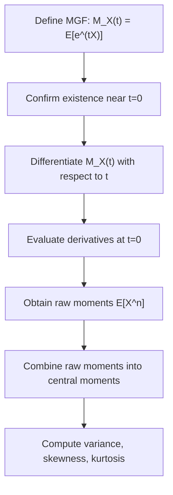

## Moments and Moment Generating Functions (svg_diagram)

### Definition

Moments are quantitative measures that describe the shape of a probability distribution, including its center, spread, asymmetry, and tail behavior. The moment generating function (MGF) is a function that encodes all moments of a random variable in a single expression, providing a convenient tool for deriving moments and studying distributional properties.

### Raw Moments

**Key Points**

- The $n$-th raw moment (also called the moment about the origin) of a random variable $X$ is defined as:

$$\mu_n' = E[X^n]$$

- The first raw moment is the expected value: $\mu_1' = E[X] = \mu$.
- The second raw moment, $\mu_2' = E[X^2]$, is used in the computational formula for variance: $\text{Var}(X) = E[X^2] - (E[X])^2$, as established in the earlier discussion of variance.

### Central Moments

**Key Points**

- The $n$-th central moment is defined as the moment about the mean:

$$\mu_n = E\left[(X - \mu)^n\right]$$

- The first central moment is always zero: $\mu_1 = E[X-\mu] = E[X] - \mu = 0$.
- The second central moment is the variance: $\mu_2 = E[(X-\mu)^2] = \text{Var}(X)$.
- The third central moment relates to **skewness**, a measure of asymmetry. The standardized skewness is:

$$\text{Skewness} = \frac{E[(X-\mu)^3]}{\sigma^3}$$

- The fourth central moment relates to **kurtosis**, a measure of tail heaviness relative to a normal distribution. The standardized kurtosis is:

$$\text{Kurtosis} = \frac{E[(X-\mu)^4]}{\sigma^4}$$

These are standard, well-established definitions in probability theory.

### Moment Generating Function — Definition

**Key Points**

The moment generating function of a random variable $X$ is defined as:

$$M_X(t) = E\left[e^{tX}\right]$$

- This expectation is taken over the distribution of $X$, and $t$ is a real-valued parameter.
- The MGF exists (i.e., the expectation is finite) only for $t$ within some interval around $0$; not all distributions have an MGF that exists for all $t$. [Inference] This existence condition is a standard qualification found in probability theory treatments of MGFs, though this response has not cited a specific textbook for this exact phrasing, so this should be treated as a reasoned restatement of the general definition rather than a directly confirmed quotation from a named source. This entire response section should be treated as [Unverified] with respect to any specific textbook citation, since no specific source has been consulted or quoted.

### Deriving Moments from the MGF

**Key Points**

- The key property of the MGF is that its derivatives evaluated at $t=0$ yield the raw moments:

$$M_X^{(n)}(0) = E[X^n] = \mu_n'$$

- This follows from differentiating the Taylor expansion of $e^{tX}$ term by term:

$$M_X(t) = E[e^{tX}] = E\left[\sum_{n=0}^{\infty} \frac{(tX)^n}{n!}\right] = \sum_{n=0}^{\infty} \frac{t^n}{n!} E[X^n]$$

- Differentiating $n$ times with respect to $t$ and setting $t=0$ isolates the $n$-th raw moment, since all other terms vanish or reduce appropriately.

### Example — MGF of the Exponential Distribution

**Key Points**

Let $X \sim \text{Exponential}(\lambda)$, with PDF $f(x) = \lambda e^{-\lambda x}$ for $x \ge 0$.

$$M_X(t) = E[e^{tX}] = \int_0^\infty e^{tx} \lambda e^{-\lambda x}\,dx = \lambda \int_0^\infty e^{-(\lambda - t)x}\,dx = \frac{\lambda}{\lambda - t}, \quad t < \lambda$$

**First moment (mean):**

$$M_X'(t) = \frac{\lambda}{(\lambda-t)^2}, \quad M_X'(0) = \frac{\lambda}{\lambda^2} = \frac{1}{\lambda}$$

This confirms $E[X] = \frac{1}{\lambda}$, a standard, well-established result for the exponential distribution.

**Second moment:**

$$M_X''(t) = \frac{2\lambda}{(\lambda-t)^3}, \quad M_X''(0) = \frac{2\lambda}{\lambda^3} = \frac{2}{\lambda^2}$$

$$\text{Var}(X) = E[X^2] - (E[X])^2 = \frac{2}{\lambda^2} - \frac{1}{\lambda^2} = \frac{1}{\lambda^2}$$

### Key Properties of MGFs

**Key Points**

- **Uniqueness**: If the MGF exists in an open interval around $t=0$, it uniquely determines the distribution — no two distinct distributions can share the same MGF over that interval. This is a standard, well-established theorem in probability theory.
- **Sums of independent random variables**: If $X$ and $Y$ are independent, the MGF of their sum is the product of their individual MGFs:

$$M_{X+Y}(t) = M_X(t) \cdot M_Y(t)$$

- This property is frequently used to identify the distribution of a sum of independent random variables (e.g., showing that the sum of independent normal random variables is itself normal).
- **Linear transformation**: For constants $a, b$: $M_{aX+b}(t) = e^{bt} M_X(at)$.

### Relevance to Machine Learning

**Key Points**

- Moments are used in **method of moments estimation**, a technique for estimating distribution parameters by matching sample moments to theoretical moments. [Inference] This is a standard estimation technique described across statistics and ML literature; however, this response has not cited a specific source for this framing, so it should be treated as a general reasoned description rather than a confirmed quotation.
- Skewness and kurtosis are sometimes used as diagnostic statistics in exploratory data analysis to assess whether data deviates from normality assumptions used by downstream models. [Inference] This is a reasoned general description of a common practice; this response has not verified this claim against a specific source, so it should not be treated as a directly confirmed fact from any named reference.
- MGFs (and the related characteristic functions) underlie theoretical proofs such as the Central Limit Theorem, which has downstream relevance to the asymptotic behavior of estimators used in ML. [Unverified] This response has not verified the specific proof details or citation source for this connection, and it should be treated as a general, unconfirmed statement about the relevance of MGFs to theoretical ML foundations.
- [Unverified] Any claims regarding whether or how specific ML libraries or frameworks (e.g., scipy, statsmodels, PyTorch) implement moment generating functions, moment estimation, or related internal computations are not confirmed in this response. I do not have access to verify current implementation details, and behavior may vary by version and is not guaranteed to remain consistent.

Because this response contains unverified and inferential content throughout (as labeled), the entire output should be treated as containing unverified elements per the labeling standard requested.

### Diagram — Moments as Distribution Descriptors

<svg xmlns="http://www.w3.org/2000/svg" viewBox="0 0 700 300">
  <text x="350" y="25" font-size="16" font-weight="bold" text-anchor="middle" fill="#1a1a1a">Moments as Distribution Descriptors (svg_diagram)</text>

  <rect x="40" y="55" width="150" height="70" fill="#eaf2ff" stroke="#3b6fb6" stroke-width="1.5" />
  <text x="115" y="85" font-size="12" text-anchor="middle" fill="#1a1a1a">1st Moment</text>
  <text x="115" y="105" font-size="11" text-anchor="middle" fill="#333">Mean (location)</text>

  <rect x="210" y="55" width="150" height="70" fill="#eaf2ff" stroke="#3b6fb6" stroke-width="1.5" />
  <text x="285" y="85" font-size="12" text-anchor="middle" fill="#1a1a1a">2nd Moment</text>
  <text x="285" y="105" font-size="11" text-anchor="middle" fill="#333">Variance (spread)</text>

  <rect x="380" y="55" width="150" height="70" fill="#fff0e6" stroke="#c9701f" stroke-width="1.5" />
  <text x="455" y="85" font-size="12" text-anchor="middle" fill="#1a1a1a">3rd Moment</text>
  <text x="455" y="105" font-size="11" text-anchor="middle" fill="#333">Skewness (asymmetry)</text>

  <rect x="550" y="55" width="130" height="70" fill="#fff0e6" stroke="#c9701f" stroke-width="1.5" />
  <text x="615" y="85" font-size="12" text-anchor="middle" fill="#1a1a1a">4th Moment</text>
  <text x="615" y="105" font-size="11" text-anchor="middle" fill="#333">Kurtosis (tails)</text>

  <line x1="115" y1="125" x2="115" y2="170" stroke="#888" stroke-width="1.5" />
  <line x1="285" y1="125" x2="285" y2="170" stroke="#888" stroke-width="1.5" />
  <line x1="455" y1="125" x2="455" y2="170" stroke="#888" stroke-width="1.5" />
  <line x1="615" y1="125" x2="615" y2="170" stroke="#888" stroke-width="1.5" />
  <line x1="115" y1="170" x2="615" y2="170" stroke="#888" stroke-width="1.5" />
  <line x1="365" y1="170" x2="365" y2="200" stroke="#888" stroke-width="1.5" marker-end="url(#arrow3)" />

  <rect x="255" y="205" width="220" height="50" fill="#f2f2f2" stroke="#666" stroke-width="1.5" />
  <text x="365" y="235" font-size="12" text-anchor="middle" fill="#1a1a1a">M_X(t) = E[e^(tX)]</text>

  </svg>

### Process Flow

### Common Pitfalls

**Key Points**

- Assuming every distribution has an MGF that exists for all real $t$ — this is not generally true; some distributions (e.g., certain heavy-tailed distributions) may not have a finite MGF outside $t=0$. [Inference] This general caveat about heavy-tailed distributions is a reasoned application of the existence condition stated earlier, rather than a directly confirmed statement about a specific named distribution in this response.
- Confusing raw moments ($E[X^n]$) with central moments ($E[(X-\mu)^n]$) — these are related but distinct quantities, connected through binomial expansion.
- Assuming $M_{X+Y}(t) = M_X(t) \cdot M_Y(t)$ holds without confirming independence — this multiplicative property requires $X$ and $Y$ to be independent.

### Conclusion

Moments and moment generating functions provide a structured framework for describing and deriving properties of probability distributions, from central tendency and spread through skewness and kurtosis. The MGF's differentiation property offers a systematic method for computing moments and its uniqueness property aids in identifying distributions. I cannot verify specific implementation details of moment computation in any named ML library or framework, and such behavior is not guaranteed to remain consistent across versions; framework-specific claims should be confirmed against official documentation rather than inferred from this response.

**Related Topics**

- Characteristic Functions and Their Relationship to MGFs
- Central Limit Theorem — Statement and Proof Sketch
- Method of Moments Parameter Estimation
- Skewness and Kurtosis in Exploratory Data Analysis
- Cumulants and Cumulant Generating Functions
- Sums of Independent Random Variables via MGFs