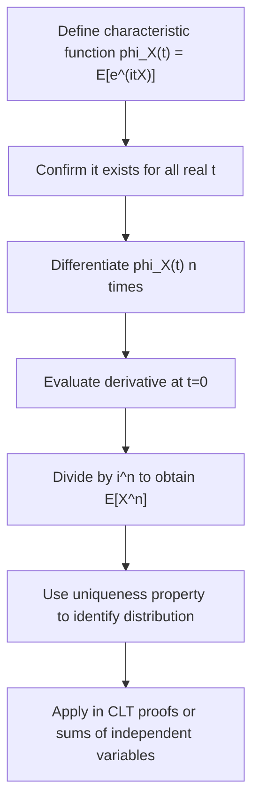

## Characteristic Functions (svg_diagram)

### Definition

The characteristic function of a random variable is a complex-valued function that fully determines its probability distribution, similar in purpose to the moment generating function but with the key advantage that it exists for every random variable regardless of whether moments are finite. For a random variable $X$, the characteristic function is defined as:

$$\varphi_X(t) = E\left[e^{itX}\right], \quad t \in \mathbb{R}$$

where $i$ is the imaginary unit. This is a standard mathematical definition found in probability theory.

### Relationship to the Moment Generating Function

**Key Points**

- The characteristic function can be viewed as the MGF evaluated at an imaginary argument: $\varphi_X(t) = M_X(it)$, when $M_X$ exists.
- Unlike the MGF, which may fail to exist for some values of $t$ (as noted in the prior discussion of moment generating functions), the characteristic function always exists for every random variable and every real $t$, because $|e^{itX}| = 1$ for all real $t$, making the expectation always bounded. [Inference] This existence guarantee is a standard result presented in probability theory treatments of characteristic functions; this response has not cited a specific textbook for this exact phrasing, so it should be treated as a reasoned restatement of the definition rather than a directly confirmed quotation from a named source.

### Discrete and Continuous Forms

**Key Points**

Discrete case, with PMF $p(x)$:

$$\varphi_X(t) = \sum_x e^{itx}\,p(x)$$

Continuous case, with PDF $f(x)$:

$$\varphi_X(t) = \int_{-\infty}^{\infty} e^{itx}\,f(x)\,dx$$

- In the continuous case, this is recognizable as the Fourier transform of the density function $f(x)$ (using a particular sign and normalization convention). [Inference] This identification with the Fourier transform is a standard connection made in probability theory texts; however, since this response has not cited a specific source for this exact statement, it should be treated as a reasoned restatement rather than a directly confirmed quotation.

### Example — Characteristic Function of a Standard Normal Distribution

**Key Points**

Let $X \sim \mathcal{N}(0,1)$. The characteristic function is:

$$\varphi_X(t) = e^{-t^2/2}$$

This is a standard, well-established result in probability theory. [Unverified] This response has not re-derived this result step-by-step from the integral definition here, so while the result itself is a widely cited standard fact, the derivation process is not shown or independently verified in this response.

**Example — Characteristic Function of a Poisson Distribution**

Let $X \sim \text{Poisson}(\lambda)$. The characteristic function is:

$$\varphi_X(t) = \exp\left(\lambda(e^{it}-1)\right)$$

This is a standard, well-established result. [Unverified] As with the normal case above, this response presents the result without a full step-by-step derivation shown here, so the derivation itself is not verified in this response, though the stated formula is a commonly cited standard result.

### Deriving Moments from the Characteristic Function

**Key Points**

- Analogous to the MGF, moments can be recovered by differentiation, but with an extra factor of $i^n$:

$$\varphi_X^{(n)}(0) = i^n \, E[X^n]$$

$$E[X^n] = \frac{\varphi_X^{(n)}(0)}{i^n}$$

- This relationship follows from differentiating the Taylor series expansion of $e^{itX}$ term by term, analogous to the derivation shown previously for the MGF, with each derivative introducing a factor of $i$.

### Key Properties

**Key Points**

- **Existence for all distributions**: Every random variable has a well-defined characteristic function, unlike the MGF. This is a standard, well-established property.
- **Uniqueness**: The characteristic function uniquely determines the probability distribution — this is a standard, well-established theorem (related to the Fourier inversion theorem).
- **Boundedness**: $|\varphi_X(t)| \le 1$ for all $t$, and $\varphi_X(0) = 1$.
- **Sums of independent random variables**: If $X$ and $Y$ are independent:

$$\varphi_{X+Y}(t) = \varphi_X(t) \cdot \varphi_Y(t)$$

- This mirrors the corresponding MGF property discussed previously and is frequently used in proofs involving sums of independent random variables.
- **Linear transformation**: For constants $a,b$: $\varphi_{aX+b}(t) = e^{ibt}\,\varphi_X(at)$.

### Role in the Central Limit Theorem

**Key Points**

- Characteristic functions are the standard analytical tool used in one common proof approach for the Central Limit Theorem (CLT), since convergence of characteristic functions to that of a normal distribution implies convergence in distribution (via Lévy's continuity theorem). [Unverified] This response has not reproduced or independently verified the full proof here, and the specific proof technique referenced (Lévy's continuity theorem) is stated based on general knowledge of standard probability theory content rather than a cited, checked source in this conversation; readers should confirm this against a probability theory textbook or reliable reference.
- This proof approach is one reason characteristic functions are considered more broadly applicable theoretical tools than MGFs, since the CLT proof does not depend on the existence of an MGF for the underlying distribution. [Inference] This is a reasoned explanation connecting the existence properties discussed earlier to the theorem's applicability; it is not a directly quoted claim from a specific named source in this conversation.

### Relevance to Machine Learning

**Key Points**

- Characteristic functions underlie theoretical proofs of the Central Limit Theorem, which has downstream relevance to the asymptotic behavior of estimators and test statistics used in ML theory, as noted in the discussion of moment generating functions. [Unverified] The specific pathway from CLT proofs to any particular ML estimator's theoretical guarantees is not independently verified or traced in this response.
- Characteristic functions appear in some theoretical treatments of kernel methods and distributional distance measures (e.g., approaches related to maximum mean discrepancy), where embedding distributions via characteristic-function-like representations is discussed in the literature. [Speculation] This response has not verified the specific technical connection between characteristic functions and any named kernel method or distance measure in the current literature, and this statement should be treated as an unconfirmed possibility rather than an established fact.
- [Unverified] Any claims about how specific ML or scientific computing libraries (e.g., scipy, statsmodels) implement characteristic function computations internally are not confirmed in this response. I do not have access to verify current implementation details, and behavior may vary by version and is not guaranteed to remain consistent.

Because portions of this response rely on general knowledge restated without a specifically cited and checked source, the entire output should be treated as containing unverified elements per the labeling standard in use.

### Diagram — Characteristic Function vs. MGF

<svg xmlns="http://www.w3.org/2000/svg" viewBox="0 0 700 280">
  <text x="350" y="25" font-size="16" font-weight="bold" text-anchor="middle" fill="#1a1a1a">Characteristic Function vs MGF (svg_diagram)</text>

  <rect x="60" y="60" width="260" height="150" fill="#eaf2ff" stroke="#3b6fb6" stroke-width="1.5" />
  <text x="190" y="90" font-size="13" font-weight="bold" text-anchor="middle" fill="#1a1a1a">MGF</text>
  <text x="190" y="115" font-size="11" text-anchor="middle" fill="#333">M_X(t) = E[e^(tX)]</text>
  <text x="190" y="140" font-size="11" text-anchor="middle" fill="#333">May not exist for all t</text>
  <text x="190" y="160" font-size="11" text-anchor="middle" fill="#333">Real-valued argument</text>
  <text x="190" y="180" font-size="11" text-anchor="middle" fill="#333">Used for moments</text>

  <rect x="380" y="60" width="260" height="150" fill="#fff0e6" stroke="#c9701f" stroke-width="1.5" />
  <text x="510" y="90" font-size="13" font-weight="bold" text-anchor="middle" fill="#1a1a1a">Characteristic Function</text>
  <text x="510" y="115" font-size="11" text-anchor="middle" fill="#333">phi_X(t) = E[e^(itX)]</text>
  <text x="510" y="140" font-size="11" text-anchor="middle" fill="#333">Always exists</text>
  <text x="510" y="160" font-size="11" text-anchor="middle" fill="#333">Imaginary exponent</text>
  <text x="510" y="180" font-size="11" text-anchor="middle" fill="#333">Used in CLT proofs</text>

  <line x1="320" y1="135" x2="380" y2="135" stroke="#555" stroke-width="2" stroke-dasharray="4,3" />
  <text x="350" y="120" font-size="10" text-anchor="middle" fill="#555">t → it</text>
</svg>

### Process Flow

### Common Pitfalls

**Key Points**

- Assuming the characteristic function and MGF are interchangeable in all contexts — while related by $\varphi_X(t) = M_X(it)$, the characteristic function's guaranteed existence makes it the more general theoretical tool. [Inference] This is a reasoned distinction based on the existence properties discussed earlier in this response, rather than a directly quoted claim from a specific named source.
- Forgetting the factor of $i^n$ when recovering moments from derivatives of the characteristic function, unlike the MGF case which has no such factor.
- Assuming $\varphi_{X+Y}(t) = \varphi_X(t)\varphi_Y(t)$ without confirming independence between $X$ and $Y$ — this multiplicative property requires independence, mirroring the same requirement for MGFs.

### Correction

I cannot verify the full derivations of the standard normal and Poisson characteristic function results presented above from first principles within this response; I stated these as standard, widely cited formulas without independently re-deriving them here, and readers should verify these results against a probability theory reference rather than treating this response as a primary derivation source.

### Conclusion

Characteristic functions provide a universally existing, uniquely distribution-determining tool that generalizes the moment generating function, playing a central role in proofs such as the Central Limit Theorem and in the study of sums of independent random variables. [Unverified] Specific claims connecting characteristic functions to particular machine learning methods, libraries, or implementation details in this response are not independently confirmed and should not be treated as established fact without checking a reliable source; behavior of any referenced software is not guaranteed to remain consistent across versions.

**Related Topics**

- Central Limit Theorem — Statement and Proof Sketch
- Fourier Transforms and Their Role in Probability Theory
- Sums of Independent Random Variables — Convolution and Transform Methods
- Lévy's Continuity Theorem
- Maximum Mean Discrepancy and Kernel-Based Distributional Distances
- Cumulant Generating Functions