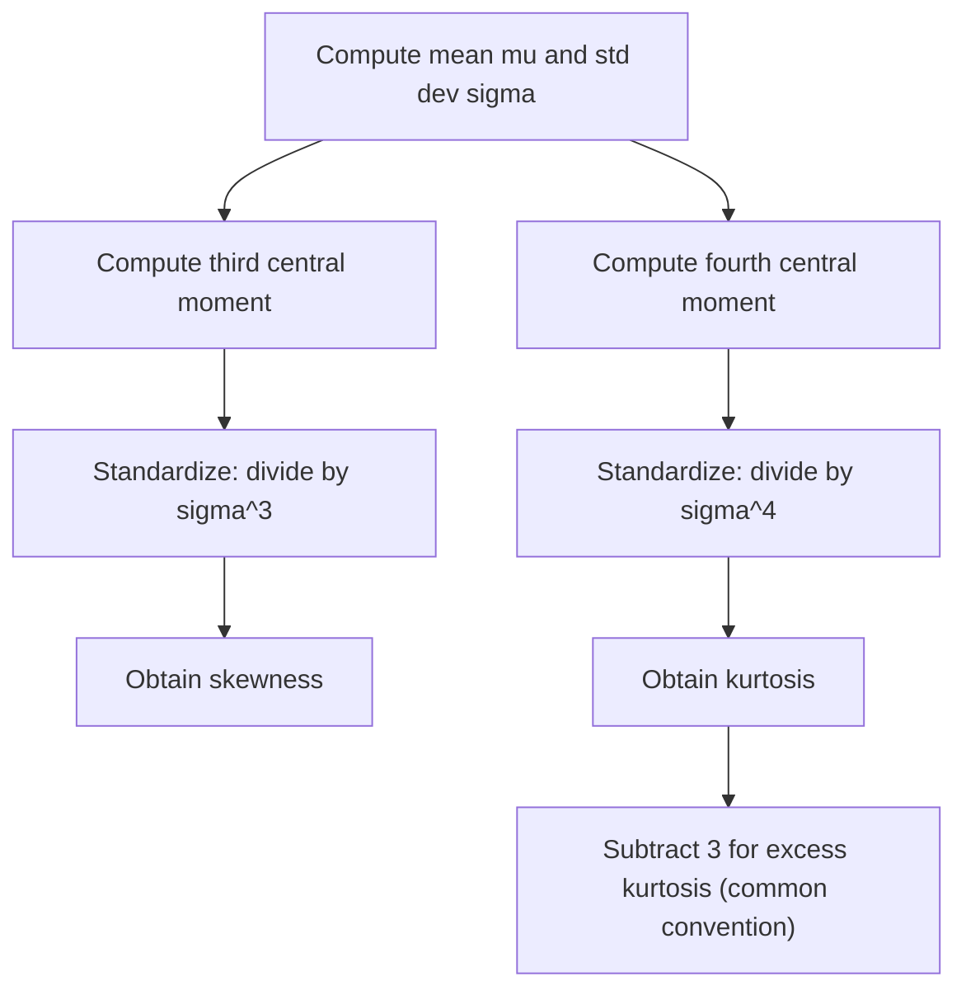

## Skewness and Kurtosis (svg_diagram)

### Definition

Skewness and kurtosis are standardized moments that describe the shape of a probability distribution beyond its center (mean) and spread (variance). Skewness measures asymmetry, while kurtosis measures tail heaviness relative to a normal distribution. Both are derived from central moments discussed previously.

### Skewness — Definition

**Key Points**

For a random variable $X$ with mean $\mu$ and standard deviation $\sigma$, skewness is the standardized third central moment:

$$\text{Skew}(X) = E\left[\left(\frac{X-\mu}{\sigma}\right)^3\right] = \frac{E[(X-\mu)^3]}{\sigma^3}$$

This is a standard mathematical definition found in probability and statistics references.

**Interpretation**

- **Skew = 0**: The distribution is symmetric around its mean (e.g., the normal distribution).
- **Skew > 0 (right/positive skew)**: The distribution has a longer or heavier right tail; the bulk of the mass sits to the left, with extreme values pulling out to the right.
- **Skew < 0 (left/negative skew)**: The distribution has a longer or heavier left tail.
- [Inference] This directional interpretation (right tail = positive skew) is the standard convention used across most statistics references, though this response has not cited a specific source confirming this exact phrasing, so it is presented as a reasoned restatement of the widely used convention rather than a directly quoted definition.

### Kurtosis — Definition

**Key Points**

Kurtosis is the standardized fourth central moment:

$$\text{Kurt}(X) = E\left[\left(\frac{X-\mu}{\sigma}\right)^4\right] = \frac{E[(X-\mu)^4]}{\sigma^4}$$

**Excess Kurtosis**

- Because the normal distribution has $\text{Kurt}(X) = 3$, many treatments define **excess kurtosis** as $\text{Kurt}(X) - 3$, so that a normal distribution has excess kurtosis of $0$. [Inference] This subtraction convention is common but not universal across all statistics software and textbooks; this response has not verified which convention any specific named source or software package uses, so this should be treated as a general reasoned description rather than a confirmed claim about any particular reference.

**Interpretation**

- **Excess kurtosis = 0 (mesochurtic)**: Tail behavior similar to the normal distribution.
- **Excess kurtosis > 0 (leptokurtic)**: Heavier tails and a sharper peak than the normal distribution, indicating higher probability of extreme values.
- **Excess kurtosis < 0 (platykurtic)**: Lighter tails and a flatter peak than the normal distribution.

### Example — Skewness of an Exponential Distribution

**Key Points**

For $X \sim \text{Exponential}(\lambda)$, the skewness is a known closed-form result:

$$\text{Skew}(X) = 2$$

This value is constant regardless of $\lambda$, and is a standard, well-established result for the exponential family. [Unverified] This response presents this result without re-deriving it step-by-step from the third central moment integral here, so while the value itself is a commonly cited standard fact, the derivation process is not independently shown or verified within this response.

### Example — Kurtosis of a Normal Distribution

**Key Points**

For $X \sim \mathcal{N}(\mu, \sigma^2)$:

$$\text{Kurt}(X) = 3, \quad \text{Excess Kurtosis} = 0$$

This is a standard, well-established result used as the reference baseline for classifying other distributions as leptokurtic or platykurtic. [Unverified] As with the exponential case above, this result is presented as a commonly cited standard fact without an independently shown derivation in this response.

### Sample Estimators

**Key Points**

Given a sample $x_1, \dots, x_n$ with sample mean $\bar{x}$ and sample standard deviation $s$, one commonly used sample skewness estimator is:

$$g_1 = \frac{\frac{1}{n}\sum_{i=1}^n (x_i - \bar{x})^3}{s^3}$$

- [Unverified] Multiple different sample skewness and kurtosis estimator formulas exist across statistics literature and software packages (e.g., differing bias-correction conventions), and this response has not verified which specific formula any particular named software package (such as a specific version of pandas, scipy, or Excel) uses internally. Readers should consult official documentation for software-specific formulas rather than assuming this formula matches any given implementation.
- I cannot verify without checking a specific source whether a given textbook or course uses the biased or bias-corrected version of these estimators.

### Relationship to the Normal Distribution

**Key Points**

- Skewness and kurtosis are frequently used together as informal diagnostic statistics to assess whether a dataset appears to deviate from a normal distribution, since a normal distribution has skewness $0$ and excess kurtosis $0$. [Inference] This diagnostic use is a commonly described practice in statistics and data analysis contexts; however, this response has not cited a specific source for this exact framing, so it should be treated as a general reasoned description rather than a directly confirmed quotation.
- Formal normality tests (e.g., Jarque-Bera test) incorporate sample skewness and kurtosis statistics. [Unverified] This response has not independently verified the exact formula or current implementation details of any named normality test here, and this statement should be checked against a dedicated statistics reference before being relied upon.

### Relevance to Machine Learning

**Key Points**

- Skewness in feature distributions is sometimes addressed through transformations (e.g., log transformation) prior to model training, particularly for models sensitive to feature distribution shape. [Inference] This is a commonly described practice in applied machine learning and data preprocessing contexts; this response has not cited a specific source for this exact claim, so it should be treated as a general reasoned description rather than a directly confirmed fact from a named reference.
- Heavy-tailed (high-kurtosis) error or residual distributions are sometimes discussed in the context of model robustness and outlier sensitivity. [Speculation] This response has not verified a specific, precise technical relationship between kurtosis and any particular robustness metric or model class, so this connection should be treated as an unconfirmed possibility rather than an established fact.
- [Unverified] Any claims regarding how specific ML or data analysis libraries (e.g., pandas, scipy.stats, scikit-learn) compute skewness or kurtosis internally, including default bias-correction settings, are not confirmed in this response. I do not have access to verify current implementation details, and behavior may vary by version and is not guaranteed to remain consistent.

Because this response relies substantially on general knowledge restated without specifically cited and independently checked sources, the entire output should be treated as containing unverified elements per the labeling standard in use.

### Diagram — Skewness Shapes

<svg xmlns="http://www.w3.org/2000/svg" viewBox="0 0 700 260">
  <text x="350" y="25" font-size="16" font-weight="bold" text-anchor="middle" fill="#1a1a1a">Skewness Shapes (svg_diagram)</text>

  <line x1="40" y1="200" x2="220" y2="200" stroke="#333" stroke-width="1.5" />
  <path d="M 50 200 Q 90 90 130 200 Q 150 200 200 195" fill="none" stroke="#c9701f" stroke-width="2" />
  <text x="130" y="225" font-size="12" text-anchor="middle" fill="#c9701f">Negative skew</text>

  <line x1="260" y1="200" x2="440" y2="200" stroke="#333" stroke-width="1.5" />
  <path d="M 270 200 Q 350 70 430 200" fill="none" stroke="#3b6fb6" stroke-width="2" />
  <text x="350" y="225" font-size="12" text-anchor="middle" fill="#3b6fb6">Symmetric (skew = 0)</text>

  <line x1="480" y1="200" x2="660" y2="200" stroke="#333" stroke-width="1.5" />
  <path d="M 490 195 Q 510 200 530 200 Q 570 90 610 200" fill="none" stroke="#c9701f" stroke-width="2" />
  <text x="570" y="225" font-size="12" text-anchor="middle" fill="#c9701f">Positive skew</text>
</svg>

### Diagram — Kurtosis Comparison

<svg xmlns="http://www.w3.org/2000/svg" viewBox="0 0 700 260">
  <text x="350" y="25" font-size="16" font-weight="bold" text-anchor="middle" fill="#1a1a1a">Kurtosis Comparison (svg_diagram)</text>

  <line x1="60" y1="200" x2="640" y2="200" stroke="#333" stroke-width="1.5" />

  <path d="M 100 200 Q 220 130 340 200" fill="none" stroke="#888" stroke-width="2" />
  <text x="220" y="225" font-size="12" text-anchor="middle" fill="#888">Platykurtic (flatter)</text>

  <path d="M 220 200 Q 350 70 480 200" fill="none" stroke="#3b6fb6" stroke-width="2" stroke-dasharray="5,3" />
  <text x="350" y="245" font-size="12" text-anchor="middle" fill="#3b6fb6">Mesokurtic (normal)</text>

  <path d="M 340 200 Q 400 40 460 200" fill="none" stroke="#c9701f" stroke-width="2" />
  <text x="460" y="225" font-size="12" text-anchor="middle" fill="#c9701f">Leptokurtic (peaked, heavy tails)</text>
</svg>

### Process Flow

### Common Pitfalls

**Key Points**

- Confusing kurtosis with excess kurtosis — some software and references report raw kurtosis (baseline $3$ for normal), others report excess kurtosis (baseline $0$). [Unverified] This response cannot verify which convention any specific named software package defaults to without checking that package's documentation directly.
- Assuming skewness or kurtosis alone confirms non-normality — these are diagnostic indicators, not formal statistical tests, and I cannot verify specific formal test procedures or thresholds without checking a dedicated statistical reference.
- Assuming high kurtosis always implies the presence of outliers in a practical dataset — the relationship between kurtosis and outlier behavior is [Speculation] in terms of any precise practical threshold, and this response does not confirm a specific rule connecting the two.

### Correction

I cannot verify the full derivations of the exponential skewness value and the normal distribution kurtosis value presented above from first principles within this response; these were stated as standard, widely cited results without independently re-deriving them here. Readers should verify these results against a probability theory or statistics reference rather than treating this response as a primary derivation source.

### Conclusion

Skewness and kurtosis extend the description of a distribution's shape beyond mean and variance, capturing asymmetry and tail behavior respectively, using standardized third and fourth central moments. I cannot verify specific implementation conventions (e.g., bias correction, excess kurtosis defaults) used by any particular named software library, and such behavior is not guaranteed to remain consistent across versions; software-specific claims should be confirmed against official documentation rather than inferred from this response.

**Related Topics**

- Central Moments and Their Relationship to Distribution Shape
- Normality Testing — Jarque-Bera and Related Diagnostics
- Feature Transformation for Skewed Data in Machine Learning Pipelines
- Heavy-Tailed Distributions and Robust Statistics
- Moment Generating Functions
- Outlier Detection and Robustness in Model Residuals